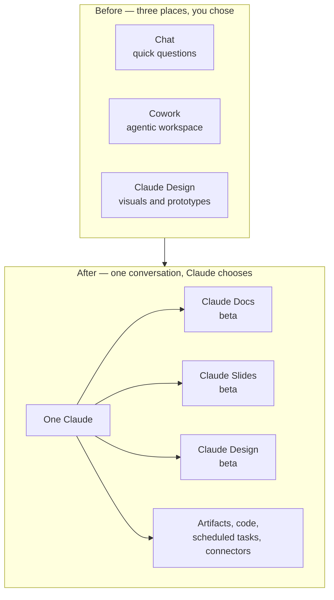

<LevelBadge level="beginner" />

<VerifyNote lastVerified="2026-09-25" source="https://claude.com/blog/cowork-is-now-claude">
Annoncé le **16 septembre 2026**. L'expérience fusionnée est déployée **progressivement, en commençant par Pro et Max** sur le web, le bureau et le mobile, puis Team et Free ; les organisations Enterprise bénéficient d'un **préavis d'au moins 30 jours**. Claude Docs, Claude Slides et Claude Design sont **en bêta sur les offres payantes**. Le déploiement étant échelonné, deux comptes sur la même offre peuvent voir des choses différentes le même jour — consultez l'[article du centre d'aide](https://support.claude.com/en/articles/16761823-claude-cowork-and-chat-are-one-claude) pour connaître l'état actuel avant de vous fier à quoi que ce soit ici.
</VerifyNote>

Le **16 septembre 2026**, Anthropic a fusionné trois produits en un seul. Le chat, **Cowork** (l'espace de travail agentique) et **Claude Design** ont cessé d'être des endroits distincts entre lesquels il fallait choisir. Il y a désormais une seule zone de conversation, et c'est Claude qui décide de ce dont la tâche a besoin.

Le cadrage officiel est court : *« Demandez à Claude ce dont vous avez besoin, et il peut décider quel outil utiliser. »* La conséquence pratique est plus longue, et c'est le sujet de cette page — parce qu'une fusion comme celle-ci déplace des réglages, met des habitudes à la retraite, et livre deux nouveaux outils documentaires dont les limites ne sont pas évidentes avant qu'on les percute.

<Callout type="objectives" items={[
  "Comprendre ce qui a réellement fusionné le 16 septembre 2026 — et pourquoi « plus de mode à choisir » change la façon d'ouvrir une tâche",
  "Retrouver chaque réglage qui a déménagé : instructions globales, recherche web, recherche approfondie et stockage de fichiers",
  "Choisir correctement entre Claude Docs, Claude Slides, Claude Design, un artifact simple et un .docx/.pptx téléchargé",
  "Utiliser Claude Docs comme il a été conçu : onglets, commentaires en ligne, modifications @Claude et co-rédaction en temps réel",
  "Connaître les huit limites qui vous mordront — pas d'historique des versions, pas de rôle commentaire seul, des graphiques qui ne se rafraîchissent pas, et les configurations de conformité où Docs est tout simplement indisponible",
  "Anticiper le coût en limites d'usage du travail agentique maintenant que tout se déroule dans une seule conversation"
]} />

## Ce qui a fusionné, en une image

Rien de ce que vous aviez n'est jeté. Selon Anthropic : *« Les tâches, projets, connecteurs, skills, artifacts et fichiers Cowork existants sont conservés, et ces tâches Cowork s'ouvrent comme avant, pour que vous puissiez les poursuivre. »*

Ce qui change, c'est le **point d'entrée**. Avant, vous décidiez de la forme du travail avant de le décrire — le chat pour une question, Cowork pour un projet. Maintenant, vous décrivez le travail et Claude choisit la machinerie, avec le même contexte, les mêmes skills et les mêmes connecteurs disponibles depuis n'importe quelle conversation.

## Où tout a déménagé

C'est la partie qui génère le plus de confusion du type « où est passé mon bouton », et c'est celle qu'aucun article tiers ne couvre. Quatre choses ont été relocalisées :

| Ce que vous utilisiez | Où c'est maintenant |
| --- | --- |
| Instructions globales | **Paramètres → Général** |
| Bascule de recherche web | **Disparue — c'est automatique.** Claude décide quand chercher |
| Recherche approfondie | Tapez **`/deep-research`**, ou utilisez le bouton **`+`** |
| Vos fichiers | **Paramètres → dossier Stockage** |

<Callout type="warning" items={[
  "La bascule de recherche web n'est pas cachée, elle est supprimée. Si votre workflow reposait sur le fait de forcer la recherche à off pour une tâche privée ou de raisonnement hors ligne, ce levier n'existe plus dans l'interface — dites-le dans le prompt à la place (« réponds uniquement à partir de la conversation ; ne cherche pas sur le web »)."
]} />

## Les trois templates : lequel voulez-vous vraiment ?

La fusion a livré **Claude Docs** et **Claude Slides** comme nouveaux outils, et a déplacé **Claude Design** à l'intérieur des conversations. Tous les trois sont des *templates* — une forme de départ pour un artifact, pas une application séparée.

<Steps items={[
  {title: "Claude Docs — documents vivants", body: "Des documents en texte enrichi enregistrés dans votre compte Claude, avec titres, tableaux et autre mise en forme, et plus d'un onglet (comme les sections d'un cahier). Vous, Claude et vos collègues écrivez tous dans le même document, en même temps. Export vers Word (.docx), PDF, Markdown (.md) et Google Docs. À choisir quand le document lui-même est le livrable et qu'il va continuer à changer."},
  {title: "Claude Slides — présentations", body: "Des decks construits à partir de vos notes, d'un rapport ou du travail déjà présent dans la conversation. Vous pouvez modifier n'importe quelle diapositive directement, présenter sans quitter Claude, et exporter vers PowerPoint et PDF. À choisir quand vous avez besoin d'un deck tiré de matériel que vous avez déjà produit."},
  {title: "Claude Design — visuels et prototypes", body: "Visuels, maquettes, prototypes, one-pagers et landing pages, construits sur votre design system. Export en .zip, PDF, PowerPoint ou HTML autonome. À choisir quand la sortie est visuelle ou doit correspondre à une marque."},
  {title: "Un artifact simple — code, apps, graphiques", body: "Toujours là, inchangé, sur toutes les offres y compris Free. Une mini-application exécutable, un graphique, un diagramme, un script. À choisir quand la chose doit s'exécuter plutôt qu'être lue. Voir Artifacts."},
  {title: "Un fichier généré — .docx / .pptx / .xlsx / .pdf", body: "Un fichier one-shot que Claude construit et que vous téléchargez. Aucune surface d'édition en direct, aucun partage, aucun commentaire. À choisir quand vous avez besoin d'un fichier à transmettre et à ne plus jamais toucher dans Claude. Voir Générer de vrais fichiers."}
]} />

La distinction qui compte le plus est celle entre les deux dernières : **un Claude Doc est un document vivant avec une URL, des collaborateurs et des commentaires ; un `.docx` généré est un téléchargement.** Si vous demandiez « un document Word » avant la fusion et que vous obteniez un fichier, demander la même chose aujourd'hui peut vous donner un Doc que vous exportez ensuite — ce qui est généralement ce que vous voulez, mais c'est un objet différent avec des règles de partage différentes.

### Trois façons d'en créer un

<Steps items={[
  {title: "Demander dans n'importe quelle conversation", body: "Le langage courant suffit — « transforme le plan qu'on vient d'élaborer en une spécification produit que je peux partager avec l'équipe ». Claude pose quelques questions avant de commencer, puis rédige le doc à l'écran."},
  {title: "Choisir un template explicitement", body: "Sélectionnez Sortie dans la zone de message et choisissez un template. Utilisez ceci quand Claude continue de choisir une forme différente de celle que vous voulez."},
  {title: "Partir de l'onglet Artifacts", body: "Choisissez un template dans la galerie, puis briefez Claude. Utile quand c'est le document, et non la conversation, que vous êtes venu chercher."}
]} />

<PromptCard title="Briefer un Claude Doc pour que le premier jet soit proche du but">{`Create a Claude Doc: a one-page product spec for the export feature
we just designed.

Structure it in four tabs:
  1. Summary — problem, proposed solution, who it's for
  2. Requirements — numbered, testable, each with a rationale
  3. Open questions — things I still need to decide, with your
     recommendation and the tradeoff for each
  4. Rejected alternatives — what we considered and why not

Rules:
- Pull the decisions from this conversation. Do not invent
  requirements I did not state.
- Where I was vague, leave a comment asking me the question
  instead of guessing.
- Add a table comparing the three export formats we discussed.

Ask me anything you need before you start drafting.`}</PromptCard>

## Claude Docs en détail

### Édition, commentaires et @Claude

Trois chemins d'édition coexistent, et c'est tout l'intérêt de l'outil :

- **Vous tapez.** Cliquez dans le doc et tapez. Les changements sont enregistrés automatiquement.
- **Vous demandez.** Demandez un changement en conversation ; Claude modifie et explique ce qu'il a fait et pourquoi.
- **Vous commentez.** Sélectionnez du texte et laissez un commentaire pour vos collaborateurs — et **mentionnez `@Claude` dans un commentaire pour que Claude fasse cette modification sur place.** Claude répond dans le fil, effectue le changement, et l'explique.

Claude **laisse aussi ses propres commentaires pendant la rédaction**, pour expliquer un choix ou vous poser une question. C'est le comportement autour duquel il vaut la peine de concevoir votre prompt : dire à Claude de *demander dans un commentaire plutôt que de deviner* (comme dans la carte de prompt ci-dessus) convertit un risque d'hallucination silencieuse en une question visible à laquelle vous pouvez répondre.

Vous pouvez aussi demander à Claude d'**ajouter un graphique, un diagramme, un schéma ou une chronologie** à un doc.

### Collaboration et partage

Les personnes ayant l'accès en modification travaillent sur le même doc en même temps que vous et Claude, et les modifications de chacun apparaissent en temps réel.

| | Lecteur | Éditeur |
| --- | --- | --- |
| Lire | ✅ | ✅ |
| Modifier | ❌ | ✅ |
| Commenter | ❌ | ✅ |
| Exporter | ❌ | ✅ |

Les règles de partage diffèrent fortement selon l'offre :

- **Pro / Max** — partage avec quiconque possède le lien.
- **Team / Enterprise** — invitez des personnes précises ou un groupe, ou partagez avec toute votre organisation. **Les docs ne peuvent pas être partagés en dehors de votre organisation**, ni par lien ni par invitation e-mail.
- **Dans les deux cas** — ouvrir un doc partagé nécessite un compte Claude, et **seul le propriétaire peut renommer ou supprimer un doc.**

### Où vous pouvez l'utiliser

Docs fonctionne sur le **web, le bureau, Claude Code et le mobile** — mais les **applications iOS et Android sont en lecture seule** : pas d'édition et pas de sélection de template depuis un téléphone. Prévoyez en conséquence si votre boucle de revue est mobile.

## Les limites qui vous mordront

Chacune d'elles est documentée, et chacune surprend quelqu'un la première semaine.

<Steps items={[
  {title: "Pas encore d'historique des versions", body: "Il n'existe aucun moyen de voir ou de restaurer un état antérieur d'un doc. Quiconque a l'accès en modification peut écraser n'importe quoi, et votre seul recours est un export réalisé plus tôt. Pour un document qui compte, exportez en Markdown à chaque jalon jusqu'à ce que l'historique arrive."},
  {title: "Pas de niveau d'accès commentaire seul", body: "Les rôles sont lecteur et éditeur, rien entre les deux. Un relecteur qui devrait commenter sans modifier n'existe pas comme permission — accordez la modification et faites confiance, ou accordez la lecture et collectez les retours ailleurs."},
  {title: "Les graphiques et diagrammes ne se mettent pas à jour automatiquement", body: "Un graphique ajouté par Claude est un instantané. Changez les chiffres sous-jacents dans le doc et le graphique continue d'afficher les anciens jusqu'à ce que vous demandiez à Claude de le régénérer. Considérez chaque visuel comme périmé jusqu'à nouvelle demande."},
  {title: "Team et Enterprise ne peuvent pas partager à l'extérieur", body: "Pas de partage par lien, pas d'invitation e-mail hors de l'organisation. Si vous devez envoyer un doc à un client, exportez-le (Word, PDF, Markdown, Google Docs) et envoyez l'export."},
  {title: "Le mobile est en lecture seule", body: "iOS et Android peuvent lire un doc. Ils ne peuvent pas en modifier un ni choisir un template."},
  {title: "Indisponible sous CMEK, ZDR et HIPAA", body: "Claude Docs n'est pas disponible pour les organisations configurées avec des clés de chiffrement gérées par le client, une rétention de données nulle ou HIPAA. C'est le fait le plus important pour les équipes réglementées, et ce n'est pas un retard de déploiement — c'est une exclusion."},
  {title: "Pas encore dans l'API Compliance", body: "L'activité à l'intérieur d'un doc n'est pas enregistrée dans l'API Compliance. Si votre posture d'audit dépend de cet export, l'activité dans les docs est actuellement un angle mort."},
  {title: "Enterprise démarre désactivé", body: "Sur les offres Enterprise, les templates sont désactivés jusqu'à ce qu'un propriétaire active chacun d'eux dans les paramètres de l'organisation. Sur Pro, Max et Team, ils sont activés par défaut."}
]} />

### Également pas encore pris en charge dans l'expérience fusionnée

L'expérience unifiée ne prend pas encore en charge l'**intégration GitHub (« Ajouter depuis GitHub »)**, le **branchement de conversation**, la **recherche dans les anciennes tâches Cowork**, **Dispatch** (utilisateurs existants uniquement), ni les **chats incognito pour la création de fichiers et de code**. Si votre workflow repose sur le branchement ou sur la recherche dans votre historique Cowork, cette capacité a temporairement disparu — elle n'a pas déménagé.

## Ce que cela vous coûte

Il n'y a pas de tarif séparé. La phrase pertinente porte sur les *limites d'usage* : *« Tout ce que vous faites avec Claude est décompté des limites d'usage de votre offre. Les tâches agentiques longues qui cherchent sur le web, exécutent du code ou créent des fichiers consomment généralement plus qu'une question rapide. »* Claude Docs se décompte de la même façon.

La fusion rend ce point plus aigu qu'il n'y paraît. Avant, ouvrir Cowork était un acte délibéré — vous saviez que vous démarriez un travail coûteux. Maintenant, une demande formulée avec désinvolture dans la même zone peut déclencher une longue exécution agentique qui cherche, exécute du code et écrit des fichiers. **Le signal de coût est passé de la porte au prompt.** Si vous êtes sur une offre où les limites comptent, dites explicitement ce que vous voulez :

<PromptCard title="Garder une demande peu coûteuse quand vous voulez seulement une réponse">{`Answer from this conversation only. Do not search the web, do not
run code, and do not create any files or artifacts. Two paragraphs.`}</PromptCard>

Et l'inverse, quand vous voulez toute la machinerie :

<PromptCard title="Demander la version coûteuse volontairement">{`Take this as a full task, not a chat answer.

Research the three vendors below, check their current pricing pages,
build a comparison spreadsheet, and turn the recommendation into a
Claude Doc I can share with the team. Cite every figure with a link
and the date you read it.

Vendors: [A], [B], [C]`}</PromptCard>

## Faire migrer vos propres habitudes

<Steps items={[
  {title: "Rapatriez vos instructions globales", body: "Elles ont déménagé dans Paramètres → Général. Ouvrez-les une fois et relisez-les : des instructions écrites pour un Claude chat-uniquement (« tu ne peux pas naviguer sur le web », « demande avant de faire quoi que ce soit de long ») peuvent maintenant activement combattre le comportement fusionné."},
  {title: "Arrêtez de chercher la bascule de recherche web", body: "Elle a disparu. Mettez l'intention de recherche dans le prompt — soit « vérifie les sources actuelles », soit « ne cherche pas »."},
  {title: "Réapprenez la recherche approfondie", body: "Tapez /deep-research ou utilisez le bouton +. C'est une commande maintenant, pas un mode."},
  {title: "Auditez tout ce qui supposait que Cowork était séparé", body: "Les tâches planifiées, les connecteurs et les skills ont été conservés, mais les prompts qui disaient « ceci est une tâche Cowork » comme signal de travailler plus dur ne signalent plus rien. Remplacez ce cadrage par un périmètre explicite, comme dans les cartes de prompt ci-dessus."},
  {title: "Décidez de votre cadence d'export Docs", body: "En attendant l'historique des versions, choisissez un rythme de jalons — exportez en Markdown dès que le doc atteint un état que vous seriez contrarié de perdre."}
]} />

## Termes à connaître

<Flashcards cards={[
  {front: "One Claude", back: "La fusion du 16 septembre 2026 du chat, de Cowork et de Claude Design en une seule expérience conversationnelle sans mode à choisir. Claude décide de quels outils une tâche a besoin."},
  {front: "Template (Docs / Slides / Design)", back: "Une forme de départ pour un artifact, pas une application séparée. En bêta sur les offres payantes ; activé par défaut sur Pro, Max et Team ; désactivé jusqu'à ce qu'un propriétaire l'active sur Enterprise."},
  {front: "Claude Doc", back: "Un document vivant en texte enrichi, multi-onglets, enregistré dans votre compte Claude, co-édité en temps réel par vous, Claude et vos collaborateurs. Export vers Word, PDF, Markdown et Google Docs."},
  {front: "Onglet (dans un Doc)", back: "Une section d'un doc, comme une section de cahier. Un seul doc peut en contenir plusieurs — utile pour scinder une spécification en résumé, exigences et questions ouvertes."},
  {front: "Commentaire @Claude", back: "Mentionner Claude dans un commentaire de doc pour qu'il effectue cette modification sur place, réponde dans le fil, et explique ce qu'il a changé."},
  {front: "Lecteur vs Éditeur", back: "Les deux seuls niveaux d'accès. Les lecteurs lisent. Les éditeurs lisent, modifient, commentent et exportent. Il n'y a pas de rôle commentaire seul."},
  {front: "Bouton Sortie", back: "Le contrôle dans la zone de message qui permet de choisir un template explicitement, quand vous ne voulez pas que Claude choisisse la forme pour vous."},
  {front: "Doc vs fichier généré", back: "Un Doc est un document vivant avec une URL, des collaborateurs et des commentaires. Un .docx/.pptx/.xlsx généré est un téléchargement one-shot sans rien de tout cela."}
]} />

## Quiz

<Quiz questions={[
  {q: "Votre organisation utilise Claude sur Enterprise avec rétention de données nulle (ZDR). Votre équipe veut commencer à rédiger des spécifications dans Claude Docs. Que se passe-t-il ?", options: ["Cela fonctionne dès qu'un propriétaire active le template dans les paramètres de l'organisation", "Cela fonctionne mais les documents sont supprimés au bout de 30 jours", "Claude Docs est indisponible — les configurations ZDR, CMEK et HIPAA sont exclues", "Cela fonctionne en mode lecture seule"], answer: 2, explain: "Claude Docs est indisponible pour les organisations utilisant des configurations CMEK, ZDR ou HIPAA. C'est une exclusion, pas un retard de déploiement, donc aucune bascule d'administration n'y remédie. Les équipes sous ces configurations ont besoin d'une autre surface de rédaction."},
  {q: "Vous avez ajouté un graphique à un Claude Doc à partir d'un tableau de chiffres du T3. Un collègue corrige ensuite deux valeurs dans le tableau. Qu'affiche le graphique ?", options: ["Les valeurs corrigées, mises à jour en direct", "Les valeurs corrigées après rechargement du doc", "Les anciennes valeurs, jusqu'à ce que vous demandiez à Claude de régénérer le graphique", "Un état d'erreur signalant l'incohérence"], answer: 2, explain: "Les graphiques et diagrammes ne se mettent pas à jour automatiquement — chacun est un instantané pris au moment de sa création. Considérez chaque visuel d'un doc comme périmé jusqu'à ce que vous demandiez explicitement à Claude de le reconstruire à partir des données actuelles."},
  {q: "Vous êtes sur une offre Team et devez envoyer une spécification finalisée à un client externe. Quel est le chemin pris en charge ?", options: ["Partager le lien du doc — le partage par lien fonctionne sur toutes les offres payantes", "Inviter le client par e-mail depuis la fenêtre Partager du doc", "Exporter le doc en Word, PDF, Markdown ou Google Docs et envoyer l'export", "Déplacer d'abord le doc vers un compte Pro"], answer: 2, explain: "Sur les offres Team et Enterprise, les docs ne peuvent pas être partagés en dehors de votre organisation, ni par lien ni par invitation e-mail. Le partage par lien à quiconque est un comportement Pro/Max. La voie prise en charge pour un destinataire externe est l'export."},
  {q: "Depuis la fusion, quelle affirmation sur la recherche web est vraie ?", options: ["La bascule a déménagé dans Paramètres → Général", "La bascule a déménagé derrière le bouton +", "La bascule est supprimée — la recherche est automatique, donc vous la pilotez dans le prompt", "La recherche est désormais désactivée par défaut sur toutes les offres"], answer: 2, explain: "La bascule de recherche web a été supprimée plutôt que relocalisée ; c'est Claude qui décide quand chercher. Les instructions globales ont déménagé dans Paramètres → Général et la recherche approfondie est passée à /deep-research ou au bouton +, mais la recherche se pilote désormais dans le prompt (« vérifie les sources actuelles » ou « ne cherche pas »)."}
]} />

<Callout type="takeaways" items={[
  "Une seule conversation, aucun mode à choisir : le signal de coût est passé de la porte (ouvrir Cowork) au prompt. Dites explicitement quand vous voulez une réponse peu coûteuse et quand vous voulez l'exécution agentique complète.",
  "Quatre choses ont déménagé : instructions globales → Paramètres → Général ; recherche web → automatique, pilotée dans le prompt ; recherche approfondie → /deep-research ou + ; fichiers → Paramètres → dossier Stockage.",
  "Un Claude Doc est un document vivant avec des collaborateurs et des commentaires ; un .docx généré est un téléchargement. Choisissez délibérément — leurs règles de partage diffèrent complètement.",
  "Concevez votre prompt autour des commentaires de Claude : dites-lui de demander dans un commentaire plutôt que de deviner, et vous convertissez l'invention en une question visible.",
  "Deux limites méritent un contournement dès aujourd'hui : pas d'historique des versions (exportez en Markdown aux jalons) et des graphiques qui ne se rafraîchissent jamais (régénérez après chaque changement de données).",
  "Équipes réglementées : Claude Docs est indisponible sous CMEK, ZDR et HIPAA, et l'activité dans les docs n'est pas encore dans l'API Compliance."
]} />

## Sources et lectures complémentaires

- Anthropic — [Claude Cowork et le chat ne font plus qu'un seul Claude](https://claude.com/blog/cowork-is-now-claude) (annonce, 16 septembre 2026)
- Centre d'aide Anthropic — [Claude Cowork et le chat sont un seul Claude](https://support.claude.com/en/articles/16761823-claude-cowork-and-chat-are-one-claude) (déploiement, relocalisations, ce qui a été conservé, manques actuels)
- Centre d'aide Anthropic — [Démarrer avec Claude Docs](https://support.claude.com/en/articles/16923645-get-started-with-claude-docs) (création, onglets, commentaires, matrice de partage, exports, limites)
- Centre d'aide Anthropic — [Que sont les artifacts et comment les utiliser ?](https://support.claude.com/en/articles/17153992-what-are-artifacts-and-how-do-i-use-them) (les trois templates et leur disponibilité par offre)
- À lire aussi sur AILmanac : [Artifacts](/docs/claude-app/artifacts) · [Tâches planifiées Cowork](/docs/claude-app/cowork-scheduled-tasks) · [Générer de vrais fichiers](/docs/claude-app/generating-files) · [Projets](/docs/claude-app/projects) · [Offres, limites et facturation](/docs/claude-app/plans-and-billing)

## Suite

- [Artifacts : des sorties vivantes et exécutables](/docs/claude-app/artifacts) — le conteneur dans lequel s'affichent les trois templates
- [Tâches planifiées Cowork](/docs/claude-app/cowork-scheduled-tasks) — la machinerie de tâches récurrentes conservée intacte
- [Générer de vrais fichiers (docx/pptx/xlsx/pdf)](/docs/claude-app/generating-files) — quand vous voulez un téléchargement, pas un document vivant
