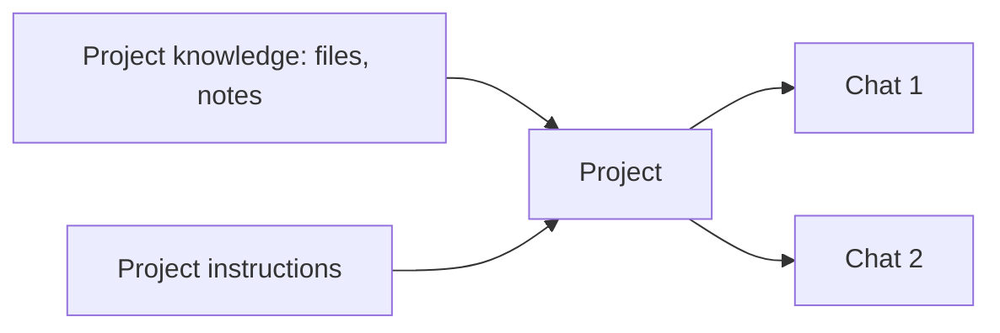

<LevelBadge level="beginner" />

<VerifyNote lastVerified="2026-06-20" source="https://www.anthropic.com">
Les fonctionnalités et limites des projets varient selon la formule et changent — confirmez le comportement actuel dans l'application ou le centre d'aide.
</VerifyNote>

Un **Projet** est un espace de travail dédié dans Claude.ai qui regroupe **ses propres fichiers, connaissances et instructions**. Au lieu de re-téléverser les mêmes documents et de ré-expliquer le contexte à chaque conversation, vous le configurez une seule fois — et chaque conversation au sein du Projet commence déjà informée.

## Pourquoi utiliser un Projet

- **Des réponses ancrées.** Ajoutez vos documents (un manuel, des spécifications, des notes) et Claude répond *à partir d'eux* — une version intégrée et sans code de la [RAG](/docs/foundations/rag).
- **Un contexte persistant.** Les instructions du projet agissent comme un [prompt système](/docs/foundations/roles) à portée limitée pour tout ce qui s'y trouve.
- **De l'organisation.** Toutes les conversations sur un même sujet / client / initiative restent regroupées.

## En configurer un

1. **Créez un Projet** et donnez-lui un objectif clair.
2. **Ajoutez des connaissances** — les fichiers / textes qu'il doit toujours connaître.
3. **Rédigez les instructions du projet** — rôle, conventions, ce qu'il faut faire / éviter.
4. **Commencez à discuter** — chaque conversation hérite des connaissances + des instructions.

## D'excellents cas d'usage

- Un espace de travail **client / compte** (leurs documents + vos notes).
- Une base de connaissances sur une **base de code ou un produit** pour les questions-réponses.
- Un **projet de rédaction** avec votre guide de style et vos écrits passés (pour que les brouillons correspondent à votre voix).
- Les **études** pour un cours, avec le programme et les supports chargés.

## Conseils

- **Sélectionnez les connaissances** — des fichiers pertinents et à jour valent mieux que de tout déverser (le bruit nuit à la récupération).
- **Gardez les instructions concises et justes** (même règle que pour les [instructions personnalisées](/docs/claude-app/custom-instructions)).
- **N'ajoutez pas de données sensibles** que vous ne seriez pas à l'aise de stocker — voir [Confidentialité](/docs/foundations/privacy).

## Suite

- [Instructions personnalisées et styles](/docs/claude-app/custom-instructions)
- [La mémoire entre les conversations](/docs/claude-app/memory)
- [Génération augmentée par récupération (RAG)](/docs/foundations/rag)
