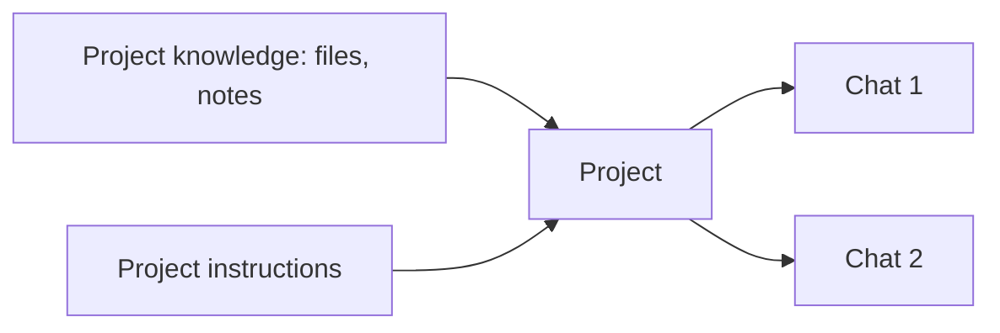

<LevelBadge level="beginner" />

<VerifyNote lastVerified="2026-09-23" source="https://claude.com/blog/projects-redesigned">
Les fonctionnalités et limites des Projets varient selon l'offre et évoluent — vérifiez le comportement actuel dans l'application ou le centre d'aide. Une **refonte des Projets** (un coordinateur qui délègue à des threads parallèles) est entrée en bêta dans Claude Code le 17 septembre 2026 et doit atteindre le reste de Claude ainsi que les offres Team/Enterprise plus tard. Cette page décrit le Projet à base de connaissances que la plupart des comptes ont encore.
</VerifyNote>

Un **Projet** est un espace de travail dédié dans Claude.ai qui regroupe **ses propres fichiers, connaissances et instructions**. Au lieu de re-téléverser les mêmes documents et de réexpliquer le contexte à chaque conversation, vous le configurez une fois — et chaque conversation dans le Projet démarre déjà informée.

<Callout type="objectives" items={[
  "Ce qu'un Projet regroupe, et pourquoi c'est mieux que de recoller le contexte à chaque conversation",
  "La configuration en quatre étapes, et l'étape que tout le monde saute",
  "Comment curer les connaissances du projet pour que la récupération reste précise",
  "En quoi ce Projet diffère des Projets coordinateur-et-threads de Claude Code"
]} />

## Pourquoi utiliser un Projet

- **Réponses ancrées.** Ajoutez vos documents (un manuel, des spécifications, des notes) et Claude répond *à partir d'eux* — une variante intégrée et sans code du [RAG](/docs/foundations/rag).
- **Contexte persistant.** Les instructions du projet agissent comme un [prompt système](/docs/foundations/roles) à portée limitée pour tout ce qui s'y trouve.
- **Organisé.** Toutes les conversations sur un même sujet / client / initiative vivent ensemble.

## En configurer un

<Steps items={[
  {title: "Créez un Projet avec un objectif clair", body: "Un Projet par sujet, client ou initiative. Un Projet qui couvre trois choses sans rapport récupère mal pour les trois."},
  {title: "Ajoutez des connaissances", body: "Les fichiers et textes qu'il doit toujours connaître — le manuel, la spécification, le guide de style. C'est à partir de cela que Claude répond."},
  {title: "Rédigez les instructions du projet", body: "L'étape que tout le monde saute. Rôle, conventions, ce qu'il faut faire et ce qu'il faut éviter. Sans elles, vous avez un index de recherche plutôt qu'un collègue."},
  {title: "Commencez à discuter", body: "Chaque conversation à l'intérieur du Projet hérite automatiquement des connaissances et des instructions."}
]} />

```mermaid
flowchart LR
  K[Project knowledge: files, notes] --> P[Project]
  I[Project instructions] --> P
  P --> C1[Chat 1]
  P --> C2[Chat 2]
```

## D'excellents cas d'usage

- Un espace de travail **client / compte** (leurs documents + vos notes).
- Une base de connaissances sur une **base de code ou un produit** pour les questions-réponses.
- Un **projet de rédaction** avec votre guide de style et vos écrits passés (pour que les brouillons correspondent à votre voix).
- Les **études** pour un cours, avec le programme et les supports chargés.

## Un point de départ pour les instructions du projet

<PromptCard title="Squelette d'instructions de projet">{`You are helping with [project/client name].

Context: [what this project is, who it serves, current stage]

Always:
- Answer from the project knowledge first; say so when you are going beyond it.
- Use [our terminology: list the 3-5 terms that matter].
- Match the tone in [named file in the knowledge base].

Never:
- Invent figures, dates, or quotes. If it is not in the knowledge, say it is not in the knowledge.
- [Project-specific constraint: e.g. reference the deprecated v1 API.]`}</PromptCard>

## Conseils

- **Sélectionnez les connaissances** — des fichiers pertinents et à jour valent mieux que de tout déverser (le bruit nuit à la récupération).
- **Gardez les instructions concises et justes** (même règle que pour les [instructions personnalisées](/docs/claude-app/custom-instructions)).
- **Élaguez quand les choses changent.** Une spécification dépassée laissée dans la base de connaissances est pire que pas de spécification du tout, parce que Claude n'a aucun moyen de savoir qu'elle a perdu un arbitrage face à la nouvelle.
- **N'ajoutez pas de données sensibles** que vous ne seriez pas à l'aise de stocker — voir [Confidentialité](/docs/foundations/privacy).

## Deux choses appelées « Projets »

Ce sont réellement deux produits différents, et les noms se chevauchent pendant le déploiement :

| | Ce Projet (Claude.ai) | [Projets Claude Code](/docs/claude-code/projects-coordinator-threads) |
|---|---|---|
| Ce que c'est | Un espace de travail avec connaissances + instructions | Un coordinateur qui délègue à des threads parallèles |
| Ce que ça fait | Ancre *vos* conversations dans *vos* fichiers | Cadre, découpe et exécute le travail pour vous |
| Exécute du code ? | Non | Oui — chaque thread est une session cloud sur sa propre branche |
| Qui l'a | Largement disponible | Bêta, utilisateurs Claude Code Pro/Max sélectionnés au lancement |

Si vous lisez des choses sur les coordinateurs, les threads et les pull requests, c'est de celui de Claude Code qu'il s'agit.

<Quiz questions={[
  {
    q: "À quoi les instructions du projet ressemblent-elles dans leur fonctionnement ?",
    options: [
      "À un message unique dans la première conversation",
      "À un prompt système à portée limitée appliqué à chaque conversation du Projet",
      "À un filtre qui cache des fichiers à Claude",
      "À un résumé que Claude écrit pour lui-même"
    ],
    answer: 1,
    explain: "Les instructions du projet se comportent comme un prompt système limité à la portée du Projet, si bien que chaque conversation à l'intérieur hérite du même rôle et des mêmes conventions sans que vous ayez à les répéter."
  },
  {
    q: "Pourquoi déverser tous les fichiers disponibles dans les connaissances du projet est-il nuisible ?",
    options: [
      "Claude facture au fichier",
      "Les fichiers expirent après un certain nombre de conversations",
      "Le matériel non pertinent et obsolète ajoute du bruit qui dégrade la récupération",
      "Seul le premier fichier est jamais lu"
    ],
    answer: 2,
    explain: "Les connaissances du projet servent de source de récupération, donc la pertinence compte plus que le volume. Les documents dépassés sont le pire cas — Claude ne peut pas savoir qu'un fichier plus récent annule un plus ancien à moins que vous ne le retiriez ou ne l'étiquetiez."
  }
]} />

<Callout type="takeaways" items={[
  "Un Projet regroupe connaissances et instructions pour que chaque conversation à l'intérieur démarre informée.",
  "Les instructions sont l'étape que tout le monde saute — sans elles vous avez de la recherche, pas un collègue.",
  "Sélectionnez et élaguez : les fichiers dépassés induisent activement en erreur, ils n'ajoutent pas seulement du bruit.",
  "Les Projets coordinateur-et-threads de Claude Code sont un produit différent qui partage le même nom."
]} />

## Suite

- [Instructions personnalisées et styles](/docs/claude-app/custom-instructions)
- [La mémoire entre les conversations](/docs/claude-app/memory)
- [Génération augmentée par récupération (RAG)](/docs/foundations/rag)
