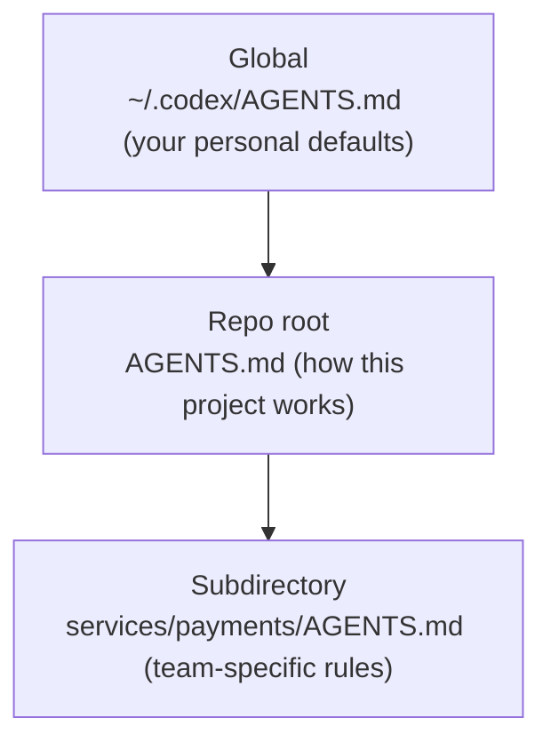

<LevelBadge level="intermediate" />

<VerifyNote lastVerified="2026-06-27" source="https://agents.md/">
La liste des adoptants d'AGENTS.md et le comportement d'import/symlink de Claude Code évoluent rapidement — vérifiez les détails sur le site officiel AGENTS.md et dans la documentation mémoire de Claude Code.
</VerifyNote>

Vous connaissez déjà [CLAUDE.md](/docs/claude-code/claude-md) — le briefing de projet de Claude Code. Mais votre dépôt est probablement manipulé par *plus* d'un agent : un collègue lance Codex, la CI utilise un bot de code, quelqu'un ouvre le dépôt dans Cursor. `AGENTS.md` est le standard ouvert que ces outils s'accordent à lire, pour que vous écriviez les instructions de votre projet **une seule fois** au lieu de maintenir un fichier différent par outil.

<Callout type="objectives" items={["Ce qu'est AGENTS.md et qui en assure la gouvernance", "Pourquoi Claude Code lit CLAUDE.md et non AGENTS.md", "Trois moyens fiables de garder une seule source de vérité entre les outils", "Comment les fichiers AGENTS.md imbriqués et globaux fusionnent", "Ce qui a sa place dans le fichier — et ce qu'il faut en exclure"]} />

## Ce qu'est AGENTS.md

`AGENTS.md` est un simple fichier Markdown à la racine de votre dépôt — voyez-le comme un **README écrit pour les agents plutôt que pour les humains**. Il indique à un agent de code comment construire, tester et contribuer au projet. Le format n'impose aucun champ : les agents lisent simplement le texte.

C'est un standard ouvert dont la gouvernance est assurée par l'**Agentic AI Foundation (AAIF) sous l'égide de la Linux Foundation**, et à la mi-2026 il est utilisé par plus de 60 000 projets open source et lu par plus de 30 outils — dont OpenAI Codex, Jules et Gemini CLI de Google, Cursor, Windsurf, Devin, Zed, Warp, Aider, goose, Amp et l'agent de code de GitHub Copilot.

<Callout type="info" items={["AGENTS.md est une convention, pas un runtime : chaque outil décide comment il découvre, fusionne et injecte le fichier.", "Aucun schéma n'est imposé — un texte clair vaut mieux qu'une structure rigide.", "Il complète votre README ; il ne le remplace pas."]} />

## Le piège de Claude Code

Voici le point sur lequel les gens trébuchent : **Claude Code lit `CLAUDE.md`, pas `AGENTS.md`.** Si votre dépôt ne contient qu'un `AGENTS.md`, Claude Code l'ignore par défaut. Ce n'est pas un bug — il précède le standard — mais cela signifie qu'un dépôt multi-outils a besoin d'une stratégie de synchronisation délibérée, sinon vos instructions divergent silencieusement.

<Callout type="warning" items={["Ne supposez pas que Claude Code se rabat sur AGENTS.md — il ne le lit pas automatiquement.", "Deux fichiers maintenus à la main (CLAUDE.md et AGENTS.md) finiront par diverger. Choisissez une seule source de vérité.", "Vérifiez le comportement actuel dans la documentation mémoire officielle avant de vous fier à toute promesse de repli."]} />

## Gardez une seule source de vérité

Trois approches gardent CLAUDE.md et AGENTS.md synchronisés sans dupliquer le contenu. Choisissez selon la plateforme de votre équipe.

<Steps items={[{title: "Symlink (le plus simple)", body: "Faites de CLAUDE.md un lien symbolique vers AGENTS.md. Claude Code suit les liens symboliques et lit la cible octet pour octet — un seul vrai fichier, aucune logique de fusion. Bémol : sous Windows, créer un lien symbolique nécessite le mode développeur ou des droits administrateur, donc les équipes multi-plateformes peuvent préférer la méthode par import."}, {title: "@import (multi-plateforme)", body: "Gardez un CLAUDE.md minuscule dont le seul rôle est d'inclure le fichier standard avec un import @AGENTS.md. Claude Code développe le fichier importé dans le contexte au lancement, donc AGENTS.md reste la source unique et il n'y a aucun lien symbolique susceptible de casser sous Windows."}, {title: "/init (migration)", body: "Vous initialisez Claude Code dans un dépôt qui possède déjà un AGENTS.md (ou .cursorrules / .windsurfrules) ? Lancez /init — il lit ces fichiers et intègre les parties pertinentes dans un CLAUDE.md généré."}]} />

<PromptCard title="Lier CLAUDE.md au standard partagé par symlink (macOS / Linux)">{`ln -s AGENTS.md CLAUDE.md`}</PromptCard>

<PromptCard title="Ou garder un CLAUDE.md d'une seule ligne qui l'importe">{`@AGENTS.md`}</PromptCard>

<Callout type="tip" items={["Utilisez le symlink quand toute votre équipe est sous macOS/Linux — c'est le moins de maintenance.", "Utilisez @import quand des contributeurs sous Windows sont impliqués.", "Versionnez l'option que vous choisissez pour que toute l'équipe obtienne le même comportement."]} />

## Comment les fichiers imbriqués et globaux fusionnent

Les agents les plus aboutis traitent AGENTS.md de façon hiérarchique — le même modèle mental que la [hiérarchie mémoire de CLAUDE.md](/docs/claude-code/claude-md). Codex, par exemple, part d'un fichier global dans votre répertoire personnel, descend jusqu'à la racine Git puis jusqu'à votre dossier courant, en concaténant au fur et à mesure :

Les fichiers les plus proches du travail l'emportent, parce qu'ils sont concaténés **en dernier** et surchargent les directives antérieures. Ainsi, un `services/payments/AGENTS.md` hérite des instructions de la racine du dépôt et ajoute des règles qui ne s'appliquent qu'à l'intérieur de ce service — placez les directives spécialisées aussi près que possible du code spécialisé.

<Flashcards title="L'interopérabilité en un coup d'œil" cards={[{front: "Qui lit AGENTS.md ?", back: "Plus de 30 outils — Codex, Cursor, Windsurf, Devin, Zed, Gemini CLI, l'agent de code de Copilot, et d'autres. Pas Claude Code par défaut."}, {front: "Qui lit CLAUDE.md ?", back: "Claude Code — et seulement Claude Code. Il ne lit pas AGENTS.md automatiquement."}, {front: "Meilleure synchro pour une équipe Mac/Linux", back: "Lier CLAUDE.md → AGENTS.md par symlink. Un seul vrai fichier, aucune divergence."}, {front: "Meilleure synchro avec des contributeurs Windows", back: "Un CLAUDE.md d'une seule ligne contenant @AGENTS.md — aucun symlink requis."}, {front: "Ordre de fusion pour les fichiers imbriqués", back: "Global → racine du dépôt → sous-répertoire. Les fichiers les plus proches du travail surchargent, car ils sont concaténés en dernier."}]} />

## Ce qu'il faut y mettre

La même discipline qu'un bon CLAUDE.md — le standard suggère simplement quelques sections courantes :

- **Présentation du projet** — ce que c'est, en deux phrases.
- **Commandes de build et de test** — comment exécuter, tester et linter.
- **Style de code** — les conventions qu'un agent ne peut pas deviner.
- **Instructions de test** — ce que « terminé » signifie.
- **Considérations de sécurité** — ce qu'il ne faut jamais toucher ni committer.
- **Directives de commit / PR** — format des messages, règles de branches.

<Callout type="warning" items={["Les agents suivent le fichier à la lettre — des instructions périmées ou idéalisées nuisent activement, exactement comme pour CLAUDE.md.", "Gardez-le court et vrai ; décrivez comment le projet fonctionne aujourd'hui.", "Ne committez jamais de secrets ; référencez les gros documents au lieu de les coller."]} />

## Vérifiez vos acquis

<Quiz title="Vérifiez vos acquis" questions={[{q: "Claude Code lit-il AGENTS.md automatiquement ?", options: ["Oui, il se rabat sur AGENTS.md", "Non — il lit uniquement CLAUDE.md", "Seulement sous Windows"], answer: 1, explain: "Claude Code lit CLAUDE.md et ignore par défaut un AGENTS.md isolé, donc les dépôts multi-outils ont besoin d'une stratégie de synchronisation délibérée."}, {q: "Votre équipe est entièrement sous macOS et Linux. Quel est le moyen le moins coûteux en maintenance pour partager un seul fichier d'instructions entre Claude Code et Codex ?", options: ["Maintenir CLAUDE.md et AGENTS.md à la main", "Lier CLAUDE.md à AGENTS.md par symlink", "Coller AGENTS.md dans un commentaire"], answer: 1, explain: "Lier CLAUDE.md → AGENTS.md par symlink vous donne un seul vrai fichier ; Claude Code suit le lien symbolique et lit la cible octet pour octet."}, {q: "Quand des agents fusionnent un AGENTS.md global, un à la racine du dépôt et un dans un sous-répertoire, lequel l'emporte en cas de conflit ?", options: ["Le fichier global", "Le fichier à la racine du dépôt", "Le fichier de sous-répertoire le plus proche du travail"], answer: 2, explain: "Les fichiers sont concaténés global → racine → sous-répertoire, donc le fichier le plus proche du travail apparaît en dernier et surcharge les directives antérieures."}]} />

<Callout type="takeaways" items={["AGENTS.md est le standard ouvert, sous gouvernance de la Linux Foundation, que lisent plus de 30 agents de code — un README pour les agents.", "Claude Code lit CLAUDE.md, pas AGENTS.md, donc les dépôts multi-outils doivent les garder synchronisés.", "Liez CLAUDE.md → AGENTS.md par symlink sous Mac/Linux, ou utilisez un import @AGENTS.md d'une seule ligne pour les équipes multi-plateformes.", "Les fichiers imbriqués fusionnent global → racine → sous-répertoire, le fichier le plus proche l'emportant.", "Remplissez-le comme un excellent CLAUDE.md : présentation, commandes de build/test, conventions, sécurité et garde-fous — court et vrai."]} />

## Pour aller plus loin

- [CLAUDE.md & fichiers mémoire](/docs/claude-code/claude-md) — le pendant Claude Code de la même idée
- [Modèles de CLAUDE.md](/docs/templates/claude-md) — des points de départ prêts à l'emploi que vous pouvez réutiliser comme AGENTS.md
- [Commandes slash](/docs/claude-code/slash-commands) — y compris /init pour migrer des fichiers d'instructions existants

## Sources & lectures complémentaires

- [AGENTS.md — site officiel & spécification](https://agents.md/)
- [OpenAI Codex — Instructions personnalisées avec AGENTS.md](https://developers.openai.com/codex/guides/agents-md)
- [Documentation mémoire de Claude Code](https://code.claude.com/docs/en/memory)
