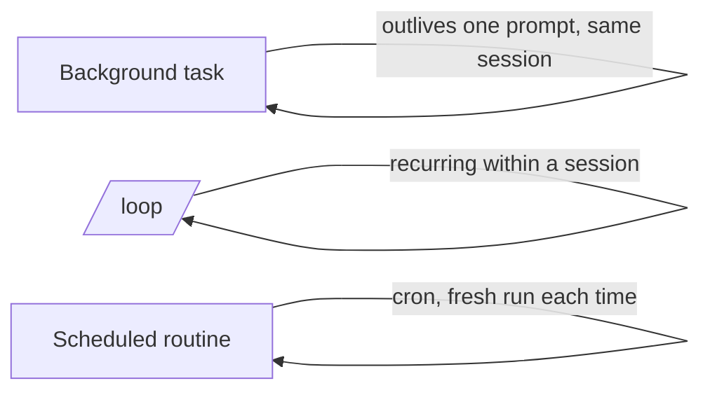

<LevelBadge level="advanced" />

<VerifyNote lastVerified="2026-06-20" source="https://code.claude.com/docs/en">
Les commandes exactes et la disponibilité des tâches en arrière-plan, de /loop et de la planification changent d'une version à l'autre — vérifiez dans la documentation officielle.
</VerifyNote>

Tout n'est pas qu'une modification rapide. Claude Code peut exécuter du travail qui **survit à une seule invite** : des commandes longues en arrière-plan, des boucles récurrentes et des exécutions planifiées.

## Tâches en arrière-plan

Lancez une commande de longue durée (un serveur de développement, un observateur de tests, un build) **sans bloquer** la session. Claude continue à travailler et est notifié lorsque la tâche produit une sortie ou se termine. Utilisez-la pour tout ce que vous mettriez normalement en arrière-plan avec `&` — mais de manière gérée, pour que Claude puisse lire la sortie plus tard.

:::tip N'attendez pas en boucle active
Lancez la tâche en arrière-plan et continuez ; laissez la notification de fin vous ramener, plutôt que d'interroger dans une boucle serrée.
:::

## Boucles récurrentes (`/loop`)

`/loop` exécute une invite ou une commande à un **intervalle récurrent** au sein d'une session — par exemple « toutes les 5 minutes, vérifie le statut du déploiement ». Donnez-lui un intervalle, ou laissez Claude définir lui-même son rythme. Idéal pour surveiller une exécution de CI ou interroger un job externe dont le harnais ne peut pas vous notifier autrement.

## Agents cloud planifiés

Pour du travail qui doit se produire **à heure fixe, de façon continue** — « chaque matin, résume les nouveaux tickets », « toutes les heures, vérifie les actualités et mets à jour la documentation » — utilisez les **tâches planifiées / routines** (de type cron). Chaque exécution démarre de zéro, donc ses instructions doivent être **autonomes**.

## Choisir entre eux

| Besoin | À utiliser |
|---|---|
| Exécuter une commande longue, continuer à travailler | Tâche en arrière-plan |
| Interroger quelque chose toutes les N minutes dans cette session | `/loop` |
| Faire quelque chose selon un planning, indéfiniment | Routine planifiée |

:::warning L'autonomie nécessite des garde-fous
Tout ce qui agit sans surveillance selon un planning doit être strictement cadré et réversible. Associez-le à des [permissions](/docs/claude-code/permissions) strictes et lisez [Sécuriser les exécutions autonomes](/docs/security/hardening-autonomous-runs).
:::

## Et après

- [Mode headless & l'Agent SDK](/docs/claude-code/headless-and-agent-sdk)
- [Permissions & modes](/docs/claude-code/permissions)
- [Sécuriser les exécutions autonomes](/docs/security/hardening-autonomous-runs)
