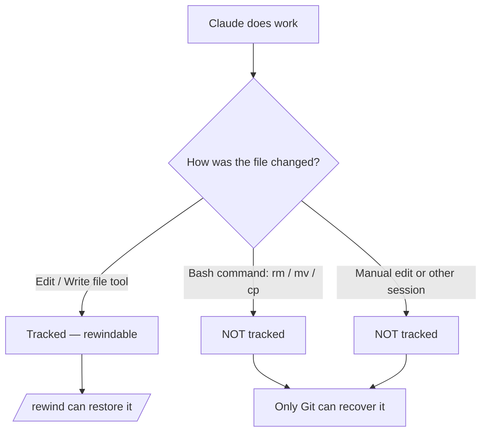

<LevelBadge level="intermediate" />

<Callout type="objectives" items={["Comprendre ce qu'un point de contrôle capture — et ce qu'il ne capture silencieusement pas", "Ouvrir le menu de retour arrière de deux façons et choisir la bonne action de restauration à chaque fois", "Distinguer « restaurer » (annuler l'état) de « résumer » (compresser le contexte)", "Savoir exactement pourquoi les points de contrôle complètent Git mais ne le remplacent jamais"]} />

<VerifyNote lastVerified="2026-07-09" source="https://code.claude.com/docs/en/checkpointing">
Le comportement des points de contrôle, les actions du menu de retour arrière, la rétention et les exigences de version (par ex. reprendre au-delà d'un `/clear` nécessite Claude Code v2.1.191+) changent d'une version à l'autre — vérifiez dans la documentation officielle.
</VerifyNote>

## L'idée maîtresse

Quand vous lâchez Claude sur une modification ambitieuse et de grande ampleur, la question la plus effrayante est « et si ça tourne mal trois modifications plus loin ? » Le **point de contrôle** (checkpointing) est la réponse : Claude Code capture automatiquement un instantané de votre code avant chaque modification, pour que vous puissiez revenir à n'importe quel état antérieur au lieu de démêler à la main un refactoring à moitié terminé.

Voyez-le comme une **annulation locale pour toute la session** — un filet de sécurité qui vous permet de dire « oui, tente l'approche audacieuse » sans crainte.

## Comment les points de contrôle sont créés

Vous ne créez pas les points de contrôle — ils se produisent automatiquement.

<Steps items={[{title: "Chaque prompt = un point de contrôle", body: "Chaque prompt utilisateur capture l'état de votre code avant l'exécution des outils d'édition de fichiers de Claude. Aucune commande, aucune configuration, aucune cérémonie."}, {title: "Ils persistent entre les sessions", body: "Les points de contrôle survivent à la fermeture et à la reprise d'une conversation, vous pouvez donc revenir en arrière dans une session reprise, pas seulement dans la session en cours."}, {title: "Ils se nettoient tout seuls", body: "Les points de contrôle sont supprimés avec leur session après 30 jours (configurable). Il s'agit d'une récupération au niveau de la session, pas d'une archive."}]} />

## Ouvrir le menu de retour arrière

Il y a deux façons d'y accéder :

<Steps items={[{title: "Exécuter /rewind", body: "Tapez la commande slash depuis le prompt. Fonctionne toujours."}, {title: "Appuyer deux fois sur Esc — mais seulement sur une saisie vide", body: "Le double-Esc ouvre le menu de retour arrière quand la zone de saisie est vide. S'il y a du texte, le double-Esc efface ce texte à la place (le texte effacé est enregistré dans l'historique de saisie, appuyez sur Haut pour le récupérer ensuite)."}]} />

<PromptCard title="Open the rewind menu">{`/rewind`}</PromptCard>

Le menu liste **chaque prompt que vous avez envoyé pendant cette session**. Choisissez le point sur lequel vous voulez agir, puis sélectionnez une action.

## Restaurer vs. résumer : la distinction clé

C'est là que les gens se perdent. Le menu propose deux *types* d'action :

- Les actions de **restauration** modifient l'état sur le disque et/ou dans la conversation — elles annulent.
- Les actions de **résumé** ne touchent jamais à vos fichiers — elles compressent la conversation pour libérer de l'espace dans la fenêtre de contexte.

<Callout type="warning" items={["Restaurer = annuler (rétablit le code, la conversation ou les deux). Résumer = compresser le contexte (les fichiers sur le disque restent intacts).", "Optez pour la restauration quand une modification a cassé quelque chose. Optez pour le résumé quand la session est surchargée mais que le code est correct."]} />

### Les actions de restauration

<Steps items={[{title: "Restaurer le code et la conversation", body: "Rétablir à la fois vos fichiers et l'historique de la conversation au point sélectionné — un « retour dans le temps » net vers ce moment."}, {title: "Restaurer la conversation", body: "Revenir en arrière dans la conversation jusqu'à ce message mais conserver votre code actuel. Utile pour reposer une question sans perdre les modifications que vous voulez garder."}, {title: "Restaurer le code", body: "Rétablir les modifications de fichiers mais conserver la conversation. Annuler les modifications, garder la discussion à leur sujet."}]} />

Après avoir restauré la conversation (ou choisi « Résumer à partir d'ici »), le prompt original du message sélectionné est réinséré dans la zone de saisie pour que vous puissiez le renvoyer ou le modifier.

### Les actions de résumé

Les deux compressent une partie de la conversation en un résumé généré par l'IA — comme un **`/compact` ciblé** où vous choisissez de quel côté du message sélectionné vous voulez condenser.

<Steps items={[{title: "Résumer à partir d'ici", body: "Les messages AVANT le message sélectionné restent intacts. Le message sélectionné et tout ce qui suit deviennent un résumé. À utiliser pour écarter une discussion annexe tout en conservant le contexte antérieur en détail complet."}, {title: "Résumer jusqu'ici", body: "Les messages AVANT le message sélectionné deviennent un résumé ; le message sélectionné et tout ce qui suit restent intacts. Vous restez à la fin de la conversation. À utiliser pour compresser le bavardage de configuration initiale tout en conservant le travail récent mot pour mot."}]} />

Dans les deux cas, les messages originaux restent dans la transcription de la session, de sorte que Claude peut toujours s'y référer. Vous pouvez taper des instructions facultatives pour orienter ce sur quoi le résumé se concentre.

Pour l'ensemble du processus, voir [Gestion du contexte](/docs/claude-code/context-management) — les actions de résumé de `/rewind` sont un scalpel là où `/compact` est un pinceau large.

## Revenir en arrière au-delà d'un `/clear`

Si vous avez exécuté `/clear` plus tôt dans le même processus Claude Code, le menu de retour arrière affiche une entrée supplémentaire en haut : `/resume <session-id> (previous session)`. Sélectionnez-la pour revenir à la conversation qui était active avant `/clear`.

<VerifyNote lastVerified="2026-07-09" source="https://code.claude.com/docs/en/checkpointing">
Reprendre au-delà d'un `/clear` depuis le menu de retour arrière nécessite Claude Code v2.1.191 ou une version ultérieure. Sur les versions antérieures, exécutez `/resume` et choisissez la session précédente dans la liste à la place.
</VerifyNote>

## Là où les points de contrôle s'arrêtent — les limites qui piègent

Les points de contrôle semblent magiques jusqu'à ce qu'ils ne le soient plus. Trois lacunes comptent :

<Steps items={[{title: "Les changements via bash sont invisibles", body: "Les fichiers touchés par les commandes shell que Claude exécute — rm, mv, cp, générateurs de code, formateurs — ne sont PAS suivis. Seules les modifications directes via les outils d'édition de fichiers de Claude sont enregistrées comme points de contrôle. Un fichier supprimé par rm est perdu du point de vue du retour arrière."}, {title: "Les changements externes et concurrents sont invisibles", body: "Les modifications manuelles que vous faites en dehors de Claude Code, et les modifications d'autres sessions concurrentes, ne sont normalement pas capturées — sauf si elles touchent par hasard les mêmes fichiers que ceux modifiés par la session en cours."}, {title: "C'est au niveau de la session, pas de l'historique", body: "Les points de contrôle sont une récupération rapide et locale. Ce ne sont ni des commits, ni des branches, et ils ne sont pas partageables avec votre équipe."}]} />

## Points de contrôle vs. Git : utilisez les deux

Ils résolvent des problèmes différents, alors associez-les.

| | Points de contrôle (`/rewind`) | Git |
|---|---|---|
| Portée | Une session | Tout l'historique du projet |
| Granularité | Par prompt, automatique | Par commit, délibéré |
| Suit les changements faits via bash ? | Non | Oui (une fois indexés/commités) |
| Durée de vie | ~30 jours, puis disparu | Permanent |
| Partageable / collaboratif | Non | Oui |
| Modèle mental | « Annulation locale » | « Historique permanent » |

<Callout type="tip" items={["Commitez les états fonctionnels avec Git avant une exécution risquée et de grande ampleur — c'est votre base durable.", "Utilisez /rewind pour une récupération rapide en cours de session entre les commits sans polluer votre historique Git.", "Si Claude va exécuter des commandes bash destructrices (rm/mv) ou des générateurs, appuyez-vous sur Git — le retour arrière ne sauvera pas ces fichiers."]} />

## Quand y avoir recours

<Steps items={[{title: "Explorer des alternatives", body: "Essayez une implémentation audacieuse et, si elle ne vous plaît pas, restaurez le code et la conversation au point de bifurcation et tentez-en une autre."}, {title: "Récupérer après une mauvaise modification", body: "Une modification a introduit un bug il y a trois prompts ? Restaurez le code juste avant, au lieu de déboguer les décombres."}, {title: "Itérer sur une fonctionnalité", body: "Expérimentez des variantes en sachant toujours qu'un état sain connu est à un /rewind de distance."}, {title: "Libérer de l'espace de contexte", body: "Un détour de débogage verbeux a englouti votre fenêtre de contexte ? Résumez à partir du point médian vers l'avant et conservez vos instructions d'origine en détail complet."}]} />

<Quiz title="Check yourself" questions={[{q: "Claude a exécuté `rm config.old.json` via une commande bash et vous voulez le récupérer. `/rewind` peut-il le restaurer ?", options: ["Oui — chaque changement que fait Claude fait l'objet d'un point de contrôle", "Non — les changements faits via bash ne sont pas suivis ; seules les modifications directes par outil de fichier le sont", "Seulement si vous exécutez /rewind dans les 30 secondes"], answer: 1, explain: "Le point de contrôle ne capture que les modifications faites via les outils d'édition de fichiers de Claude. Les fichiers modifiés par des commandes bash (rm, mv, cp) ne sont pas suivis — c'est exactement à cela que sert Git."}, {q: "Votre code est correct, mais une longue digression de débogage a rempli la fenêtre de contexte. Quelle action convient ?", options: ["Restaurer le code et la conversation à avant la digression", "Restaurer le code", "Résumer à partir d'ici au début de la digression"], answer: 2, explain: "Les actions de résumé compressent la conversation sans toucher aux fichiers. « Résumer à partir d'ici » transforme la digression en résumé tout en conservant votre contexte antérieur intact — libérant de l'espace de contexte sans aucun changement de code."}, {q: "Comment un point de contrôle est-il créé ?", options: ["Vous exécutez /checkpoint manuellement", "Automatiquement, avant chaque modification — chaque prompt en crée un", "Uniquement quand vous commitez dans Git"], answer: 1, explain: "Le point de contrôle est automatique : chaque prompt utilisateur capture l'état pré-modification de votre code. Il n'y a aucune étape manuelle."}]} />

<Flashcards title="Checkpoints & rewind vocabulary" cards={[{front: "Point de contrôle", back: "Un instantané automatique de votre code pris avant chaque modification, une fois par prompt. Limité à la session, conservé ~30 jours."}, {front: "/rewind", back: "Ouvre le menu de retour arrière listant chaque prompt de cette session, pour que vous puissiez restaurer ou résumer depuis n'importe quel point. Accessible aussi via un double-Esc sur une saisie vide."}, {front: "Action de restauration", back: "Rétablit l'état — code, conversation, ou les deux — au point sélectionné. C'est l'« annulation »."}, {front: "Action de résumé", back: "Compresse une partie de la conversation en un résumé IA pour libérer du contexte. Les fichiers sur le disque ne sont jamais touchés."}, {front: "Angle mort de bash", back: "Les fichiers modifiés par des commandes shell (rm/mv/cp) ne font PAS l'objet d'un point de contrôle — seules les modifications directes par outil de fichier le sont. Utilisez Git pour ceux-là."}]} />

<Callout type="takeaways" items={["Les points de contrôle sont des instantanés automatiques de votre code, par prompt — une annulation locale pour toute la session, conservée environ 30 jours.", "Ouvrez le menu de retour arrière avec /rewind ou un double-Esc sur une saisie vide ; il liste chaque prompt que vous avez envoyé.", "Les actions de restauration annulent l'état (code, conversation ou les deux) ; les actions de résumé compressent le contexte et ne touchent jamais aux fichiers.", "Les changements faits via bash, externes et concurrents ne sont PAS suivis — seules les modifications directes par outil de fichier le sont.", "Les points de contrôle complètent Git, ils ne le remplacent pas : pensez « annulation locale » vs. « historique permanent et partageable »."]} />

## Suite

- [Gestion du contexte](/docs/claude-code/context-management) — `/compact`, `/clear`, et comment le résumé s'inscrit dans le tableau d'ensemble
- [Mode Plan](/docs/claude-code/plan-mode) — étudier et approuver un plan avant l'exécution des modifications, pour revenir en arrière moins souvent
- [Permissions](/docs/claude-code/permissions) — l'autre moitié de l'exécution sûre de tâches ambitieuses
