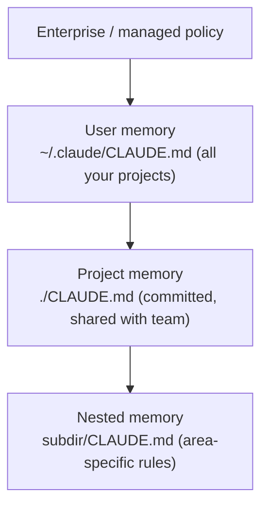

<LevelBadge level="beginner" />

<VerifyNote lastVerified="2026-06-20" source="https://code.claude.com/docs/en/memory">
Les emplacements des fichiers de mémoire et la syntaxe d'import peuvent changer — confirmez les détails dans la documentation officielle de la mémoire de Claude Code.
</VerifyNote>

Si vous faites **une** chose pour rendre [Claude Code](/docs/claude-code/what-is-claude-code) meilleur, faites ceci. `CLAUDE.md` est un fichier en texte brut que Claude lit au début de chaque session — le briefing permanent de votre projet.

<Callout type="objectives" items={["Pourquoi CLAUDE.md est le réglage de Claude Code au plus fort impact", "Comment la hiérarchie de mémoire fusionne du global au spécifique au projet", "Comment générer un fichier de départ avec /init et l'élaguer", "Ce qui a sa place dans CLAUDE.md — et ce qu'il faut en écarter", "Comment les @imports vous permettent de référencer des docs sans les dupliquer"]} />

## Pourquoi c'est le réglage au plus fort impact

Sans lui, vous réexpliquez votre projet à chaque session (« on utilise pnpm, les tests sont dans `__tests__`, ne touche pas à `/generated`… »). Avec lui, Claude sait déjà. De bonnes instructions ici améliorent *toutes* les interactions futures d'un coup.

## La hiérarchie de mémoire

Claude Code lit la mémoire depuis plusieurs endroits et les fusionne, grosso modo du plus global au plus spécifique :

- **Mémoire utilisateur** — vos préférences personnelles à travers tous les projets.
- **Mémoire de projet** (`./CLAUDE.md`, versionnée) — comment fonctionne *ce* dépôt. Partagée avec votre équipe.
- **Imbriquée** — déposez un `CLAUDE.md` dans un sous-dossier pour des règles qui ne s'appliquent qu'à cet endroit.

<Flashcards title="Connaissez vos couches de mémoire" cards={[{front: "Mémoire utilisateur", back: "~/.claude/CLAUDE.md — vos préférences personnelles qui s'appliquent à travers tous les projets."}, {front: "Mémoire de projet", back: "./CLAUDE.md — versionnée et partagée avec l'équipe ; décrit comment fonctionne ce dépôt."}, {front: "Mémoire imbriquée", back: "subdir/CLAUDE.md — règles spécifiques à une zone qui ne s'appliquent qu'à l'intérieur de ce sous-dossier."}, {front: "Enterprise / managed policy", back: "La couche la plus globale ; politique au niveau de l'organisation qui se situe au-dessus de votre mémoire utilisateur."}]} />

## Générer un point de départ

<Steps items={[{title: "Exécuter /init dans le projet", body: "Claude inspecte le code et vous rédige automatiquement un CLAUDE.md."}, {title: "L'élaguer", body: "Le brouillon est un point de départ, pas la ligne d'arrivée. Réduisez-le à ce qui est vrai et utile."}, {title: "Emprunter un modèle", body: "Récupérez un modèle prêt à l'emploi depuis la page des modèles CLAUDE.md et adaptez-le à votre dépôt."}]} />

<PromptCard title="Générer un brouillon de CLAUDE.md">{`/init`}</PromptCard>

Récupérez un modèle prêt à l'emploi depuis [Modèles de CLAUDE.md](/docs/templates/claude-md).

## Ce qu'il faut y mettre

- Ce qu'est le projet, en deux phrases.
- La stack technique et comment **lancer / tester / linter**.
- Les conventions que Claude ne peut pas déduire (nommage, structure, style de commit).
- **Garde-fous** : « lancer les tests avant de déclarer terminé », « ne jamais modifier `/vendor` », « ne jamais commiter de secrets ».

## Ce qu'il ne faut PAS y mettre

<Callout type="warning" items={["Claude suit CLAUDE.md à la lettre — des instructions périmées, vagues ou irréalistes nuisent activement.", "Décrivez comment le projet fonctionne réellement aujourd'hui ; court et vrai vaut mieux que long et aspirationnel.", "Évitez les docs entiers collés (utilisez les @imports à la place), les secrets et les règles que vous ne suivez pas réellement.", "Relisez-le périodiquement pour qu'il reste exact à mesure que le projet évolue."]} />

## Imports

Intégrez des docs existants au lieu de les dupliquer — par ex. référencez votre guide de style avec un import `@path/to/file` pour qu'il n'y ait qu'une seule source de vérité. Voir la [documentation officielle de la mémoire](https://code.claude.com/docs/en/memory) pour la syntaxe exacte.

<Callout type="tip" items={["Une seule source de vérité : référencez un fichier avec les @imports plutôt que de coller son contenu dans CLAUDE.md.", "Si un doc existe déjà, liez-le — ne le copiez pas. Les copies finissent périmées."]} />

## Vérifiez vos acquis

<Quiz title="Vérifiez vos acquis" questions={[{q: "Quel fichier Claude Code lit-il au début de chaque session comme briefing permanent de votre projet ?", options: ["README.md", "CLAUDE.md", "package.json"], answer: 1, explain: "CLAUDE.md est le fichier de mémoire en texte brut que Claude lit au début de chaque session."}, {q: "Que fait l'exécution de /init dans un projet ?", options: ["Il commite CLAUDE.md dans le dépôt de votre équipe", "Il rédige un CLAUDE.md en inspectant le code, que vous élaguez ensuite", "Il supprime les fichiers de mémoire périmés"], answer: 1, explain: "/init rédige un CLAUDE.md de départ à partir du code — le brouillon est un point de départ, alors vous l'élaguez ensuite."}, {q: "Quelle est la façon recommandée d'inclure un gros doc existant comme un guide de style ?", options: ["Coller le document entier dans CLAUDE.md", "Le référencer avec un import @path/to/file", "Le stocker comme un secret"], answer: 1, explain: "Utilisez les @imports pour pointer vers le fichier afin d'avoir une seule source de vérité au lieu d'une copie dupliquée qui se périme."}]} />

<Callout type="takeaways" items={["CLAUDE.md est le réglage au plus fort impact : il améliore toutes les sessions futures d'un coup.", "La mémoire fusionne du global au spécifique : politique d'entreprise, puis fichiers CLAUDE.md utilisateur, de projet et imbriqués.", "Commencez avec /init, puis élaguez le brouillon jusqu'à ce qui est réellement vrai.", "Incluez le résumé du projet, les commandes lancer/tester/linter, les conventions et les garde-fous.", "Gardez-le court et vrai — utilisez les @imports pour les gros docs, et ne commitez jamais de secrets."]} />

## Suite

- [AGENTS.md & interopérabilité inter-outils](/docs/claude-code/agents-md) — partagez un seul fichier d'instructions entre tous les agents de codage
- [Plan Mode](/docs/claude-code/plan-mode) — des premières modifications sûres
- [Permissions & modes](/docs/claude-code/permissions) — ce que Claude peut faire sans surveillance
- [Pas à pas : personnaliser Claude Code pour un vrai dépôt](/docs/walkthroughs/customize-claude-code)
