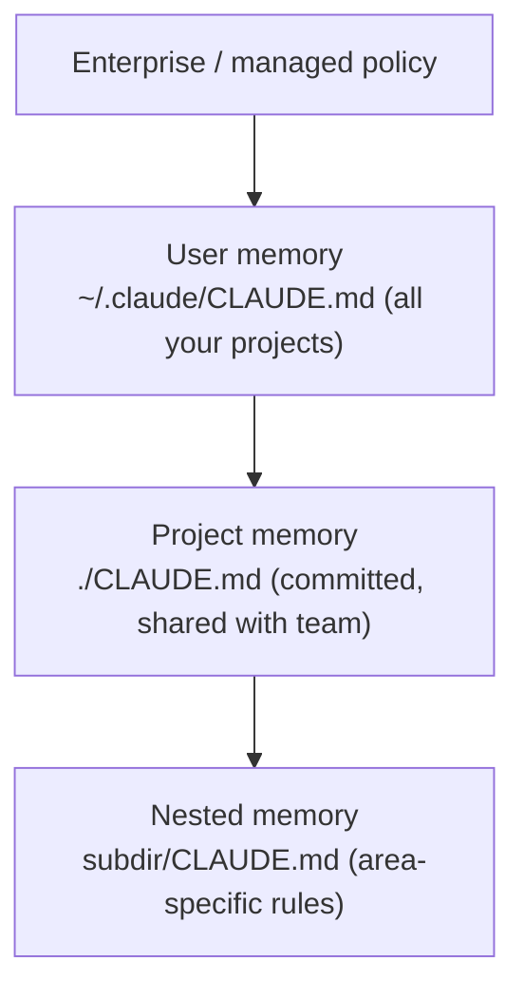

<LevelBadge level="beginner" />

<VerifyNote lastVerified="2026-06-20" source="https://code.claude.com/docs/en/memory">
L'emplacement des fichiers de mémoire et la syntaxe d'import peuvent changer — vérifiez les détails dans la documentation officielle de la mémoire de Claude Code.
</VerifyNote>

Si vous ne deviez faire qu'**une seule** chose pour améliorer [Claude Code](/docs/claude-code/what-is-claude-code), faites celle-ci. `CLAUDE.md` est un fichier en texte brut que Claude lit au début de chaque session — le briefing permanent de votre projet.

## Pourquoi c'est le réglage au plus fort impact

Sans lui, vous réexpliquez votre projet à chaque session (« on utilise pnpm, les tests sont dans `__tests__`, ne touche pas à `/generated`… »). Avec lui, Claude le sait déjà. De bonnes instructions ici améliorent *toutes* vos interactions futures d'un coup.

## La hiérarchie de la mémoire

Claude Code lit la mémoire depuis plusieurs endroits et les fusionne, grossièrement du plus global au plus spécifique :

- **Mémoire utilisateur** — vos préférences personnelles pour tous les projets.
- **Mémoire de projet** (`./CLAUDE.md`, committée) — comment fonctionne *ce* dépôt. Partagée avec votre équipe.
- **Imbriquée** — déposez un `CLAUDE.md` dans un sous-dossier pour des règles qui ne s'appliquent qu'à cet endroit.

## Générer un point de départ

Exécutez `/init` dans un projet et Claude rédige un `CLAUDE.md` en inspectant le code. Ensuite, **réduisez-le** — le brouillon est un point de départ, pas la ligne d'arrivée.

## Quoi y mettre

- Ce qu'est le projet, en deux phrases.
- La pile technique et comment **exécuter / tester / linter**.
- Les conventions que Claude ne peut pas deviner (nommage, structure, style de commit).
- **Garde-fous** : « exécute les tests avant de te déclarer terminé », « ne modifie jamais `/vendor` », « ne committe jamais de secrets ».

Récupérez un modèle prêt à l'emploi dans les [Modèles de CLAUDE.md](/docs/templates/claude-md).

## Quoi NE PAS y mettre

:::warning Court et vrai vaut mieux que long et idéaliste
Claude suit `CLAUDE.md` *à la lettre*. Des instructions obsolètes, vagues ou pleines de bonnes intentions nuisent activement. Décrivez comment le projet fonctionne **réellement** aujourd'hui, gardez-le concis et relisez-le régulièrement.
:::

À éviter : de gigantesques docs collées (utilisez plutôt des `@imports` pour référencer des fichiers), les secrets et les règles que vous ne suivez pas vraiment.

## Imports

Intégrez la documentation existante au lieu de la dupliquer — par exemple, référencez votre guide de style avec un import `@path/to/file` afin d'avoir une seule source de vérité. Consultez la [documentation officielle de la mémoire](https://code.claude.com/docs/en/memory) pour la syntaxe exacte.

## Et après

- [Mode Plan](/docs/claude-code/plan-mode) — premières modifications en toute sécurité
- [Permissions & modes](/docs/claude-code/permissions) — ce que Claude peut faire sans surveillance
- [Tutoriel : Personnaliser Claude Code pour un vrai dépôt](/docs/walkthroughs/customize-claude-code)
