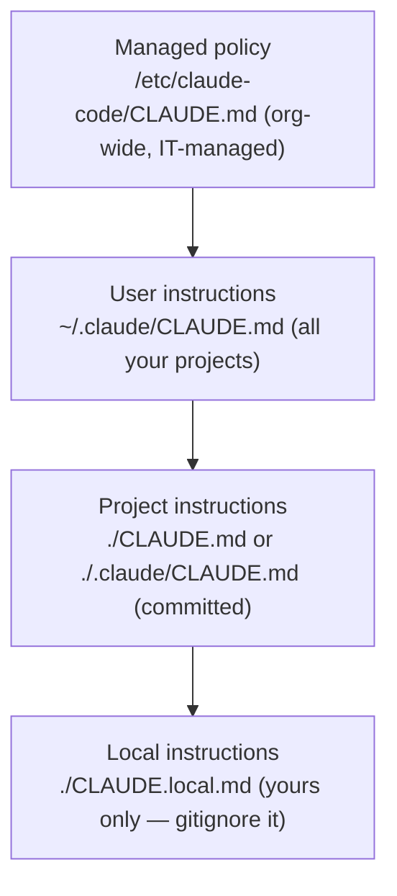

<LevelBadge level="beginner" />

<VerifyNote lastVerified="2026-10-06" source="https://code.claude.com/docs/en/memory">
Les emplacements, l'ordre de chargement et la syntaxe d'import proviennent de la documentation officielle de la mémoire (« Comment Claude se souvient de votre projet »), qui décrit désormais **deux** mécanismes : les fichiers CLAUDE.md que vous écrivez et la **mémoire automatique** que Claude écrit lui-même. Les imports se résolvent jusqu'à une profondeur maximale de quatre sauts. Confirmez les détails là-bas — ces éléments changent.
</VerifyNote>

Si vous faites **une** chose pour rendre [Claude Code](/docs/claude-code/what-is-claude-code) meilleur, faites ceci. `CLAUDE.md` est un fichier en texte brut que Claude lit au début de chaque session — le briefing permanent de votre projet.

<Callout type="objectives" items={["Pourquoi CLAUDE.md est le réglage de Claude Code au plus fort impact", "Comment la hiérarchie de mémoire se charge, de la politique managée jusqu'à CLAUDE.local.md", "En quoi la mémoire automatique diffère du CLAUDE.md que vous écrivez", "Comment générer un fichier de départ avec /init et l'élaguer", "Ce qui a sa place dans CLAUDE.md — et ce qu'il faut en écarter", "Comment les @imports vous permettent de référencer des docs sans les dupliquer"]} />

## Pourquoi c'est le réglage au plus fort impact

Sans lui, vous réexpliquez votre projet à chaque session (« on utilise pnpm, les tests sont dans `__tests__`, ne touche pas à `/generated`… »). Avec lui, Claude sait déjà. De bonnes instructions ici améliorent *toutes* les interactions futures d'un coup.

## La hiérarchie de mémoire

Claude Code charge la mémoire depuis plusieurs emplacements et les fusionne dans l'ordre de chargement, en commençant par le périmètre le plus large — de sorte qu'une instruction de projet arrive en contexte *après* une instruction utilisateur :

```mermaid
flowchart TD
  A["Managed policy<br/>/etc/claude-code/CLAUDE.md (org-wide, IT-managed)"] --> B["User instructions<br/>~/.claude/CLAUDE.md (all your projects)"]
  B --> C["Project instructions<br/>./CLAUDE.md or ./.claude/CLAUDE.md (committed)"]
  C --> D["Local instructions<br/>./CLAUDE.local.md (yours only — gitignore it)"]
```

- **Politique managée** — des instructions à l'échelle de l'organisation livrées par votre équipe IT/DevOps. Le chemin dépend de l'OS : `/Library/Application Support/ClaudeCode/CLAUDE.md` sur macOS, `/etc/claude-code/CLAUDE.md` sur Linux et WSL, `C:\Program Files\ClaudeCode\CLAUDE.md` sur Windows.
- **Instructions utilisateur** (`~/.claude/CLAUDE.md`) — vos préférences personnelles à travers tous les projets.
- **Instructions de projet** (`./CLAUDE.md` *ou* `./.claude/CLAUDE.md`, versionnées) — comment fonctionne *ce* dépôt. Partagées avec votre équipe. Si votre dépôt utilise [`AGENTS.md`](/docs/claude-code/agents-md), celui-ci peut se charger à la place de ces fichiers ou en complément.
- **Instructions locales** (`./CLAUDE.local.md`) — des notes spécifiques au projet rien que pour vous, comme une URL de sandbox. Ajoutez-le à `.gitignore`.

Les fichiers situés dans la hiérarchie de répertoires *au-dessus* de votre répertoire de travail se chargent au démarrage ; les fichiers des **sous-dossiers se chargent à la demande**, quand Claude touche quelque chose dans cette zone.

<Callout type="tip" items={["Un seul fichier ne suffit plus ? Répartissez les instructions dans .claude/rules/*.md — un sujet par fichier, découverts récursivement. Les règles sans frontmatter paths se chargent au démarrage avec la même priorité que .claude/CLAUDE.md ; ajoutez un frontmatter paths pour ne charger une règle que lorsque Claude travaille sur des fichiers correspondants, ce qui économise du contexte."]} />

<Flashcards title="Connaissez vos couches de mémoire" cards={[{front: "Politique managée", back: "Un CLAUDE.md à l'échelle de l'organisation, géré par l'IT — la couche la plus large, chargée avant les instructions utilisateur et de projet."}, {front: "Instructions utilisateur", back: "~/.claude/CLAUDE.md — vos préférences personnelles qui s'appliquent à travers tous les projets."}, {front: "Instructions de projet", back: "./CLAUDE.md ou ./.claude/CLAUDE.md — versionnées et partagées avec l'équipe ; décrivent comment fonctionne ce dépôt."}, {front: "Instructions locales", back: "./CLAUDE.local.md — préférences personnelles spécifiques au projet. Mettez-le dans gitignore."}, {front: ".claude/rules/*.md", back: "Des instructions à raison d'un sujet par fichier, pour les projets plus gros. Avec un frontmatter paths, elles ne se chargent que pour les fichiers correspondants."}, {front: "CLAUDE.md de sous-dossier", back: "Se charge à la demande — quand Claude travaille dans cette partie de l'arborescence — et non au démarrage."}]} />

## L'autre moitié : la mémoire automatique

CLAUDE.md est la moitié de la mémoire que *vous* écrivez. Claude Code conserve aussi une **mémoire automatique** — des notes que Claude écrit lui-même à partir de vos corrections et de vos préférences, stockées par dépôt et chargées dans chaque session aux côtés de vos fichiers CLAUDE.md.

| | Fichiers CLAUDE.md | Mémoire automatique |
| --- | --- | --- |
| **Qui l'écrit** | Vous | Claude |
| **Ce qu'elle contient** | Instructions et règles | Apprentissages et patterns |
| **Portée** | Projet, utilisateur ou organisation | Par dépôt, partagée entre les worktrees |

Les deux sont du *contexte*, pas une contrainte : Claude les traite comme des indications qu'il peut pondérer, pas comme une configuration à laquelle il doit obéir. Pour bloquer net une action quoi que Claude décide, utilisez plutôt un [hook PreToolUse](/docs/claude-code/hooks).

<Callout type="warning" items={["La mémoire automatique ne charge que ses 200 premières lignes ou 25 Ko — un MEMORY.md surchargé se tronque silencieusement. Voir Audit du budget de contexte pour la répartition complète du coût au démarrage."]} />

## Générer un point de départ

<Steps items={[{title: "Exécuter /init dans le projet", body: "Claude inspecte le code et vous rédige automatiquement un CLAUDE.md."}, {title: "L'élaguer", body: "Le brouillon est un point de départ, pas la ligne d'arrivée. Réduisez-le à ce qui est vrai et utile."}, {title: "Emprunter un modèle", body: "Récupérez un modèle prêt à l'emploi depuis la page des modèles CLAUDE.md et adaptez-le à votre dépôt."}]} />

<PromptCard title="Générer un brouillon de CLAUDE.md">{`/init`}</PromptCard>

Récupérez un modèle prêt à l'emploi depuis [Modèles de CLAUDE.md](/docs/templates/claude-md).

## Ce qu'il faut y mettre

- Ce qu'est le projet, en deux phrases.
- La stack technique et comment **lancer / tester / linter**.
- Les conventions que Claude ne peut pas déduire (nommage, structure, style de commit).
- **Garde-fous** : « lancer les tests avant de déclarer terminé », « ne jamais modifier `/vendor` », « ne jamais commiter de secrets ».

## Ce qu'il ne faut PAS y mettre

<Callout type="warning" items={["Claude suit CLAUDE.md à la lettre — des instructions périmées, vagues ou irréalistes nuisent activement.", "Décrivez comment le projet fonctionne réellement aujourd'hui ; court et vrai vaut mieux que long et aspirationnel.", "Évitez les docs entiers collés (utilisez les @imports à la place), les secrets et les règles que vous ne suivez pas réellement.", "Relisez-le périodiquement pour qu'il reste exact à mesure que le projet évolue."]} />

## Imports

Intégrez des docs existants au lieu de les dupliquer — par ex. référencez votre guide de style avec un import `@path/to/file` pour qu'il n'y ait qu'une seule source de vérité. Les chemins relatifs comme absolus fonctionnent ; les chemins relatifs se résolvent par rapport au fichier qui contient l'import, et **non** à votre répertoire de travail. Les fichiers importés peuvent en importer d'autres, jusqu'à une profondeur maximale de **quatre sauts**.

Deux pièges de syntaxe à connaître avant qu'ils ne vous mordent :

- **Les espaces exigent un antislash.** `@Design\ Docs/api-conventions.md` fonctionne ; sans l'antislash, le chemin s'arrête au premier espace. L'entourer de guillemets n'importe pas le fichier du tout.
- **Les backticks font sortir du jeu.** L'analyse des imports ignore les spans de code et les blocs délimités, donc `` `@README` `` reste du texte littéral alors que `@README` seul importe le fichier. C'est ainsi qu'on *mentionne* un chemin sans le charger.

Voir la [documentation officielle de la mémoire](https://code.claude.com/docs/en/memory) pour la référence complète.

<Callout type="tip" items={["Une seule source de vérité : référencez un fichier avec les @imports plutôt que de coller son contenu dans CLAUDE.md.", "Si un doc existe déjà, liez-le — ne le copiez pas. Les copies finissent périmées."]} />

## Vérifiez vos acquis

<Quiz title="Vérifiez vos acquis" questions={[{q: "Quel fichier Claude Code lit-il au début de chaque session comme briefing permanent de votre projet ?", options: ["README.md", "CLAUDE.md", "package.json"], answer: 1, explain: "CLAUDE.md est le fichier de mémoire en texte brut que Claude lit au début de chaque session."}, {q: "Que fait l'exécution de /init dans un projet ?", options: ["Il commite CLAUDE.md dans le dépôt de votre équipe", "Il rédige un CLAUDE.md en inspectant le code, que vous élaguez ensuite", "Il supprime les fichiers de mémoire périmés"], answer: 1, explain: "/init rédige un CLAUDE.md de départ à partir du code — le brouillon est un point de départ, alors vous l'élaguez ensuite."}, {q: "Quelle est la façon recommandée d'inclure un gros doc existant comme un guide de style ?", options: ["Coller le document entier dans CLAUDE.md", "Le référencer avec un import @path/to/file", "Le stocker comme un secret"], answer: 1, explain: "Utilisez les @imports pour pointer vers le fichier afin d'avoir une seule source de vérité au lieu d'une copie dupliquée qui se périme."}, {q: "Où vont les notes personnelles spécifiques à un projet — celles que vous ne voulez pas versionner ?", options: ["~/.claude/CLAUDE.md", "./CLAUDE.local.md", "./.claude/CLAUDE.md"], answer: 1, explain: "./CLAUDE.local.md est la couche locale : spécifique au projet mais rien qu'à vous. Mettez-le dans gitignore. ~/.claude/CLAUDE.md s'applique à tous vos projets, et ./.claude/CLAUDE.md contient les instructions d'équipe versionnées."}, {q: "Qui écrit la mémoire automatique ?", options: ["Vous, à la main", "Claude, à partir de vos corrections et de vos préférences", "Votre administrateur IT"], answer: 1, explain: "La mémoire automatique est la moitié que Claude écrit lui-même — apprentissages et patterns, stockés par dépôt. CLAUDE.md est la moitié que vous écrivez."}, {q: "Un CLAUDE.md placé dans un sous-dossier se charge quand ?", options: ["Au démarrage, avec tous les autres fichiers de mémoire", "À la demande, quand Claude travaille dans cette partie de l'arborescence", "Seulement si vous l'@importez"], answer: 1, explain: "Les fichiers au-dessus de votre répertoire de travail se chargent au démarrage ; les fichiers des sous-dossiers se chargent à la demande, quand Claude touche quelque chose dans cette zone."}]} />

<Callout type="takeaways" items={["CLAUDE.md est le réglage au plus fort impact : il améliore toutes les sessions futures d'un coup.", "La mémoire se charge du plus large d'abord : politique managée, puis utilisateur (~/.claude/CLAUDE.md), projet (./CLAUDE.md ou ./.claude/CLAUDE.md), puis local (./CLAUDE.local.md). Les fichiers des sous-dossiers se chargent à la demande.", "La mémoire automatique est l'autre moitié — les notes propres à Claude, par dépôt, chargées à chaque session. Les deux sont du contexte, pas une contrainte : utilisez un hook pour bloquer net quelque chose.", "Un seul fichier ne suffit plus ? Répartissez-le dans .claude/rules/*.md et cadrez les règles avec un frontmatter paths.", "Commencez avec /init, puis élaguez le brouillon jusqu'à ce qui est réellement vrai.", "Gardez-le court et vrai — utilisez les @imports (quatre sauts maximum) pour les gros docs, et ne commitez jamais de secrets."]} />

## Suite

- [AGENTS.md & interopérabilité inter-outils](/docs/claude-code/agents-md) — partagez un seul fichier d'instructions entre tous les agents de codage
- [Plan Mode](/docs/claude-code/plan-mode) — des premières modifications sûres
- [Permissions & modes](/docs/claude-code/permissions) — ce que Claude peut faire sans surveillance
- [Pas à pas : personnaliser Claude Code pour un vrai dépôt](/docs/walkthroughs/customize-claude-code)
