<LevelBadge level="intermediate" />

Un projet Claude Code accumule de la dette de contexte comme un ordinateur portable accumule des onglets de navigateur. Chaque skill que vous avez installé ajoute une ligne à une liste que Claude relit à chaque tour. Chaque sous-agent ajoute une description. Chaque paragraphe de `CLAUDE.md` que vous avez écrit en mars se charge en septembre, que la tâche en ait besoin ou non. Et chaque `npm test` déverse jusqu'à 30 000 caractères dans la conversation. Rien de tout cela n'est visible jusqu'à ce que la session commence à oublier des instructions ou que la facture cesse de correspondre au travail.

[La gestion du contexte](/docs/claude-code/context-management) couvre les deux commandes que vous utilisez sur le moment, `/clear` et `/compact`. Cette page est l'audit que vous lancez une fois par projet : six endroits où Claude Code dépense du contexte avant que vous tapiez quoi que ce soit ou entre vos tours, le réglage qui gouverne chacun, et la valeur par défaut. Tout ce qui suit figure dans la documentation officielle en date de septembre 2026, et la plupart de ces réglages sont plus récents que le folklore qui les entoure.

<Callout type="objectives" items={[
  "Mesurer avant de couper : lisez /context, l'attribution de /usage et l'estimation de la liste fournie par /doctor pour corriger d'abord le plus gros poste",
  "Élaguer la liste des skills avec /skill-doctor (v2.1.252+) et les quatre états de skillOverrides, et connaître le budget de 1 % de la fenêtre auquel la liste est plafonnée",
  "Plafonner ce qu'une commande shell ou une tâche d'arrière-plan renvoie en ligne (30 000 et 32 000 caractères par défaut) avec bashOutputMaxChars et taskOutputMaxChars",
  "Cesser de payer CLAUDE.md dans chaque sous-agent avec omitClaudeMd (v2.1.271+) et garder les descriptions de sous-agents sous le seuil d'avertissement de 15 000 tokens",
  "Régler volontairement la fenêtre d'auto-compaction (/autocompact, autoCompactWindow) et comprendre le budget de 25 000 tokens qui décide quels skills invoqués survivent à la compaction",
  "Plafonner l'effort à l'échelle de la flotte avec maxEffortLevel quand ce sont les tokens de réflexion, et non le contexte, qui constituent la vraie facture"
]} />

<VerifyNote lastVerified="2026-09-15" source="https://code.claude.com/docs/en/settings-reference">
Noms des réglages, valeurs par défaut, plages et versions minimales issus de la référence des réglages Claude Code (`autoCompactWindow`, `bashOutputMaxChars`, `taskOutputMaxChars`, `maxEffortLevel`, `skillListingBudgetFraction`, `skillOverrides`, `disableBundledSkills`). Comportement de `/skill-doctor`, budget de 1 % pour la liste, plafond de 1 536 caractères pour les descriptions et budget de rattachement de 25 000 tokens issus de la [documentation des skills](https://code.claude.com/docs/en/skills). Limites Bash en ligne issues de la [référence des outils](https://code.claude.com/docs/en/tools-reference#output-limits). `omitClaudeMd`, l'avertissement à 15 000 tokens de descriptions et ce qu'un sous-agent charge, issus de la [documentation des sous-agents](https://code.claude.com/docs/en/sub-agents). CLAUDE.md et conseils de coût issus de [Gérer les coûts](https://code.claude.com/docs/en/costs). Les tailles de contexte des modèles ne sont pas reprises ici ; voir [Modèles et tarifs](/docs/whats-new/models-and-pricing).
</VerifyNote>

## Ce qui se trouve dans la fenêtre avant que vous tapiez

```mermaid
flowchart LR
  subgraph startup["Loaded at session start (every turn thereafter)"]
    SP[System prompt]
    CM[CLAUDE.md hierarchy]
    AM["Auto memory (first 200 lines / 25 KB)"]
    SL["Skill listing (capped at 1% of window)"]
    AD["Subagent descriptions (warning at 15k tokens)"]
    MT["MCP tool names (schemas deferred)"]
  end
  subgraph turns["Added as you work"]
    TR["Tool results (Bash ≤30k chars inline)"]
    TO["Background task output (≤32k chars inline)"]
    SK["Invoked skill bodies"]
    FR[File reads]
  end
  startup --> turns --> C{Auto-compact window}
  C -->|summary| R["Re-attached skills: 5k each, 25k total"]
```

Deux faits rendent ce diagramme actionnable. Tout ce qui se trouve dans l'encadré de gauche est payé **à chaque requête**, parce que Claude Code envoie la conversation complète à chaque tour et que seule la remise de lecture de cache en atténue le coût. Et l'encadré de droite est l'endroit où une seule commande verbeuse peut ajouter plus que tout l'encadré de gauche en une étape. L'audit ci-dessous se déroule de gauche à droite.

## L'audit

<Steps items={[
  { title: "Mesurer : /context, /usage, /doctor", body: "Lancez /context pour obtenir une répartition en direct par catégorie avec des suggestions d'optimisation, y compris les fichiers CLAUDE.md et de mémoire automatique qui se sont chargés. Sur un plan Pro, Max, Team ou Enterprise, /usage attribue l'usage récent aux skills, sous-agents, plugins et serveurs MCP individuels sous forme de pourcentages, et signale les comportements (contexte long, échecs de cache) qui représentent 10 % ou plus. /doctor estime le coût en contexte de la liste des skills et ses plus gros contributeurs. Notez les trois postes les plus importants avant de changer quoi que ce soit." },
  { title: "Élaguer la liste des skills avec /skill-doctor", body: "Chaque skill présent dans la liste coûte du contexte à chaque tour, que Claude l'utilise ou non. /skill-doctor (v2.1.252+) montre le coût en contexte et la fréquence d'invocation de chaque skill, signale les skills jamais invoqués et vous indique où les désactiver ; il liste aussi les plugins que vous n'avez pas utilisés récemment. Commencez par les plus coûteux parmi les inutilisés. Les sessions interactives ouvrent le rapport dans l'onglet Stats du gestionnaire /plugin ; avec -p, il s'affiche en texte. Il ne couvre pas les skills intégrés ni d'entreprise, nécessite la récupération des feature flags, et refuse de s'exécuter via Remote Control." },
  { title: "Replier, ne pas supprimer, avec skillOverrides", body: "Quatre états par skill : on (nom et description listés), name-only (listé sans description, toujours invocable), user-invocable-only (masqué pour Claude, toujours dans le menu /), off. Le menu /skills écrit cela pour vous : surlignez un skill, appuyez sur Espace pour faire défiler les états, Échap pour enregistrer dans .claude/settings.local.json. Les skills de plugins se gèrent plutôt via /plugin. Le réglage disableBundledSkills: true retire les skills et workflows intégrés de Claude Code en une seule ligne." },
  { title: "Connaître le budget de la liste et le plafond des descriptions", body: "La liste est plafonnée à 1 % de la fenêtre de contexte du modèle (skillListingBudgetFraction, valeur par défaut 0.01). En cas de dépassement, Claude Code conserve tous les noms mais supprime les descriptions en commençant par les skills les moins utilisés, ce qui retire les mots-clés dont Claude a besoin pour les sélectionner automatiquement. La description de chaque skill plus son when_to_use sont également coupés à 1 536 caractères (skillListingMaxDescChars). Mettez le cas d'usage clé dans la première phrase." },
  { title: "Réduire ce qui se charge au démarrage", body: "Gardez CLAUDE.md sous 200 lignes et déplacez les instructions spécifiques à un workflow (revue de PR, migrations) dans des skills, qui ne se chargent qu'à l'invocation. La mémoire automatique ne charge que ses 200 premières lignes ou 25 Ko, donc un MEMORY.md surchargé se tronque silencieusement. Les descriptions de sous-agents sont lues à chaque tour : quand les descriptions combinées de vos sous-agents personnalisés dépassent 15 000 tokens, Claude Code avertit au démarrage. Déplacez les détails dans le prompt système de chaque sous-agent, qui ne se charge que lorsqu'il s'exécute." },
  { title: "Plafonner la sortie des outils en ligne", body: "Une commande Bash ou PowerShell réussie renvoie jusqu'à environ 30 000 caractères en ligne par défaut ; au-delà, Claude reçoit un court aperçu plus un chemin de fichier et lit le fichier à la demande. Une commande en échec renvoie jusqu'à 10 000 caractères sous forme d'extrait début-et-fin. bashOutputMaxChars (v2.1.261+, borné entre 4 000 et 128 000) définit conjointement le plafond en ligne et la fenêtre de relecture, et fait ignorer BASH_MAX_OUTPUT_LENGTH à Claude Code. taskOutputMaxChars fait la même chose pour les tâches d'arrière-plan lues avec TaskOutput (valeur par défaut 32 000, même plage). Abaissez-les sur les projets dont les outils de build sont bavards ; ne les augmentez que si Claude finit de toute façon par ouvrir le fichier enregistré." },
  { title: "Cesser de payer CLAUDE.md dans chaque sous-agent", body: "Un sous-agent non-fork charge chaque niveau de votre hiérarchie CLAUDE.md plus un instantané de git status, en plus de son propre prompt. Les agents intégrés Explore et Plan sautent les deux. Pour les sous-agents personnalisés qui reçoivent tout du prompt de délégation, mettez omitClaudeMd: true dans le frontmatter (v2.1.271+) : les fichiers CLAUDE.md utilisateur, projet et local sont ignorés ; les fichiers de politique managés se chargent toujours. Ignoré quand l'agent s'exécute comme agent de session principal. Pour de grosses instructions partagées dans des exécutions headless, passez plutôt --append-subagent-system-prompt-file (v2.1.261+) au lieu de les entasser dans chaque description." },
  { title: "Régler volontairement la fenêtre d'auto-compaction", body: "autoCompactWindow est un nombre de tokens de 100 000 à 1 000 000, plafonné à la fenêtre de votre modèle ; non défini, Claude Code choisit une fenêtre calibrée pour le modèle. /autocompact 500k l'écrit dans les réglages utilisateur ; --autocompact remplace la valeur pour une session ; CLAUDE_CODE_AUTO_COMPACT_WINDOW remplace les deux. CLAUDE_AUTOCOMPACT_PCT_OVERRIDE (1–100) ne peut qu'abaisser le point de déclenchement. Après compaction, les skills invoqués sont rattachés à hauteur de 5 000 tokens chacun au maximum dans un total de 25 000 tokens, du plus récent au plus ancien, donc les skills plus anciens peuvent être entièrement abandonnés. Si un skill doit survivre, réinvoquez-le après /compact." },
  { title: "Plafonner l'effort quand la facture vient de la réflexion, pas du contexte", body: "Les tokens de réflexion sont facturés en sortie. maxEffortLevel (v2.1.267+) plafonne l'effort que toute session peut utiliser : low, medium, high, xhigh ou max (max = aucun plafond). Il s'applique avant chaque requête sur chaque fournisseur, le plafond le plus bas parmi les portées l'emporte, et un plafond sous xhigh désactive ultracode. Les plafonds par modèle vont dans modelSettings. Déployez-le via les réglages managés pour l'imposer à toute une organisation." }
]} />

## Un bloc de réglages prêt à coller

<PromptCard title="Plafonds de contexte propres au projet (.claude/settings.local.json)">
{`{
  "bashOutputMaxChars": 12000,
  "taskOutputMaxChars": 12000,
  "skillOverrides": {
    "legacy-migration-notes": "name-only",
    "deploy-prod": "user-invocable-only",
    "old-design-system": "off"
  },
  "autoCompactWindow": 500000,
  "maxEffortLevel": "high"
}`}
</PromptCard>

Lisez-le de haut en bas comme des décisions, pas comme des valeurs par défaut. Les deux plafonds de sortie supposent un lanceur de tests bavard ; remontez-les vers les valeurs par défaut de 30 000 / 32 000 si Claude commence à ouvrir le fichier de sortie enregistré à chaque exécution. Les trois surcharges gardent les skills accessibles sans payer leurs descriptions. La fenêtre de compaction est un choix explicite pour un modèle à contexte de 1 M où vous préférez compacter à la moitié plutôt qu'au point calibré pour le modèle. Le plafond d'effort est la seule ligne ici qui change la qualité de la sortie, donc réglez-la en dernier et seulement après que `/usage` montre que les tokens de réflexion dominent.

<PromptCard title="Sous-agent qui ne charge pas CLAUDE.md (.claude/agents/repo-auditor.md)">
{`---
name: repo-auditor
description: Audits a repository for dead code and unused exports. Use for read-only sweeps.
tools: Read, Grep, Glob, Bash
model: sonnet
omitClaudeMd: true
---
You are a read-only auditor. Everything you need is in the delegation prompt.
Report findings as a table of path, symbol, and evidence. Do not edit files.`}
</PromptCard>

<PromptCard title="Lancer le rapport sur les skills dans une session headless">
{`claude -p "/skill-doctor"`}
</PromptCard>

## Erreurs courantes

<Callout type="warning" items={[
  "Supprimer des skills au lieu de les replier. name-only garde un skill invocable pour un coût de liste quasi nul ; off le retire aussi du menu /. La plupart des skills « inutilisés » devraient devenir name-only, pas disparaître.",
  "Pousser bashOutputMaxChars jusqu'au plafond de 128 000 parce qu'un seul journal de build a débordé. Cela rend chaque commande future jusqu'à 4× plus coûteuse en ligne. Filtrez plutôt le journal avec un hook PreToolUse (grep sur FAIL, head -100) ; la documentation sur les coûts montre le hook exact.",
  "Régler autoCompactWindow au-dessus du contexte du modèle. Claude Code le plafonne silencieusement à la fenêtre, donc le réglage semble appliqué et ne fait rien.",
  "Supposer qu'un sous-agent est bon marché parce que son contexte est séparé. Son démarrage inclut toujours chaque niveau de CLAUDE.md et un instantané git, sauf s'il s'agit d'Explore, de Plan, ou s'il définit omitClaudeMd.",
  "Lire /skill-doctor via Remote Control depuis un téléphone. Il renvoie « Skill usage reports are not available on this connection. » Lancez-le dans le terminal où vit la session.",
  "S'attendre à ce qu'un skill invoqué survive à /compact. Seules les invocations les plus récentes entrent dans le budget de rattachement de 25 000 tokens, à 5 000 tokens chacune. Réinvoquez ceux dont vous avez encore besoin."
]} />

## Vérification rapide

<Quiz questions={[
  {
    q: "Que rapporte /skill-doctor, et qu'omet-il délibérément ?",
    options: [
      "Le corps complet de chaque skill ; rien n'est exclu",
      "Le coût en contexte et le nombre d'invocations de chaque skill de la session, en signalant ceux jamais invoqués — les skills intégrés et d'entreprise sont exclus",
      "Uniquement les skills de plugins",
      "Uniquement les skills en erreur"
    ],
    answer: 1,
    explain: "Le rapport couvre les skills de votre session autres que les skills intégrés et d'entreprise, montre coût et fréquence, signale les skills jamais invoqués en indiquant où les désactiver, et liste les plugins que vous n'avez pas utilisés récemment. Nécessite la v2.1.252+ et la récupération des feature flags."
  },
  {
    q: "Votre liste de skills a dépassé son budget. Que se passe-t-il ?",
    options: [
      "Claude Code refuse de démarrer",
      "Des skills sont retirés au hasard",
      "Tous les noms restent ; les descriptions sont supprimées en commençant par les skills les moins utilisés, donc Claude a moins de chances de les sélectionner automatiquement",
      "Le budget augmente automatiquement"
    ],
    answer: 2,
    explain: "La liste est plafonnée à 1 % de la fenêtre de contexte (skillListingBudgetFraction 0.01). En cas de dépassement, les noms sont conservés et les descriptions des skills les moins utilisés sont supprimées en premier. Augmentez la fraction ou passez les skills peu prioritaires en name-only."
  },
  {
    q: "Un npm test réussi affiche 80 000 caractères. Avec les réglages par défaut, que reçoit Claude ?",
    options: [
      "Les 80 000 caractères en ligne",
      "Environ les 30 000 premiers caractères plus un chemin vers un fichier enregistré contenant le reste, que Claude peut lire ou chercher",
      "Rien — la commande est tuée",
      "Uniquement les 10 000 derniers caractères"
    ],
    answer: 1,
    explain: "Les résultats valides sont en ligne jusqu'à environ 30 000 caractères par défaut ; au-delà, Claude reçoit un court aperçu et le chemin du fichier enregistré. Les échecs obtiennent un extrait début-et-fin de 10 000 caractères sans fichier. bashOutputMaxChars (4 000–128 000) modifie le plafond des résultats valides."
  },
  {
    q: "Quels sous-agents sautent vos fichiers CLAUDE.md sans aucune configuration ?",
    options: [
      "Aucun — chaque sous-agent les charge",
      "Les agents intégrés Explore et Plan",
      "Tous les sous-agents personnalisés",
      "Les sous-agents de type fork"
    ],
    answer: 1,
    explain: "Explore et Plan sautent CLAUDE.md et l'instantané de git status. Tous les autres sous-agents, intégrés ou personnalisés, chargent les deux sauf si leur définition met omitClaudeMd: true (v2.1.271+). Un fork hérite au contraire de la conversation parente."
  },
  {
    q: "Vous avez invoqué six skills dans une longue session et /compact vient de s'exécuter. Lesquels survivent ?",
    options: [
      "Tous les six, en intégralité",
      "Les plus récemment invoqués, jusqu'à 5 000 tokens chacun dans un total de 25 000 tokens ; les plus anciens peuvent être entièrement abandonnés",
      "Aucun — la compaction efface les skills",
      "Seulement le premier invoqué"
    ],
    answer: 1,
    explain: "Claude Code rattache la plus récente invocation de chaque skill après le résumé, en gardant les 5 000 premiers tokens de chacun, dans un budget combiné de 25 000 tokens rempli à partir du skill invoqué le plus récemment. Réinvoquez tout ce dont vous avez encore besoin."
  },
  {
    q: "maxEffortLevel est réglé sur « medium » dans les réglages managés et sur « high » dans vos réglages utilisateur. Que s'exécute-t-il ?",
    options: [
      "high — les réglages utilisateur l'emportent",
      "medium — le plafond le plus bas parmi les portées s'applique",
      "max — les plafonds contradictoires s'annulent",
      "Ce que /effort a défini en dernier"
    ],
    answer: 1,
    explain: "Quand plusieurs portées définissent un plafond, le plus bas s'applique, donc un plafond défini dans une portée ne peut pas être relevé depuis une autre. Il remplace aussi /effort, --effort, CLAUDE_CODE_EFFORT_LEVEL et le frontmatter effort. Nécessite la v2.1.267+."
  }
]} />

<Flashcards cards={[
  { front: "/skill-doctor", back: "v2.1.252+. Coût en contexte par skill + fréquence d'invocation ; signale les skills jamais invoqués et où les désactiver ; liste les plugins inutilisés. Exclut les skills intégrés/d'entreprise. Pas via Remote Control. S'affiche en texte avec -p." },
  { front: "Budget de la liste des skills", back: "1 % de la fenêtre de contexte du modèle (skillListingBudgetFraction 0.01). En cas de dépassement, les noms restent, les descriptions des skills les moins utilisés partent en premier. Chaque description + when_to_use plafonné à 1 536 caractères (skillListingMaxDescChars)." },
  { front: "États de skillOverrides", back: "on (nom + description) · name-only (nom, toujours invocable) · user-invocable-only (masqué pour Claude, présent dans le menu /) · off (masqué partout). Menu /skills : Espace fait défiler, Échap enregistre dans .claude/settings.local.json. Skills de plugins : utilisez /plugin." },
  { front: "Limites de sortie Bash", back: "Valide : ~30 000 caractères en ligne, puis aperçu + chemin du fichier enregistré. Échec : 10 000 caractères début-et-fin, sans fichier. bashOutputMaxChars (v2.1.261+) borne entre 4 000 et 128 000 et remplace BASH_MAX_OUTPUT_LENGTH." },
  { front: "taskOutputMaxChars", back: "Limite en ligne pour la sortie des tâches d'arrière-plan lue avec TaskOutput. Valeur par défaut 32 000 caractères (les plus récents sont conservés). Plage 4 000–128 000. Remplace TASK_MAX_OUTPUT_LENGTH. v2.1.261+." },
  { front: "omitClaudeMd", back: "Frontmatter de sous-agent, v2.1.271+. Saute les CLAUDE.md utilisateur, projet et local ; les fichiers de politique managés se chargent toujours. Ignoré pour l'agent de session principal. Explore et Plan sautent CLAUDE.md de toute façon." },
  { front: "autoCompactWindow", back: "En tokens, 100 000–1 000 000, plafonné à la fenêtre du modèle. Non défini = valeur par défaut calibrée pour le modèle. /autocompact 500k l'écrit ; --autocompact remplace par session ; CLAUDE_CODE_AUTO_COMPACT_WINDOW remplace les deux. CLAUDE_AUTOCOMPACT_PCT_OVERRIDE ne fait qu'abaisser." },
  { front: "Les skills après compaction", back: "La plus récente invocation de chaque skill est rattachée, 5 000 premiers tokens chacune, 25 000 tokens au total, du plus récent au plus ancien. Les skills plus anciens peuvent être entièrement abandonnés. La liste des skills elle-même ne se recharge pas." },
  { front: "Limite des descriptions de sous-agents", back: "Des descriptions combinées de sous-agents personnalisés dépassant 15 000 tokens déclenchent un avertissement au démarrage. Raccourcissez les descriptions ; déplacez les détails dans le prompt système, qui ne se charge que lorsque le sous-agent s'exécute." },
  { front: "maxEffortLevel", back: "v2.1.267+. low / medium / high / xhigh / max (aucun plafond). Appliqué avant chaque requête sur chaque fournisseur. Le plafond le plus bas parmi les portées l'emporte. En dessous de xhigh, ultracode est désactivé. Plafonds par modèle dans modelSettings." }
]} />

<Callout type="takeaways" items={[
  "Mesurez d'abord : /context pour la répartition en direct, /usage pour l'attribution par skill, sous-agent, plugin et serveur MCP, /doctor pour l'estimation de la liste.",
  "La liste des skills est une taxe à chaque tour, plafonnée à 1 % de la fenêtre. /skill-doctor vous dit quoi replier ; name-only garde un skill utilisable pour un coût quasi nul.",
  "La sortie des outils est le moyen le plus rapide de faire exploser une fenêtre : ~30 000 caractères en ligne par commande réussie, 32 000 par tâche d'arrière-plan. Plafonnez avec bashOutputMaxChars / taskOutputMaxChars, ou filtrez avec un hook.",
  "Les sous-agents ne sont pas gratuits au démarrage : chaque niveau de CLAUDE.md plus git status, sauf Explore, Plan ou omitClaudeMd. Gardez les descriptions personnalisées sous 15 000 tokens combinés.",
  "La compaction ne garde que les skills invoqués les plus récents (5 000 chacun, 25 000 au total). Réglez autoCompactWindow délibérément, et réinvoquez ce qui doit survivre.",
  "Quand les tokens de réflexion dominent la facture, maxEffortLevel plafonne l'effort à l'échelle de la flotte ; la portée la plus basse l'emporte et cela tient sur chaque fournisseur."
]} />

## Sources et lectures complémentaires

- [Documentation Claude Code — Référence des réglages](https://code.claude.com/docs/en/settings-reference) — `autoCompactWindow`, `bashOutputMaxChars`, `taskOutputMaxChars`, `maxEffortLevel`, `skillListingBudgetFraction`, `skillOverrides`, `disableBundledSkills`
- [Documentation Claude Code — Étendre Claude avec les skills](https://code.claude.com/docs/en/skills) — `/skill-doctor`, le budget de la liste, le plafond des descriptions, le budget de rattachement à la compaction
- [Documentation Claude Code — Référence des outils : limites de sortie](https://code.claude.com/docs/en/tools-reference#output-limits) — plafonds en ligne pour les commandes valides et en échec
- [Documentation Claude Code — Sous-agents](https://code.claude.com/docs/en/sub-agents) — ce qui se charge au démarrage, `omitClaudeMd`, l'avertissement à 15 000 tokens de descriptions
- [Documentation Claude Code — Gérer les coûts](https://code.claude.com/docs/en/costs) — l'attribution par `/usage`, la recommandation des 200 lignes pour CLAUDE.md, le hook de filtrage de la sortie de tests
- [Documentation Claude Code — Explorer la fenêtre de contexte](https://code.claude.com/docs/en/context-window) — la simulation interactive que le diagramme de cette page résume
- À lire aussi sur AILmanac : [Coût en tokens de MCP](/docs/claude-code/mcp-token-cost) — la moitié spécifique à MCP du même audit
- À lire aussi sur AILmanac : [Limites de la flotte de sous-agents](/docs/claude-code/subagent-fleet-limits) — le versant concurrence et budget des sous-agents

## Et ensuite

- [Gestion du contexte](/docs/claude-code/context-management) — `/clear` contre `/compact` sur le moment, une fois l'audit terminé
- [Skills](/docs/claude-code/skills) — écrire des skills qui méritent leur ligne dans la liste
- [Sous-agents](/docs/claude-code/subagents) — concevoir le prompt de délégation pour que `omitClaudeMd` soit sans risque
