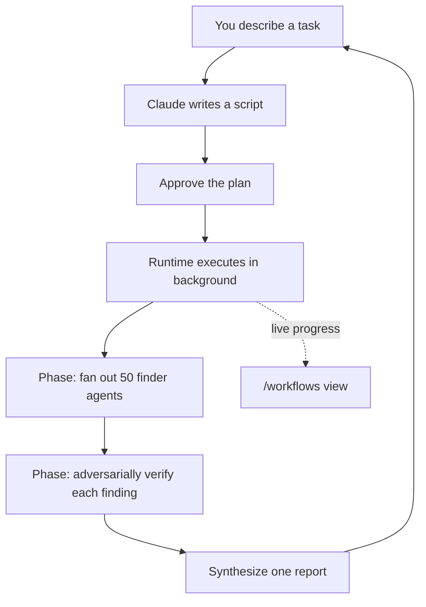

<LevelBadge level="advanced" />

<VerifyNote lastVerified="2026-06-28" source="https://code.claude.com/docs/en/workflows">
Les workflows dynamiques sont une fonctionnalité en évolution rapide : le mot-clé déclencheur, les options d'approbation, les plafonds d'agents et la disponibilité changent d'une version de Claude Code à l'autre — confirmez les détails dans la documentation officielle. Ils nécessitent Claude Code v2.1.154+ et un forfait payant.
</VerifyNote>

<Callout type="objectives" items={["Distinguer un workflow des sous-agents, des skills et des équipes d'agents selon qui détient le plan", "En voir un en 30 secondes avec la commande /deep-research fournie", "Démarrer le vôtre de trois façons : le mot-clé ultracode, /effort ultracode, ou une commande sauvegardée", "Savoir contre quoi l'invite d'approbation vous protège avant d'appuyer sur Oui", "Maîtriser le coût et les exécutions sans surveillance grâce au découpage et à la liste d'autorisation"]} />

Un **workflow dynamique** est un script JavaScript qui orchestre des [sous-agents](/docs/claude-code/subagents) à grande échelle. Vous décrivez une tâche ; Claude *écrit le script* ; un runtime l'exécute en arrière-plan pendant que votre session reste réactive. Là où une tâche multi-étapes normale vit tour par tour dans la fenêtre de contexte de Claude, un workflow déplace le **plan dans le code** — la boucle, le branchement et chaque résultat intermédiaire vivent dans des variables de script, de sorte que votre contexte ne contient que la réponse finale.

C'est ce seul changement qui permet aux workflows de monter en charge jusqu'à des *dizaines ou des centaines* d'agents en une seule exécution, là où la délégation ordinaire plafonne à une poignée.

## Quand recourir à un workflow

Claude Code vous offre quatre façons d'exécuter un travail multi-étapes. La vraie question est **qui détient le plan** :

| | [Sous-agents](/docs/claude-code/subagents) | [Skills](/docs/claude-code/skills) | Équipes d'agents | **Workflows** |
| :-- | :-- | :-- | :-- | :-- |
| Ce que c'est | Un ouvrier que Claude génère | Des instructions que Claude suit | Un chef supervisant des sessions pairs | Un script que le runtime exécute |
| Qui décide ce qui s'exécute ensuite | Claude, tour par tour | Claude, selon le prompt | Le chef, tour par tour | **Le script** |
| Où vivent les résultats | Fenêtre de contexte | Fenêtre de contexte | Une liste de tâches partagée | **Variables de script** |
| Échelle | Quelques-uns par tour | Comme les sous-agents | Une poignée de pairs | **Des dizaines à des centaines** |
| En cas d'interruption | Redémarre le tour | Redémarre le tour | Les coéquipiers continuent | **Reprenable en session** |

Utilisez un workflow lorsqu'une tâche nécessite **plus d'agents qu'une seule conversation ne peut en coordonner**, ou lorsque vous voulez que l'orchestration soit **codifiée sous forme de script que vous pouvez lire et réexécuter**. Cas canoniques :

- Un **balayage de bugs à l'échelle de la base de code** — déployez en éventail un chercheur sur chaque module, puis faites vérifier chaque découverte de manière adverse par des agents indépendants avant qu'elle ne soit signalée.
- Une **migration de 500 fichiers** — un agent par fichier, chacun dans son propre worktree, avec une étape de vérification.
- Une **question de recherche** où les sources doivent être **recoupées les unes avec les autres**, et pas seulement résumées.
- Un **plan difficile** qui mérite d'être ébauché sous plusieurs angles indépendants, puis pesés les uns par rapport aux autres avant de vous engager.

Ce dernier point est le plus sous-estimé : un workflow peut appliquer un *modèle de qualité répétable* (revue adverse, ébauche multi-angles, vérification par vote majoritaire), de sorte que vous obtenez un résultat plus fiable qu'une seule passe — et pas seulement plus d'agents.



## La façon la plus rapide d'en voir un : /deep-research

Claude Code est livré avec un workflow intégré pour que vous n'ayez pas à en écrire un pour essayer le modèle. Lancez-le sur n'importe quelle question :

<PromptCard title="Essayez un workflow en une commande">{`/deep-research What changed in the Node.js permission model between v20 and v22?`}</PromptCard>

Il déploie des recherches web sous plusieurs angles, récupère et **recoupe** les sources, vote sur chaque affirmation, et renvoie un **rapport sourcé dont les affirmations qui n'ont pas survécu au recoupement sont filtrées**. Approuvez à l'invite, puis regardez-le travailler avec `/workflows`. (Il a besoin que l'outil WebSearch soit disponible.)

## Trois façons de démarrer le vôtre

**1. Demandez en un seul prompt.** Incluez le mot-clé `ultracode`, ou demandez simplement en clair (« utilise un workflow », « lance un workflow »). Claude écrit un script pour cette seule tâche sans changer le niveau d'effort de votre session :

<PromptCard title="Exécuter une tâche en tant que workflow">{`ultracode: audit every API endpoint under src/routes/ for missing auth checks`}</PromptCard>

Le mot-clé est mis en évidence dans votre saisie. Ce n'était pas votre intention ? Appuyez sur `Option+W` (macOS) ou `Alt+W` (Windows/Linux) pour supprimer la mise en évidence pour ce prompt.

:::note Historique du mot-clé
Avant la v2.1.160, le mot déclencheur littéral était `workflow` ; il a été renommé `ultracode` afin que le mot courant « workflow » ne déclenche pas une exécution. Les requêtes en langage naturel (« lance un workflow ») fonctionnent dans les **deux** versions.
:::

**2. Laissez Claude décider — effort ultracode.** Réglez la session sur ultracode et Claude planifie un workflow pour *chaque* tâche substantielle, décidant lui-même quand un workflow est justifié :

<PromptCard title="Activer l'orchestration automatique pour la session">{`/effort ultracode`}</PromptCard>

Ultracode combine l'[effort de raisonnement](/docs/api/thinking-and-effort) `xhigh` avec l'orchestration automatique. Une seule requête peut devenir plusieurs workflows à la suite — un pour comprendre le code, un pour effectuer le changement, un pour le vérifier. Chaque tâche utilise alors plus de tokens et prend plus de temps, alors revenez à `/effort high` pour le travail courant. Cela ne dure que la session en cours.

**3. Exécutez une commande sauvegardée ou fournie.** `/deep-research`, ou tout workflow que vous avez sauvegardé (ci-dessous), apparaît dans l'autocomplétion `/` comme n'importe quelle commande slash.

## Approuver avant l'exécution

Les workflows peuvent générer beaucoup d'agents, donc le CLI vous montre les phases prévues et demande d'abord :

- **Oui, exécute-le** — démarrer l'exécution
- **Oui, et ne plus demander pour `[name]` dans `[path]`** — démarrer et ignorer l'invite pour ce workflow dans ce projet
- **Voir le script brut** (`Ctrl+G` l'ouvre dans votre éditeur) — lire avant de décider
- **Non** — annuler (`Tab` vous permet d'ajuster d'abord le prompt)

Que vous soyez invité ou non dépend de votre [mode de permission](/docs/claude-code/permissions) : **Default / accept-edits** invite à chaque exécution (sauf si vous avez désactivé pour ce workflow) ; **Auto** invite uniquement au premier lancement ; **bypass / `claude -p` / Agent SDK** n'invitent jamais — l'exécution démarre immédiatement.

:::warning Les sous-agents n'héritent pas du mode de votre session
Quel que soit le mode de permission de votre session, les agents qu'un workflow génère s'exécutent toujours en **`acceptEdits`** et héritent de votre [liste d'autorisation d'outils](/docs/claude-code/permissions) — les modifications de fichiers sont approuvées automatiquement. Les commandes shell, les récupérations web et les outils MCP qui ne figurent *pas* sur votre liste d'autorisation peuvent encore mettre l'exécution en pause pour vous demander confirmation. Lors d'une longue exécution sans surveillance, **ajoutez les commandes dont les agents ont besoin à votre liste d'autorisation avant de démarrer** afin qu'elle ne se bloque pas en attendant après vous. Voir [Renforcer les exécutions autonomes](/docs/security/hardening-autonomous-runs).
:::

## Comment une exécution se déroule

Le runtime exécute le script dans un **environnement isolé**, séparé de votre conversation — les résultats intermédiaires restent dans des variables de script, sans jamais toucher le contexte de Claude. Le script lui-même n'a **aucun accès direct au système de fichiers ni au shell** : ce sont les *agents* qui lisent, écrivent et exécutent des commandes ; le script ne fait que les coordonner.

Chaque exécution écrit son script dans un fichier sous votre répertoire de session dans `~/.claude/projects/`, et Claude reçoit le chemin. Vous pouvez donc demander le script à Claude, lire l'orchestration qu'il a écrite, la comparer à une exécution précédente, ou la modifier et demander à Claude de relancer depuis votre version éditée.

Le runtime impose quelques plafonds pour qu'un mauvais script ne puisse pas s'emballer :

| Contrainte | Pourquoi |
| :-- | :-- |
| Pas de saisie utilisateur en cours d'exécution (seules les invites de permission des agents la mettent en pause) | Pour une validation entre les étapes, exécutez chaque étape comme son propre workflow |
| Le script n'a aucun accès direct au système de fichiers/shell | Les agents font le travail ; le script coordonne |
| Jusqu'à **16 agents** simultanés (moins sur les machines à faible nombre de cœurs) | Limite l'utilisation des ressources locales |
| **1 000 agents au total** par exécution | Empêche les boucles incontrôlées |

## Surveiller et gérer les exécutions

Lancez `/workflows` pour lister les exécutions en cours et terminées, puis sélectionnez-en une pour ouvrir sa vue de progression — chaque phase avec son nombre d'agents, son total de tokens et son temps écoulé. Explorez une phase, puis un agent, pour lire son prompt, ses appels d'outils récents et son résultat. Contrôles clés :

| Touche | Action |
| :-- | :-- |
| `↑` / `↓` | Sélectionner une phase ou un agent |
| `Enter` / `→` | Explorer ; `Esc` revient en arrière |
| `f` | Filtrer les agents par statut (v2.1.186+) |
| `p` | Mettre en pause ou reprendre l'exécution |
| `x` | Arrêter l'agent sélectionné — ou toute l'exécution lorsque le focus est dessus |
| `r` | Redémarrer l'agent en cours sélectionné |
| `s` | **Sauvegarder** le script de cette exécution comme commande |

Un résumé de progression sur une ligne apparaît également dans le panneau de tâches sous votre zone de saisie ; appuyez sur la flèche bas pour le mettre au focus, sur Enter pour le développer.

**Reprise :** arrêtez une exécution et reprenez-la plus tard (`p`) — les agents déjà terminés renvoient des résultats mis en cache, les autres s'exécutent en direct. La reprise fonctionne **dans la même session** ; quittez Claude Code en cours d'exécution et la session suivante la redémarre de zéro.

## Sauvegarder un workflow pour le réutiliser

Lorsque Claude écrit une bonne orchestration pour quelque chose que vous répéterez — une revue que vous exécutez sur chaque branche — appuyez sur `s` dans `/workflows` pour sauvegarder le script de cette exécution. `Tab` bascule l'emplacement :

- `.claude/workflows/` dans votre projet — partagé avec tous ceux qui clonent le dépôt
- `~/.claude/workflows/` dans votre répertoire personnel — disponible partout, vous seul le voyez

Il s'exécute ensuite sous `/[name]` dans les futures sessions. Un workflow sauvegardé peut prendre une entrée via un global `args`, vous le paramétrez donc au moment de l'appel au lieu de modifier le script :

```text
> Run /triage-issues on issues 1024, 1025, and 1030
```

Claude transmet la liste sous forme de données structurées, de sorte que le script appelle directement des méthodes de tableau/objet sur `args`.

## Surveillez le coût

Un workflow génère de nombreux agents, donc une seule exécution peut utiliser **nettement plus de tokens** que de faire la même tâche en conversation, et elle compte dans l'utilisation et les limites de débit de votre forfait. Deux habitudes gardent cela raisonnable :

- **Découpez d'abord.** Exécutez sur un seul répertoire (pas tout le dépôt) ou une question étroite d'abord pour jauger la dépense ; `/workflows` affiche l'utilisation de tokens par agent en direct, et vous pouvez vous arrêter à tout moment sans perdre le travail terminé.
- **Dimensionnez bien le modèle.** Chaque agent utilise le modèle de votre session sauf si le script route une étape ailleurs. Vérifiez `/model` avant une grande exécution, et lorsque vous décrivez la tâche, demandez à Claude d'utiliser un **modèle plus petit pour les étapes qui n'ont pas besoin du plus puissant**. Voir [Coût et latence](/docs/foundations/cost-and-latency) et [Choisir un modèle](/docs/api/choosing-a-model).

## Erreurs courantes

- **S'attendre à une intervention humaine en cours d'exécution.** Il n'y a pas de saisie en cours d'exécution. Si une tâche nécessite votre validation entre les étapes, divisez-la en workflows distincts.
- **Oublier la liste d'autorisation lors des exécutions sans surveillance.** Un long workflow se bloque dès qu'un agent rencontre une commande shell non autorisée. Pré-autorisez ce dont les agents ont besoin.
- **Recourir à un workflow alors qu'un sous-agent suffirait.** Quelques tâches déléguées par tour, c'est à cela que servent les [sous-agents](/docs/claude-code/subagents). Les workflows justifient leur surcoût à l'échelle d'une *flotte* ou lorsque vous voulez que l'orchestration soit sauvegardée comme un script réexécutable.
- **Exécuter l'effort ultracode toute la session pour des modifications de routine.** Il planifie un workflow pour tout — parfait pour le travail difficile, inutile pour une correction d'une ligne. Revenez à `/effort high`.

<Quiz title="Vérifiez vos connaissances" questions={[{q: "Quelle est la différence déterminante entre un workflow et les sous-agents, les skills ou les équipes d'agents ?", options: ["Un workflow peut générer des agents ; les autres ne le peuvent pas", "Le plan vit dans un script que le runtime exécute, et non tour par tour dans le contexte de Claude", "Les workflows sont les seuls à s'exécuter en arrière-plan"], answer: 1, explain: "Les quatre peuvent exécuter un travail multi-étapes. Dans un workflow, la boucle, le branchement et les résultats intermédiaires vivent dans des variables de script — le contexte de Claude ne contient que la réponse finale — c'est ce qui lui permet de monter en charge jusqu'à des dizaines ou des centaines d'agents."}, {q: "Vous exécutez un long workflow sans surveillance et les agents ont besoin d'une commande shell qui ne figure pas sur votre liste d'autorisation. Que se passe-t-il ?", options: ["Les agents l'approuvent automatiquement car ils s'exécutent en acceptEdits", "L'exécution se bloque en attendant votre approbation", "L'exécution ignore cette commande et continue"], answer: 1, explain: "Les agents de workflow s'exécutent en acceptEdits, donc les modifications de fichiers sont approuvées automatiquement, mais les commandes shell, les récupérations web et les outils MCP qui ne figurent pas sur votre liste d'autorisation mettent encore l'exécution en pause pour vous demander confirmation. Pré-autorisez ce dont les agents ont besoin avant une exécution sans surveillance."}, {q: "Quelle est la façon la moins chère de jauger ce que coûtera un grand workflow avant de vous engager ?", options: ["Lire d'abord le script sauvegardé", "L'exécuter sur une tranche étroite — un répertoire ou une question — et surveiller les tokens par agent dans /workflows", "Basculer toute la session sur un modèle plus petit"], answer: 1, explain: "Découpez d'abord : exécutez sur un seul répertoire ou une question étroite, surveillez l'utilisation de tokens par agent en direct dans /workflows, et arrêtez à tout moment sans perdre le travail terminé."}]} />

<Callout type="takeaways" items={["Un workflow déplace le plan dans le code — le script contient la boucle et les résultats intermédiaires, de sorte que les exécutions montent en charge jusqu'à des dizaines ou des centaines d'agents.", "Essayez-en un instantanément avec /deep-research ; démarrez le vôtre avec le mot-clé ultracode, /effort ultracode, ou une /commande sauvegardée.", "L'invite d'approbation existe parce qu'une exécution peut générer de nombreux agents — Default et accept-edits invitent à chaque exécution ; Auto invite une fois ; bypass et headless n'invitent jamais.", "Les agents générés s'exécutent en acceptEdits avec votre liste d'autorisation, alors pré-autorisez les commandes dont ils ont besoin avant une exécution sans surveillance.", "Les workflows coûtent nettement plus de tokens — découpez d'abord, dimensionnez bien le modèle par étape, et revenez de l'effort ultracode à /effort high pour les modifications de routine."]} />

## Désactiver les workflows

Désactivez **Dynamic workflows** dans `/config`, définissez `"disableWorkflows": true` dans `~/.claude/settings.json`, ou définissez la variable d'environnement `CLAUDE_CODE_DISABLE_WORKFLOWS=1`. Les organisations peuvent les désactiver dans les [paramètres gérés](/docs/claude-code/settings). Lorsqu'ils sont désactivés, les commandes de workflow fournies disparaissent et `ultracode` ne déclenche plus d'exécution ni n'apparaît dans le menu `/effort`.

## Et après

- [Sous-agents et agents parallèles](/docs/claude-code/subagents) — la primitive ouvrière que les workflows orchestrent
- [Concevoir un workflow multi-sous-agents (tutoriel)](/docs/walkthroughs/multi-subagent-workflow)
- [Harnais d'agents à longue durée d'exécution](/docs/frontiers/long-running-agent-harnesses) — les principes de conception derrière les exécutions multi-agents durables
- [Renforcer les exécutions autonomes](/docs/security/hardening-autonomous-runs)
