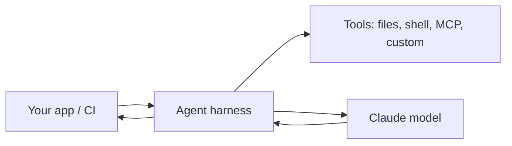

<LevelBadge level="advanced" />

<VerifyNote lastVerified="2026-06-20" source="https://code.claude.com/docs/en/sdk">
Les noms du SDK, des packages et les options headless évoluent — vérifiez dans la documentation officielle du Claude Agent SDK / de Claude Code.
</VerifyNote>

Claude Code n'est pas qu'interactif. Vous pouvez l'exécuter en **headless** (non interactif, scriptable) et construire vos **propres agents** sur le même harnais sous-jacent grâce à l'**Agent SDK**.

## Mode headless

Exécutez une seule invite de manière non interactive et capturez la sortie — parfait pour les scripts, les hooks pre-commit et la CI :

```bash
claude -p "Review the staged diff and list any bugs as a Markdown checklist"
```

Vous fournissez une entrée, vous obtenez un résultat. Combinez avec des [permissions](/docs/claude-code/permissions) réglées sur une posture sûre et non interactive afin qu'il ne reste jamais bloqué en attente d'approbation — et **verrouillez-le** pour qu'une exécution automatisée ne puisse pas toucher aux secrets (voir [Sécuriser les exécutions autonomes](/docs/security/hardening-autonomous-runs)).

Un usage classique : un job de CI qui fait examiner par Claude chaque pull request — voir le [tutoriel de revue de PR](/docs/walkthroughs/pr-review-action).

## L'Agent SDK

Le **Claude Agent SDK** (Python et TypeScript) vous permet de construire des agents de production sur la même boucle qui propulse Claude Code — usage d'outils, accès fichiers/shell, permissions, gestion du contexte — mais intégrée à *votre* application.



Tournez-vous vers lui quand vous avez dépassé un simple appel API ou une boucle faite main et que vous voulez un runtime d'agent prêt à l'emploi. Pour l'éventail des options — appel unique → workflow → agent personnalisé → géré — voir [Construire des agents sur l'API](/docs/api/building-agents).

## Headless/SDK vs interactif

| Mode | Pour |
|---|---|
| Claude Code interactif | Développement quotidien avec un humain dans la boucle |
| Headless (`claude -p`) | Scripts, pre-commit, exécutions ponctuelles en CI |
| Agent SDK | Agents de production intégrés à votre logiciel |

## Et après

- [Action GitHub qui examine chaque PR (tutoriel)](/docs/walkthroughs/pr-review-action)
- [Construire des agents sur l'API](/docs/api/building-agents)
- [Sécuriser les exécutions autonomes](/docs/security/hardening-autonomous-runs)
