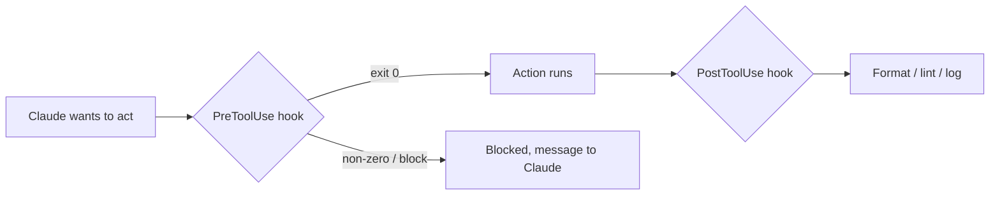

<LevelBadge level="advanced" />

<VerifyNote lastVerified="2026-06-23" source="https://code.claude.com/docs/en/hooks">
Les noms exacts des événements de hook, la charge utile sur stdin et le protocole de blocage évoluent — vérifiez dans la documentation officielle des hooks avant de vous appuyer sur un événement ou un champ précis.
</VerifyNote>

Les hooks sont des **commandes shell que Claude Code exécute automatiquement** à des points définis de son cycle de vie. Là où les [permissions](/docs/claude-code/permissions) décident *si* une action est autorisée, les hooks vous permettent d'exécuter *vous-même* une logique déterministe autour d'elle — formatage, validation, journalisation, garde-fous. C'est ainsi qu'on rend un comportement garanti au lieu de « n'oublie pas de… ».

<Callout type="objectives" items={["Quand recourir à un hook plutôt qu'à une instruction ou une permission", "Comment un hook est câblé : événement, matcher, et la charge utile JSON sur stdin", "Les deux façons dont un hook bloque une action — code de sortie 2 vs JSON sur stdout", "Les bonnes pratiques et erreurs courantes qui distinguent les hooks rapides et sûrs des hooks lents et silencieux"]} />

## Quand recourir à un hook

Recourez à un hook quand vous voulez qu'un comportement soit *garanti*, pas seulement demandé. Chaque tâche courante correspond à un événement du cycle de vie :

- **Formatage / lint automatique** après chaque édition de fichier (`PostToolUse`).
- **Bloquer** une action qui viole une règle avant son exécution (`PreToolUse`).
- **Notifier ou journaliser** quand une session se termine ou une tâche s'achève (`Stop`).
- **Injecter du contexte** au démarrage de la session.

<Flashcards title="Les événements de hook en un coup d'œil" cards={[{front: "PreToolUse", back: "Se déclenche avant l'exécution d'une action. Utilisez-le pour bloquer ou filtrer — p. ex. refuser une commande destructive avant son exécution."}, {front: "PostToolUse", back: "Se déclenche après une action correspondante. Utilisez-le pour formater, linter ou journaliser ce qui vient de changer."}, {front: "Stop", back: "Se déclenche quand une session se termine ou une tâche s'achève. Utilisez-le pour notifier ou journaliser."}, {front: "Démarrage de session", back: "Se déclenche au début d'une session. Utilisez-le pour injecter du contexte."}]} />

## Comment ils fonctionnent

Vous enregistrez les hooks dans [`settings.json`](/docs/claude-code/settings), en associant un **événement** (et souvent un matcher d'outil). Quand l'événement se déclenche, Claude exécute votre commande en lui passant une **charge utile JSON sur stdin** (le nom de l'outil, ses entrées, la session). Le code de sortie et la sortie de votre commande décident de la suite.

<Steps items={[{title: "Associer un événement", body: "Enregistrez le hook dans settings.json sous l'événement de cycle de vie qui vous intéresse — par exemple PostToolUse."}, {title: "Restreindre avec un matcher", body: "Ajoutez un matcher d'outil pour que le hook ne se déclenche que sur les outils pertinents, p. ex. matcher \"Edit|Write\" pour les éditions de fichiers."}, {title: "Lire la charge utile depuis stdin", body: "Quand l'événement se déclenche, Claude exécute votre commande et lui envoie une charge utile JSON sur stdin — le nom de l'outil, ses entrées, la session."}, {title: "Décider de la suite", body: "Le code de sortie et la sortie de votre commande déterminent le résultat : laisser l'action se poursuivre, exécuter votre logique, ou la bloquer."}]} />

```json
{
  "hooks": {
    "PostToolUse": [
      {
        "matcher": "Edit|Write",
        "hooks": [
          { "type": "command", "command": "jq -r '.tool_input.file_path' | xargs npx prettier --write" }
        ]
      }
    ]
  }
}
```

Le hook ci-dessus lit le chemin du fichier édité dans le JSON de stdin (`.tool_input.file_path`) et le formate. Ne supposez pas qu'une variable d'environnement contient le chemin — **lisez-le depuis stdin.** Des placeholders de chemin utiles comme `${CLAUDE_PROJECT_DIR}` *sont* disponibles pour localiser les scripts.

## Comment un hook bloque

Deux façons, selon l'événement :

- **Code de sortie 2** — le hook fait échouer l'action et tout ce qu'il a écrit sur **stderr** devient le message que Claude voit. Simple et fonctionne pour les hooks de type commande.
- **JSON sur stdout (sortie 0)** — renvoyer une décision structurée. Pour `PreToolUse`, c'est une `permissionDecision` de `deny` ; pour `PostToolUse`/`Stop`/etc. c'est `{"decision": "block", "reason": "…"}`.

Le script ci-dessous est un hook `PreToolUse` sur l'outil Bash. Lisez-le de haut en bas : il extrait la commande de stdin, et si elle semble destructive, écrit une raison sur stderr et sort avec 2 pour bloquer.

```bash
#!/usr/bin/env bash
# PreToolUse hook on the Bash tool: refuse to delete things.
command=$(jq -r '.tool_input.command' < /dev/stdin)
if [[ "$command" == rm\ * || "$command" == *"rm -rf"* ]]; then
  echo "Blocked: destructive 'rm' is not allowed by policy." >&2
  exit 2
fi
exit 0
```

## Le modèle mental

Un hook `PreToolUse` s'exécute *avant* l'action et peut la bloquer ; un hook `PostToolUse` s'exécute *après* sa réussite et réagit au résultat.



## Bonnes pratiques

- **Gardez les hooks rapides et idempotents** — ils s'exécutent souvent.
- **Signalez fort les vrais problèmes**, mais ne bloquez pas sur des soucis cosmétiques.
- **Traitez la sortie du hook comme un retour à Claude** — un message clair l'aide à se corriger.
- Les hooks s'exécutent avec les privilèges de votre shell — relisez tout hook que vous n'avez pas écrit ([Relire le code tiers](/docs/security/reviewing-third-party-code)).

## Erreurs courantes

- **Lire le chemin du fichier depuis une variable d'environnement.** Le chemin se trouve dans le JSON de stdin (`.tool_input.file_path`), pas dans `$CLAUDE_FILE_PATH`. Faites passer stdin par `jq`.
- **Blocages silencieux.** Si un hook `PreToolUse` sort avec 2 sans rien sur stderr, Claude est bloqué mais ne sait pas *pourquoi* et ne peut pas s'adapter. Écrivez toujours une raison claire.
- **Hooks lents.** Un hook `PostToolUse` s'exécute après *chaque* édition correspondante. Un linter de 3 secondes rend toute la session poussive — gardez les hooks rapides et, idéalement, n'agissez que sur ce qui a changé.
- **Matchers trop larges.** `matcher: ".*"` se déclenche sur chaque outil. Restreignez avec un nom exact, une liste `Edit|Write`, ou le champ `if` par handler (p. ex. `"if": "Bash(git push *)"`).
- **Faire confiance à des hooks que vous n'avez pas écrits.** Un hook exécute du shell arbitraire avec vos privilèges. Relisez d'abord tout hook issu d'un plugin ou d'un modèle — voir [Relire le code tiers](/docs/security/reviewing-third-party-code).

<Callout type="warning" items={["Un hook exécute du shell arbitraire avec vos privilèges — ne câblez jamais un hook issu d'un plugin ou d'un modèle sans l'avoir lu au préalable."]} />

Des exemples prêts à copier-coller se trouvent dans [Recettes de hooks & settings.json](/docs/templates/hooks-settings).

<PromptCard title="Formater automatiquement les fichiers édités (PostToolUse sur Edit|Write)">{`{
  "hooks": {
    "PostToolUse": [
      {
        "matcher": "Edit|Write",
        "hooks": [
          { "type": "command", "command": "jq -r '.tool_input.file_path' | xargs npx prettier --write" }
        ]
      }
    ]
  }
}`}</PromptCard>

<Quiz title="Testez-vous" questions={[{q: "Où un hook trouve-t-il le chemin du fichier qui vient d'être édité ?", options: ["Dans la variable d'environnement $CLAUDE_FILE_PATH", "Dans la charge utile JSON sur stdin, à .tool_input.file_path", "Dans un argument de ligne de commande passé par Claude"], answer: 1, explain: "Le chemin se trouve dans le JSON de stdin (.tool_input.file_path), pas dans une variable d'environnement. Faites passer stdin par jq pour le lire."}, {q: "Un hook PreToolUse sort avec le code 2. Que se passe-t-il ?", options: ["L'action est autorisée et stdout est journalisé", "L'action est bloquée, et tout ce que le hook a écrit sur stderr devient le message que Claude voit", "Claude ignore le résultat car la sortie 2 est réservée"], answer: 1, explain: "Le code de sortie 2 fait échouer l'action ; stderr devient le message que Claude voit. Écrivez toujours une raison claire pour que Claude puisse s'adapter."}, {q: "Pourquoi le matcher \".*\" est-il considéré comme une erreur courante ?", options: ["Ce n'est pas du JSON valide et cela casse settings.json", "Il se déclenche sur chaque outil, donc le hook s'exécute bien plus que prévu — restreignez-le avec un nom exact, une liste Edit|Write, ou le champ if", "Il ne correspond qu'à l'outil Bash"], answer: 1, explain: "Un matcher trop large se déclenche sur chaque outil. Restreignez-le pour garder les hooks rapides et ciblés."}]} />

<Callout type="takeaways" items={["Les hooks rendent un comportement garanti, pas seulement demandé — ils exécutent une logique déterministe autour d'actions que les permissions se contentent d'autoriser ou de refuser.", "Enregistrez un hook dans settings.json contre un événement et un matcher ; Claude envoie une charge utile JSON sur stdin et lit votre code de sortie et votre sortie.", "Lisez le chemin du fichier depuis stdin (.tool_input.file_path) — pas depuis une variable d'environnement.", "Bloquez avec le code de sortie 2 (stderr devient le message) ou avec du JSON structuré sur stdout (sortie 0) ; incluez toujours une raison claire.", "Gardez les hooks rapides, idempotents et étroitement filtrés — et relisez tout hook que vous n'avez pas écrit, car il s'exécute avec les privilèges de votre shell."]} />

## La suite

- [settings.json](/docs/claude-code/settings) · [Permissions](/docs/claude-code/permissions)
- [Skills](/docs/claude-code/skills) — expertise vs automatisation
- [Renforcer les exécutions autonomes](/docs/security/hardening-autonomous-runs)
