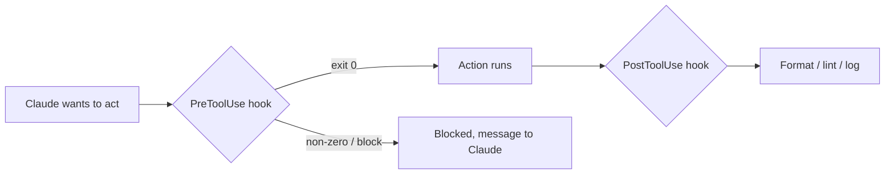

<LevelBadge level="advanced" />

<VerifyNote lastVerified="2026-06-20" source="https://docs.anthropic.com/en/docs/claude-code/hooks">
Les noms exacts des événements de hooks et le schéma de configuration évoluent — vérifiez par rapport à la documentation officielle des hooks avant de vous appuyer sur un événement spécifique.
</VerifyNote>

Les hooks sont des **commandes shell que Claude Code exécute automatiquement** à des points définis de son cycle de vie. Là où les [permissions](/docs/claude-code/permissions) décident *si* une action est autorisée, les hooks vous laissent exécuter une logique déterministe autour d'elle — formatage, validation, journalisation, barrières. C'est ainsi que vous rendez un comportement garanti au lieu d'un « merci de penser à ».

## Quand recourir à un hook

- **Formater / linter automatiquement** après chaque modification de fichier (`PostToolUse`).
- **Bloquer** une action qui enfreint une règle avant qu'elle ne s'exécute (`PreToolUse`).
- **Notifier ou journaliser** quand une session se termine ou qu'une tâche s'achève (`Stop`).
- **Injecter du contexte** au démarrage de la session.

## Comment ils fonctionnent

Vous enregistrez les hooks dans [`settings.json`](/docs/claude-code/settings), en associant un **événement** (et souvent un matcher d'outil). Quand l'événement se déclenche, Claude exécute votre commande et lit son résultat — un code de sortie non nul ou une sortie spécifique peut **bloquer** l'action et renvoyer un message à Claude.

```json
{
  "hooks": {
    "PostToolUse": [
      {
        "matcher": "Edit|Write",
        "hooks": [
          { "type": "command", "command": "npx prettier --write \"$CLAUDE_FILE_PATH\"" }
        ]
      }
    ]
  }
}
```

Le hook reçoit du contexte (par exemple le chemin du fichier, le nom de l'outil) via l'environnement/stdin — consultez la documentation pour la charge utile exacte, qui varie selon l'événement.

## Le modèle mental



## Bonnes pratiques

- **Gardez les hooks rapides et idempotents** — ils s'exécutent beaucoup.
- **Échouez bruyamment sur les vrais problèmes**, mais ne bloquez pas sur des soucis cosmétiques.
- **Traitez la sortie du hook comme un retour adressé à Claude** — un message clair l'aide à se corriger.
- Les hooks s'exécutent avec les privilèges de votre shell — examinez tout hook que vous n'avez pas écrit ([Examiner le code tiers](/docs/security/reviewing-third-party-code)).

Des modèles à copier-coller se trouvent dans [Recettes de hooks & settings.json](/docs/templates/hooks-settings).

## Et après

- [settings.json](/docs/claude-code/settings) · [Permissions](/docs/claude-code/permissions)
- [Skills](/docs/claude-code/skills) — expertise vs automatisation
- [Sécuriser les exécutions autonomes](/docs/security/hardening-autonomous-runs)
