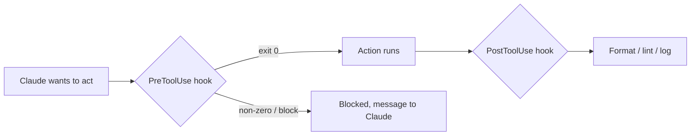

<LevelBadge level="advanced" />

<VerifyNote lastVerified="2026-06-23" source="https://code.claude.com/docs/en/hooks">
Les noms exacts des événements de hooks, la charge utile envoyée sur stdin et le protocole de blocage évoluent — vérifiez par rapport à la documentation officielle des hooks avant de vous appuyer sur un événement ou un champ spécifique.
</VerifyNote>

Les hooks sont des **commandes shell que Claude Code exécute automatiquement** à des points définis de son cycle de vie. Là où les [permissions](/docs/claude-code/permissions) décident *si* une action est autorisée, les hooks vous laissent *exécuter* une logique déterministe autour d'elle — formatage, validation, journalisation, barrières. C'est ainsi que vous rendez un comportement garanti au lieu d'un « merci de penser à ».

## Quand recourir à un hook

- **Formater / linter automatiquement** après chaque modification de fichier (`PostToolUse`).
- **Bloquer** une action qui enfreint une règle avant qu'elle ne s'exécute (`PreToolUse`).
- **Notifier ou journaliser** quand une session se termine ou qu'une tâche s'achève (`Stop`).
- **Injecter du contexte** au démarrage de la session.

## Comment ils fonctionnent

Vous enregistrez les hooks dans [`settings.json`](/docs/claude-code/settings), en associant un **événement** (et souvent un matcher d'outil). Quand l'événement se déclenche, Claude exécute votre commande en lui passant une **charge utile JSON sur stdin** (le nom de l'outil, ses entrées, la session). Le code de sortie et la sortie de votre commande déterminent ce qui se passe ensuite.

```json
{
  "hooks": {
    "PostToolUse": [
      {
        "matcher": "Edit|Write",
        "hooks": [
          { "type": "command", "command": "jq -r '.tool_input.file_path' | xargs npx prettier --write" }
        ]
      }
    ]
  }
}
```

Le hook ci-dessus lit le chemin du fichier modifié dans le JSON reçu sur stdin (`.tool_input.file_path`) et le formate. Ne supposez pas qu'une variable d'environnement contient le chemin — **lisez-le depuis stdin.** Des espaces réservés de chemin utiles comme `${CLAUDE_PROJECT_DIR}` *sont* disponibles pour localiser les scripts.

## Comment un hook bloque

Deux manières, selon l'événement :

- **Code de sortie 2** — le hook fait échouer l'action et tout ce qu'il a écrit sur **stderr** devient le message que Claude voit. Simple et fonctionne pour les hooks de type commande.
- **JSON sur stdout (sortie 0)** — renvoyez une décision structurée. Pour `PreToolUse`, c'est un `permissionDecision` valant `deny` ; pour `PostToolUse`/`Stop`/etc. c'est `{"decision": "block", "reason": "…"}`.

```bash
#!/usr/bin/env bash
# PreToolUse hook on the Bash tool: refuse to delete things.
command=$(jq -r '.tool_input.command' < /dev/stdin)
if [[ "$command" == rm\ * || "$command" == *"rm -rf"* ]]; then
  echo "Blocked: destructive 'rm' is not allowed by policy." >&2
  exit 2
fi
exit 0
```

## Le modèle mental



## Bonnes pratiques

- **Gardez les hooks rapides et idempotents** — ils s'exécutent beaucoup.
- **Échouez bruyamment sur les vrais problèmes**, mais ne bloquez pas sur des soucis cosmétiques.
- **Traitez la sortie du hook comme un retour adressé à Claude** — un message clair l'aide à se corriger.
- Les hooks s'exécutent avec les privilèges de votre shell — examinez tout hook que vous n'avez pas écrit ([Examiner le code tiers](/docs/security/reviewing-third-party-code)).

## Erreurs courantes

- **Lire le chemin du fichier depuis une variable d'environnement.** Le chemin se trouve dans le JSON de stdin (`.tool_input.file_path`), pas dans `$CLAUDE_FILE_PATH`. Faites passer stdin par `jq`.
- **Blocages silencieux.** Si un hook `PreToolUse` sort avec le code 2 sans rien écrire sur stderr, Claude est bloqué mais ignore *pourquoi* et ne peut pas s'adapter. Indiquez toujours une raison claire.
- **Hooks lents.** Un hook `PostToolUse` s'exécute après *chaque* modification correspondante. Un linter de 3 secondes rend toute la session poussive — gardez les hooks rapides et, idéalement, n'agissez que sur ce qui a changé.
- **Matchers trop larges.** `matcher: ".*"` se déclenche sur chaque outil. Affinez avec un nom exact, une liste `Edit|Write` ou le champ `if` par gestionnaire (par ex. `"if": "Bash(git push *)"`).
- **Faire confiance à des hooks que vous n'avez pas écrits.** Un hook exécute du shell arbitraire avec vos privilèges. Examinez d'abord tout hook provenant d'un plugin ou d'un modèle — voir [Examiner le code tiers](/docs/security/reviewing-third-party-code).

Des amorces à copier-coller se trouvent dans [Recettes de hooks & settings.json](/docs/templates/hooks-settings).

## Et après

- [settings.json](/docs/claude-code/settings) · [Permissions](/docs/claude-code/permissions)
- [Skills](/docs/claude-code/skills) — expertise vs automatisation
- [Sécuriser les exécutions autonomes](/docs/security/hardening-autonomous-runs)
