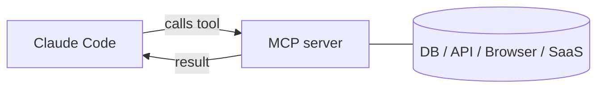

<LevelBadge level="advanced" />

<VerifyNote lastVerified="2026-06-23" source="https://code.claude.com/docs/en/mcp">
Les commandes `claude mcp`, les portées de configuration et les transports évoluent — vérifiez dans la documentation officielle MCP de Claude Code et sur modelcontextprotocol.io.
</VerifyNote>

Le **Model Context Protocol (MCP)** est un standard ouvert pour connecter l'IA à des outils et données externes. Un **serveur MCP** expose des capacités (interroger une base de données, ouvrir une PR GitHub, piloter un navigateur) ; Claude Code s'y connecte et peut **appeler ces outils** pendant une session. C'est ainsi qu'on étend Claude au-delà de votre système de fichiers et de votre shell.

<Callout type="objectives" items={["Expliquer ce qu'est un serveur MCP et comment Claude Code appelle ses outils", "Distinguer les deux transports : stdio local vs HTTP/SSE distant", "Ajouter un serveur avec claude mcp add et lire le JSON qu'il écrit", "Choisir la bonne portée (local, project, user) pour qui voit un serveur", "Connecter une vraie base de données à Claude de bout en bout", "Éviter les pièges de sécurité et de configuration qui touchent la plupart des gens"]} />

## La forme de la chose



Vous déclarez les serveurs que Claude peut utiliser ; chaque serveur publie un ensemble d'outils avec des schémas ; Claude les sélectionne et les appelle comme n'importe quel autre outil.

<Flashcards title="Vocabulaire MCP" cards={[{front: "Model Context Protocol (MCP)", back: "Un standard ouvert pour connecter l'IA à des outils et données externes."}, {front: "Serveur MCP", back: "Un programme qui expose des capacités — interroger une base de données, ouvrir une PR GitHub, piloter un navigateur — sous forme d'outils appelables."}, {front: "Outil", back: "Une capacité qu'un serveur MCP publie avec un schéma ; Claude le sélectionne et l'appelle comme n'importe quel autre outil."}, {front: "Transport", back: "Comment Claude atteint un serveur : stdio (processus local) ou HTTP/SSE distant (hébergé, souvent avec OAuth)."}, {front: "Portée", back: "Qui voit un serveur : local (vous, ce projet), project (l'équipe, versionné), ou user (vous, partout)."}]} />

## Transports

Il y a deux façons pour Claude d'atteindre un serveur. Choisissez selon l'endroit où le serveur s'exécute.

- **stdio** — un processus local que Claude lance (idéal pour les outils/CLI locaux).
- **Distant (HTTP/SSE)** — un serveur hébergé, souvent avec OAuth.

## Configurer des serveurs

Le chemin le plus rapide est la commande `claude mcp add` — elle écrit la configuration pour vous. Suivez cette séquence pour passer de zéro à un serveur connecté.

<Steps items={[{title: "Ajouter un serveur stdio local", body: "Exécutez claude mcp add — tout ce qui suit le -- est la commande de lancement que Claude exécute pour vous."}, {title: "Ou ajouter un serveur HTTP distant", body: "Passez --transport http et une portée, puis l'URL du serveur. Les serveurs distants sont souvent hébergés et utilisent OAuth."}, {title: "Voir ce qui est connecté", body: "Exécutez claude mcp list pour voir les serveurs configurés et leur statut de connexion."}, {title: "Inspecter et s'authentifier", body: "Utilisez /mcp dans une session pour inspecter les outils d'un serveur et vous authentifier auprès des serveurs distants."}]} />

<PromptCard title="Ajouter un serveur stdio local">{`# A local stdio server (everything after -- is the launch command)
claude mcp add github -- npx -y @modelcontextprotocol/server-github`}</PromptCard>

<PromptCard title="Ajouter un serveur HTTP distant (partagé avec le projet)">{`# A remote HTTP server, shared with everyone on the project
claude mcp add --transport http --scope project linear https://mcp.linear.app/mcp`}</PromptCard>

Sous le capot, ce n'est que du JSON. Un serveur de portée **project** atterrit dans un `.mcp.json` à la racine du dépôt — versionnez-le et toute votre équipe obtient les mêmes outils :

```json
{
  "mcpServers": {
    "github": { "command": "npx", "args": ["-y", "@modelcontextprotocol/server-github"] }
  }
}
```

### La portée décide qui voit le serveur

| Portée | Réside dans | À utiliser pour |
|---|---|---|
| `local` (par défaut) | vos paramètres utilisateur, ce projet uniquement | expériences personnelles, secrets |
| `project` | `.mcp.json` dans le dépôt (versionné) | outils que toute l'équipe doit partager |
| `user` | vos paramètres utilisateur, tous les projets | serveurs que vous voulez partout |

Exécutez `claude mcp list` pour voir ce qui est connecté et `/mcp` dans une session pour inspecter les outils et vous authentifier auprès des serveurs distants. Voir [Config MCP & squelettes de serveurs](/docs/templates/mcp-config) pour des exemples prêts à copier-coller.

## Exemple concret : donnez votre base de données à Claude

Disons que vous voulez que Claude réponde à des questions sur un Postgres local au lieu que vous colliez les résultats de requêtes. Ajoutez le serveur (portée project, pour que vos coéquipiers en héritent) :

<PromptCard title="Ajouter un serveur Postgres en portée project">{`claude mcp add --scope project db -- npx -y @modelcontextprotocol/server-postgres "postgresql://localhost/app"`}</PromptCard>

Maintenant, dans une session, vous pouvez poser la question en langage naturel et laisser Claude faire la boucle de requête pour vous :

<PromptCard title="Poser une question à la base de données">{`How many users signed up last week? Check the DB.`}</PromptCard>

Claude appelle l'outil `query` du serveur, récupère les lignes et répond — sans boucle de copier-coller. Comme c'est en portée project, un coéquipier qui récupère le dépôt obtient la même capacité dès qu'il ouvre Claude Code. Gardez la chaîne de connexion en lecture seule si vous ne voulez que des lectures.

## Confiance & sécurité

<Callout type="warning" items={["Un serveur MCP exécute du code et peut lire des données et effectuer des actions — ne connectez que des serveurs de confiance.", "Donnez à chaque serveur le moindre privilège dont il a besoin.", "Tout contenu externe qu'un serveur renvoie peut véhiculer une injection de prompt.", "Relisez les serveurs tiers avant de les connecter."]} />

:::warning Traitez les serveurs MCP comme l'installation d'un logiciel
Un serveur MCP exécute du code et peut lire des données et effectuer des actions. Ne connectez que des serveurs de confiance, donnez-leur le **moindre privilège** nécessaire, et rappelez-vous que tout contenu externe qu'ils renvoient peut véhiculer une [injection de prompt](/docs/security/prompt-injection). Relisez d'abord les serveurs tiers — voir [Relire le code tiers](/docs/security/reviewing-third-party-code).
:::

## MCP aussi dans les applications

MCP alimente aussi les **Connecteurs** dans les applications Claude — même standard, surface différente. Voir [Connecteurs (MCP) dans les applications](/docs/claude-app/connectors) et, pour l'API, [MCP & connexion aux outils](/docs/api/mcp).

## Erreurs courantes

- **Mauvaise portée.** Un serveur ajouté en portée `local` n'apparaîtra pas pour vos coéquipiers ; un serveur que vous vouliez pour vous seul ne devrait pas être versionné en portée `project`. Choisissez délibérément.
- **Trop de serveurs, trop d'outils.** Chaque serveur connecté ajoute ses schémas d'outils au contexte. Connectez ce dont la tâche a besoin, pas tout votre catalogue.
- **Connexions surprivilégiées.** Donnez à un serveur de base de données un rôle en lecture seule à moins que Claude n'ait réellement besoin d'écrire. MCP rend les capacités réelles — réduisez-les.
- **Oublier le risque d'injection.** Tout ce qu'un serveur renvoie (une page web, le corps d'un ticket, une ligne) est du texte non fiable qui peut véhiculer une [injection de prompt](/docs/security/prompt-injection). Ne câblez pas un serveur puissant capable d'écrire à côté d'un serveur non fiable capable de lire sans y réfléchir.

<Quiz title="Testez-vous" questions={[{q: "Quel transport est un processus local que Claude lance lui-même ?", options: ["HTTP/SSE distant", "stdio", "OAuth"], answer: 1, explain: "stdio est un processus local que Claude lance — idéal pour les outils et CLI locaux. Le HTTP/SSE distant est un serveur hébergé, souvent avec OAuth."}, {q: "Où un serveur de portée project est-il écrit, et quel est l'avantage ?", options: ["Vos paramètres utilisateur ; vous seul le voyez", "Un .mcp.json à la racine du dépôt ; versionnez-le et toute l'équipe obtient les mêmes outils", "Un cache global caché ; personne ne peut le modifier"], answer: 1, explain: "La portée project atterrit dans un .mcp.json versionné à la racine du dépôt, donc les coéquipiers qui récupèrent le dépôt héritent des mêmes outils."}, {q: "Pourquoi garder une connexion à une base de données en lecture seule quand Claude n'a besoin que de lire ?", options: ["Cela accélère l'exécution des requêtes", "Moindre privilège — MCP rend les capacités réelles, donc n'accordez pas l'écriture à moins que ce ne soit réellement nécessaire", "La lecture seule est requise par le protocole"], answer: 1, explain: "Donnez aux serveurs le moindre privilège dont ils ont besoin. MCP rend les capacités réelles, donc un rôle en lecture seule évite les écritures involontaires."}]} />

<Callout type="takeaways" items={["MCP est un standard ouvert ; un serveur MCP expose des outils que Claude Code appelle comme n'importe quel autre outil.", "Deux transports : stdio local (un processus que Claude lance) et HTTP/SSE distant (hébergé, souvent OAuth).", "claude mcp add écrit la configuration pour vous ; sous le capot c'est du JSON, et la portée project réside dans un .mcp.json versionné.", "La portée contrôle la visibilité : local (vous, ce projet), project (versionné pour l'équipe), user (vous, partout).", "Traitez les serveurs comme l'installation d'un logiciel : confiance, moindre privilège, et méfiez-vous de l'injection de prompt dans tout ce qu'ils renvoient."]} />

## La suite

- [Créez et câblez votre premier serveur MCP (tutoriel)](/docs/walkthroughs/first-mcp-server)
- [Config MCP & squelettes de serveurs](/docs/templates/mcp-config)
- [Sécuriser agents & outils](/docs/security/securing-agents)
