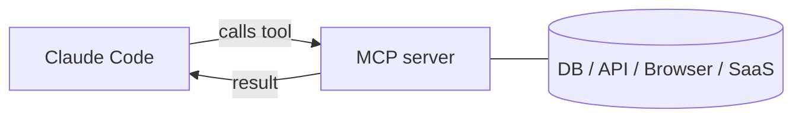

<LevelBadge level="advanced" />

<VerifyNote lastVerified="2026-06-23" source="https://code.claude.com/docs/en/mcp">
Les commandes `claude mcp`, les portées de configuration et les transports évoluent — vérifiez dans la documentation officielle MCP de Claude Code et sur modelcontextprotocol.io.
</VerifyNote>

Le **Model Context Protocol (MCP)** est une norme ouverte pour connecter l'IA à des outils et des données externes. Un **serveur MCP** expose des capacités (interroger une base de données, ouvrir une PR GitHub, piloter un navigateur) ; Claude Code s'y connecte et peut **appeler ces outils** pendant une session. C'est ainsi que vous étendez Claude au-delà de votre système de fichiers et de votre shell.

## À quoi cela ressemble



Vous déclarez les serveurs que Claude peut utiliser ; chaque serveur publie un ensemble d'outils avec des schémas ; Claude les sélectionne et les appelle comme n'importe quel autre outil.

## Transports

- **stdio** — un processus local que Claude lance (idéal pour les outils/CLI locaux).
- **Distant (HTTP/SSE)** — un serveur hébergé, souvent avec OAuth.

## Configurer les serveurs

La voie la plus rapide est la commande `claude mcp add` — elle écrit la configuration pour vous :

```bash
# A local stdio server (everything after -- is the launch command)
claude mcp add github -- npx -y @modelcontextprotocol/server-github

# A remote HTTP server, shared with everyone on the project
claude mcp add --transport http --scope project linear https://mcp.linear.app/mcp
```

En coulisses, ce n'est que du JSON. Un serveur à portée **project** se retrouve dans un fichier `.mcp.json` à la racine du dépôt — versionnez-le et toute votre équipe obtient les mêmes outils :

```json
{
  "mcpServers": {
    "github": { "command": "npx", "args": ["-y", "@modelcontextprotocol/server-github"] }
  }
}
```

**La portée détermine qui voit le serveur :**

| Portée | Vit dans | À utiliser pour |
|---|---|---|
| `local` (par défaut) | vos paramètres utilisateur, ce projet uniquement | expériences personnelles, secrets |
| `project` | `.mcp.json` dans le dépôt (versionné) | outils que toute l'équipe doit partager |
| `user` | vos paramètres utilisateur, tous les projets | serveurs que vous voulez partout |

Exécutez `claude mcp list` pour voir ce qui est connecté et `/mcp` à l'intérieur d'une session pour inspecter les outils et vous authentifier auprès des serveurs distants. Consultez [Configuration MCP & ébauches de serveur](/docs/templates/mcp-config) pour des amorces à copier-coller.

## Exemple concret : donnez votre base de données à Claude

Imaginons que vous vouliez que Claude réponde à des questions sur un Postgres local au lieu de coller vous-même les résultats de requêtes. Ajoutez le serveur (portée projet, pour que vos coéquipiers en héritent) :

```bash
claude mcp add --scope project db -- npx -y @modelcontextprotocol/server-postgres "postgresql://localhost/app"
```

Désormais, dans une session, vous pouvez demander : *« Combien d'utilisateurs se sont inscrits la semaine dernière ? Vérifie la BDD. »* Claude appelle l'outil `query` du serveur, récupère les lignes et répond — sans boucle de copier-coller. Comme la portée est projet, un coéquipier qui clone le dépôt obtient la même capacité dès qu'il ouvre Claude Code. Gardez la chaîne de connexion en lecture seule si vous ne voulez que des lectures.

## Confiance & sécurité

:::warning Traitez les serveurs MCP comme l'installation d'un logiciel
Un serveur MCP exécute du code et peut lire des données et entreprendre des actions. Ne connectez que des serveurs de confiance, donnez-leur le **moindre privilège** nécessaire, et rappelez-vous que tout contenu externe qu'ils renvoient peut véhiculer une [injection d'invite](/docs/security/prompt-injection). Examinez d'abord les serveurs tiers — voir [Examiner le code tiers](/docs/security/reviewing-third-party-code).
:::

## MCP dans les applications aussi

MCP propulse aussi les **Connecteurs** dans les applications Claude — même norme, surface différente. Voir [Connecteurs (MCP) dans les applications](/docs/claude-app/connectors) et, pour l'API, [MCP & connexion aux outils](/docs/api/mcp).

## Erreurs courantes

- **Mauvaise portée.** Un serveur ajouté avec la portée `local` n'apparaîtra pas pour vos coéquipiers ; un serveur que vous ne vouliez que pour vous-même ne devrait pas être versionné avec la portée `project`. Choisissez délibérément.
- **Trop de serveurs, trop d'outils.** Chaque serveur connecté ajoute ses schémas d'outils au contexte. Connectez ce dont la tâche a besoin, pas tout votre catalogue.
- **Connexions sur-privilégiées.** Donnez à un serveur de base de données un rôle en lecture seule, sauf si Claude a réellement besoin d'écrire. MCP rend les capacités réelles — restreignez-les.
- **Oublier le risque d'injection.** Tout ce qu'un serveur renvoie (une page web, le corps d'un ticket, une ligne) est du texte non fiable qui peut véhiculer une [injection d'invite](/docs/security/prompt-injection). Ne reliez pas un serveur puissant capable d'écrire à côté d'un serveur non fiable capable de lire sans y avoir réfléchi.

## Et après

- [Construire & câbler votre premier serveur MCP (tutoriel)](/docs/walkthroughs/first-mcp-server)
- [Configuration MCP & ébauches de serveur](/docs/templates/mcp-config)
- [Sécuriser les agents & les outils](/docs/security/securing-agents)
