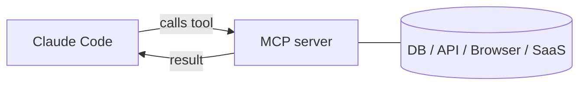

<LevelBadge level="advanced" />

<VerifyNote lastVerified="2026-06-20" source="https://docs.anthropic.com/en/docs/claude-code/mcp">
La syntaxe de configuration MCP, les scopes et les transports évoluent — vérifiez dans la documentation officielle MCP de Claude Code et sur modelcontextprotocol.io.
</VerifyNote>

Le **Model Context Protocol (MCP)** est un standard ouvert pour connecter l'IA à des outils et données externes. Un **serveur MCP** expose des capacités (interroger une base de données, ouvrir une PR GitHub, piloter un navigateur) ; Claude Code s'y connecte et peut **appeler ces outils** pendant une session. C'est ainsi que vous étendez Claude au-delà de votre système de fichiers et de votre shell.

## À quoi cela ressemble



Vous déclarez les serveurs que Claude peut utiliser ; chaque serveur publie un ensemble d'outils avec des schémas ; Claude les sélectionne et les appelle comme n'importe quel autre outil.

## Transports

- **stdio** — un processus local que Claude lance (idéal pour les outils/CLI locaux).
- **Distant (HTTP/SSE)** — un serveur hébergé, souvent avec OAuth.

## Configurer les serveurs

Les serveurs se configurent (généralement dans un `.mcp.json` et/ou via les réglages) avec une commande/URL et toute authentification nécessaire. Les scopes contrôlent où un serveur est disponible (vous seul, ou partagé avec le projet). Voir [Configuration MCP & ébauches de serveur](/docs/templates/mcp-config) pour des modèles à copier-coller.

```json
{
  "mcpServers": {
    "github": { "command": "npx", "args": ["-y", "@modelcontextprotocol/server-github"] }
  }
}
```

## Confiance & sécurité

:::warning Traitez les serveurs MCP comme l'installation d'un logiciel
Un serveur MCP exécute du code et peut lire des données et entreprendre des actions. Ne connectez que des serveurs de confiance, donnez-leur le **moindre privilège** nécessaire, et rappelez-vous que tout contenu externe qu'ils renvoient peut véhiculer une [injection d'invite](/docs/security/prompt-injection). Examinez d'abord les serveurs tiers — voir [Examiner le code tiers](/docs/security/reviewing-third-party-code).
:::

## MCP dans les applications aussi

MCP propulse aussi les **Connecteurs** dans les applications Claude — même standard, surface différente. Voir [Connecteurs (MCP) dans les applications](/docs/claude-app/connectors) et, pour l'API, [MCP & connexion aux outils](/docs/api/mcp).

## Et après

- [Construire & câbler votre premier serveur MCP (tutoriel)](/docs/walkthroughs/first-mcp-server)
- [Configuration MCP & ébauches de serveur](/docs/templates/mcp-config)
- [Sécuriser les agents & les outils](/docs/security/securing-agents)
