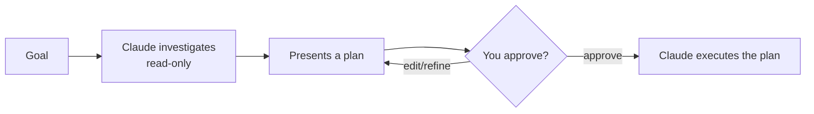

<LevelBadge level="beginner" />

<VerifyNote lastVerified="2026-06-20" source="https://code.claude.com/docs/en">
La façon d'entrer en Mode Plan (raccourci/option) peut changer d'une version à l'autre — consultez la documentation officielle de Claude Code.
</VerifyNote>

Le **Mode Plan** rend Claude Code **en lecture seule** : il peut explorer votre base de code, lancer des recherches et raisonner — mais il **ne modifiera pas de fichiers et n'exécutera pas de commandes modifiant l'état**. À la place, il produit un plan et attend votre approbation.

## Pourquoi c'est la façon la plus sûre de commencer

Pour tout ce qui est important, risqué ou inconnu, vous voulez voir *ce que* Claude a l'intention de faire avant qu'il ne touche à votre dépôt. Le Mode Plan sépare la **réflexion** de l'**action** :

Vous repérez les hypothèses erronées *avant* qu'elles ne deviennent du code erroné.

## Quand l'utiliser

- **Toujours** pour les changements importants ou multi-fichiers, les migrations ou les refactorisations.
- Quand vous travaillez dans une base de code que vous ne connaissez pas encore pleinement.
- Quand vous voulez un plan révisable à partager avec un coéquipier.

Pour de minuscules modifications évidentes, vous pouvez vous en passer — mais dans le doute, planifiez d'abord.

## Comment ça marche en pratique

1. Entrez en Mode Plan et énoncez votre objectif.
2. Claude lit les fichiers pertinents et pose des questions de clarification.
3. Il renvoie un plan étape par étape : les fichiers à modifier, l'approche et comment vérifier.
4. Vous approuvez (ou affinez). C'est seulement alors qu'il passe à l'application des changements.

:::tip Associez-le à CLAUDE.md
Un bon [CLAUDE.md](/docs/claude-code/claude-md) rend les plans plus précis — Claude planifie en ayant déjà vos conventions et garde-fous à l'esprit.
:::

## Mode Plan vs Permissions

Ils résolvent des problèmes différents et fonctionnent ensemble :

- **Mode Plan** = « enquêter et proposer, ne pas encore agir ». (Cette page.)
- **[Permissions](/docs/claude-code/permissions)** = une fois en action, *quelles* actions sont autorisées sans demander.

## Et après

- [Permissions & modes de permission](/docs/claude-code/permissions)
- [Gestion du contexte](/docs/claude-code/context-management) — garder les longues sessions efficaces
- [Tutoriel : Personnaliser Claude Code pour un vrai dépôt](/docs/walkthroughs/customize-claude-code)
