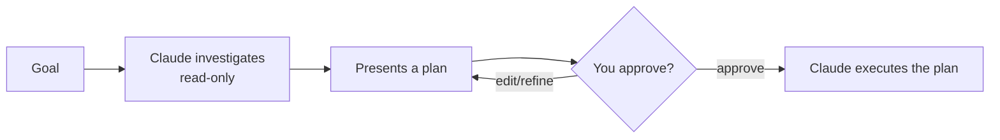

<LevelBadge level="beginner" />

<Callout type="objectives" items={["Expliquer ce que fait le mode Plan et pourquoi il est en lecture seule", "Décider quand planifier d'abord et quand vous pouvez sauter cette étape", "Parcourir la boucle enquêter-proposer-approuver-exécuter", "Distinguer le mode Plan des Permissions et les utiliser ensemble"]} />

<VerifyNote lastVerified="2026-06-20" source="https://code.claude.com/docs/en">
La façon d'entrer en mode Plan (raccourci/option) peut changer d'une version à l'autre — vérifiez dans la documentation officielle de Claude Code.
</VerifyNote>

## L'idée principale

Imaginez confier vos clés de maison à un artisan versus lui demander d'abord de faire le tour et de noter *ce qu'il* changerait. Le mode Plan est le tour de repérage.

Le **mode Plan** met Claude Code en **lecture seule** : il peut explorer votre base de code, lancer des recherches et raisonner — mais il n'**éditera pas de fichiers ni n'exécutera de commandes modifiant l'état**. À la place, il produit un plan et attend votre approbation.

<Callout type="tip" items={["Lecture seule signifie que Claude RÉFLÉCHIT mais n'AGIT pas — pas d'édition de fichiers, pas de commandes modifiant l'état, jusqu'à ce que vous donniez le feu vert."]} />

## Pourquoi c'est la façon la plus sûre de commencer

Pour tout ce qui est grand, risqué ou inconnu, vous voulez voir *ce que* Claude compte faire avant qu'il ne touche votre dépôt. Le mode Plan sépare la **réflexion** de l'**action** :

Le gain : vous attrapez les mauvaises hypothèses *avant* qu'elles ne deviennent du mauvais code.

## Quand l'utiliser

<Callout type="tip" items={["TOUJOURS pour les changements grands ou multi-fichiers, les migrations ou les refactorisations", "Quand vous travaillez dans une base de code que vous ne connaissez pas encore entièrement", "Quand vous voulez un plan révisable à partager avec un coéquipier"]} />

Pour de minuscules éditions évidentes, vous pouvez sauter cette étape — mais en cas de doute, planifiez d'abord.

## Comment ça marche en pratique

Suivez la boucle. Chaque étape mérite la suivante — Claude ne passe à l'édition qu'*après* votre approbation.

<Steps items={[{title: "Entrer en mode Plan et énoncer votre objectif", body: "Passez en mode lecture seule, puis décrivez ce que vous voulez accomplir."}, {title: "Claude enquête", body: "Il lit les fichiers pertinents et pose des questions de clarification."}, {title: "Claude renvoie un plan étape par étape", body: "Les fichiers à changer, l'approche, et comment vérifier le résultat."}, {title: "Vous approuvez ou affinez", body: "Ce n'est qu'après approbation que Claude passe à effectuer les changements."}]} />

### Essayez vous-même

Copiez ceci dans une vraie session de planification et regardez la boucle se dérouler :

<PromptCard title="Lancer une session de planification">{`I want to migrate our auth from sessions to JWT. Stay in Plan Mode: investigate the current setup, ask anything you need, then propose a step-by-step plan with files to change and how to verify — don't edit anything yet.`}</PromptCard>

:::tip Associez-le à CLAUDE.md
Un bon [CLAUDE.md](/docs/claude-code/claude-md) rend les plans plus précis — Claude planifie avec vos conventions et garde-fous déjà en tête.
:::

## Mode Plan vs Permissions

Une confusion classique. Ils résolvent des problèmes différents et fonctionnent ensemble :

- **Mode Plan** = « enquêter et proposer, ne pas encore agir ». (Cette page.)
- **[Permissions](/docs/claude-code/permissions)** = une fois en action, *quelles* actions sont autorisées sans demander.

Voyez-le comme **agir maintenant ou non** (mode Plan) versus **quelles actions sont autorisées une fois en action** (Permissions).

<Flashcards cards={[{front: "Dans quel état le mode Plan met-il Claude Code ?", back: "Lecture seule — il peut explorer, chercher et raisonner, mais n'éditera pas de fichiers ni n'exécutera de commandes modifiant l'état jusqu'à votre approbation."}, {front: "Quelle est la boucle du mode Plan ?", back: "Enquêter (lecture seule) → présenter un plan → vous approuvez ou affinez → Claude exécute."}, {front: "Quand recourir au mode Plan ?", back: "Par défaut pour le travail grand, risqué ou inconnu (changements multi-fichiers, migrations, refactorisations, bases de code inconnues). Ne sautez que les minuscules éditions évidentes."}, {front: "Mode Plan vs Permissions ?", back: "Le mode Plan régit S'IL FAUT agir maintenant ; les Permissions régissent QUELLES actions sont autorisées une fois en action."}]} />

<Callout type="takeaways" items={["Le mode Plan est en lecture seule : Claude explore et propose mais n'édite jamais ni n'exécute de commandes modifiant l'état jusqu'à votre approbation", "Utilisez-le par défaut pour le travail grand, risqué ou inconnu ; ne sautez que les minuscules éditions évidentes", "La boucle est enquêter, proposer, approuver/affiner, exécuter", "Le mode Plan régit S'IL FAUT agir maintenant ; les Permissions régissent QUELLES actions sont autorisées une fois en action"]} />

<Quiz title="Testez-vous" questions={[{q: "Que peut faire Claude Code en mode Plan ?", options: ["Éditer des fichiers et exécuter n'importe quelle commande", "Explorer, chercher et raisonner — mais ne pas éditer de fichiers ni exécuter de commandes modifiant l'état", "Seulement répondre aux questions, sans aucun accès aux fichiers"], answer: 1, explain: "Le mode Plan est en lecture seule : Claude peut explorer la base de code, lancer des recherches et raisonner, mais n'éditera pas de fichiers ni n'exécutera de commandes modifiant l'état."}, {q: "Quand recourir au mode Plan ?", options: ["Seulement pour les corrections de fautes de frappe d'une ligne", "Pour les changements grands ou multi-fichiers, les migrations, les refactorisations, ou les bases de code inconnues", "Jamais — il ne fait que vous ralentir"], answer: 1, explain: "Utilisez-le toujours pour les changements grands ou multi-fichiers, les migrations ou les refactorisations, et quand vous travaillez dans une base de code que vous ne connaissez pas entièrement. Les minuscules éditions évidentes peuvent le sauter."}, {q: "Quel est l'ordre correct de la boucle du mode Plan ?", options: ["Exécuter, puis enquêter, puis approuver", "Enquêter (lecture seule), présenter un plan, vous approuvez ou affinez, puis Claude exécute", "Approuver d'abord, puis Claude enquête et édite"], answer: 1, explain: "Claude enquête en lecture seule, présente un plan, vous approuvez ou affinez, et ce n'est qu'alors qu'il passe à l'exécution du plan."}, {q: "En quoi le mode Plan et les Permissions diffèrent-ils ?", options: ["Ce sont deux noms pour la même fonctionnalité", "Mode Plan = enquêter et proposer, ne pas encore agir ; Permissions = une fois en action, quelles actions sont autorisées sans demander", "Les Permissions décident s'il faut planifier ; le mode Plan décide quels fichiers éditer"], answer: 1, explain: "Le mode Plan sépare la réflexion de l'action. Les Permissions contrôlent quelles actions sont autorisées sans demander une fois que Claude agit. Ils fonctionnent ensemble."}]} />

## La suite

- [Permissions & modes de permission](/docs/claude-code/permissions)
- [Gestion du contexte](/docs/claude-code/context-management) — garder les longues sessions efficaces
- [Tutoriel : personnaliser Claude Code pour un vrai dépôt](/docs/walkthroughs/customize-claude-code)
