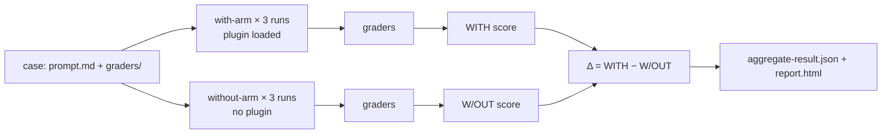

<LevelBadge level="advanced" />

<VerifyNote lastVerified="2026-09-14" source="https://code.claude.com/docs/en/plugin-evals">
`claude plugin eval` est arrivé dans Claude Code **v2.1.269 (11 septembre 2026)** et est documenté comme une fonctionnalité jeune : le schéma des cas est en `1.1`, le résultat JSON en `schemaVersion: 1`, et Anthropic peut désactiver la commande côté serveur (« plugin eval is currently unavailable »). Les valeurs par défaut, les options et la sémantique des évaluateurs ci-dessous viennent de la page officielle à la date indiquée ; revérifiez avant de câbler un blocage strict en CI.
</VerifyNote>

<Callout type="objectives" items={[
  "Comprendre ce qu'une évaluation de plugin mesure et que `claude plugin validate` ou un test manuel ne peuvent pas mesurer : le skill se *déclenche*-t-il, et bat-il un modèle nu",
  "Lire les trois chiffres de chaque résultat — WITH, W/OUT et Δ — et savoir pourquoi certains évaluateurs sont délibérément exclus du score",
  "Choisir parmi les six types d'évaluateurs (quatre gratuits, deux à base de juge) et écrire des grilles qui donnent un signal stable",
  "Simuler les serveurs MCP d'un plugin pour qu'une suite soit reproductible et ne touche jamais le service réel",
  "Câbler un blocage en CI avec des modèles épinglés, un plafond de coût et le contrat sur les codes de sortie"
]} />

Jusqu'ici, l'auteur d'un plugin disposait de deux outils : `claude plugin validate`, qui vérifie que les manifestes et le frontmatter s'analysent correctement, et ses propres yeux. Ni l'un ni l'autre ne répond à la question qui décide si un plugin vaut la peine d'être installé : **quand un utilisateur formule une demande naturelle, Claude choisit-il le skill, et le résultat est-il meilleur que ce que Claude aurait fait de toute façon ?** `claude plugin eval` répond exactement à cela. Il exécute chaque cas dans une session jetable avec votre plugin seul chargé, l'exécute à nouveau sans aucun plugin, note les deux et rapporte la différence.

Cette page s'adresse à celles et ceux qui ont déjà un [plugin](/docs/claude-code/plugins-marketplaces) ou un [skill](/docs/claude-code/skills) fonctionnel. Si vous n'avez besoin que du concept, lisez les deux premières sections et le quiz.

## Le modèle mental : deux bras et un écart

Chaque cas est un **prompt** plus un ou plusieurs **évaluateurs**. Un évaluateur est une vérification réussite/échec sur ce que Claude a produit. Pour chaque cas, Claude Code exécute :

- le **bras avec** : une nouvelle session headless avec votre plugin seul chargé, le prompt envoyé, Claude libre de travailler jusqu'à ce qu'il termine ou atteigne la limite de tours/de temps, puis les évaluateurs appliqués ;
- le **bras sans** : le même prompt, le même nombre d'exécutions, sans plugin.

Chaque bras exécute le cas **trois fois par défaut**, parce qu'une exécution unique d'un agent non déterministe ne vous apprend presque rien. Le score d'une exécution est la fraction des évaluateurs réussis (pondérée, si vous définissez des poids). Le score du cas est la moyenne sur les exécutions. Vous obtenez :

| Colonne | Signification |
|---|---|
| `WITH` | Score moyen avec le plugin chargé |
| `W/OUT` | Score moyen sans aucun plugin |
| `Δ` | `WITH − W/OUT` — ce que le plugin a réellement apporté |

Le point non évident : **un score `WITH` élevé ne prouve rien à lui seul.** Si un cas obtient 1,0 dans les deux bras, Claude l'a résolu sans vous, et votre plugin est du poids mort pour ce prompt. Le Δ est le chiffre qui justifie l'existence d'un plugin. La documentation d'Anthropic nomme elle-même la découverte la plus fréquente : un Δ proche de zéro *accompagné* d'un évaluateur « le skill s'est déclenché » en échec, ce qui signifie que Claude n'a jamais choisi votre skill sur une formulation naturelle. C'est un problème de `description` dans `SKILL.md`, pas un problème de code, et aucun test manuel où vous invoquez le skill par son nom ne l'aurait détecté.



### Pourquoi certains évaluateurs sont exclus du score

Une vérification du type « l'outil `Skill` a été invoqué » ne peut jamais réussir dans le bras sans. Si elle comptait, elle tirerait `W/OUT` vers zéro et gonflerait le Δ gratuitement. Donc, dans une exécution à deux bras, Claude Code **exclut du score, dans les deux bras**, tout évaluateur `tool_used` dont le `tool` est `Skill`, plus tout ce que vous marquez `arm: with-only`. Ils apparaissent toujours dans le rapport comme indicateurs réussite/échec (le rapport les étiquette comme « plugin-fired indicator »), et le JSON les marque `scored: false`. Deux règles limites en découlent :

- Si *tous* les évaluateurs d'un cas devaient être exclus, ils sont notés normalement à la place, sinon il ne resterait rien à noter.
- `arm: both` force un évaluateur à compter dans les deux bras. C'est ce que vous voulez pour une vérification « ne doit **pas** invoquer le skill » sur un prompt leurre, écrite en `tool_used` avec `min: 0` et `max: 0`.

Conséquence à retenir : la même suite peut rapporter un **score absolu différent** sous `--ablation none` (un seul bras, rien d'exclu) et sous le mode à deux bras par défaut. Comparez ce qui est comparable quand vous tracez des tendances.

## Anatomie d'un cas

Une suite vit dans `evals/` à l'intérieur du plugin (ou dans un autre répertoire que vous désignez). Chaque cas est un dossier contenant un `prompt.md`, un `case.yaml`, ou les deux, plus un dossier `graders/` avec un fichier Markdown par évaluateur.

```text
my-plugin/
├── .claude-plugin/plugin.json
├── skills/...
└── evals/
    ├── drafts-commit-message/
    │   ├── prompt.md            # frontmatter: run limits; body: the user's request
    │   └── graders/
    │       ├── criteria.md      # type: llm — rubric in the body
    │       └── skill-fired.md   # type: tool_used, tool: Skill
    ├── ignores-unrelated-request/
    │   └── ...
    ├── mocks/                   # optional suite-wide MCP mocks
    └── results/                 # written by each run — add to .gitignore
```

Le corps du prompt est envoyé à Claude **exactement tel qu'il est écrit**. Deux choses mordent les auteurs débutants :

- Chaque exécution démarre dans un **répertoire de travail vide** avec un répertoire personnel jetable, sans réglages utilisateur, sans `CLAUDE.md`, sans serveurs MCP personnels, sans autre plugin, et avec seulement une liste blanche de variables d'environnement (des basiques comme `PATH`, l'authentification du fournisseur, la plupart des `ANTHROPIC_*`/`CLAUDE_CODE_*`, et tout ce qui est nommé `EVAL_*`). Si la tâche a besoin de fichiers, mettez-les dans le prompt, générez-les, ou livrez-les dans le plugin.
- Les mentions `@path` dans le prompt ne sont **pas** développées en pièces jointes. Accordez `Read` dans `allowed_tools` si Claude doit ouvrir un fichier.

Les champs de frontmatter de `prompt.md` qui comptent le plus :

| Champ | Défaut | Remarque |
|---|---|---|
| `runs` | 3 | De 1 à 50 par bras ; `--runs` remplace la valeur |
| `max_turns` | 10 | Jusqu'à 200. L'atteindre est journalisé comme une erreur d'exécution et abaisse généralement le score, donc soyez généreux |
| `timeout_seconds` | 300 | Jusqu'à 3600 par exécution |
| `allowed_tools` | `[]` | Les outils en lecture seule sont accordés simplement en les listant ; tout le reste nécessite une autorisation en CLI |
| `model` | défaut de la session | `--model` remplace la valeur ; épinglez-le en CI |
| `env` | `{}` | Les clés doivent correspondre à `EVAL_[A-Z0-9_]*` sinon l'exécution échoue |
| `plugins` | le plugin englobant le plus proche | Mettez `["../.."]` si la détection automatique manque votre plugin |

`case.yaml` porte les mêmes champs (ceux d'exécution sous `execution:`) plus les trois qui référencent d'autres fichiers : `context.scaffold_script` (un script Bash qui prépare l'espace de travail, exécuté uniquement avec `--scaffold`), `context.history_file` (une transcription `.jsonl` à reprendre, votre prompt devenant le tour suivant), et `context.add_dirs` (des répertoires de fixtures que Claude peut lire).

## Les six types d'évaluateurs

Quatre sont calculés à partir de la transcription et des fichiers et ne coûtent rien. Deux appellent un modèle juge et s'ajoutent à la facture.

| Type | Gratuit ? | Réussit quand |
|---|---|---|
| `regex` | oui | Une expression régulière JavaScript est trouvée dans la cible (`last_message` par défaut, ou `trace`, `files`, un fichier précis, ou `mock_calls`). `match: not_contains` pour l'absence, `match: "count:N"` pour un nombre exact. L'insensibilité à la casse se met dans `flags: i` ; le `(?i)` en ligne n'est pas pris en charge |
| `tool_used` | oui | Le nombre d'appels à `tool` dont l'entrée encodée en JSON correspond à `input_match` est compris entre `min` (défaut 1) et `max` (illimité). `min: 0, max: 0` affirme qu'un outil n'a jamais été appelé |
| `tool_order` | oui | Les deux outils ont été appelés et la première correspondance `before` précède la première correspondance `after` |
| `file_exists` | oui | Un fichier **créé par Claude** correspond au glob `path` (ou aucun ne correspond, avec `exists: false`). Les fichiers créés par un scaffold ou simplement modifiés par Claude ne comptent pas |
| `llm` | non | Un modèle juge vote PASS sur votre grille dans au moins **deux votes sur trois** |
| `baseline` | non | Un juge estime que l'exécution satisfait les critères au moins aussi bien qu'une transcription de référence que vous avez enregistrée comme `baseline_file` |

Il n'existe **pas d'évaluateurs en code personnalisé**. Si vous devez vérifier qu'un build ou des tests sont passés, faites en sorte que le prompt demande à Claude de les lancer et d'écrire le résultat dans un fichier, notez ce fichier avec `regex`, et affirmez que la commande a bien été exécutée avec un évaluateur `tool_used` dont l'`input_match` la nomme.

L'évaluateur « le skill s'est déclenché » que presque tous les cas veulent ressemble à ceci (remplacez le nom du skill ; le motif reconnaît aussi la forme espacée de noms `plugin:skill`) :

<PromptCard title="graders/skill-fired.md — mon skill s'est-il vraiment exécuté ?">{`---
type: tool_used
tool: Skill
input_match: '"skill"\\s*:\\s*"(?:[\\w-]+:)?your-skill-name"'
---`}</PromptCard>

Et la grille de jugement à côté, écrite sous forme de conditions PASS/FAIL concrètes plutôt qu'avec des adjectifs :

<PromptCard title="graders/criteria.md — une grille qui donne un verdict stable">{`---
type: llm
weight: 2
---

PASS if the reply is a single conventional-commit subject line under 72 characters,
starts with "refactor:", and mentions both the rename (getUser -> fetchUser) and the
number of call sites updated.
FAIL if the reply contains more than one candidate message, asks a clarifying
question, or omits the rename.`}</PromptCard>

### Des habitudes qui stabilisent les scores

Ce sont les pratiques recommandées par la documentation officielle, et elles correspondent à ce qu'apprend à ses dépens quiconque a fait tourner des pipelines de type LLM-juge :

- **Notez les longues sorties avec `regex` sur le fichier, pas avec un juge `llm`.** La variance du juge croît avec la longueur de ce qu'il lit. Gardez les évaluateurs `llm` pour les messages finaux courts.
- **Un évaluateur sur le résultat, un sur le chemin.** Un évaluateur `regex`/`llm`/`file_exists` vous dit que la réponse était juste ; un évaluateur `tool_used`/`tool_order` vous dit que c'est *votre plugin* qui l'a produite. Il vous faut les deux pour interpréter le Δ.
- **Soupçonnez le juge avant le plugin quand le Δ est négatif mais que le skill s'est déclenché.** Le juge par défaut est un petit modèle rapide ; il peut recaler une réponse correcte parce qu'elle est formatée différemment de la grille. Relancez avec `--judge-model sonnet` et resserrez la grille pour que le formatage ne décide pas.
- **Itérez sur un seul cas avec un seul bras**, puis confirmez à trois exécutions : `--case <name> --runs 1 --ablation none`. Avec un seul bras, le tableau affiche `SCORE` et `PASS%` au lieu de `WITH`/`W/OUT`/`Δ`.

## Simulez les serveurs MCP

Si les skills de votre plugin appellent des outils MCP, une exécution **ne démarre jamais les vrais serveurs sauf si vous le demandez**. À la place, Claude Code enregistre un remplaçant sous le nom de chaque serveur et répond aux appels d'outils à partir de fichiers Markdown : `evals/mocks/<server>/<tool>.md` pour toute la suite, ou le dossier `mocks/` propre à un cas pour surcharger cas par cas. Le corps du fichier est le résultat de l'outil, avec des substitutions `{{input.<field>}}` et des insertions `{{file:fixtures/...}}`. Un outil sans fichier de simulation n'est simplement pas disponible pour Claude.

<PromptCard title="evals/mocks/tracker/create_issue.md — une simulation qui vérifie aussi l'entrée">{`---
expect:
  title: string
  priority: [low, medium, high]
---

Created issue #4821: {{input.title}}`}</PromptCard>

Le bloc `expect:` transforme une simulation en assertion : un appel qui l'enfreint **interrompt l'exécution avec un score de 0** et enregistre le serveur, l'outil et la raison. Pointez un évaluateur sur `target: mock_calls` pour noter ce que le plugin a demandé au serveur de faire. Pour les serveurs dont les réponses dépendent de la conversation, `type: agent` laisse un petit modèle jouer le rôle du serveur ; les exécutions propres enregistrent ses réponses sous `results/<timestamp>/mock-recordings/`, et dès que vous copiez un enregistrement dans `mocks/.replay/<server>/`, les exécutions suivantes le rejouent sans aucun appel de modèle. Committez `.replay/` pour que la CI soit déterministe. `_tools.json` (une réponse `tools/list` enregistrée) donne aux outils simulés leurs vraies descriptions et schémas au lieu d'un substitut permissif.

Pour atteindre les vrais serveurs à la place : `--allow-real-servers` démarre ceux qui n'ont pas de simulation ; `--mocks off` ignore complètement les simulations. Dans les deux cas, ces processus tournent **en votre nom, hors du bac à sable**, et leurs outils ont toujours besoin d'une autorisation explicite comme `--allow-tools "mcp__plugin_my-plugin_github__*"`.

## L'exécution

<Steps items={[
  {title: "Générer la suite", body: "Depuis la racine du plugin, lancez `claude plugin eval init`. Cela ouvre une session interactive dans laquelle Claude lit le plugin, demande à quoi ressemble un bon résultat, propose des prompts qui devraient et ne devraient pas le déclencher, conçoit des évaluateurs, les pilote une fois, et écrit un répertoire de cas par prompt. `claude plugin eval init --bare <name>` écrit plutôt un modèle vierge (la seule forme qui fonctionne sans terminal, par exemple en CI)."},
  {title: "Lancer toute la suite", body: "`claude plugin eval .` exécute chaque cas, les deux bras, trois exécutions chacun. La première exécution demande `Trust this plugin directory?` ; à l'intérieur d'un dépôt git, répondre oui accorde la confiance à tout le dépôt, y compris pour les sessions interactives. Une ligne de progression s'affiche par exécution avec le verdict de chaque évaluateur ; un tableau récapitulatif et un chemin `Report:` suivent."},
  {title: "N'accorder que ce dont les cas ont besoin", body: "Les exécutions ne s'arrêtent jamais pour demander une permission. Les outils intégrés qui nécessitent une autorisation que vous n'avez pas donnée (`Bash`, `Write`, `Edit`, `WebFetch`, `WebSearch`) sont entièrement retirés de la session. Accordez-les pour toute l'exécution : `--allow-tools Write Edit \"Bash(npm test *)\"`. Toute autorisation Bash s'exécute dans le bac à sable au niveau OS de Claude Code ; sur une machine sans backend de bac à sable (Windows natif), l'exécution est refusée plutôt que lancée sans confinement."},
  {title: "Lire le rapport", body: "`report.html` est un fichier autonome unique sans aucune requête externe. En haut : une ligne de verdict (effet du plugin en points par rapport à la référence, cas améliorés/stables/régressés) et cinq tuiles (score de la suite, Δ d'ablation, score de référence, cas réussis, exécutions parfaites). Chaque carte de cas montre le Δ et une barre de score avec un repère au seuil ; un Δ négatif reçoit un bord gauche rouge. Les évaluateurs en échec sont pré-dépliés avec les votes du juge et l'extrait qu'il a vu."},
  {title: "Décider où va le rapport", body: "Connecté avec un abonnement claude.ai et les artefacts activés, le rapport est aussi publié comme artefact privé et une URL `Published:` est affichée ; `--no-publish` le garde en local. L'authentification par clé API ne publie jamais. Une exécution lancée depuis une session Claude Code reste locale sauf si vous ajoutez `--publish-report`."}
]} />

La commande pour toute la suite avec les options que vous utiliserez vraiment :

<PromptCard title="Lancer la suite avec un juge plus solide et un plafond de coût">{`claude plugin eval . \\
  --judge-model sonnet \\
  --max-cost-usd 10 \\
  --allow-tools Read Write "Bash(npm test *)" \\
  -j 4`}</PromptCard>

Remarques sur les options : `-j`/`--concurrency` va de 1 à 8 et ne raccourcit que le temps d'horloge, car toutes les exécutions partagent la limite de débit de votre compte. `--max-cost-usd` est un plafond sur **l'estimation au prix catalogue**, vérifié avant le démarrage de chaque exécution ; les exécutions déjà en cours vont jusqu'au bout, donc la dépense peut dépasser de ces exécutions, et tout ce qui reste non démarré fait sortir la commande avec le code 2 et `partial: true`. Placez la cible (`.`) **avant** `--tag`, `--allow-tools` et `--json` : chacune d'elles prend une liste ou une valeur optionnelle et avalerait une cible qui la suivrait (l'erreur « `--json` output path must end in `.json` » est cette erreur-là).

## Ce que ça coûte

Chaque exécution et chaque vote du juge est un véritable appel de modèle sur votre compte, compté sur l'usage de votre plan ou sur votre facture API. L'arithmétique approximative : `cas × exécutions` exécutions d'agent pour le bras avec, autant à nouveau pour le bras sans, plus **trois courts appels de juge par évaluateur `llm` ou `baseline` et par exécution**. Le cas unique de la démonstration officielle avec deux évaluateurs (un `llm`, un `tool_used`) a effectué six exécutions d'agent en 74 secondes pour une estimation au prix catalogue d'environ 0,41 $. Trois leviers gardent une suite abordable :

- `--ablation none` divise par deux les exécutions d'agent quand vous itérez sur les évaluateurs et n'avez pas besoin du Δ.
- Uniquement des évaluateurs gratuits (`regex`, `tool_used`, `tool_order`, `file_exists`) pour la suite lancée à chaque commit ; les évaluateurs à juge pour la suite nocturne.
- Une erreur de limite d'usage ou de débit au milieu d'une suite fait que chaque exécution ultérieure **se termine avec cette erreur et obtient généralement 0, et la suite n'est pas marquée `partial`**, donc une exécution bridée peut ressembler exactement à une régression. Vérifiez la colonne `NOTES` ou `cases[].arms.with[].error` avant de croire à une chute soudaine.

## Conditionnez la CI à ce résultat

<PromptCard title="Job CI — modèles épinglés, rapport local, le code de sortie pilote le build">{`claude plugin eval . \\
  --trust-plugin \\
  --json results.json \\
  --threshold 0.8 \\
  --model claude-sonnet-5 \\
  --judge-model claude-haiku-4-5 \\
  --no-publish \\
  --max-cost-usd 20`}</PromptCard>

Pourquoi chaque option est là :

- `--trust-plugin` affirme la décision de confiance de la première exécution. Sans elle, un job non interactif est refusé avec le code 1 (ou reste bloqué sur l'invite si le runner alloue un TTY). Ne la passez que pour des plugins dont vous exécuteriez le code et la suite sur votre propre machine.
- `--model` et `--judge-model` sont **épinglés** pour qu'un déploiement de modèle ne soit jamais pris pour une régression du plugin. Cela compte plus qu'il n'y paraît : l'agent testé utilise par défaut `ANTHROPIC_MODEL` ou le modèle par défaut actuel de Claude Code, qui change avec les versions.
- `--threshold 0.8` parce que la valeur par défaut est **1.0**, ce qui fait sortir la commande avec le code 1 dès qu'un cas n'est pas parfait. Une barre à 1.0 sur une moyenne de trois exécutions d'un agent non déterministe est un blocage instable.
- `--json results.json` écrit le document de résultat versionné (`schemaVersion: 1`, camelCase, nouveaux champs ajoutés sans renommage) et supprime l'affichage de progression.

Le contrat sur les codes de sortie :

| Sortie | Signification |
|---|---|
| 0 | Chaque cas est au niveau du seuil ou au-dessus et chaque fichier de cas s'est chargé |
| 1 | Un cas sous le seuil, un fichier de cas qui n'a pas pu se charger, aucun cas trouvé, une exécution qui n'a pas pu démarrer, un répertoire non fiable sans `--trust-plugin`, ou une option invalide |
| 2 | Exécution partielle : plafond de coût atteint, ou identifiant rejeté au plus tard à la première exécution. `results.json` est tout de même écrit avec `partial: true` |
| 130 / 143 | Interrompu / terminé (par exemple un délai dépassé en CI). Les résultats partiels sont écrits |

Les problèmes d'écriture ou de publication du rapport ne changent **jamais** le code de sortie. Quand vous tracez des tendances, écartez les documents avec `partial: true` et les exécutions marquées `skippedPaidGraders`, puisque leurs scores ne sont pas comparables.

Les champs qu'un script de blocage lit dans le JSON : `aggregates.overallScore`, `aggregates.casesPassed` / `casesTotal`, `aggregates.meanDelta`, et par cas `cases[].aggregates.score` et `.delta` (omis quand les bras ne sont pas comparables). Une exécution avec un `cases[].arms.with[].error` non nul (par exemple `timed out after 300s`) est tout de même notée sur ce qu'elle a produit, donc une erreur n'implique pas un score de 0 ; une exécution `aborted` (un `expect:` de simulation s'est déclenché) obtient 0 avec `error` toujours à `null`.

## Ce qu'une exécution peut et ne peut pas atteindre

Lisez ceci avant d'évaluer un plugin que vous n'avez pas écrit. Pointer `claude plugin eval` sur un répertoire est la même décision de confiance que `claude --plugin-dir` : les skills **et les hooks** du plugin se chargent et s'exécutent sur votre machine en votre nom. L'isolation limite ce que l'*agent testé* peut faire ; ce n'est pas une frontière face au code propre du plugin, et une suite qui passe ne dit rien sur la sûreté du plugin.

- **Agent isolé.** Chaque exécution obtient un répertoire personnel, un répertoire de travail et une configuration Claude Code jetables, tourne comme un processus enfant `claude -p`, ne peut pas lire le répertoire d'évaluation (elle ne voit donc jamais les prompts ni les évaluateurs du cas ou de ses voisins), et a l'outil Artifact désactivé.
- **Les réglages managés s'appliquent toujours.** Les restrictions qu'un administrateur a déployées sur la machine s'appliquent à l'intérieur d'une exécution, donc les résultats sur un portable managé peuvent différer de ceux d'un runner CI non managé.
- **Des échappatoires sur option.** Le `scaffold_script` d'un cas tourne en votre nom, hors du bac à sable, et uniquement avec `--scaffold`. Les vrais serveurs MCP uniquement avec `--allow-real-servers` ou `--mocks off`. Les `allowed_tools` d'un cas ou le frontmatter `allowed-tools` d'un skill ne peuvent jamais élargir ces limites.
- **Réseau.** Les commandes shell que vous autorisez suivent les règles réseau du bac à sable ; une autorisation `WebFetch(domain:…)` atteint ce domaine directement ; les hooks du plugin et tout vrai serveur MCP que vous démarrez peuvent atteindre n'importe quel hôte.

Pour un plugin tiers qui livre des hooks ou a besoin de ses vrais serveurs, traitez les scores comme indicatifs sauf si vous avez lancé la suite dans un conteneur ou sur un runner CI. Voir [Examiner du code tiers](/docs/security/reviewing-third-party-code) pour la checklist plus large.

## Référence rapide : les pièges

- La `target` par défaut de `regex` est `last_message`. Quand vous ciblez `trace`, c'est du JSON ligne par ligne, donc les guillemets apparaissent en `\"` et les retours à la ligne sont échappés.
- `files` est une **liste de chemins** créés par Claude, pas leur contenu. Pour noter le contenu, utilisez `{ source: file, path: <path> }` comme `target`/`focus`. Un juge `llm` voit les PNG/JPEG/GIF/WebP comme des images et refuse les autres binaires (`.pptx`, PDF).
- Un juge `llm` qui lit `trace` ne voit que les **12 premiers et les 12 derniers messages**.
- `file_exists` ne voit que les fichiers créés pendant l'exécution. Un fichier généré par un scaffold ou simplement modifié lui est invisible ; notez son contenu ou utilisez `tool_used` sur `Edit`.
- Les clés inconnues dans le frontmatter de `prompt.md` sont une erreur, et les clés `env` doivent être en `EVAL_*`.
- Évaluer un plugin installé par son nom (`name@marketplace`) écrit les résultats sous `./evals/results/` dans votre répertoire courant et saute l'invite de confiance.
- Le format de cas de plugin eval est **distinct** du fichier `evals/evals.json` que le plugin skill-creator utilise pour les évaluations de skills.

<Flashcards cards={[
  {front: "bras avec / bras sans", back: "Les deux ensembles d'exécutions d'un cas : avec votre plugin seul chargé, et sans aucun plugin. Le Δ est le score du bras avec moins celui du bras sans."},
  {front: "Pourquoi `tool_used: Skill` n'est-il pas noté ?", back: "Il ne peut jamais réussir sans le plugin, donc le compter tirerait W/OUT à zéro et gonflerait le Δ. Il est exclu dans les deux bras et affiché comme indicateur de déclenchement du plugin."},
  {front: "Seuil par défaut", back: "1.0 — tout cas en dessous de la perfection fait sortir la commande avec le code 1. Réglez `--threshold` sur votre vraie barre en CI."},
  {front: "Règle de vote du juge", back: "Un évaluateur `llm` réussit quand le juge vote PASS dans au moins deux votes sur trois ; un évaluateur `baseline` compare à une transcription de référence enregistrée."},
  {front: "Code de sortie 2", back: "Exécution partielle : le plafond --max-cost-usd a été atteint ou l'identifiant a été rejeté. results.json est tout de même écrit avec partial: true."},
  {front: "Bloc `expect:` d'une simulation", back: "Garde-fou sur l'entrée d'un outil MCP simulé. Un appel qui l'enfreint interrompt l'exécution avec un score de 0 et enregistre le serveur, l'outil et la raison."},
  {front: "Variables EVAL_*", back: "Les seules variables d'environnement personnalisées qui atteignent une exécution. Tout le reste de votre shell est retenu, à l'exception d'une petite liste blanche."}
]} />

<Quiz title="Vérifiez vos acquis" questions={[
  {q: "Un cas obtient 1,00 en WITH et 1,00 en W/OUT. Que vous dit cela ?", options: ["Le plugin fonctionne parfaitement", "Claude résout ce prompt sans le plugin, donc le plugin n'apporte rien ici", "Les évaluateurs sont cassés", "Le modèle juge est trop faible"], answer: 1, explain: "Le Δ est nul. Un score élevé du bras avec ne prouve jamais à lui seul que le plugin a aidé ; seule la différence entre les bras le fait."},
  {q: "Votre job CI lance `claude plugin eval . --json results.json` sans autre option et sort avec le code 1 alors que chaque cas a obtenu 0,9. Pourquoi ?", options: ["Le mode JSON sort toujours avec le code 1", "Le --threshold par défaut est 1.0, donc 0,9 est un échec", "Le répertoire du plugin était fiable", "--json désactive la notation"], answer: 1, explain: "Le seuil par défaut est la perfection (1.0). Passez --threshold 0.8 ou la barre qui est la vôtre. Passez aussi --trust-plugin en CI, sinon la vérification de répertoire non fiable sort également avec le code 1."},
  {q: "Quels types d'évaluateurs ne coûtent rien de plus à l'exécution ?", options: ["llm et baseline", "regex, tool_used, tool_order, file_exists", "Uniquement regex", "Les six sont gratuits"], answer: 1, explain: "Quatre évaluateurs sont calculés à partir de la transcription et des fichiers. llm et baseline ajoutent chacun trois courts appels de juge par exécution."},
  {q: "Le Δ est négatif mais l'évaluateur « le skill s'est déclenché » a réussi à chaque exécution du bras avec. Que conseille de vérifier en premier la documentation officielle ?", options: ["Supprimer le plugin", "Augmenter max_turns", "Le juge : relancez avec --judge-model sonnet et resserrez la grille pour que le formatage ne décide pas", "Ajouter d'autres cas"], answer: 2, explain: "Un petit juge peut recaler une réponse correcte parce qu'elle est formatée différemment de la grille. Soupçonnez le juge avant le plugin."},
  {q: "Un outil MCP simulé reçoit pendant une exécution un appel dont l'entrée enfreint le bloc `expect:` de la simulation. Que se passe-t-il ?", options: ["L'appel renvoie une chaîne d'erreur et l'exécution continue", "L'exécution est interrompue avec un score de 0 et la raison est enregistrée", "L'évaluateur est ignoré", "Le vrai serveur est démarré en secours"], answer: 1, explain: "expect: est une assertion. Un appel qui l'enfreint interrompt l'exécution, obtient 0, et apparaît comme `aborted` avec le serveur, l'outil et la raison dans le JSON."},
  {q: "À quoi l'agent testé a-t-il accès pendant une exécution ?", options: ["Vos réglages ~/.claude et votre CLAUDE.md", "Vos serveurs MCP personnels", "Le prompt et les évaluateurs du cas", "Les outils en lecture seule listés dans les allowed_tools du cas, plus ce que vous avez accordé avec --allow-tools"], answer: 3, explain: "Les exécutions sont isolées : répertoire personnel et configuration jetables, aucun réglage personnel, aucun autre plugin, et le répertoire d'évaluation est masqué à l'agent."}
]} />

## Sources et lectures complémentaires

- [Tester les plugins avec des évaluations](https://code.claude.com/docs/en/plugin-evals) — la référence officielle sur laquelle cette page est bâtie : format des cas, tableau des évaluateurs, options, codes de sortie, isolation
- [Référence des plugins : `plugin eval` et `experimental.evals`](https://code.claude.com/docs/en/plugins-reference#plugin-eval)
- [Changelog Claude Code, v2.1.269 (11 septembre 2026)](https://code.claude.com/docs/en/changelog) — l'entrée de version
- [Skills : le frontmatter et comment la `description` décide du déclenchement](https://code.claude.com/docs/en/skills)
- [Bac à sable](https://code.claude.com/docs/en/sandboxing) — le bac à sable au niveau OS appliqué quand vous accordez Bash à une exécution
- [Mode headless](https://code.claude.com/docs/en/headless) — le processus enfant `claude -p` sur lequel chaque exécution est bâtie

## Et ensuite

- [Plugins et marketplaces](/docs/claude-code/plugins-marketplaces) — empaquetez ce que vous venez de tester, et publiez-le une fois la suite au vert
- [Skills](/docs/claude-code/skills) — le champ `description` est ce qu'un évaluateur « le skill s'est déclenché » en échec vous dit de corriger
- [Examiner du code tiers](/docs/security/reviewing-third-party-code) — avant de faire passer le plugin de quelqu'un d'autre (et ses hooks) dans une évaluation sur votre machine
