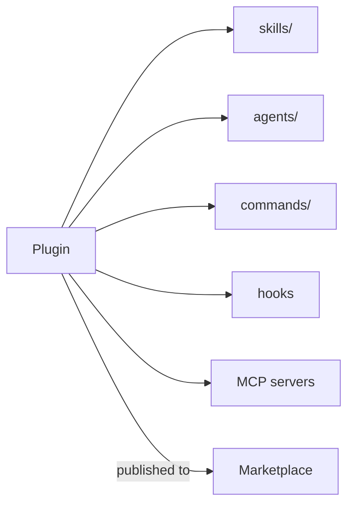

<LevelBadge level="advanced" />

<VerifyNote lastVerified="2026-06-20" source="https://code.claude.com/docs/en">
La structure des plugins et le fonctionnement des marketplaces évoluent rapidement — vérifiez les détails dans la documentation officielle de Claude Code.
</VerifyNote>

Un **plugin** regroupe plusieurs personnalisations — [skills](/docs/claude-code/skills), [sous-agents](/docs/claude-code/subagents), [commandes slash](/docs/claude-code/slash-commands), [hooks](/docs/claude-code/hooks) et [serveurs MCP](/docs/claude-code/mcp) — en une seule unité versionnée et installable. Une **marketplace** est un catalogue de plugins que les gens peuvent découvrir et installer.

## Pourquoi les plugins comptent

- **Livrez une boîte à outils d'équipe en une étape.** Plutôt que de demander à chacun de copier cinq fichiers, publiez un plugin ; vos coéquipiers l'installent et obtiennent les mêmes commandes, hooks, agents et connexions MCP.
- **Versionnement.** Mettez à jour le plugin, tout le monde récupère la nouvelle version.
- **Distribution.** Une marketplace rend votre boîte à outils (ou celle des autres) découvrable.

## Ce qu'on y trouve généralement

Un plugin est un dossier structuré (un manifeste plus les pièces qu'il livre). Au minimum, il peut ne contenir que des skills ; au maximum, l'ensemble complet ci-dessus. Gardez chaque plugin **cohérent** — un plugin « conventions d'équipe », un plugin « boîte à outils Python » — plutôt qu'un fourre-tout.

## La confiance avant d'installer

:::warning Les plugins peuvent livrer du code exécutable
Les hooks et serveurs MCP d'un plugin s'exécutent avec vos privilèges. Installez depuis des sources de confiance et examinez d'abord ce que fait un plugin — voir [Examiner le code tiers](/docs/security/reviewing-third-party-code).
:::

## Une voie pour faire évoluer votre configuration

La progression naturelle : un `CLAUDE.md` → quelques [skills](/docs/claude-code/skills) et [commandes](/docs/claude-code/slash-commands) → les regrouper dans un plugin → le publier sur une marketplace pour votre équipe ou la communauté. Cette dernière étape fait partie de la façon dont AILmanac veut aider l'écosystème à grandir.

## Et après

- [Skills](/docs/claude-code/skills) · [Sous-agents](/docs/claude-code/subagents) · [MCP](/docs/claude-code/mcp)
- [Examiner le code tiers](/docs/security/reviewing-third-party-code)
- Les [packs de skills](/docs/templates/skills) d'AILmanac
