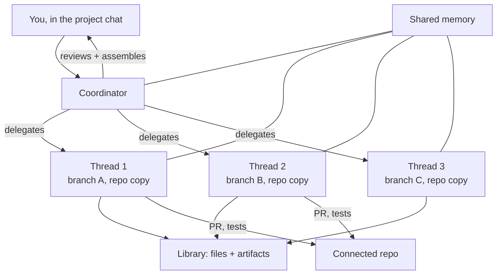

<LevelBadge level="advanced" />

<VerifyNote lastVerified="2026-09-23" source="https://claude.com/blog/projects-redesigned">
La refonte des Projets est en **bêta** et se déploie par étapes. L'éligibilité, la couverture par forfait et les contrôles coordinateur/fil bougent encore, et il n'existe pas encore de page de référence dans la documentation Claude Code — le billet d'annonce est la source faisant autorité. Vérifiez ce dont votre compte dispose réellement avant de concevoir quoi que ce soit autour.
</VerifyNote>

Le **17 septembre 2026**, Anthropic a reconstruit les Projets. L'ancien Projet était un *dossier* : des fichiers, des instructions et une pile de conversations qui les partageaient toutes. Le nouveau Projet est un *organigramme* — « des fils qui font le travail et un coordinateur qui les dirige ».

C'est un changement plus profond qu'il n'y paraît. Un Projet n'est plus un endroit où l'on dépose du contexte ; c'est une chose qui **exécute du travail pour vous**. Vous décrivez un résultat dans la conversation principale du projet, et Claude le cadre, le découpe, le délègue à des fils parallèles, examine ce qui revient et assemble le résultat.

<Callout type="objectives" items={[
  "Ce qu'est réellement un fil — et pourquoi « une session cloud Claude Code sur sa propre branche » est la phrase clé",
  "En quoi le coordinateur diffère d'un orchestrateur de sous-agents, et quand chacun est le bon outil",
  "Les quatre façons d'exécuter du travail en parallèle dans Claude Code aujourd'hui, et comment choisir entre elles",
  "Pourquoi les Projets consomment les limites d'usage plus vite, et les deux réglages de modèle/effort qui le contrôlent",
  "La règle d'éligibilité qui explique pourquoi votre compte ne voit peut-être pas encore la refonte"
]} />

## L'architecture en un schéma

Trois pièces comptent, et elles sont faciles à confondre :

- **Le coordinateur** est la conversation principale du projet. Le cadrage d'Anthropic est celui d'un briefing à un chef de cabinet : vous dites ce dont vous avez besoin, il achemine le travail vers des fils nouveaux ou existants.
- **Un fil** n'est pas un exécutant léger. « Sous le capot, chaque fil est une session cloud Claude Code travaillant sur sa propre branche et sa propre copie du dépôt. » C'est une session complète avec sa propre fenêtre de contexte, ses propres outils et sa propre capacité à générer des **sous-agents, des boucles et des workflows** lorsqu'une mission est suffisamment importante pour le justifier.
- **La mémoire partagée et la bibliothèque** sont ce qui empêche l'éclatement du travail en éventail. Chaque fil puise dans le même pool de mémoire, et la bibliothèque « rassemble les fichiers que vous ajoutez et les artefacts produits par Claude » afin que les sorties restent trouvables au lieu de mourir dans une session fermée.

Avec un dépôt connecté, les fils ouvrent des pull requests et exécutent les tests par eux-mêmes. Vous pouvez observer et piloter depuis n'importe où, y compris votre téléphone.

## La phrase qui détermine tout le reste

> Chaque fil est une session cloud Claude Code travaillant sur sa propre branche et sa propre copie du dépôt.

Lisez-la comme trois engagements distincts :

1. **Session propre** → sa propre fenêtre de contexte. Les fils ne partagent pas un budget de contexte comme le font les sous-agents au sein d'une même session. L'éventail ne dévore plus la fenêtre du parent.
2. **Branche propre** → les fils ne peuvent pas écraser les fichiers les uns des autres. L'isolation est imposée par git, pas par la discipline de prompt. Le coût, c'est que l'intégration est repoussée au moment du merge.
3. **Copie propre du dépôt** → un fil peut exécuter des tests, installer des dépendances et casser des choses sans toucher à votre machine ni à vos autres fils.

Ce troisième point est aussi le plafond actuel : les fils ne tournent que dans le cloud. Anthropic indique que l'exécution « sur votre machine, aux côtés de vos outils et de votre code locaux et derrière votre réseau, arrive très bientôt » — jusqu'à ce que ce soit livré, tout ce qui nécessite un service local, un hôte accessible uniquement par VPN ou une dépendance non publiée reste en dehors des Projets.

## Choisir parmi quatre formes de parallélisme

Claude Code propose désormais quatre façons de faire plus d'une chose à la fois. Elles ne sont pas interchangeables, et choisir la mauvaise est l'échec le plus courant ici.

| Mécanisme | Qui orchestre | Isolation | Contexte | Idéal pour |
|---|---|---|---|---|
| [Sous-agents](/docs/claude-code/subagents) | Votre agent principal, au sein d'une session | Même arbre de travail | Partagent les limites de la session ; [plafonnés à 20 simultanés, profondeur 3](/docs/claude-code/subagent-fleet-limits) | Déployer en éventail des lectures et des recherches à l'intérieur d'une seule tâche |
| [Worktrees](/docs/claude-code/worktrees) | Vous, à la main | Branche + répertoire séparés, en local | Sessions distinctes que vous démarrez vous-même | Travail parallèle local que vous voulez observer et contrôler |
| [Messagerie inter-sessions](/docs/claude-code/inter-session-messaging) | Vous, en adressant les sessions par leur nom | Ce que chaque session possède déjà | Indépendant | Coordonner des sessions déjà en cours |
| **Fils de projet** | **Claude, depuis le coordinateur** | **Branche + copie du dépôt séparées, dans le cloud** | **Indépendant par fil** | **Missions longues que vous voulez voir cadrées, découpées et assemblées pour vous** |

L'heuristique honnête :

- Si le travail tient dans une session et consiste surtout à lire, utilisez les **sous-agents** — ils ne demandent aucune configuration et sont les moins coûteux.
- Si vous voulez superviser chaque étape sur votre propre machine, utilisez les **worktrees**.
- Si le découpage vous paraît évident et que vous préférez le décider vous-même, utilisez les worktrees ou la messagerie. Les Projets apportent de la valeur précisément quand **la décomposition est la partie difficile**.
- Si la mission est vaste, le découpage non évident, et que vous voulez faire un point depuis votre téléphone plutôt que de surveiller un terminal, utilisez les **Projets**.

## Mettre un projet en place

<Steps items={[
  {title: "Choisissez un objectif et un dépôt", body: "Vous choisissez le résultat et le dépôt ou le contexte pertinent dès le départ. Le coordinateur utilise les deux pour proposer la première tranche de travail : un objectif vague produit donc une délégation vague."},
  {title: "Configurez l'environnement", body: "Définissez l'environnement cloud, les connecteurs, les plugins et les instructions. Ils sont hérités par chaque fil que le coordinateur lance — c'est le seul endroit où une erreur se multiplie sur tout l'éventail."},
  {title: "Choisissez modèles et effort — deux fois", body: "La conversation du coordinateur et les fils exécutants ont des réglages de modèle et d'effort séparés. C'est le principal levier de coût ; voir plus bas."},
  {title: "Décrivez le résultat, pas les étapes", body: "Briefez le coordinateur comme un chef de cabinet. Nommer le livrable et les contraintes lui permet de cadrer et de découper ; nommer les étapes en fait une façon coûteuse d'exécuter une checklist que vous avez déjà écrite."},
  {title: "Ajustez la cadence des points d'étape", body: "Vous pouvez régler la fréquence à laquelle Claude fait un point avec vous et sa propension à ouvrir de nouveaux fils. Augmentez les points d'étape tant que vous calibrez encore sa façon de décomposer votre travail."},
  {title: "Relisez au merge, pas à la frappe", body: "Les fils ouvrent des pull requests et exécutent les tests. Votre surface de relecture est l'ensemble de PR que le coordinateur assemble, là où des branches isolées deviennent un seul changement."}
]} />

## Le modèle de coût, dit clairement

Anthropic est direct là-dessus : « Les Projets peuvent atteindre les limites d'usage plus vite. » La raison découle de l'architecture — chaque fil est une session cloud Claude Code complète, donc cinq fils représentent à peu près cinq sessions de consommation en même temps, pas une session divisée en cinq.

Deux réglages existent, et ils résument toute l'histoire du coût :

<Callout type="tip" items={[
  "Modèle/effort du coordinateur — il cadre, relit et assemble. Il lit beaucoup et écrit peu, il gagne donc à disposer d'un raisonnement solide.",
  "Modèle/effort des fils — cela se multiplie par le nombre de fils. Baisser d'un cran ici est le changement de coût le plus rentable que vous puissiez faire.",
  "L'usage par projet est visible séparément, vous pouvez donc voir ce que coûte un projet sans le deviner à partir de votre limite globale."
]} />

Le schéma qui en découle : **gardez le coordinateur affûté, dimensionnez les exécutants en proportion.** Déléguer le travail mécanique — écriture de tests, migrations, passes de documentation — à des fils à un niveau d'effort plus bas pendant que le coordinateur relit à un niveau plus élevé vous donne l'essentiel de la qualité pour une fraction de la dépense multipliée. C'est la même économie que [router les sous-agents vers des modèles moins chers](/docs/claude-code/subagent-fleet-limits), appliquée un cran au-dessus.

## Pourquoi vous ne l'avez peut-être pas

La barrière de la bêta est inhabituellement précise, et elle piège ceux qui supposent qu'il s'agit d'un simple déploiement par pourcentage. Au lancement, l'accès est allé à :

> une sélection d'abonnés Claude Pro et Max qui utilisent les sessions cloud dans Claude Code et n'ont aucun projet existant sur le web ou le bureau

Trois conditions, toutes requises :

| Condition | Pourquoi elle mord |
|---|---|
| Forfait Pro ou Max | Team et Enterprise viennent plus tard, après le déploiement grand public |
| Utilise déjà les sessions cloud dans Claude Code | Les utilisateurs exclusivement locaux ne sont pas dans la première vague, aussi intensif que soit leur usage |
| **Aucun projet existant sur le web ou le bureau** | La surprenante — être un utilisateur *précoce et intensif* des anciens Projets vous disqualifiait activement au lancement |

Cette troisième règle est le piège. Les utilisateurs de longue date des Projets sont les moins susceptibles d'avoir vu la refonte, parce que le chemin de migration des projets existants n'avait pas été livré. Les projets existants continuent de fonctionner pendant le déploiement. Les utilisateurs Pro et Max sans accès peuvent s'inscrire sur une liste d'attente ; Anthropic a indiqué que l'accès s'élargirait « au cours de la semaine à venir » à davantage d'utilisateurs de Claude Code sur ces forfaits, puis au reste de Claude et à Team et Enterprise.

## Erreurs courantes

- **Traiter le coordinateur comme une boîte à prompt.** C'est un délégateur. Donnez-lui un résultat et des contraintes ; si vous lui remettez une liste ordonnée d'étapes, vous payez un surcoût d'orchestration pour quelque chose qu'une seule session fait mieux.
- **Supposer que les fils partagent votre état local.** Ils détiennent une copie cloud du dépôt. Les modifications locales non commitées, les fichiers d'environnement locaux et les services sur `localhost` n'y sont pas.
- **Oublier que l'isolation reporte les conflits au lieu de les supprimer.** Une branche par fil garantit que les fils ne s'écraseront pas mutuellement *pendant l'exécution*. Elle ne garantit pas que trois PR touchant le même module fusionneront proprement. Cadrez les fils le long des frontières de modules quand vous le pouvez.
- **Laisser l'effort des fils au même niveau que celui du coordinateur.** Ce réglage est multiplié par le nombre de fils. C'est le moyen le plus rapide d'atteindre une limite en pleine mission.
- **L'utiliser pour du travail qui a besoin de votre machine.** Les dépendances au réseau local ou aux outils locaux relèvent des [worktrees](/docs/claude-code/worktrees) tant que les fils locaux ne sont pas livrés.

## Ce que cela signale

Les Projets sont le premier endroit où Anthropic a fait de *la décomposition elle-même* le produit. Les sous-agents permettent à un modèle de se déployer en éventail à l'intérieur d'une tâche que vous avez définie. Un Projet demande au modèle de définir les tâches. Les contrôles qu'Anthropic a choisi d'exposer — fréquence des points d'étape, empressement à ouvrir de nouveaux fils, effort séparé pour le coordinateur et les exécutants — sont tous des boutons sur **la quantité d'autonomie que vous déléguez**, ce qui constitue un signal utile sur la direction que prennent les produits agentiques en général. Voir [le goulot d'étranglement de la vérification](/docs/frontiers/the-verification-bottleneck) pour comprendre pourquoi c'est la relecture, et non la génération, qui est la contrainte contre laquelle bute cette conception.

<Quiz questions={[
  {
    q: "Qu'est-ce qu'un fil de projet, techniquement ?",
    options: [
      "Un sous-agent tournant à l'intérieur de la session du coordinateur",
      "Une session cloud Claude Code complète sur sa propre branche et sa propre copie du dépôt",
      "Une tâche d'arrière-plan partageant la fenêtre de contexte du coordinateur",
      "Une requête Message Batches en file d'attente"
    ],
    answer: 1,
    explain: "La formulation d'Anthropic est exacte : chaque fil est une session cloud Claude Code travaillant sur sa propre branche et sa propre copie du dépôt. C'est pourquoi les fils ont un contexte indépendant et peuvent ouvrir leurs propres pull requests — et pourquoi ils consomment l'usage comme des sessions distinctes."
  },
  {
    q: "Pourquoi les Projets atteignent-ils les limites d'usage plus vite qu'une session unique ?",
    options: [
      "Le coordinateur tourne toujours à l'effort maximal",
      "Les sessions cloud sont facturées à un tarif majoré",
      "Chaque fil est une session complète, donc plusieurs tournent simultanément au lieu de partager un seul budget",
      "La mémoire partagée est renvoyée à chaque requête"
    ],
    answer: 2,
    explain: "Les fils sont des sessions complètes tournant en parallèle, donc la consommation se multiplie par le nombre de fils. Le levier est le modèle/effort des fils, qui est multiplié — le baisser d'un cran tout en gardant un coordinateur capable est le changement de coût le plus rentable."
  },
  {
    q: "Au lancement, quelle condition DISQUALIFIAIT un compte de la bêta ?",
    options: [
      "Être sur le forfait Max plutôt que Pro",
      "Avoir des projets existants sur le web ou le bureau",
      "N'avoir jamais utilisé de sous-agents",
      "Utiliser Claude Code uniquement via l'extension IDE"
    ],
    answer: 1,
    explain: "La bêta est allée à une sélection d'abonnés Pro et Max qui utilisent les sessions cloud dans Claude Code et n'ont aucun projet existant sur le web ou le bureau. Les utilisateurs intensifs des anciens Projets étaient donc les moins susceptibles de voir la refonte en premier, parce que le chemin de migration n'avait pas été livré."
  }
]} />

<Callout type="takeaways" items={[
  "Un Projet est désormais une couche d'orchestration, pas un dossier : un coordinateur cadre et délègue, les fils exécutent.",
  "Un fil est une session cloud complète sur sa propre branche et sa propre copie du dépôt — contexte indépendant, ses propres PR, sa propre consommation.",
  "Optez pour les Projets quand la décomposition est la partie difficile ; optez pour les sous-agents ou les worktrees quand vous connaissez déjà le découpage.",
  "L'effort des fils est multiplié par le nombre de fils ; celui du coordinateur ne l'est pas. Réglez-les séparément.",
  "Les fils sont aujourd'hui exclusivement cloud : tout ce qui nécessite des outils locaux ou un réseau privé reste pour l'instant dans les worktrees."
]} />

## Suite

- [Sous-agents](/docs/claude-code/subagents) — la primitive d'éventail intra-session au-dessus de laquelle se placent les fils
- [Limites de la flotte de sous-agents](/docs/claude-code/subagent-fleet-limits) — les plafonds de concurrence et le routage de coût qui s'appliquent à l'intérieur de chaque fil
- [Worktrees](/docs/claude-code/worktrees) — l'alternative locale, orchestrée par vous, tant que le cloud-only est une contrainte

## Sources et lectures complémentaires

- [Projects redesigned: from folder to conversation — Anthropic](https://claude.com/blog/projects-redesigned) — l'annonce, et actuellement la description faisant autorité du coordinateur, des fils, de la mémoire partagée, de la bibliothèque, de l'éligibilité à la bêta et de la limitation cloud-only
- [Documentation de Claude Code](https://code.claude.com/docs/en/overview) — la documentation de référence des fonctionnalités Claude Code environnantes ; une page de référence sur les Projets n'avait pas été livrée au moment de la rédaction
