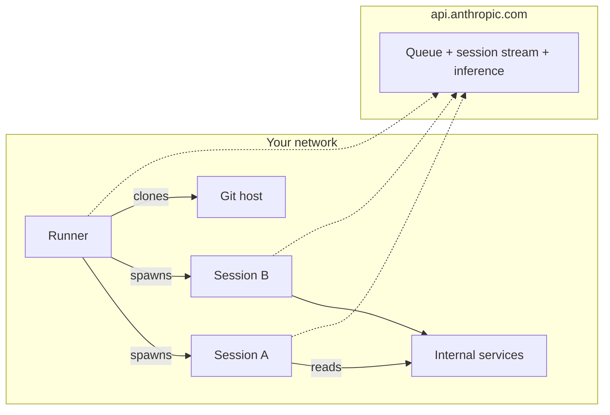

<LevelBadge level="advanced" />

<Callout type="objectives" items={[
  "Comprendre ce qu'est vraiment un environnement auto-hébergé — trois parties mobiles (environment, runner, session) qui ressemblent presque exactement à un runner CI auto-hébergé",
  "Voir la forme réseau : 100 % HTTPS sortant, zéro entrant depuis Anthropic, la control plane d'Anthropic reste hébergée, l'exécution bouge sur vos machines",
  "Savoir quand se tourner vers cela (accès réseau interne, tooling custom, conformité) vs les deux réponses plus faciles que la plupart des équipes devraient utiliser d'abord",
  "Monter votre premier runner avec claude self-hosted-runner en quatre commandes, sans fuiter le secret d'environnement dans l'historique shell",
  "Comprendre le verrou runner un-utilisateur-à-la-fois — pourquoi il existe, ce que font --drain-grace-sec et --retire-at, et comment il pilote votre taille minimum de flotte",
  "Livrer avec les six pièges qui piègent chaque première flotte de production (rotation de secret, blockers ZDR, blockers de routage modèle, défaut --base-dir, dérive d'horloge, éviction spot)",
]} />

<VerifyNote lastVerified="2026-08-07" source="https://code.claude.com/docs/en/self-hosted-environments">
Bêta publique livrée le **7 août 2026** dans [Claude Code v2.1.224](https://code.claude.com/docs/en/changelog) sur les plans Team et Enterprise. La sous-commande `claude self-hosted-runner` n'existe pas sur les versions antérieures — elle démarre silencieusement une session Claude normale avec les mots comme prompt. Noms, flags et chemin d'activation peuvent changer avant la GA ; croisez avec la page officielle [self-hosted environments](https://code.claude.com/docs/en/self-hosted-environments) et son [quickstart](https://code.claude.com/docs/en/self-hosted-environments-quickstart) avant de construire dessus.
</VerifyNote>

Le 7 août 2026, Anthropic a livré une fonctionnalité qui ferme le dernier vrai gap entre Claude Code et la façon dont les organisations régulées exécutent réellement leur infrastructure : les **environnements auto-hébergés**. Chaque session cloud — celles que vous démarrez depuis claude.ai, les apps mobile et desktop, les [routines Cowork planifiées](/docs/claude-app/cowork-scheduled-tasks), ou `claude --cloud` — peut maintenant s'exécuter dans votre propre réseau, sur des machines que vous provisionnez et imagez, sur les plans Team et Enterprise. L'orchestration et l'appel modèle restent côté Anthropic ; le code checkouté, les exécutions d'outils, et l'accès réseau à vos services internes vivent entièrement sur vos machines.

Si vous avez déjà exploité une flotte de self-hosted runners GitHub Actions, la forme est exactement familière. Vous serez productif plus vite en portant ce modèle mental.

## La version en un paragraphe

Vous définissez un **environment** dans les settings admin claude.ai — une destination nommée. Vous copiez son **secret d'environnement** une fois (durée 365 jours ; l'UI l'appelle « environment key »). Vous installez Claude Code v2.1.224+ sur un hôte Linux ou macOS, mettez le secret dans un fichier, et lancez `claude self-hosted-runner --environment-secret-file /etc/claude/environment-secret --base-dir /workspace`. Ce processus sonde `api.anthropic.com` en sortie pour du travail, réclame des sessions depuis la queue de votre environment, clone le repo que le développeur a choisi, et lance un processus enfant `claude` pour exécuter chaque session. L'état de session, les checkouts git, et tout ce que les outils touchent restent sur votre hôte ; seule la transcription pour l'inférence part, sur HTTPS sortant. Rien d'entrant depuis Anthropic. Modèle mental simple, une surprise opérationnelle : un runner se verrouille au premier utilisateur qui atterrit dessus et ne sert que cet utilisateur jusqu'à drainage.

## Où cela se situe vs les deux réponses plus faciles

Avant de construire une flotte, soyez honnête sur si vous en avez vraiment besoin. Deux produits adjacents couvrent la plupart des cas « je veux Claude ailleurs que sur mon portable » sans infra à exploiter.

| Option | Où l'exécution se passe | Setup à votre charge | Choisissez-le quand |
| :--- | :--- | :--- | :--- |
| Cloud hébergé Anthropic (défaut) | Infra Anthropic | Rien | Vous n'avez aucune raison de conformité ou réseau pour déplacer l'exécution. C'est la bonne réponse pour la plupart des équipes. |
| [Remote Control](https://code.claude.com/docs/en/remote-control) | Votre propre machine always-on | Cette seule machine | Vous voulez piloter un workstation depuis votre téléphone ou un autre portable. Disponible sur Pro, Max, Team et Enterprise. |
| **Environnements auto-hébergés** | Votre flotte de runners | Image runner, orchestration, sortie, credentials git | Vous avez besoin de l'exécution de session dans votre réseau — registres internes, endpoints privés, code air-gapped, ou la conformité dit « les checkouts restent sur notre infra ». Team et Enterprise uniquement. |

Si une session démarrée depuis un terminal ou IDE ne quitte de toute façon jamais le portable du développeur, rien de tout cela ne s'applique à cette session — le sélecteur d'environnement n'apparaît que pour les sessions cloud.

## Architecture : environment, runner, session

Trois noms ; ils mappent proprement sur leurs équivalents GitHub Actions.

<Steps items={[
  {title: "Environment (~ runner group)", body: "Un groupe nommé de vos runners, créé sur la page admin Cloud environments dans claude.ai. Les sessions sont routées vers un environment, pas vers un runner spécifique. Dans les champs API et métriques il apparaît comme pool, et l'ID est une chaîne comme ccpool_..."},
  {title: "Runner (~ self-hosted runner)", body: "Un processus long-running sur votre hôte démarré avec claude self-hosted-runner. Il s'enregistre auprès de l'environment en utilisant le secret d'environnement, reçoit un token runner, et sonde la queue pour du travail. Un seul binaire, aucun service daemon à installer — le runner EST le CLI claude standard dans un mode différent."},
  {title: "Session (~ workflow run)", body: "Une tâche Claude Code qu'un développeur a démarrée, depuis claude.ai, l'app mobile/desktop, une routine Cowork planifiée, ou claude --cloud. Chaque session tourne comme processus enfant claude que le runner lance, avec son propre flux d'événements vers Anthropic."},
]} />

Chaque connexion est sortante depuis votre réseau. Anthropic ne se connecte jamais entrant. Le runner et chaque session ouvrent chacun leur propre HTTPS sortant vers `api.anthropic.com` pour le polling de queue, le streaming de session et l'inférence modèle ; le runner ou la session ouvre des connexions git vers votre hôte git (public via HTTPS/SSH, ou interne directement puisque vous êtes sur ce réseau).

## Disponibilité et les blockers que la plupart des orgs rencontrent

Six lignes à lire avant de planifier un rollout. Chacune est un « non » dur, pas un contournement.

- **Plans** : Team et Enterprise, bêta publique. **Allow self-hosted environments** doit être activé par un Owner ou admin sur la [page admin Cloud environments](https://claude.ai/admin-settings/cloud-environments) ; le bouton **New** est caché jusqu'alors. Nécessite que [Claude Code on the web](https://code.claude.com/docs/en/claude-code-on-the-web) soit activé pour l'org.
- **Zero Data Retention** : indisponible pour les organisations avec ZDR activé. Si votre org a besoin de ZDR, les environnements auto-hébergés ne sont pas pour vous.
- **Routage modèle** : l'inférence va à l'API Anthropic sur `api.anthropic.com`. Vous **ne pouvez pas** la router via Amazon Bedrock, Google Cloud, Microsoft Foundry, ou un [LLM gateway](https://code.claude.com/docs/en/llm-gateway) dans un environnement auto-hébergé — la session s'authentifie avec un token OAuth session-scoped émis par Anthropic. Déplacez l'exécution, gardez l'inférence.
- **Dépôts** : les checkouts de session sont GitHub pour l'instant. Si votre source de vérité est GitLab, Bitbucket, ou du self-hosted sans auth fédérée GitHub, attendez.
- **Surfaces pas encore routables** : les sessions [Claude Tag](https://claude.com/docs/claude-tag/overview), Claude Security et Code Review ne routent pas encore vers les environnements auto-hébergés. Chat régulier, Claude Code on the web, app mobile/desktop, routines planifiées, et `claude --cloud` le font.
- **OS du runner** : hôte ou conteneur Linux ou macOS. Windows n'est pas supporté comme hôte runner — exécutez-le dans un conteneur Linux à la place. Les workstations développeur sont non affectées (ils n'hébergent jamais le runner).

## Quickstart : votre premier runner en quatre commandes

Le setup guidé (`claude self-hosted-runner setup`) fait passer une machine sur laquelle vous vous êtes connecté avec `claude auth login` sous un compte Owner/admin par tout le flux interactivement, et dépose un `./runner-setup/CHEAT-SHEET.md` à la fin. Sur un hôte headless où un setup interactif n'est pas possible, faites-le manuellement avec ces quatre commandes.

<Steps items={[
  {title: "Créez l'environment dans claude.ai et copiez le secret", body: "Page admin Cloud environments → New sous Self-hosted environments → nommez-le → Copiez la clé d'environnement. Le secret est montré UNE fois. Expire 365 jours après création. L'ID ccpool_... est récupérable plus tard ; le secret non."},
  {title: "Stagez le secret dans un fichier, hors de l'historique shell", body: "L'astuce subshell + umask lit depuis stdin, donc le secret n'atterrit jamais dans ~/.bash_history ou ~/.zsh_history. Ctrl-D après paste + Entrée."},
  {title: "Créez un répertoire de base auquel l'utilisateur runner peut écrire", body: "Le runner défaute --base-dir à /workspace. Si ce répertoire n'existe pas (ou si le runner n'est pas root), vous frapperez une erreur à la première claim. Possédez-le explicitement."},
  {title: "Démarrez le runner et regardez-le s'enregistrer", body: "Le processus sonde la queue en avant-plan. Le redémarrage à la sortie est votre job — voir les recettes de flotte ci-dessous."},
]} />

<PromptCard title="1. Vérifier que Claude Code est assez récent">{`claude self-hosted-runner --help`}</PromptCard>

Imprime le texte d'usage du runner avec des flags comme `--environment-secret-file` sur v2.1.224+. Sur les versions plus anciennes il imprime le `claude --help` général — upgradez d'abord avec `claude update` ou réinstallez depuis le [canal `latest`](https://code.claude.com/docs/en/setup).

<PromptCard title="2. Stager le secret d'environnement sans le fuiter">{`sudo mkdir -p /etc/claude
sudo bash -c '(umask 077 && cat > /etc/claude/environment-secret)'
# paste secret, press Enter, then Ctrl-D`}</PromptCard>

<PromptCard title="3. Créer un répertoire de base writable">{`sudo mkdir -p /workspace && sudo chown $USER /workspace`}</PromptCard>

<PromptCard title="4. Démarrer le runner">{`claude self-hosted-runner \\
  --environment-secret-file /etc/claude/environment-secret \\
  --base-dir /workspace`}</PromptCard>

En quelques secondes le statut de l'environment sur la page admin bascule de **No runners deployed** à **Healthy**. Démarrez une session depuis `claude.ai/code`, choisissez votre environment dans le sélecteur, et regardez le runner logger `Picked up session <session-id>` avec un compteur active/capacity.

Envoyer un suivi depuis toute autre machine sur laquelle vous vous êtes connecté :

<PromptCard title="Envoyer un suivi à une session cloud en cours">{`claude -p "add a test for the empty-list case" --cloud <session-id>`}</PromptCard>

Le `<session-id>` est l'ID nu `session_...` ou `cse_...` ou l'URL `claude.ai/code` de la session. Confirme avec `Sent to cloud session.` plus un lien de vue.

## Le cycle de vie du runner : le verrou un-utilisateur

C'est la surprise que la plupart des opérateurs frappent en premier. C'est un choix d'isolation délibéré, et il pilote tout du dimensionnement de la flotte.

- La première session qu'un runner récupère **verrouille le runner au compte de cet utilisateur**. Dès lors, le runner ne réclame que le travail en queue de cet utilisateur, jusqu'à `--capacity` sessions concurrentes.
- Ce qui se passe après que ces sessions se terminent dépend de `--drain-grace-sec` :
  - **Défaut `0`** : le runner sort dès que les sessions actives finissent ; votre orchestrateur (Kubernetes, Compose, systemd + `Restart=always`) démarre un frais sur un disque propre qui peut servir *tout* utilisateur.
  - **Valeur positive** : le runner continue de sonder la queue du compte verrouillé pendant ce nombre de secondes avant de sortir. Utilisez uniquement si les sessions dos-à-dos d'un seul power user dominent.
- La **taille minimum de flotte** est donc le nombre d'utilisateurs que vous vous attendez à voir actifs en même temps — une session long-running sur un runner bloque tout autre utilisateur de ce runner jusqu'au drainage.
- Le bail de session est sondé environ chaque cycle ; **60 secondes** sans poll et la control plane remet la session en queue vers un autre runner. Le heartbeat du runner et le refresh du bail sont le même appel.
- Pour les hôtes détruits à un temps wall clock sans signal (instances spot, plafonds de vie de sandbox), passez `--retire-at <epoch-seconds>` quelques minutes avant le kill. Le runner arrête de prendre du nouveau travail, libère chaque session active (pour que le prochain message de l'utilisateur soit repris sur un runner frais), et sort 0. Sans `--retire-at`, un kill sans signal ressemble à un crash et la session est remise en queue depuis un état lost-worker.
- SIGTERM déclenche un drainage gracieux out-of-the-box (pas de flag). Un tour qui survit au grace du kill est encore perdu ; dimensionnez pour cela.

<Flashcards title="Vocabulaire du cycle de vie du runner" cards={[
  {front: "Verrou un-utilisateur", back: "La première session qu'un runner réclame verrouille le runner au compte de cet utilisateur jusqu'au drainage. Taille min de flotte = nombre d'utilisateurs actifs concurrents."},
  {front: "--drain-grace-sec", back: "Secondes qu'un runner continue de sonder la queue de l'utilisateur verrouillé après que ses sessions actives finissent. Défaut 0 (sortir immédiatement)."},
  {front: "--capacity", back: "Sessions concurrentes par runner, toutes servies pour l'utilisateur verrouillé."},
  {front: "--retire-at <epoch>", back: "Demander au runner d'arrêter de prendre du travail et libérer les sessions actives avant un kill sans signal (instance spot, timeout de sandbox). Prévient l'état lost-worker."},
  {front: "--base-dir", back: "Où le runner checkoute les dépôts. Défaut /workspace ; doit exister et être writable, ou exécutez le runner en root."},
  {front: "--environment-secret-file", back: "Chemin vers le fichier détenant le secret ccpool. Le secret env expire 365 jours après création ; roulez avant."},
  {front: "ID ccpool_", back: "Identifiant public d'environment (a.k.a. pool_id dans les APIs et métriques). Pas un secret ; utilisez-le dans le check aud quand vous vérifiez les tokens de session."},
]} />

## Réseau et ce qui traverse vraiment le périmètre

Le but de l'auto-hébergement est le contrôle sur ce qui part. Alors ça vaut la peine d'être précis sur ce qui le fait.

**Reste sur votre infra** — les checkouts de dépôt, artefacts de build, secrets que votre tooling lit, et tout fichier que les sessions créent ou modifient. Les appels session-vers-service-interne (bases de données, registres, endpoints HTTP privés) ne quittent jamais votre réseau.

**Quitte votre infra** — la conversation elle-même (prompts, réponses modèle, résultats d'outils) va à `api.anthropic.com` pour l'inférence, et Anthropic stocke la transcription de session pour qu'une session puisse être reprise depuis une autre surface. Les heartbeats runner et polls de queue sont HTTPS sortant vers le même hôte. Optionnel : les clones git peuvent être tunnelés via le [proxy git](https://code.claude.com/docs/en/self-hosted-environments-deploy#use-the-anthropic-git-proxy) d'Anthropic si votre hôte git interne est inaccessible depuis le runner directement.

**N'arrive jamais** — Anthropic n'ouvre pas de connexions entrantes vers votre réseau. Il n'y a pas de port à exposer, pas d'ingress à firewaller.

Support proxy : le runner et l'orchestrateur d'autoscaling optionnel honorent `HTTPS_PROXY` / `NO_PROXY` et les variables mTLS de [Network configuration](https://code.claude.com/docs/en/network-config). Les sessions les héritent. Le proxy sur le chemin **ne doit pas buffer** les réponses server-sent-event — le streaming de session cassera s'il le fait.

## Checklist de production : ce qu'il faut cuire dans l'image runner

Le runner est un seul binaire. Tout le reste qui rend les sessions productives vit dans l'image ou un script wrapper.

- **Épinglez la version de Claude Code.** Le canal `latest` reçoit les releases le jour où elles livrent ; le canal `stable`, le cask Homebrew, et les repos apt/dnf/apk stables traînent d'~une semaine. Suivez [Install a specific version](https://code.claude.com/docs/en/setup#install-a-specific-version) et épinglez.
- **Git ≥ 2.24** sur PATH. Un git plus récent est requis pour certaines options [Configure git](https://code.claude.com/docs/en/self-hosted-environments-deploy#configure-git) ; chaque plancher indiqué est sur cette page.
- **Préinstallez vos outils de build** — compilateurs, runtimes de langage, package managers, CLIs internes. C'est 80 % de la valeur « pourquoi on auto-héberge » : chaque session démarre prête à builder, pas de `apt install` en cours de tour.
- **Provisionnez les credentials git** dans l'image runner ou via un wrapper. Les options incluent des credentials mintés par session — voir [Configure git](https://code.claude.com/docs/en/self-hosted-environments-deploy#configure-git).
- **Orchestration restart-on-exit** (Kubernetes Deployment, `systemd` avec `Restart=always`, Compose avec `restart: always`). Le runner sort par conception quand les sessions actives finissent ; sans redémarreur, votre environment devient froid.
- **Sync d'horloge (NTP ou équivalent).** L'authentification échoue quand l'horloge est à plus de 5 minutes de décalage — cause silencieuse de boucles `poll auth failed`.
- **Autoscaling** : pour la demande en burst, déployez l'[orchestrateur d'autoscaling](https://code.claude.com/docs/en/self-hosted-environments-configuration#on-demand-runners), un second processus que vous hébergez qui démarre des runners on-demand à mesure que les sessions font la queue.

## Test et identité

Deux surfaces adjacentes à connaître le jour où vous dépassez un smoke test single-host :

- **Smoke test CI** — [Test end to end](https://code.claude.com/docs/en/self-hosted-environments-testing) dispatche une session vers votre environment depuis la CI (`--environment ccpool_...`) et lit les réponses de Claude, vous donnant un gate de promotion d'image.
- **Vérifier l'identité de session** — [Session identity verification](https://code.claude.com/docs/en/self-hosted-environments-identity) laisse vos services internes valider le token de session avant d'accorder l'accès, en utilisant l'ID `ccpool_...` comme check `aud`. C'est la pièce qui laisse les APIs internes savoir « cette requête vient d'une session dans notre environment, pas d'un portable employé au hasard ».

## Les six pièges qui piègent chaque première flotte

Pas inventé — chacun est soit dans les petits caractères de la doc soit une conséquence naturelle du design. Épargnez-vous une semaine.

1. **Piège de version du setup guidé.** Sur Claude Code &lt; v2.1.224, `claude self-hosted-runner setup` n'erreure pas — il démarre une session Claude normale avec les mots littéraux comme prompt. Faites d'abord le check `--help` ; si vous voyez le `claude --help` général, upgradez.
2. **Le secret d'environnement est show-once.** La valeur que vous copiez à la création est irrécupérable. Stockez-la dans votre secrets manager au moment même où vous la copiez, avant de fermer le wizard. Si vous la perdez, créez un nouveau secret depuis l'onglet **Configuration** de l'environment, roulez-le sur vos runners, puis révoquez l'ancien — les vieux runners frappant des secrets révoqués échouent leur prochain poll avec `poll auth failed`.
3. **Piège du défaut `--base-dir`.** Si vous ne passez pas `--base-dir` et n'exécutez pas le runner en root, `/workspace` n'existera pas et ne sera pas writable — le runner s'enregistre bien, puis erreure sur la première claim. Passez toujours un `--base-dir` explicite sur les runs non-root, et `chown`-ez-le.
4. **Le verrou un-utilisateur, encore.** Une équipe de 20 ingénieurs actifs a besoin au minimum de 20 runners, pas de 20 × capacity-de-session. Sous-provisionnez ici et chaque autre utilisateur attend derrière celui qui a frappé le runner en premier. Dimensionnez les flottes par *utilisateurs actifs concurrents*, pas par sessions concurrentes.
5. **La dérive d'horloge fait échouer l'auth.** Les runners sur des hôtes à plus de 5 minutes de décalage wall-clock bouclent silencieusement sur `poll auth failed`. NTP n'est pas optionnel.
6. **Les kills sans signal perdent le tour en cours.** Les instances spot, deadlines de runtime conteneur, et certaines évictions Kubernetes tuent l'hôte sans SIGTERM. Réglez `--retire-at` quelques minutes avant le temps de kill connu pour que le runner draine proprement ; sinon un tour en cours de vol est perdu et la session est remise en queue depuis un état lost-worker.

<Quiz title="Vérifiez votre compréhension" questions={[
  {q: "Votre org Enterprise avec ZDR activé veut déplacer l'exécution Claude Code on-prem. Peuvent-ils utiliser les environnements auto-hébergés ?", options: ["Oui, ZDR est orthogonal à la localisation d'exécution", "Non — les environnements auto-hébergés sont indisponibles pour les organisations avec Zero Data Retention activé", "Oui, mais seulement pour les routines planifiées"], answer: 1, explain: "Les environnements auto-hébergés sont indisponibles aux orgs ZDR-enabled. La transcription de session va encore à api.anthropic.com pour l'inférence et est stockée pour qu'une session puisse bouger entre surfaces — ce stockage est incompatible avec ZDR."},
  {q: "Vous avez 20 ingénieurs qui pourraient chacun avoir une session cloud Claude Code ouverte à tout moment. Quel est votre compte minimum de runners ?", options: ["1, puisque --capacity gère les sessions concurrentes", "20, parce que chaque runner se verrouille à un utilisateur jusqu'au drainage", "Vous pouvez le calculer comme ceil(20 / --capacity)"], answer: 1, explain: "Un runner se verrouille au compte du premier utilisateur pour sa durée de vie. La taille min de flotte égale les utilisateurs actifs concurrents. --capacity ne fait que bump la concurrence pour cet UNIQUE utilisateur verrouillé."},
  {q: "Vos runners sont sur des instances spot qui reçoivent 2 minutes d'avertissement avant terminaison — pas de SIGTERM. Que réglez-vous pour éviter de perdre des sessions en milieu de tour ?", options: ["--drain-grace-sec 120", "--retire-at réglé à quelques minutes avant le temps de terminaison connu", "--capacity 1"], answer: 1, explain: "--retire-at gère les kills sans signal : le runner arrête d'accepter du nouveau travail et libère les sessions actives pour que le prochain message de l'utilisateur soit repris sur un runner frais. --drain-grace-sec n'affecte que le polling post-drainage."},
  {q: "Vous voulez que les sessions cloud Claude Code soient routées vers votre inférence Bedrock. Les environnements auto-hébergés permettent-ils cela ?", options: ["Oui — c'est un cas d'usage courant", "Non — les sessions dans les environnements auto-hébergés s'authentifient avec un token OAuth session-scoped émis par Anthropic et l'inférence va à api.anthropic.com uniquement", "Oui, si vous utilisez un LLM gateway"], answer: 1, explain: "L'auto-hébergement déplace l'exécution, pas l'inférence. L'inférence dans un environnement auto-hébergé ne peut pas être routée via Bedrock, Google Cloud, Foundry, ou un LLM gateway."},
  {q: "Vous montez un runner sur une machine dont l'horloge est 12 minutes en avance sur le temps réel. Que voyez-vous ?", options: ["Ça marche bien — Anthropic tolère la dérive d'horloge", "Il s'enregistre mais ne récupère jamais de sessions", "Il échoue avec poll auth failed et ne s'enregistre jamais comme Healthy — l'auth échoue au-delà d'une dérive de 5 minutes"], answer: 2, explain: "Les tokens d'authentification sont bornés dans le temps. À plus de 5 minutes de décalage wall-clock et les polls du runner échouent l'auth. NTP ou un sync d'horloge similaire est une exigence dure."},
]} />

<Callout type="takeaways" items={[
  "Les environnements auto-hébergés déplacent l'EXÉCUTION des sessions cloud Claude Code dans votre réseau. L'orchestration et l'inférence restent sur api.anthropic.com. Il n'y a pas d'entrant depuis Anthropic.",
  "Trois parties : environment (une destination de routage nommée), runner (un processus claude self-hosted-runner), session (une tâche enfant Claude Code). Même forme que les self-hosted runners GitHub Actions.",
  "Disponibilité aujourd'hui : Team et Enterprise, bêta publique, off par défaut. Bloqué par ZDR. L'inférence ne peut pas être routée hors Anthropic. Checkouts GitHub uniquement. Hôtes runner Linux/macOS.",
  "Un runner se verrouille au compte du premier utilisateur pour sa durée de vie. Taille min de flotte = nombre d'utilisateurs actifs concurrents. --capacity ne scale que la concurrence pour cet utilisateur verrouillé.",
  "Les quatre commandes sont tout le quickstart : vérifier version, stager le secret dans un fichier protégé par umask, mkdir un --base-dir writable, lancer le runner en avant-plan. Le restart-on-exit est le job de votre orchestrateur.",
  "Pour tout ce qui est moins qu'une flotte, le cloud hébergé Anthropic est la bonne réponse. Pour piloter une machine always-on à distance, utilisez Remote Control à la place.",
]} />

## Suite

- Les sessions cloud que vous allez router → [Claude Code on the web](https://code.claude.com/docs/en/claude-code-on-the-web)
- Les sessions planifiées qui tournent sans appareil allumé → [Cowork Scheduled Tasks](/docs/claude-app/cowork-scheduled-tasks)
- Les recettes de hardening et de flotte pour les vrais déploiements → [Deploy to production (official docs)](https://code.claude.com/docs/en/self-hosted-environments-deploy)
- L'autre primitive pour « exécuter Claude Code ailleurs que sur mon portable » → [Remote Control (official docs)](https://code.claude.com/docs/en/remote-control)
