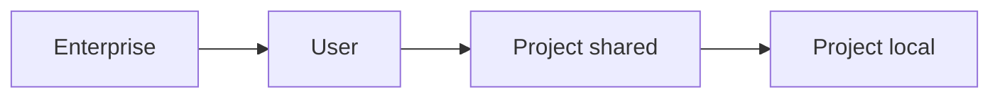

<LevelBadge level="intermediate" />

<VerifyNote lastVerified="2026-06-20" source="https://docs.anthropic.com/en/docs/claude-code/settings">
Les clés exactes et l'emplacement des fichiers sont à confirmer de préférence dans la documentation officielle des réglages de Claude Code.
</VerifyNote>

`settings.json` est l'endroit où vit la configuration de Claude Code — [permissions](/docs/claude-code/permissions), [hooks](/docs/claude-code/hooks), variables d'environnement, modèles par défaut, et plus encore. Comprendre les **niveaux** est essentiel.

## Les niveaux (du plus global → au plus spécifique)

Les niveaux ultérieurs (plus spécifiques) ont priorité sur les précédents :

1. **Enterprise / managed** — politique définie par un administrateur d'organisation. Prime sur tout.
2. **User** — `~/.claude/settings.json`. Vos valeurs par défaut pour tous les projets.
3. **Project (shared)** — `.claude/settings.json`, committé dans le dépôt. À l'échelle de l'équipe.
4. **Project (personal)** — `.claude/settings.local.json`, ignoré par git. Vos surcharges pour ce dépôt.

:::tip Committez le fichier partagé, ignorez le fichier local
Mettez les conventions de l'équipe dans `.claude/settings.json` (committé). Mettez les ajustements personnels et les chemins spécifiques à la machine dans `.claude/settings.local.json` (ignoré par git). Cela garde l'équipe cohérente sans imposer vos préférences aux autres.
:::

## Ce que vous configurerez couramment

- **`permissions`** — règles allow/ask/deny. Voir [Permissions](/docs/claude-code/permissions).
- **`hooks`** — commandes exécutées lors des événements du cycle de vie. Voir [Hooks](/docs/claude-code/hooks).
- **`env`** — variables d'environnement pour la session.
- **Valeurs par défaut du modèle / du comportement** — par exemple le modèle préféré.

## Modifier en toute sécurité

- Gardez un JSON valide (une virgule finale le casse).
- Préférez des règles de permission **étroites** plutôt que larges.
- Ne mettez jamais de secrets dans un fichier committé — utilisez des références `env` ou un gestionnaire de secrets.

Des fichiers de départ prêts à copier se trouvent dans [Recettes de hooks & settings.json](/docs/templates/hooks-settings).

## Et après

- [Permissions & modes de permission](/docs/claude-code/permissions)
- [Hooks : automatisation déterministe](/docs/claude-code/hooks)
- [Commandes slash personnalisées](/docs/claude-code/slash-commands)
