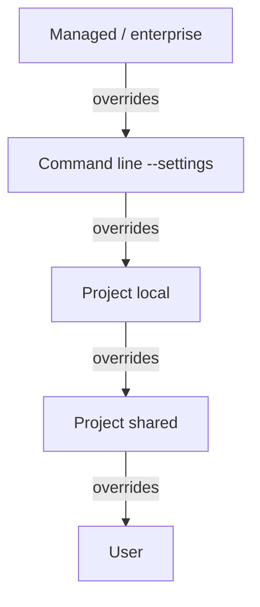

<LevelBadge level="intermediate" />

<VerifyNote lastVerified="2026-09-23" source="https://code.claude.com/docs/en/settings">
Pile de précédence à cinq niveaux (géré → ligne de commande → projet local → projet partagé → utilisateur) et la règle « les variables d'environnement ne sont pas un niveau » de la page officielle [Settings files and precedence](https://code.claude.com/docs/en/settings). Les remplacements par clé sont listés dans la [référence des paramètres](https://code.claude.com/docs/en/settings-reference).
</VerifyNote>

`settings.json` est l'endroit où vit la configuration de Claude Code — [permissions](/docs/claude-code/permissions), [hooks](/docs/claude-code/hooks), variables d'environnement, modèles par défaut, et plus encore. Comprendre les **niveaux** est essentiel.

## Les niveaux (précédence la plus élevée en premier)

Quand la même clé est définie à plusieurs endroits, Claude Code utilise la valeur du niveau le plus élevé qui la définit :

1. **Géré / entreprise** — `managed-settings.json`, une stratégie MDM ou les paramètres gérés côté serveur depuis la console claude.ai. Rien de ce que vous définissez ne les remplace (hormis quelques exceptions sensibles pour la sécurité).
2. **Ligne de commande** — `claude --settings '<json-or-path>'`, pour une seule session. Se place au-dessus de tout fichier sauf le niveau géré, et n'écrit dans aucun fichier.
3. **Projet (personnel)** — `.claude/settings.local.json`, ignoré par git. Vos remplacements pour ce dépôt.
4. **Projet (partagé)** — `.claude/settings.json`, versionné dans le dépôt. Pour toute l'équipe.
5. **Utilisateur** — `~/.claude/settings.json`. Vos valeurs par défaut dans tous les projets.

```mermaid
flowchart TB
  M[Managed / enterprise] -->|overrides| C[Command line --settings]
  C -->|overrides| L[Project local]
  L -->|overrides| P[Project shared]
  P -->|overrides| U[User]
```

:::note Les variables d'environnement ne sont pas un niveau
Elles se situent en dehors de cette pile et sont résolues clé par clé. Par exemple, `ANTHROPIC_MODEL` prévaut sur la clé `model` de n'importe quel fichier, tandis que `ANTHROPIC_DEFAULT_MODEL` ne s'applique que si aucun fichier ne définit `model`.
:::

:::tip Committez le fichier partagé, ignorez le fichier local
Mettez les conventions de l'équipe dans `.claude/settings.json` (committé). Mettez les ajustements personnels et les chemins spécifiques à la machine dans `.claude/settings.local.json` (ignoré par git). Cela garde l'équipe cohérente sans imposer vos préférences aux autres.
:::

## Ce que vous configurerez couramment

- **`permissions`** — règles allow/ask/deny. Voir [Permissions](/docs/claude-code/permissions).
- **`hooks`** — commandes exécutées lors des événements du cycle de vie. Voir [Hooks](/docs/claude-code/hooks).
- **`env`** — variables d'environnement pour la session.
- **Valeurs par défaut du modèle / du comportement** — par exemple le modèle préféré.

## Modifier en toute sécurité

- Gardez un JSON valide (une virgule finale le casse).
- Préférez des règles de permission **étroites** plutôt que larges.
- Ne mettez jamais de secrets dans un fichier committé — utilisez des références `env` ou un gestionnaire de secrets.

Des fichiers de départ prêts à copier se trouvent dans [Recettes de hooks & settings.json](/docs/templates/hooks-settings).

## Et après

- [Permissions & modes de permission](/docs/claude-code/permissions)
- [Hooks : automatisation déterministe](/docs/claude-code/hooks)
- [Commandes slash personnalisées](/docs/claude-code/slash-commands)
