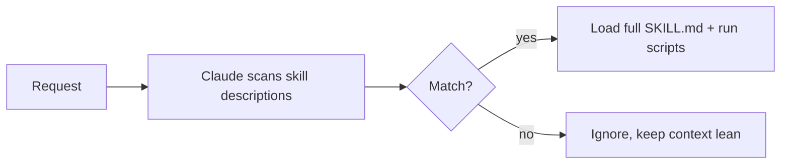

<LevelBadge level="advanced" />

<VerifyNote lastVerified="2026-06-20" source="https://docs.anthropic.com/en/docs/claude-code/skills">
La structure des fichiers de skill et les endroits où les skills s'exécutent (Claude Code, Claude.ai, Cowork) évoluent — vérifiez dans la documentation officielle des Skills.
</VerifyNote>

Un **Skill** empaquette une expertise — des instructions plus des scripts et ressources optionnels — que Claude charge **uniquement quand c'est pertinent**. Au lieu de tout entasser dans [CLAUDE.md](/docs/claude-code/claude-md), vous donnez à Claude une bibliothèque de capacités qu'il convoque à la demande.

## Anatomie

Un skill est un dossier avec un `SKILL.md` : frontmatter YAML + instructions.

```markdown
---
name: pdf-forms
description: Use when the user needs to fill, read, or generate PDF forms.
---

# PDF Forms
Steps and rules for working with PDF forms…
(optionally reference scripts/ or resources/ in this folder)
```

La **`description` est le déclencheur** — Claude la lit pour décider *quand* activer le skill. Rédigez-la comme « Use when… », assez spécifique pour qu'elle se charge au bon moment et pas autrement.

## Divulgation progressive (pourquoi les skills passent à l'échelle)

Claude ne charge pas d'emblée le corps complet de chaque skill — il voit le `name` + la `description` légers, et ne convoque les instructions complètes (et n'exécute les scripts) que lorsqu'une requête correspond. Cela garde le contexte léger même avec de nombreux skills installés.



## Où ils vivent

- Personnel : `~/.claude/skills/<name>/SKILL.md`
- Projet (partageable) : `.claude/skills/<name>/SKILL.md`
- Regroupé dans un [plugin](/docs/claude-code/plugins-marketplaces) pour la distribution en équipe.

AILmanac livre [7 packs de skills prêts à l'emploi](/docs/templates/skills) — copiez-en un pour l'essayer.

## Skill vs commande vs sous-agent vs MCP

| Outil | Ce que c'est | Déclencheur : vous vs Claude |
|---|---|---|
| [Commande slash](/docs/claude-code/slash-commands) | Une invite enregistrée | **Vous** l'invoquez |
| **Skill** | Expertise à la demande + scripts | **Claude** le charge quand c'est pertinent |
| [Sous-agent](/docs/claude-code/subagents) | Un agent délégué avec son propre contexte | Claude délègue |
| [MCP](/docs/claude-code/mcp) | Une connexion à des outils/données externes | Fournit des outils à appeler |

## Et après

- [Écrire votre premier skill (tutoriel)](/docs/walkthroughs/first-skill)
- [Modèles de SKILL.md](/docs/templates/skills)
- [Plugins & marketplaces](/docs/claude-code/plugins-marketplaces)
