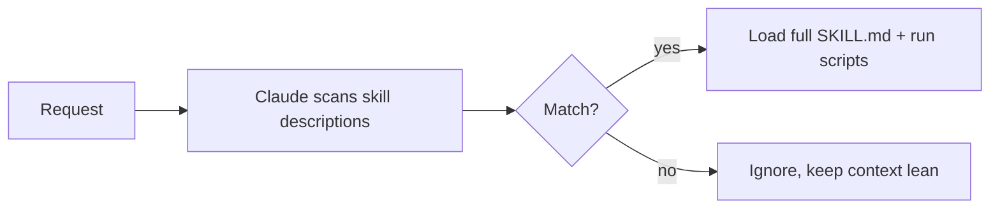

<LevelBadge level="advanced" />

<VerifyNote lastVerified="2026-06-23" source="https://code.claude.com/docs/en/skills">
La structure des fichiers de skill, la divulgation progressive et l'endroit où s'exécutent les skills (Claude Code, Claude.ai, Cowork) évoluent — vérifiez dans la documentation officielle des Skills.
</VerifyNote>

<Callout type="objectives" items={["Définir ce qu'est un Skill et en quoi il diffère du fait de tout entasser dans CLAUDE.md", "Lire et écrire un SKILL.md — frontmatter plus instructions — et comprendre pourquoi la description est le déclencheur", "Expliquer la divulgation progressive et pourquoi elle permet à de nombreux skills de passer à l'échelle sans gonfler le contexte", "Connaître les trois endroits où vivent les skills : personnel, projet, et intégré à un plugin", "Choisir correctement entre Skill, commande slash, subagent et MCP", "Éviter les quatre erreurs courantes qui empêchent les skills de se déclencher"]} />

Un **Skill** empaquette de l'expertise — des instructions plus des scripts et ressources optionnels — que Claude charge **uniquement quand c'est pertinent**. Au lieu de tout entasser dans [CLAUDE.md](/docs/claude-code/claude-md), vous donnez à Claude une bibliothèque de capacités qu'il tire à la demande.

## Anatomie

Un skill est un dossier avec un `SKILL.md` : frontmatter YAML + instructions.

```markdown
---
name: pdf-forms
description: Use when the user needs to fill, read, or generate PDF forms.
---

# PDF Forms
Steps and rules for working with PDF forms…
(optionally reference scripts/ or resources/ in this folder)
```

<Callout type="tip" items={["La description est le déclencheur — Claude la lit pour décider quand activer le skill. Écrivez-la comme « Use when… », assez spécifique pour qu'elle se charge au bon moment et pas autrement."]} />

## Divulgation progressive (pourquoi les skills passent à l'échelle)

Claude ne charge pas d'emblée le corps complet de chaque skill — il voit le `name` + la `description` légers, et ne tire les instructions complètes (et n'exécute les scripts) que lorsqu'une requête correspond. Cela garde le contexte léger même avec beaucoup de skills installés.



## Où ils vivent

<Steps items={[{title:"Personnel", body:"~/.claude/skills/<name>/SKILL.md — reste à vous, disponible dans tous vos projets."},{title:"Projet (partageable)", body:".claude/skills/<name>/SKILL.md — versionnez-le dans git et toute l'équipe obtient la capacité."},{title:"Intégré à un plugin", body:"Empaquetez des skills dans un plugin pour la distribution en équipe. Voir Plugins & Marketplaces."}]} />

AILmanac est livré avec [7 packs de skills prêts à l'emploi](/docs/templates/skills) — copiez-en un pour l'essayer.

## Exemple concret : un skill qui se déclenche lui-même

Créez `~/.claude/skills/release-notes/SKILL.md` :

```markdown
---
name: release-notes
description: Use when the user asks to write release notes or a changelog from git history.
---

# Release Notes
1. Run `git log <last-tag>..HEAD --oneline` to get the commits.
2. Group them into Features / Fixes / Breaking changes.
3. Write user-facing notes — what changed for *users*, not commit messages.
4. Output Markdown ready to paste into a GitHub release.
```

Plus tard vous tapez le prompt ci-dessous. Claude n'avait jamais ces étapes en contexte — mais la requête correspond à la `description`, alors il tire le `SKILL.md` complet, exécute le `git log` et produit des notes groupées. Vous n'avez rien invoqué par son nom ; la **description a fait le routage**. Ajoutez un fichier `scripts/` dans le même dossier et le skill peut l'exécuter dans le cadre de l'étape 1.

<PromptCard title="Déclencher le skill par l'intention — aucun nom requis">{`Draft release notes since v1.4.`}</PromptCard>

## Skill vs commande vs subagent vs MCP

| Outil | Ce que c'est | Vous vs Claude déclenche |
|---|---|---|
| [Commande slash](/docs/claude-code/slash-commands) | Un prompt enregistré | **Vous** l'invoquez |
| **Skill** | Expertise à la demande + scripts | **Claude** le charge quand c'est pertinent |
| [Subagent](/docs/claude-code/subagents) | Un agent délégué avec son propre contexte | Claude délègue |
| [MCP](/docs/claude-code/mcp) | Une connexion à des outils/données externes | Fournit des outils à appeler |

<Callout type="takeaways" items={["Vous voulez le déclencher à la demande → commande slash.", "Claude doit connaître la procédure et l'appliquer quand c'est pertinent → skill.", "Le travail doit se dérouler dans un contexte séparé → subagent.", "Vous devez atteindre un système externe → MCP."]} />

## Erreurs courantes

<Callout type="warning" items={["Une description qui ne se déclenche pas. « Aide avec les PDF » est trop vague ; « Use when the user needs to fill, read, or generate PDF forms » indique à Claude exactement quand la charger. La description est tout le mécanisme d'activation — écrivez-la pour la correspondance, pas pour les humains.", "Tout mettre dans CLAUDE.md à la place. CLAUDE.md se charge à chaque session et coûte toujours du contexte ; un skill ne se charge que quand c'est pertinent. Déplacez les procédures situationnelles dans des skills et gardez CLAUDE.md pour les règles de projet toujours vraies.", "Un skill géant unique. Beaucoup de petits skills à la description précise routent mieux qu'un fourre-tout — la divulgation progressive n'aide que si chaque description est spécifique.", "Oublier que c'est partageable. Un skill de projet dans .claude/skills/ versionné dans git donne la capacité à toute l'équipe ; un skill personnel dans ~/.claude/skills/ reste à vous."]} />

## Récapitulez les termes

<Flashcards cards={[{front:"Qu'est-ce qu'un Skill ?", back:"Un dossier avec un SKILL.md empaquetant des instructions plus des scripts et ressources optionnels, que Claude charge uniquement quand c'est pertinent."},{front:"Quel est le déclencheur d'un skill ?", back:"Le champ description — Claude le lit pour décider quand activer le skill. Écrivez-le comme « Use when… », assez spécifique pour se charger au bon moment et pas autrement."},{front:"Qu'est-ce que la divulgation progressive ?", back:"Claude ne voit d'emblée que le name + description légers, et ne tire le SKILL.md complet (et n'exécute les scripts) que lorsqu'une requête correspond — gardant le contexte léger même avec beaucoup de skills."},{front:"Emplacement d'un skill personnel vs projet ?", back:"Personnel : ~/.claude/skills/<name>/SKILL.md (reste à vous). Projet : .claude/skills/<name>/SKILL.md (versionnez dans git pour partager avec l'équipe)."},{front:"Skill vs commande slash ?", back:"Vous invoquez une commande slash à la demande ; Claude charge un skill automatiquement quand la requête correspond à sa description."},{front:"Skill vs CLAUDE.md ?", back:"CLAUDE.md se charge à chaque session et coûte toujours du contexte ; un skill ne se charge que quand c'est pertinent. Gardez les règles toujours vraies dans CLAUDE.md, les procédures situationnelles dans des skills."}]} />

## Testez-vous

<Quiz title="Testez-vous" questions={[{q:"Dans un SKILL.md, qu'est-ce qui décide réellement quand Claude active le skill ?", options:["Le nom du dossier","Le champ description dans le frontmatter","Le premier titre du corps","L'invocation manuelle par l'utilisateur"], answer:1, explain:"La description est le déclencheur — Claude la lit pour décider quand activer le skill. Écrivez-la comme « Use when… », assez spécifique pour se charger au bon moment."},{q:"Qu'est-ce que la divulgation progressive ?", options:["Claude charge d'emblée le corps complet de chaque skill","Claude ne voit que le name + description, et ne charge le SKILL.md complet que lorsqu'une requête correspond","Les skills révèlent leurs étapes une ligne à la fois à l'utilisateur","CLAUDE.md est chargé graduellement au cours d'une session"], answer:1, explain:"La divulgation progressive signifie que Claude voit le name + description légers et ne tire les instructions complètes (et n'exécute les scripts) que lorsqu'une requête correspond — gardant le contexte léger même avec beaucoup de skills installés."},{q:"Vous voulez que TOUTE L'ÉQUIPE obtienne une capacité via git. Où placez-vous le skill ?", options:["~/.claude/skills/<name>/SKILL.md","/etc/claude/skills/","\.claude/skills/<name>/SKILL.md versionné dans git","À l'intérieur de CLAUDE.md"], answer:2, explain:"Un skill de projet dans .claude/skills/ versionné dans git donne la capacité à toute l'équipe ; un skill personnel dans ~/.claude/skills/ reste à vous."},{q:"Vous voulez déclencher quelque chose vous-même, à la demande, par son nom. Quel outil convient ?", options:["Skill","Commande slash","Subagent","MCP"], answer:1, explain:"Règle générale : vous voulez le déclencher à la demande → commande slash. Claude charge une procédure quand c'est pertinent → skill ; contexte séparé → subagent ; atteindre un système externe → MCP."},{q:"Pourquoi préférer un skill à mettre une procédure situationnelle dans CLAUDE.md ?", options:["CLAUDE.md ne peut pas contenir de procédures","CLAUDE.md se charge à chaque session et coûte toujours du contexte, tandis qu'un skill ne se charge que quand c'est pertinent","Les skills s'exécutent plus vite que CLAUDE.md","CLAUDE.md ne peut pas être partagé via git"], answer:1, explain:"CLAUDE.md se charge à chaque session et coûte toujours du contexte ; un skill ne se charge que quand c'est pertinent. Déplacez les procédures situationnelles dans des skills et gardez CLAUDE.md pour les règles de projet toujours vraies."}]} />

## La suite

- [Écrivez votre premier Skill (tutoriel)](/docs/walkthroughs/first-skill)
- [Modèles de SKILL.md](/docs/templates/skills)
- [Plugins & Marketplaces](/docs/claude-code/plugins-marketplaces)
