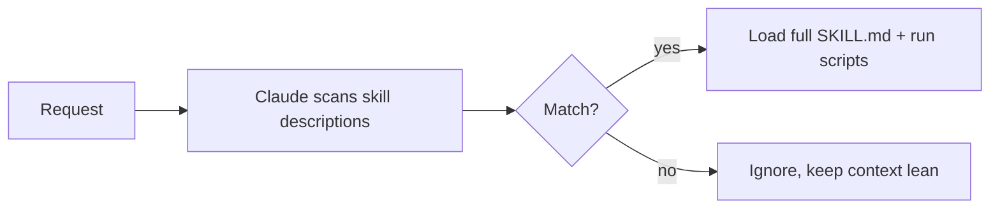

<LevelBadge level="advanced" />

<VerifyNote lastVerified="2026-06-23" source="https://code.claude.com/docs/en/skills">
La structure des fichiers de skill, la divulgation progressive et les endroits où les skills s'exécutent (Claude Code, Claude.ai, Cowork) évoluent — vérifiez dans la documentation officielle des Skills.
</VerifyNote>

Un **Skill** empaquette une expertise — des instructions plus des scripts et ressources optionnels — que Claude charge **uniquement quand c'est pertinent**. Au lieu de tout entasser dans [CLAUDE.md](/docs/claude-code/claude-md), vous donnez à Claude une bibliothèque de capacités qu'il convoque à la demande.

## Anatomie

Un skill est un dossier avec un `SKILL.md` : frontmatter YAML + instructions.

```markdown
---
name: pdf-forms
description: Use when the user needs to fill, read, or generate PDF forms.
---

# PDF Forms
Steps and rules for working with PDF forms…
(optionally reference scripts/ or resources/ in this folder)
```

La **`description` est le déclencheur** — Claude la lit pour décider *quand* activer le skill. Rédigez-la comme « Use when… », assez spécifique pour qu'elle se charge au bon moment et pas autrement.

## Divulgation progressive (pourquoi les skills passent à l'échelle)

Claude ne charge pas d'emblée le corps complet de chaque skill — il voit le `name` + la `description` légers, et ne convoque les instructions complètes (et n'exécute les scripts) que lorsqu'une requête correspond. Cela garde le contexte léger même avec de nombreux skills installés.



## Où ils vivent

- Personnel : `~/.claude/skills/<name>/SKILL.md`
- Projet (partageable) : `.claude/skills/<name>/SKILL.md`
- Regroupé dans un [plugin](/docs/claude-code/plugins-marketplaces) pour la distribution en équipe.

AILmanac livre [7 packs de skills prêts à l'emploi](/docs/templates/skills) — copiez-en un pour l'essayer.

## Exemple concret : un skill qui se déclenche lui-même

Créez `~/.claude/skills/release-notes/SKILL.md` :

```markdown
---
name: release-notes
description: Use when the user asks to write release notes or a changelog from git history.
---

# Release Notes
1. Run `git log <last-tag>..HEAD --oneline` to get the commits.
2. Group them into Features / Fixes / Breaking changes.
3. Write user-facing notes — what changed for *users*, not commit messages.
4. Output Markdown ready to paste into a GitHub release.
```

Plus tard, vous tapez : *« Rédige les notes de version depuis la v1.4. »* Claude n'avait jamais eu ces étapes en contexte — mais la requête correspond à la `description`, alors il convoque le `SKILL.md` complet, exécute le `git log` et produit des notes regroupées. Vous n'avez rien invoqué par son nom ; c'est la **description qui a fait le routage**. Ajoutez un fichier `scripts/` dans le même dossier et le skill pourra l'exécuter dans le cadre de l'étape 1.

## Skill vs commande vs sous-agent vs MCP

| Outil | Ce que c'est | Déclencheur : vous vs Claude |
|---|---|---|
| [Commande slash](/docs/claude-code/slash-commands) | Une invite enregistrée | **Vous** l'invoquez |
| **Skill** | Expertise à la demande + scripts | **Claude** le charge quand c'est pertinent |
| [Sous-agent](/docs/claude-code/subagents) | Un agent délégué avec son propre contexte | Claude délègue |
| [MCP](/docs/claude-code/mcp) | Une connexion à des outils/données externes | Fournit des outils à appeler |

Règle générale : **vous** voulez le déclencher à la demande → commande slash. **Claude** doit connaître la procédure et l'appliquer quand c'est pertinent → skill. Le travail doit se dérouler dans un contexte séparé → sous-agent. Vous devez atteindre un système externe → MCP.

## Erreurs courantes

- **Une description qui ne se déclenche pas.** « Aide avec les PDF » est trop vague ; « Use when the user needs to fill, read, or generate PDF forms » indique à Claude exactement quand le charger. La description est tout le mécanisme d'activation — rédigez-la pour la correspondance, pas pour les humains.
- **Tout mettre dans CLAUDE.md à la place.** [CLAUDE.md](/docs/claude-code/claude-md) se charge à *chaque* session et coûte toujours du contexte ; un skill ne se charge *que quand c'est pertinent*. Déplacez les procédures situationnelles dans des skills et réservez CLAUDE.md aux règles de projet toujours vraies.
- **Un seul skill gigantesque.** De nombreux petits skills aux descriptions précises font un meilleur routage qu'un fourre-tout unique — la divulgation progressive n'aide que si chaque description est spécifique.
- **Oublier qu'il est partageable.** Un skill de projet dans `.claude/skills/` commité dans git donne la capacité à toute l'équipe ; un skill personnel dans `~/.claude/skills/` reste le vôtre.

## Et après

- [Écrire votre premier skill (tutoriel)](/docs/walkthroughs/first-skill)
- [Modèles de SKILL.md](/docs/templates/skills)
- [Plugins & marketplaces](/docs/claude-code/plugins-marketplaces)
