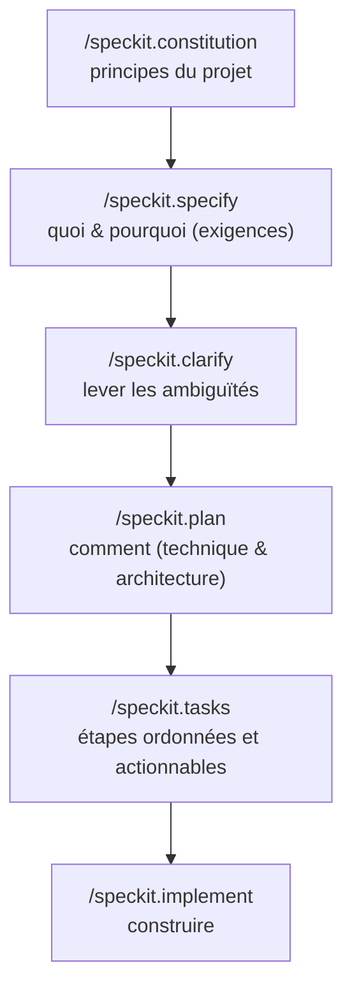

<LevelBadge level="intermediate" />

# Développement piloté par spécification avec Spec Kit

Le vibe coding — « construis-moi un tableau de bord », accepter ce qui revient — fonctionne très bien jusqu'à ce que la fonctionnalité devienne grosse. Là, l'agent dérive : il oublie une décision antérieure, réinvente une fonction, ou livre quelque chose qui techniquement tourne mais qui n'est pas ce que vous vouliez. Le **Développement piloté par spécification (SDD)** est la solution qui s'est imposée dans la communauté du codage agentique en 2026 : au lieu de traiter le prompt comme jetable, vous faites d'une **spécification écrite et révisable la source de vérité**, et vous demandez à l'agent de générer du code *à partir* d'elle.

Le **[Spec Kit](https://github.com/github/spec-kit)** open source de GitHub transforme cette idée en un workflow concret que vous pouvez exécuter dans Claude Code dès aujourd'hui.

<Callout type="objectives" items={["Comprendre ce qu'est le développement piloté par spécification et le problème qu'il résout", "Parcourir les phases du Spec Kit : constitution → specify → plan → tasks → implement", "Installer le CLI Specify et le brancher dans Claude Code", "Connaître les garde-fous qualité optionnels (clarify, analyze, checklist)", "Décider quand le SDD vaut la surcharge et quand l'éviter"]} />

<VerifyNote lastVerified="2026-06-28" source="https://github.com/github/spec-kit">
Spec Kit évolue vite (~116k★, sous licence MIT). Les noms de commandes, le flag de sélection d'agent de `specify init`, et les outils pris en charge changent d'une version à l'autre — confirmez le quickstart actuel dans le README du dépôt avant de vous fier à une syntaxe exacte. Les noms de slash commands ci-dessous utilisent l'espace de noms `/speckit.*` introduit dans les versions récentes.
</VerifyNote>

## Pourquoi des specs, pas seulement des prompts

Un prompt disparaît dès que le tour se termine. Une **spec est un artefact** : elle peut être lue, révisée dans une PR, corrigée, et ré-exécutée. Ce seul changement corrige les trois façons dont les gros chantiers agentiques tournent mal :

- **Dérive** — l'agent contredit une décision antérieure parce que rien ne l'avait écrite. La spec est la mémoire.
- **Ambiguïté** — « rends ça joli » veut dire dix choses différentes. Forcer les exigences dans de la prose fait ressortir les manques *avant* que le code existe, là où ils sont peu coûteux à corriger.
- **Diffs non révisables** — une PR générée de 2 000 lignes est difficile à juger. Une spec + un plan révisés rendent le diff *attendu* au lieu de surprenant.

Le modèle mental : **l'intention est la chose de grande valeur et durable ; le code est un artefact en aval, régénérable.** Le SDD est le cousin discipliné du [Mode Plan](/docs/claude-code/plan-mode) de Claude Code — planifier d'abord, construire ensuite — étendu à toute une fonctionnalité et persisté dans des fichiers de votre dépôt.

## Le workflow Spec Kit

Spec Kit structure une fonctionnalité comme un court pipeline de slash commands. Chacune écrit des artefacts Markdown dans votre dépôt (sous `.specify/`), de sorte que chaque phase est inspectable et versionnée.

<Steps items={[{title: "Constitution", body: "Exécutez /speckit.constitution une fois par projet. Cela écrit les principes directeurs — style de code, niveau d'exigence des tests, non-négociables architecturaux — dans .specify/memory/constitution.md. Chaque phase ultérieure est vérifiée par rapport à elle, c'est donc votre garde-fou durable (voyez-le comme un CLAUDE.md centré sur les principes)."}, {title: "Specify", body: "Exécutez /speckit.specify et décrivez QUOI vous construisez et POURQUOI — user stories, exigences, critères de réussite. Délibérément PAS la stack technique. L'agent produit une spec structurée que vous lisez et corrigez avant d'aller plus loin."}, {title: "Plan", body: "Exécutez /speckit.plan avec vos choix techniques — framework, stockage des données, contraintes. Maintenant le COMMENT s'écrit : architecture, composants, et comment ils satisfont la spec. Les décisions techniques vivent ici, pas dans la spec, pour que la spec reste agnostique de l'implémentation."}, {title: "Tasks", body: "Exécutez /speckit.tasks pour décomposer le plan en une liste numérotée et ordonnée de petites étapes révisables individuellement. C'est ce qui rend le chantier auditable — vous pouvez voir la séquence avant qu'une seule ligne de code soit écrite."}, {title: "Implement", body: "Exécutez /speckit.implement et l'agent exécute la liste de tâches, construisant la fonctionnalité conformément au plan et à la constitution. Parce que chaque phase précédente a été révisée, le diff résultant est attendu, pas une surprise."}]} />

### Garde-fous qualité optionnels

Trois commandes supplémentaires resserrent la boucle quand une fonctionnalité est à fort enjeu :

- **`/speckit.clarify`** — interroge la spec sur les zones sous-spécifiées et vous pose des questions ciblées *avant* la planification. À exécuter de préférence juste après `specify`.
- **`/speckit.analyze`** — recoupe la spec, le plan et les tâches pour vérifier leur cohérence et les lacunes de couverture.
- **`/speckit.checklist`** — génère une checklist de validation pour que « terminé » soit défini et testable.

<Callout type="tip" items={["Exécutez /speckit.clarify avant /speckit.plan — corriger l'ambiguïté coûte le moins cher avant que l'architecture soit figée.", "Traitez chaque artefact généré comme une PR : lisez-le, corrigez-le, et seulement ensuite passez à la phase suivante.", "Committez les artefacts .specify/ — ils constituent la trace révisable de l'intention derrière le code."]} />

## Le mettre en route avec Claude Code

Spec Kit fournit un CLI, **Specify**, qui échafaude les slash commands dans votre projet. Il prend en charge plus de 30 agents de codage, dont Claude Code.

<Steps items={[{title: "Installer le CLI Specify", body: "Utilisez uv pour l'installer depuis le dépôt. (Python + uv requis.)"}, {title: "Initialiser un projet", body: "Échafaudez la structure .specify/ et les commandes de l'agent. Exécutez init dans un dépôt nouveau ou existant ; à l'invite, choisissez Claude Code comme agent (ou passez le flag d'intégration actuel du README)."}, {title: "Ouvrir Claude Code et vérifier les commandes", body: "Lancez claude dans le dossier du projet. Vous saurez que c'est branché quand /speckit.constitution, /speckit.specify, /speckit.plan, /speckit.tasks et /speckit.implement apparaissent comme slash commands."}]} />

<PromptCard title="Install the Specify CLI (uv)">{`uv tool install specify-cli --from git+https://github.com/github/spec-kit.git`}</PromptCard>

<PromptCard title="Scaffold spec-driven workflow into a project">{`# new project
specify init my-feature

# or in the current repo
specify init --here`}</PromptCard>

<PromptCard title="Then, inside Claude Code, run the pipeline">{`/speckit.constitution Establish principles: TypeScript strict, tests for every public function, no secrets in code.
/speckit.specify Build a CSV export for the reports page: users pick a date range and download a CSV of matching rows.
/speckit.clarify
/speckit.plan Next.js App Router, server action for the query, stream the CSV; no new dependencies.
/speckit.tasks
/speckit.implement`}</PromptCard>

<Callout type="warning" items={["Le flag exact de sélection d'agent pour specify init change d'une version à l'autre — consultez le quickstart du README plutôt que de copier un flag à l'aveugle.", "Le SDD ne supprime pas le besoin de vérifier : lisez le code généré et exécutez-le. La spec rend le diff révisable, pas automatiquement correct.", "Ne mettez jamais de secrets ou d'identifiants dans la spec, le plan ou la constitution — ils sont committés comme n'importe quel autre fichier."]} />

## Quand l'utiliser (et quand non)

Le SDD échange de la cérémonie en amont contre du contrôle. Cet échange en vaut la peine quand le travail est gros, ambigu, ou doit être révisé par d'autres — et n'est que de la surcharge quand ce n'est pas le cas.

<Callout type="info" items={["Optez pour le SDD : fonctionnalités greenfield, chantiers multi-fichiers, tout ce qu'un collègue doit réviser, ou un travail que vous confierez à une flotte de subagents.", "Évitez le SDD : scripts ponctuels, petites corrections, code exploratoire jetable — un simple prompt ou le Mode Plan est plus rapide.", "Le brownfield marche aussi : pointez /speckit.specify vers une amélioration d'une base de code existante, pas seulement de nouveaux projets."]} />

<Flashcards title="SDD at a glance" cards={[{front: "Quelle est la source de vérité dans le SDD ?", back: "La spécification écrite. Le code est un artefact régénérable en aval d'elle."}, {front: "Que fait /speckit.constitution ?", back: "Il écrit des principes de projet durables (style, niveau d'exigence des tests, règles d'architecture) par rapport auxquels chaque phase ultérieure est vérifiée."}, {front: "Où appartiennent les décisions de stack technique ?", back: "Dans /speckit.plan — pas dans la spec. La spec reste agnostique de l'implémentation (quoi & pourquoi) ; le plan est le comment."}, {front: "Qu'est-ce qui rend un chantier Spec Kit auditable ?", back: "/speckit.tasks produit une liste de tâches ordonnée et révisable avant qu'une seule ligne de code soit écrite, et chaque phase écrit des artefacts Markdown inspectables."}, {front: "Quand ne PAS utiliser le SDD ?", back: "Scripts ponctuels, petites corrections, ou exploration jetable — la cérémonie coûte plus qu'elle ne fait gagner."}]} />

## Vérifiez vos connaissances

<Quiz title="Check yourself" questions={[{q: "Quelle est l'idée centrale du développement piloté par spécification ?", options: ["Écrire des prompts ponctuels plus détaillés", "Faire d'une spécification révisable la source de vérité et générer le code à partir d'elle", "Sauter la planification et laisser l'agent improviser"], answer: 1, explain: "Le SDD traite l'intention comme l'artefact durable et de grande valeur, et le code comme une sortie en aval régénérable — l'opposé du vibe coding à prompt jetable."}, {q: "Quelle phase du Spec Kit doit capturer la stack technique et l'architecture ?", options: ["/speckit.specify", "/speckit.plan", "/speckit.constitution"], answer: 1, explain: "specify décrit le QUOI et le POURQUOI (agnostique de l'implémentation) ; plan est l'endroit où le COMMENT — framework, stockage des données, architecture — est décidé."}, {q: "Quand le développement piloté par spécification ne vaut-il PAS la surcharge ?", options: ["Une fonctionnalité greenfield multi-fichiers qu'un collègue doit réviser", "Un script jetable d'une ligne ou une petite correction", "Tout travail que vous confierez à des subagents"], answer: 1, explain: "La cérémonie en amont du SDD est rentable sur un travail gros, ambigu ou révisé. Pour une correction triviale, un simple prompt ou le Mode Plan est plus rapide."}]} />

<Callout type="takeaways" items={["Le développement piloté par spécification fait d'une spec révisable — pas du prompt — la source de vérité, tuant la dérive, l'ambiguïté et les diffs non révisables.", "Le Spec Kit de GitHub (le CLI Specify) amène le SDD dans Claude Code sous forme de slash commands /speckit.*.", "Le pipeline est constitution → specify → (clarify) → plan → (analyze) → tasks → (checklist) → implement, chacun écrivant des artefacts inspectables.", "Gardez le QUOI/POURQUOI dans la spec et le COMMENT dans le plan ; révisez chaque artefact comme une PR avant d'avancer.", "Utilisez-le pour les fonctionnalités grosses, ambiguës ou révisées ; évitez-le pour le travail jetable — et vérifiez toujours le code généré."]} />

## Suite

- [Mode Plan](/docs/claude-code/plan-mode) — la boucle intégrée et plus légère « planifier avant de construire »
- [Slash Commands](/docs/claude-code/slash-commands) — comment les commandes /speckit.* s'intègrent au système de commandes de Claude Code
- [CLAUDE.md & fichiers de mémoire](/docs/claude-code/claude-md) — l'idée des principes-comme-mémoire derrière la constitution
- [Subagents](/docs/claude-code/subagents) — confiez une liste de tâches révisée à une flotte d'agents
- [Coding & développement logiciel](/docs/playbooks/coding) — l'état d'esprit tout-vérifier dont dépend le SDD

## Sources & lectures complémentaires

- [github/spec-kit — Toolkit for Spec-Driven Development](https://github.com/github/spec-kit) (MIT)
- [Spec Kit README & quickstart](https://github.com/github/spec-kit/blob/main/README.md)
- [Anthropic — Plan Mode in Claude Code](https://code.claude.com/docs/en/interactive-mode)
