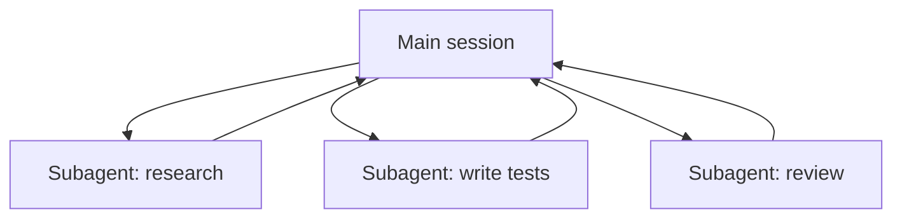

<LevelBadge level="advanced" />

<VerifyNote lastVerified="2026-06-20" source="https://docs.anthropic.com/en/docs/claude-code/sub-agents">
La configuration des sous-agents et l'interface `/agents` changent au fil du temps — vérifiez dans la documentation officielle.
</VerifyNote>

Un **sous-agent** est une instance Claude distincte avec sa **propre fenêtre de contexte** et un **ensemble d'outils cadré**, à laquelle votre session principale délègue une portion de travail. Il rapporte un résultat, et non toute sa transcription — pour que la session principale reste concentrée et dégagée.

## Pourquoi déléguer

- **Protéger le contexte principal.** Une plongée de recherche ou un balayage de gros fichiers peut consommer des milliers de tokens ; faites-le dans un sous-agent et seule la conclusion revient.
- **Spécialiser.** Donnez à un sous-agent un prompt système sur mesure et seulement les outils dont il a besoin (par exemple un relecteur en lecture seule).
- **Paralléliser.** Exécutez des sous-tâches indépendantes en même temps — par exemple explorer trois modules simultanément.

## Les définir

Les sous-agents se configurent sous forme de fichiers Markdown avec un frontmatter (nom, description, outils autorisés, parfois un modèle), gérés via l'interface `/agents`. La `description` indique à l'agent principal *quand* lui déléguer. Cadrez les outils étroitement — un relecteur a rarement besoin d'un accès en écriture.

## Quand NE PAS paralléliser

:::warning Le parallélisme n'est pas gratuit
- **Les étapes dépendantes** doivent être séquentielles — ne ventilez pas du travail où l'étape B a besoin de la sortie de l'étape A.
- **Les écritures de fichiers partagées** peuvent entrer en conflit ; isolez-les (voir [Git worktrees](/docs/claude-code/worktrees)) ou sérialisez-les.
- **Le surcoût de coordination** peut dépasser le bénéfice pour les petites tâches. Déléguez quand la sous-tâche est conséquente et indépendante.
:::

## Sous-agent vs les « agents » de l'API/SDK

Cette page traite de la délégation intégrée à Claude Code. Construire vos *propres* agents par programmation, c'est [Construire des agents sur l'API](/docs/api/building-agents). Le modèle mental — un objectif, une boucle d'outils, un contexte isolé — est le même.

## Et après

- [Concevoir un workflow multi-sous-agents (tutoriel)](/docs/walkthroughs/multi-subagent-workflow)
- [Gestion du contexte](/docs/claude-code/context-management)
- [Git worktrees](/docs/claude-code/worktrees)
