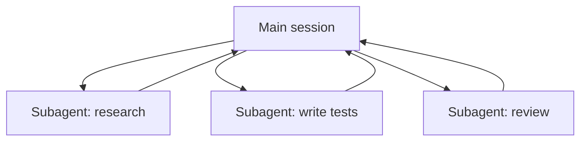

<LevelBadge level="advanced" />

<VerifyNote lastVerified="2026-06-23" source="https://code.claude.com/docs/en/sub-agents">
Les champs de frontmatter des sous-agents, la liste des agents intégrés et l'interface `/agents` changent au fil du temps — vérifiez dans la documentation officielle.
</VerifyNote>

<Callout type="objectives" items={["Ce qu'est un sous-agent — un Claude distinct avec sa propre fenêtre de contexte et un jeu d'outils cadré","Les trois raisons de déléguer : protéger le contexte, spécialiser et paralléliser","Les agents intégrés auxquels Claude délègue déjà : Explore, Plan, General-purpose","Comment définir votre propre sous-agent dans .claude/agents/ et pourquoi description + tools sont les deux champs porteurs","Quand NE PAS paralléliser, et comment cela se relie aux agents de l'API et aux workflows à l'échelle d'une flotte"]} />

Un **sous-agent** est une instance Claude distincte avec sa **propre fenêtre de contexte** et un **ensemble d'outils cadré**, à laquelle votre session principale délègue une portion de travail. Il rapporte un résultat, et non toute sa transcription — pour que la session principale reste concentrée et dégagée.

## Pourquoi déléguer

Trois missions, un seul outil. Gardez-les à l'esprit chaque fois que vous recourez à un sous-agent :

- **Protéger le contexte principal.** Une plongée de recherche ou un balayage de gros fichiers peut consommer des milliers de tokens ; faites-le dans un sous-agent et seule la conclusion revient.
- **Spécialiser.** Donnez à un sous-agent un prompt système sur mesure et seulement les outils dont il a besoin (par exemple un relecteur en lecture seule).
- **Paralléliser.** Exécutez des sous-tâches indépendantes en même temps — par exemple explorer trois modules simultanément.

## Les agents intégrés que vous avez déjà

Avant de définir les vôtres, sachez que Claude Code est livré avec des sous-agents auxquels il délègue automatiquement :

| Intégré | Ce qu'il fait |
| --- | --- |
| **Explore** | Un agent rapide en lecture seule (qui tourne sur un modèle moins coûteux) pour rechercher et comprendre une base de code sans la modifier. |
| **Plan** | Rassemble le contexte pendant le mode plan pour que la recherche reste en dehors de la conversation principale en lecture seule. |
| **General-purpose** | Un agent doté de tous les outils pour un travail complexe et multi-étapes qui mêle exploration et modifications. |

Vous les invoquez rarement par leur nom ; Claude y recourt quand une tâche s'y prête. Les sous-agents personnalisés servent aux ouvriers *que vous* recréez sans cesse avec les mêmes instructions.

## Les définir

Un sous-agent est un fichier Markdown avec un frontmatter YAML (le corps devient son prompt système). Seuls `name` et `description` sont requis ; tout le reste est optionnel. Stockez-le par projet dans `.claude/agents/` (versionnez-le dans git pour que l'équipe le partage) ou par utilisateur dans `~/.claude/agents/`. Créez-en un avec la commande `/agents` ou à la main.

<Steps items={[{title: "Choisissez un emplacement", body: "Par projet dans .claude/agents/ (versionnez-le pour que l'équipe le partage) ou par utilisateur dans ~/.claude/agents/."},{title: "Créez le fichier", body: "Utilisez la commande /agents, ou écrivez à la main un fichier Markdown avec un frontmatter YAML."},{title: "Renseignez les champs requis", body: "Seuls name et description sont requis. Tout le reste est optionnel."},{title: "Écrivez le corps comme prompt système", body: "Le corps Markdown sous le frontmatter devient le prompt système du sous-agent."},{title: "Cadrez les outils", body: "Ajoutez une liste d'autorisation d'outils pour que le sous-agent ne puisse faire que ce que sa mission exige."}]} />

Un sous-agent `code-reviewer` de départ :

<PromptCard title="sous-agent code-reviewer (.claude/agents/code-reviewer.md)">{`---
name: code-reviewer
description: Expert code reviewer. Use proactively after code changes.
tools: Read, Glob, Grep
model: sonnet
---

You are a senior reviewer. Read the changed files, then report only
high-confidence issues: correctness bugs, security risks, and missing
tests. For each, show the file:line, the problem, and a concrete fix.
Do not restate what the code does. Never edit files.`}</PromptCard>

Deux choses rendent un sous-agent efficace :

- **La `description` est le signal de routage.** Claude la lit pour décider *quand* déléguer, alors rédigez-la comme un déclencheur — « Use proactively after code changes » l'active automatiquement ; un vague « helps with code » n'y parviendra pas. C'est la ligne la plus déterminante du fichier.
- **Cadrez les outils étroitement.** Le champ `tools` est une liste d'autorisation (ou utilisez `disallowedTools` comme liste d'interdiction). Un relecteur qui ne peut que `Read, Glob, Grep` *ne peut pas* modifier votre code par accident — la restriction est une garantie, pas une suggestion. Omettez `tools` et le sous-agent hérite de tout ce dont dispose la session principale.

## Exemple concret : une ventilation de relectures en parallèle

Vous venez de terminer une fonctionnalité touchant trois modules et vous voulez une vérification rapide et indépendante de chacun. Dans votre session principale :

<PromptCard title="Ventiler trois relecteurs d'un coup">{`Review the changes in auth/, billing/, and api/ — use the code-reviewer subagent on each, in parallel.`}</PromptCard>

Claude lance trois instances de `code-reviewer` d'un coup. Chacune ne lit que son module, consomme son propre contexte sur le contenu des fichiers et renvoie une courte liste de constats. Votre session principale ne voit jamais les diffs bruts — seulement trois rapports soignés — et l'ensemble se termine en gros dans le temps de la relecture la plus lente plutôt que dans la somme des trois. Comme le relecteur est en lecture seule, trois agents travaillant en même temps ne peuvent pas entrer en collision sur une écriture.

## Quand NE PAS paralléliser

<Callout type="warning" items={["Les étapes dépendantes doivent être séquentielles — ne ventilez pas du travail où l'étape B a besoin de la sortie de l'étape A.","Les écritures de fichiers partagées peuvent entrer en conflit ; isolez-les (voir Git worktrees) ou sérialisez-les.","Le surcoût de coordination peut dépasser le bénéfice pour les petites tâches. Déléguez quand la sous-tâche est conséquente et indépendante."]} />

Pour isoler les écritures conflictuelles, voir [Git worktrees](/docs/claude-code/worktrees).

## Sous-agent vs les « agents » de l'API/SDK

Cette page traite de la délégation intégrée à Claude Code. Construire vos *propres* agents par programmation, c'est [Construire des agents sur l'API](/docs/api/building-agents). Le modèle mental — un objectif, une boucle d'outils, un contexte isolé — est le même.

## Erreurs courantes

<Flashcards title="Pièges — retournez chaque carte pour la correction" cards={[{front: "Une description vague", back: "Si elle ne dit pas QUAND utiliser le sous-agent, Claude ne déléguera pas au bon moment (ou pas du tout). Commencez par « Use when… » / « Use proactively after… »."},{front: "Laisser les outils grands ouverts", back: "Un sous-agent censé relire ne devrait pas pouvoir écrire. Une liste d'autorisation transforme l'intention en garantie."},{front: "S'attendre à une mémoire partagée", back: "Un sous-agent reçoit sa description, son prompt système et la tâche que vous lui confiez — pas votre conversation principale. Transmettez-lui le contexte nécessaire dans la délégation."},{front: "Ventiler du travail dépendant", back: "Le parallélisme n'aide que pour les sous-tâches indépendantes ; si B a besoin de la sortie de A, exécutez-les en séquence."}]} />

## Quand quelques agents ne suffisent pas

Déléguer une poignée de sous-agents par tour, c'est le pain quotidien de cette page. Quand une tâche exige des **dizaines ou des centaines** d'agents — un balayage à l'échelle de la base de code, une migration de 500 fichiers, une recherche recoupée sur de nombreuses sources — l'orchestration dépasse une seule fenêtre de contexte. C'est à cela que servent les [Workflows dynamiques & ultracode](/docs/claude-code/dynamic-workflows) : Claude écrit un script qui porte le plan, et un runtime ventile les agents en arrière-plan.

<Quiz title="Vérifiez vos connaissances" questions={[{q: "Quel champ du frontmatter d'un sous-agent est le signal de routage que Claude lit pour décider QUAND déléguer ?", options: ["name", "description", "model"], answer: 1, explain: "La description est la ligne la plus déterminante — Claude la lit pour décider quand déléguer. Rédigez-la comme un déclencheur, par ex. « Use proactively after code changes »."}, {q: "Un sous-agent relecteur reçoit tools: Read, Glob, Grep. Que garantit cette liste d'autorisation ?", options: ["Il tourne sur un modèle moins coûteux", "Il ne peut pas modifier votre code par accident", "Il hérite des outils de la session principale"], answer: 1, explain: "Le champ tools est une liste d'autorisation, donc un relecteur limité à Read, Glob, Grep ne peut pas écrire — la restriction est une garantie, pas une suggestion. Omettre tools ferait au contraire hériter de tout."}, {q: "Quand la parallélisation de sous-agents N'aide-t-elle PAS ?", options: ["Quand les sous-tâches sont indépendantes et conséquentes", "Quand l'étape B a besoin de la sortie de l'étape A", "Quand chaque agent lit un module différent"], answer: 1, explain: "Les étapes dépendantes doivent s'exécuter séquentiellement. Le parallélisme n'aide que pour les sous-tâches indépendantes ; si B a besoin de la sortie de A, exécutez-les en séquence."}]} />

<Callout type="takeaways" items={["Un sous-agent est un Claude distinct avec sa propre fenêtre de contexte et des outils cadrés ; il renvoie un résultat, pas sa transcription.","Déléguez pour protéger le contexte principal, pour spécialiser, ou pour paralléliser du travail indépendant.","Claude est déjà livré avec les intégrés Explore, Plan et General-purpose et y recourt automatiquement.","name et description sont les seuls champs de frontmatter requis — et description est le signal de routage qui décide quand Claude délègue.","Une liste d'autorisation d'outils transforme l'intention en garantie ; ne ventilez que des sous-tâches indépendantes, et isolez les écritures partagées."]} />

## Et après

- [Workflows dynamiques & ultracode](/docs/claude-code/dynamic-workflows) — orchestrer les sous-agents à l'échelle d'une flotte
- [Concevoir un workflow multi-sous-agents (tutoriel)](/docs/walkthroughs/multi-subagent-workflow)
- [Gestion du contexte](/docs/claude-code/context-management)
- [Git worktrees](/docs/claude-code/worktrees)
