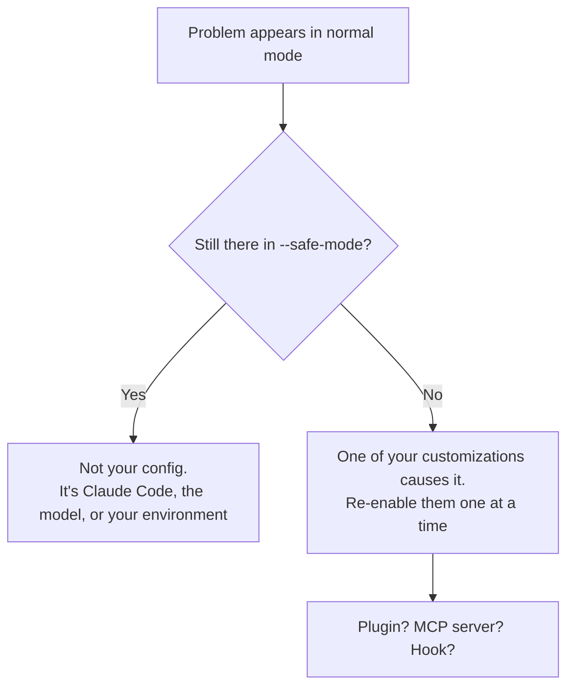

<LevelBadge level="intermediate" />

<Callout type="objectives" items={["Router n'importe quel problème de Claude Code vers son correctif en une étape, à l'aide d'une table des symptômes", "Lancer les deux commandes de diagnostic qui résolvent la plupart des soucis de configuration avant de déboguer quoi que ce soit à la main", "Isoler si un plugin, un serveur MCP ou un hook est la vraie cause", "Corriger les quatre défaillances classiques d'exécution : mémoire élevée, blocages, thrashing de compaction et recherche qui ne trouve rien", "Rassembler les bonnes preuves avant de déposer un rapport de bug"]} />

<VerifyNote lastVerified="2026-07-17" source="https://code.claude.com/docs/en/troubleshooting">
Les commandes, drapeaux et variables d'environnement de cette page sont vérifiés par rapport à la documentation officielle de dépannage de Claude Code. Les diagnostics changent d'une version à l'autre — confirmez là-bas avant de vous fier à un drapeau exact.
</VerifyNote>

## L'idée principale

Presque tout problème de Claude Code est de l'une des deux sortes, et elles ont des correctifs complètement différents :

- **Votre configuration est mauvaise** — un plugin, un serveur MCP, un hook, un fichier de settings, un binaire manquant. Le correctif est la *configuration*.
- **La session est sous tension** — la fenêtre de contexte est pleine, un fichier énorme a fait exploser la mémoire, le terminal n'arrive pas à afficher. Le correctif est l'*hygiène*.

Deviner laquelle vous avez est là où les gens perdent une après-midi. La table ci-dessous saute l'étape des devinettes.

:::tip Un genre de « bizarre » différent ?
Cette page concerne l'**outil** qui se comporte mal — il ne démarre pas, il se bloque, la recherche ne trouve rien. Si le **modèle** se comporte mal — il a inventé un fait, oublié une instruction, refusé quelque chose de raisonnable — c'est une autre page : [Pourquoi Claude a-t-il fait ça ?](/docs/contribute/troubleshooting)
:::

## Commencez ici : symptôme → où aller

Trouvez votre symptôme. Ne lisez pas le reste de la page.

| Symptôme | Aller à |
|---|---|
| `command not found`, échec d'installation, `EACCES`, erreurs de PATH ou TLS | [Officiel : installation & connexion](https://code.claude.com/docs/en/troubleshoot-install) |
| Boucles de connexion, erreurs OAuth, `403 Forbidden`, « organization disabled » | [Officiel : connexion & authentification](https://code.claude.com/docs/en/troubleshoot-install#login-and-authentication) |
| Settings non appliqués, hooks qui ne se déclenchent pas, serveurs MCP qui ne se chargent pas | [Isoler votre configuration](#isolate-your-config) ci-dessous |
| `API Error: 5xx`, `529 Overloaded`, `429`, erreurs de validation | [Erreurs & limites de débit](/docs/api/errors-and-rate-limits) |
| `model not found` / « you may not have access to it » | [Modèles & tarifs actuels](/docs/whats-new/models-and-pricing) |
| VS Code ou JetBrains ne détecte pas Claude | [Intégrations IDE](/docs/claude-code/ide-integrations) |
| CPU ou mémoire élevés | [Mémoire et CPU](#memory-and-cpu) ci-dessous |
| Blocages, gels, absence de réponse | [Blocages et gels](#hangs-and-freezes) ci-dessous |
| `Autocompact is thrashing` | [Thrashing de compaction](#compaction-thrashing) ci-dessous |
| Recherche, `@file`, agents ou skills ne trouvent pas les fichiers | [La recherche ne trouve rien](#search-finds-nothing) ci-dessous |
| Cases, bavures ou glyphes erronés dans un terminal d'IDE | [Texte de terminal illisible](#garbled-terminal-text) ci-dessous |

## Les deux commandes à lancer en premier

Avant de déboguer quoi que ce soit à la main, lancez le bilan intégré. Il diagnostique votre installation, vos settings, vos extensions et votre usage du contexte — et propose des correctifs qu'il peut appliquer après confirmation.

<Steps items={[{title: "Lancez le bilan depuis une session", body: "/doctor (son alias est /checkup) inspecte votre installation, vos settings, vos extensions et votre usage du contexte, puis propose d'appliquer les correctifs qu'il peut. À lui seul, il résout la plupart des plaintes de configuration."}, {title: "Si Claude Code ne démarre même pas, lancez-le depuis votre shell", body: "claude doctor fait le même bilan depuis l'extérieur d'une session, pour qu'une configuration cassée ne puisse pas bloquer l'outil censé la diagnostiquer."}, {title: "Si le problème sent l'outil ou le connecteur, vérifiez MCP séparément", body: "/mcp affiche le statut en direct de chaque serveur MCP configuré — le moyen le plus rapide de voir si un serveur a échoué au chargement plutôt que de mal se comporter."}]} />

<PromptCard title="Diagnostiquer une configuration cassée">{`# inside a session
/doctor

# if the session won't start at all
claude doctor

# check MCP server status
/mcp`}</PromptCard>

## Isoler votre configuration

Si les settings ne s'appliquent pas, si les hooks ne se déclenchent pas, ou si quelque chose est juste *bizarre*, la question n'est jamais « qu'est-ce qui est cassé » — c'est **laquelle de vos personnalisations est cassée**. Répondez-y en les retirant toutes d'un coup.

`--safe-mode` démarre Claude Code avec toutes les personnalisations désactivées : pas de plugins, pas de serveurs MCP, pas de hooks.

<PromptCard title="Tester contre une configuration propre">{`claude --safe-mode`}</PromptCard>

Cela vous donne un résultat binaire net :



Une fois que vous savez que c'est une personnalisation, faites une bisection : réactivez-les par groupes jusqu'à ce que le problème revienne. Les suspects, dans l'ordre approximatif de fréquence, sont les [serveurs MCP](/docs/claude-code/mcp), les [hooks](/docs/claude-code/hooks), les [plugins](/docs/claude-code/plugins-marketplaces) et les [settings](/docs/claude-code/settings).

<Callout type="tip" items={["--safe-mode est aussi le bon premier réflexe pour une lenteur mystérieuse, pas seulement pour une panne franche. Un serveur MCP bavard est une cause très courante des deux."]} />

## Mémoire et CPU

Claude Code fonctionne avec la plupart des environnements mais peut consommer de vraies ressources sur de gros codebases. Parcourez ceci dans l'ordre — c'est trié du moins coûteux au plus coûteux.

<Steps items={[{title: "Compactez régulièrement", body: "Lancez /compact pour réduire le contexte. Une fenêtre de contexte gonflée est la cause unique la plus courante d'une session lourde. Voir /docs/claude-code/context-management."}, {title: "Redémarrez entre les grandes tâches", body: "Fermez et redémarrez Claude Code quand vous passez à un travail sans rapport, au lieu de laisser un seul processus accumuler une après-midi d'état."}, {title: "Cachez les gros répertoires de build", body: "Ajoutez la sortie de build, les caches et les dépendances vendorisées à .gitignore pour qu'ils n'entrent jamais dans une recherche ou une lecture en premier lieu."}, {title: "Écartez vos personnalisations", body: "Redémarrez avec claude --safe-mode. Si l'usage chute, un plugin, un serveur MCP ou un hook en est la source — faites une bisection à partir de là."}, {title: "Si la mémoire est encore élevée, capturez des preuves", body: "Lancez /heapdump pour écrire un instantané du tas JavaScript plus une ventilation de la mémoire dans ~/Desktop (ou le répertoire personnel sous Linux sans dossier Desktop)."}]} />

La ventilation de `/heapdump` reporte la taille résidente (resident set size), le tas JS, les array buffers et la mémoire native non comptabilisée. Cette répartition est la partie utile : elle vous dit si la croissance est dans les objets JavaScript ou en bas dans le code natif. Pour inspecter ce qui maintient la mémoire en vie, ouvrez le fichier `.heapsnapshot` dans Chrome DevTools sous **Memory → Load**.

<VerifyNote lastVerified="2026-07-17" source="https://code.claude.com/docs/en/troubleshooting">
`/heapdump` écrit dans `~/Desktop`, avec repli sur le répertoire personnel sur les systèmes Linux sans dossier Desktop. Attachez les deux fichiers en signalant un problème de mémoire.
</VerifyNote>

## Blocages et gels

Si Claude Code cesse de répondre :

<Steps items={[{title: "Annulez l'opération en cours", body: "Appuyez sur Ctrl+C. Cela avorte ce qui tourne sans tuer la session."}, {title: "S'il reste sans réponse, tuez le terminal", body: "Fermez le terminal et redémarrez. Ça semble destructeur, mais ça ne l'est pas."}, {title: "Reprenez là où vous étiez", body: "Lancez claude --resume dans le MÊME répertoire. Redémarrer ne perd pas votre conversation — la transcription survit au processus."}]} />

<Callout type="tip" items={["La peur de perdre une longue conversation est pourquoi les gens attendent la fin d'un blocage au lieu de le tuer. Ne le faites pas — claude --resume dans le même répertoire ramène la session."]} />

## Thrashing de compaction

Cette erreur a l'air alarmante et est en réalité une *protection* :

```
Autocompact is thrashing: the context refilled to the limit...
```

Elle signifie que la compaction automatique a **réussi** — et qu'ensuite un fichier ou une sortie d'outil a immédiatement re-rempli toute la fenêtre de contexte, plusieurs fois d'affilée. Claude Code arrête de réessayer plutôt que de brûler des appels API dans une boucle qui ne progresse pas.

La cause est presque toujours une seule chose surdimensionnée lue en entier. Choisissez le correctif qui correspond à votre situation :

| Situation | Correctif |
|---|---|
| Un seul fichier énorme est le problème | Demandez à Claude de lire une plage de lignes ou une seule fonction au lieu de tout le fichier |
| Le contexte a une grosse sortie dont vous n'avez plus besoin | `/compact` avec un focus qui l'écarte |
| La grosse lecture est vraiment nécessaire | Déplacez-la dans un [subagent](/docs/claude-code/subagents) pour qu'elle brûle une fenêtre de contexte séparée |
| La conversation antérieure n'a plus d'importance | `/clear` |

<PromptCard title="Compacter avec un focus qui écarte le superflu">{`/compact keep only the plan and the diff`}</PromptCard>

L'option subagent est celle qu'on oublie, et c'est souvent la meilleure : un subagent lit le fichier géant dans *son* contexte et ne renvoie que la conclusion au vôtre. Voir [Gestion du contexte](/docs/claude-code/context-management) et [Subagents](/docs/claude-code/subagents).

## La recherche ne trouve rien

Si l'outil de recherche, les mentions `@file`, les agents personnalisés ou les skills personnalisées ne trouvent pas des fichiers dont vous savez qu'ils existent, le binaire `ripgrep` embarqué n'arrive probablement pas à s'exécuter sur votre système. Le correctif est d'installer le `ripgrep` propre à votre plateforme et de dire à Claude Code de l'utiliser.

<Steps items={[{title: "Installez ripgrep pour votre plateforme", body: "macOS : brew install ripgrep — Ubuntu/Debian : sudo apt install ripgrep — Alpine : apk add ripgrep — Arch : pacman -S ripgrep — Windows : winget install BurntSushi.ripgrep.MSVC"}, {title: "Dites à Claude Code d'arrêter d'utiliser le binaire embarqué", body: "Définissez USE_BUILTIN_RIPGREP=0 dans votre environnement. Sans cette étape, installer ripgrep ne change rien."}, {title: "Vérifiez", body: "Relancez la recherche ou la mention @file qui échouait. Lancez /doctor si ça revient toujours vide."}]} />

<PromptCard title="Réparer la recherche sur macOS">{`brew install ripgrep
export USE_BUILTIN_RIPGREP=0`}</PromptCard>

### L'exception WSL

Sur WSL, des résultats de recherche incomplets ne sont généralement **pas** un binaire cassé. Lire à travers la frontière du système de fichiers Windows/Linux entraîne une pénalité de performance disque, donc la recherche renvoie moins de correspondances que prévu. La recherche fonctionne toujours — elle sous-livre simplement.

<Callout type="warning" items={["Sur WSL, claude doctor reporte Search comme OK même quand les résultats sont incomplets. Un bilan vert n'écarte pas ce cas — c'est exactement ce qui le rend difficile à diagnostiquer."]} />

Trois issues, la meilleure en premier : déplacez le projet sur le système de fichiers Linux (`/home/`) plutôt que `/mnt/c/` ; lancez Claude Code nativement sur Windows au lieu de passer par WSL ; ou restreignez vos recherches pour que moins de fichiers soient scannés — « Cherche la logique de validation JWT dans le paquet auth-service » bat « trouve le code d'auth ».

## Texte de terminal illisible

Des caractères qui s'affichent en cases, bavures ou glyphes erronés dans le terminal intégré de VS Code, Cursor ou Devin Desktop est un problème de **rendu GPU**, pas un problème de police ou d'encodage.

<PromptCard title="Réparer les glyphes illisibles dans un terminal d'IDE">{`/terminal-setup`}</PromptCard>

Cela met `terminal.integrated.gpuAcceleration` à `"off"`. Vous pouvez le définir à la main dans les settings de votre éditeur et recharger la fenêtre à la place — même résultat.

## Les grandes tables sont coupées

Une table Markdown de plus de 200 lignes affiche ses 200 premières suivies d'une ligne `… N more rows not shown`. C'est **uniquement une limite d'affichage** — la table complète est toujours dans la conversation, et `/copy` copie toutes les lignes. Pour une table trop grande à lire dans un terminal, demandez à Claude de l'écrire dans un fichier.

<VerifyNote lastVerified="2026-07-17" source="https://code.claude.com/docs/en/troubleshooting">
La limite d'affichage de 200 lignes est arrivée dans Claude Code v2.1.208. Avant, chaque ligne était rendue, donc reprendre une session contenant une très grande table pouvait caler pendant qu'elle se re-rendait.
</VerifyNote>

## Déposer un bon rapport de bug

Si rien ici ne colle, signalez-le — mais apportez des preuves. Un rapport qui dit « c'est lent » n'aboutit nulle part ; un avec un instantané de tas et un résultat `--safe-mode` se fait corriger.

<Steps items={[{title: "Lancez /doctor et /mcp", body: "Capturez ce que dit le bilan et quels serveurs MCP sont réellement chargés. La moitié des bugs signalés trouvent leur réponse ici."}, {title: "Notez si --safe-mode change quelque chose", body: "Ce seul fait dit à un mainteneur s'il faut regarder Claude Code ou vos personnalisations. C'est la ligne la plus précieuse de votre rapport."}, {title: "Attachez des artefacts pour les soucis de ressources", body: "Pour les problèmes de mémoire, attachez les deux fichiers écrits par /heapdump — l'instantané et la ventilation."}, {title: "Envoyez-le", body: "Utilisez /feedback dans Claude Code pour signaler directement à Anthropic, ou vérifiez github.com/anthropics/claude-code pour un problème connu d'abord."}]} />

<Callout type="takeaways" items={["Lancez /doctor (alias /checkup) d'abord — depuis votre shell en claude doctor si la session ne démarre pas. Il diagnostique installation, settings, extensions et usage du contexte, et peut appliquer des correctifs.", "claude --safe-mode désactive toutes les personnalisations d'un coup. Que le problème y survive ou non est le fait unique le plus informatif que vous puissiez rassembler.", "Mémoire élevée : /compact, redémarrer entre les tâches, .gitignore les répertoires de build, puis --safe-mode, puis /heapdump pour les preuves.", "Un blocage n'est pas une conversation perdue — Ctrl+C, puis redémarrer le terminal, puis claude --resume dans le même répertoire.", "Le thrashing d'autocompact signifie qu'une seule lecture surdimensionnée re-remplit la fenêtre. Lisez par morceaux, /compact avec un focus, ou déléguez la lecture à un subagent.", "La recherche qui ne trouve rien signifie généralement que le ripgrep embarqué ne peut pas s'exécuter : installez le ripgrep de votre plateforme ET définissez USE_BUILTIN_RIPGREP=0. Sur WSL c'est plutôt une pénalité de frontière de système de fichiers — et claude doctor reporte quand même Search comme OK."]} />

<Quiz title="Testez-vous" questions={[{q: "Les hooks ne se déclenchent pas et les settings semblent ignorés. Quelle est la chose unique la plus informative à essayer ?", options: ["Réinstaller Claude Code", "Lancer claude --safe-mode et voir si le problème survit", "Supprimer votre CLAUDE.md"], answer: 1, explain: "--safe-mode désactive toutes les personnalisations d'un coup. Si le problème disparaît, l'un de vos plugins, serveurs MCP ou hooks en est la cause et vous pouvez faire une bisection. S'il survit, votre configuration n'est pas la cause — ce qui est tout aussi utile à savoir."}, {q: "Claude Code se bloque en pleine tâche et Ctrl+C n'aide pas. Vous fermez le terminal. Qu'arrive-t-il à votre conversation ?", options: ["Elle est perdue — c'est pourquoi vous devriez attendre la fin des blocages plutôt", "Elle survit — lancez claude --resume dans le même répertoire", "Elle n'est sauvegardée que si vous avez lancé /compact avant"], answer: 1, explain: "Redémarrer ne perd pas votre conversation. Lancez claude --resume dans le MÊME répertoire pour reprendre la session. La peur de perdre la transcription est exactement pourquoi les gens attendent inutilement la fin des blocages."}, {q: "Vous voyez « Autocompact is thrashing: the context refilled to the limit... ». Que s'est-il réellement passé ?", options: ["La compaction a échoué et le contexte est corrompu", "La compaction a réussi, mais un fichier ou une sortie d'outil a immédiatement re-rempli la fenêtre plusieurs fois d'affilée", "Votre forfait est à court de tokens"], answer: 1, explain: "La compaction a réussi — puis quelque chose de surdimensionné a re-rempli le contexte à répétition. Claude Code arrête de réessayer pour éviter de brûler des appels API dans une boucle qui ne progresse pas. Corrigez la lecture surdimensionnée : découpez-la, /compact avec un focus, ou déplacez-la dans un subagent."}, {q: "Vous avez installé ripgrep avec brew parce que les mentions @file ne trouvaient rien, mais la recherche est toujours cassée. Qu'avez-vous manqué ?", options: ["Vous devez redémarrer votre machine", "Vous devez aussi définir USE_BUILTIN_RIPGREP=0 pour que Claude Code utilise votre binaire au lieu de l'embarqué", "brew installe la mauvaise version — utilisez apt"], answer: 1, explain: "Installer ripgrep seul ne change rien. Vous devez définir USE_BUILTIN_RIPGREP=0 dans votre environnement pour dire à Claude Code d'utiliser votre binaire de plateforme au lieu de l'embarqué qui ne pouvait pas s'exécuter."}, {q: "Sur WSL, la recherche renvoie moins de correspondances que prévu mais claude doctor reporte Search comme OK. Que se passe-t-il ?", options: ["doctor ment — le binaire ripgrep est cassé", "Lire à travers la frontière du système de fichiers Windows/Linux entraîne une pénalité disque, donc la recherche sous-livre tout en fonctionnant", "Votre projet est trop grand pour être indexé"], answer: 1, explain: "Sur WSL, les pénalités de lecture inter-systèmes de fichiers font que la recherche renvoie moins de résultats que sur un système de fichiers natif. Elle fonctionne toujours, donc doctor reporte Search comme OK — ce qui la rend difficile à repérer. Déplacez le projet vers /home/, lancez nativement sur Windows, ou soumettez des recherches plus étroites."}]} />

## Suite

- [Pourquoi Claude a-t-il fait ça ?](/docs/contribute/troubleshooting) — dépanner le comportement du *modèle* plutôt que l'outil
- [Gestion du contexte](/docs/claude-code/context-management) — `/compact` contre `/clear`, et garder les sessions légères
- [Erreurs & limites de débit](/docs/api/errors-and-rate-limits) — `429`, `529`, et la stratégie de réessai sur l'API
- [Coût en tokens de MCP](/docs/claude-code/mcp-token-cost) — quand un serveur connecté est discrètement le problème
