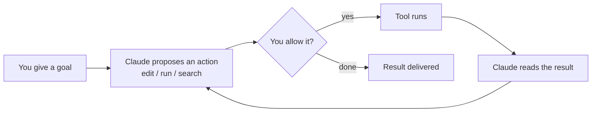

<LevelBadge level="beginner" />

<VerifyNote lastVerified="2026-06-27" source="https://code.claude.com/docs/en/overview">
Les commandes d'installation et l'ensemble exact des fonctionnalités changent souvent. Considérez la documentation officielle de Claude Code comme la source de vérité pour l'installation.
</VerifyNote>

<Callout type="objectives" items={["Expliquer ce qui rend Claude Code agentique, et pas seulement une fenêtre de chat", "Se représenter la boucle agentique : objectif, action, permission, observer, recommencer", "Nommer les surfaces où Claude Code s'exécute et comment les réglages vous suivent", "Ordonner ce que vous configurez par impact, en commençant par CLAUDE.md", "Parcourir la forme d'une première session sûre à l'aide du Mode Plan"]} />

**Claude Code** est l'outil de codage *agentique* d'Anthropic. Contrairement à une fenêtre de chat, il peut réellement **agir dans votre projet** : lire et modifier des fichiers, exécuter des commandes shell, parcourir la base de code et appeler des outils externes — le tout avec votre permission.

## Le modèle mental : une boucle agentique

C'est l'unique idée qui fait que tout le reste prend son sens. Vous donnez un objectif en langage clair (« ajoute des tests pour le module d'authentification et corrige ce qui échoue »). Claude **planifie, agit, observe le résultat et recommence** jusqu'à ce que l'objectif soit atteint. Vous gardez le contrôle via les [permissions](/docs/claude-code) et le [Mode Plan](/docs/claude-code).

<Callout type="tip" items={["La boucle n'avance que sur les actions que vous autorisez. Rien ne modifie ni n'exécute quoi que ce soit sans passer par ce point de contrôle des permissions — et c'est justement pourquoi les sections suivantes comptent."]} />

## Où l'exécuter

Le même Claude Code vous suit d'une surface à l'autre — il **partage vos réglages, hooks et permissions** partout où vous travaillez.

- **Terminal (CLI)** — la surface d'origine ; fonctionne dans n'importe quel shell.
- **Extensions IDE** — VS Code et JetBrains, avec des diffs en ligne.
- **Bureau et web** — et il partage vos réglages, hooks et permissions entre les surfaces.

## Ce que vous allez configurer (par ordre approximatif d'impact)

Voyez cela comme une échelle : maîtrisez d'abord les barreaux du haut, puis ajoutez les fonctionnalités avancées seulement quand un besoin réel apparaît.

<Steps items={[{title: "CLAUDE.md", body: "Instructions de projet persistantes. Impact le plus fort, effort le plus faible — commencez ici."}, {title: "Mode Plan", body: "Enquêter et proposer avant qu'aucune modification ne s'exécute."}, {title: "Permissions", body: "Décider ce que Claude peut faire sans demander."}, {title: "settings.json", body: "Le système de configuration complet sous tout le reste."}, {title: "Fonctionnalités avancées", body: "Commandes slash, hooks, skills, sous-agents et serveurs MCP — ajoutés au fur et à mesure de vos besoins."}]} />

Chaque barreau renvoie à sa propre leçon : [CLAUDE.md](/docs/claude-code), [Mode Plan](/docs/claude-code), [Permissions](/docs/claude-code), [settings.json](/docs/claude-code), [Commandes slash](/docs/claude-code), [hooks](/docs/claude-code), [skills](/docs/claude-code), [sous-agents](/docs/claude-code) et [serveurs MCP](/docs/claude-code).

## Votre première session (à quoi elle ressemble)

<Steps items={[{title: "Installez et authentifiez-vous", body: "Consultez la documentation officielle pour les commandes actuelles."}, {title: "Ouvrez un projet", body: "Faites cd dans un projet et lancez Claude Code."}, {title: "Générez un CLAUDE.md de départ", body: "Exécutez /init pour générer vos instructions de projet."}, {title: "Demandez quelque chose de petit et concret", body: "Essayez : Explique comment fonctionne le routage dans cette application."}, {title: "Faites d'abord une modification en Mode Plan", body: "Examinez le plan proposé, puis laissez-le s'exécuter."}]} />

Deux commandes à mémoriser dès cette première session :

<PromptCard title="Générer les instructions de projet">{`/init`}</PromptCard>

<PromptCard title="Une première demande sûre, en lecture seule">{`Explain how routing works in this app.`}</PromptCard>

Pour les commandes d'installation et d'authentification actuelles, consultez la [documentation officielle](https://code.claude.com/docs/en/overview).

<Callout type="tip" items={["Commencez en lecture seule. Pour votre première vraie tâche, utilisez le Mode Plan — Claude enquête et vous montre un plan sans toucher aux fichiers. C'est la façon la plus sûre d'instaurer la confiance."]} />

## Les termes clés en un coup d'œil

<Flashcards title="Vocabulaire de Claude Code" cards={[{front: "Outil agentique", back: "Un outil qui prend des actions dans votre projet — lit/modifie des fichiers, exécute des commandes, parcourt le code, appelle des outils externes — et pas seulement une fenêtre de chat."}, {front: "Boucle agentique", back: "Objectif en langage clair, puis Claude planifie, agit, observe le résultat et recommence jusqu'à ce que l'objectif soit atteint."}, {front: "Mode Plan", back: "Claude enquête et propose un plan avant qu'aucune modification ne s'exécute — la façon la plus sûre de commencer."}, {front: "CLAUDE.md", back: "Instructions de projet persistantes. Impact le plus fort, effort le plus faible ; généré avec /init."}, {front: "Permissions", back: "Le point de contrôle : ce que Claude peut faire sans vous demander d'abord."}]} />

<Quiz title="Vérifiez vos connaissances" questions={[{q: "Qu'est-ce qui distingue Claude Code d'une fenêtre de chat ?", options: ["Il écrit des réponses plus longues", "Il peut prendre des actions dans votre projet — modifier des fichiers, exécuter des commandes, parcourir le code — avec votre permission", "Il ne fonctionne que dans le terminal"], answer: 1, explain: "Claude Code est agentique : il agit dans votre projet (lit/modifie des fichiers, exécute des commandes shell, parcourt, appelle des outils), le tout avec votre permission."}, {q: "Dans la boucle agentique, que se passe-t-il juste après que Claude propose une action ?", options: ["L'outil s'exécute automatiquement", "Vous décidez de l'autoriser ou non", "Le résultat est livré"], answer: 1, explain: "Chaque action proposée passe par un point de contrôle des permissions — l'outil ne s'exécute que si vous l'autorisez."}, {q: "Quelle étape de configuration a l'impact le plus fort pour l'effort le plus faible ?", options: ["Serveurs MCP", "Hooks", "CLAUDE.md"], answer: 2, explain: "CLAUDE.md — les instructions de projet persistantes — est listé en premier car il a l'impact le plus fort pour l'effort le plus faible."}]} />

<Callout type="takeaways" items={["Claude Code est agentique : il agit dans votre projet avec votre permission, il ne fait pas que discuter.", "La boucle est : objectif, proposer, autoriser, exécuter, observer, recommencer — vous la contrôlez via les permissions et le Mode Plan.", "Il tourne dans le terminal, VS Code/JetBrains, et sur bureau et web, en partageant réglages, hooks et permissions entre les surfaces.", "Configurez par impact : CLAUDE.md d'abord, puis Mode Plan, Permissions, settings.json, puis les fonctionnalités avancées.", "Commencez une première session en lecture seule en Mode Plan pour instaurer la confiance avant de laisser les modifications s'exécuter."]} />

## Et après

- La configuration au plus fort impact → [CLAUDE.md & fichiers de mémoire](/docs/claude-code)
- Faites-le de bout en bout → [Tutoriel : Personnaliser Claude Code pour un vrai dépôt](/docs/walkthroughs)
- Créez vos propres automatisations → [Modèles & recettes](/docs/templates)
