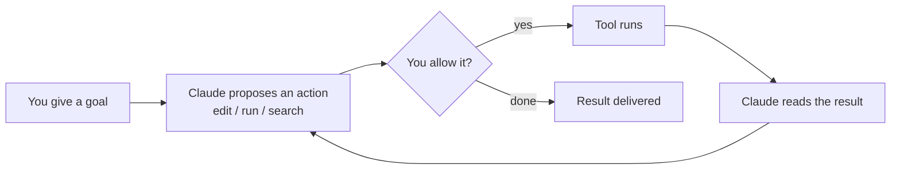

<LevelBadge level="beginner" />

<VerifyNote lastVerified="2026-06-20" source="https://code.claude.com/docs/en/overview">
Les commandes d'installation et l'ensemble exact des fonctionnalités changent souvent. Considérez la documentation officielle de Claude Code comme la source de vérité pour l'installation.
</VerifyNote>

**Claude Code** est l'outil de codage *agentique* d'Anthropic. Contrairement à une fenêtre de chat, il peut réellement **agir dans votre projet** : lire et modifier des fichiers, exécuter des commandes shell, parcourir la base de code et appeler des outils externes — le tout avec votre permission.

## Le modèle mental : une boucle agentique

C'est l'unique idée qui fait que tout le reste prend son sens :

Vous donnez un objectif en langage clair (« ajoute des tests pour le module d'authentification et corrige ce qui échoue »). Claude **planifie, agit, observe le résultat et recommence** jusqu'à ce que l'objectif soit atteint. Vous gardez le contrôle via les [permissions](/docs/claude-code) et le [Mode Plan](/docs/claude-code).

## Où l'exécuter

- **Terminal (CLI)** — la surface d'origine ; fonctionne dans n'importe quel shell.
- **Extensions IDE** — VS Code et JetBrains, avec des diffs en ligne.
- **Bureau et web** — et il partage vos réglages, hooks et permissions entre les surfaces.

## Ce que vous allez configurer (par ordre approximatif d'impact)

1. **[CLAUDE.md](/docs/claude-code)** — instructions de projet persistantes. Impact le plus fort, effort le plus faible.
2. **[Mode Plan](/docs/claude-code)** — enquêter et proposer *avant* qu'aucune modification ne soit exécutée.
3. **[Permissions](/docs/claude-code)** — ce que Claude peut faire sans demander.
4. **[settings.json](/docs/claude-code)** — le système de configuration complet.
5. **[Commandes slash](/docs/claude-code)**, **[hooks](/docs/claude-code)**, **[skills](/docs/claude-code)**, **[sous-agents](/docs/claude-code)**, **[serveurs MCP](/docs/claude-code)** — fonctionnalités avancées, ajoutées au fur et à mesure de vos besoins.

## Votre première session (à quoi elle ressemble)

1. Installez et authentifiez-vous (consultez la [documentation officielle](https://code.claude.com/docs/en/overview) pour les commandes actuelles).
2. Faites `cd` dans un projet et lancez Claude Code.
3. Exécutez `/init` pour générer un **CLAUDE.md** de départ.
4. Demandez quelque chose de petit et concret : *« Explique comment fonctionne le routage dans cette application. »*
5. Essayez ensuite une modification en **Mode Plan** d'abord, examinez le plan, puis laissez-le s'exécuter.

:::tip Commencez en lecture seule
Pour votre première vraie tâche, utilisez le [Mode Plan](/docs/claude-code) — Claude enquête et vous montre un plan sans toucher aux fichiers. C'est la façon la plus sûre d'instaurer la confiance.
:::

## Et après

- La configuration au plus fort impact → [CLAUDE.md & fichiers de mémoire](/docs/claude-code)
- Faites-le de bout en bout → [Tutoriel : Personnaliser Claude Code pour un vrai dépôt](/docs/walkthroughs)
- Créez vos propres automatisations → [Modèles & recettes](/docs/templates)
