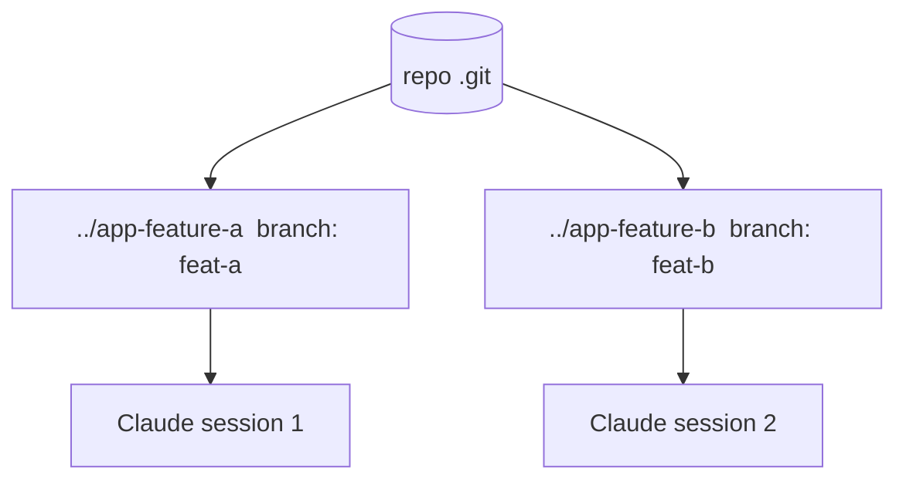

<LevelBadge level="advanced" />

Un **worktree git** permet à un seul dépôt d'avoir **plusieurs répertoires de travail**, chacun pointant sur une branche différente. Associez cela à Claude Code et vous pouvez exécuter **plusieurs sessions en parallèle** sur le même projet — chacune modifiant ses propres fichiers, sans collisions.

## Le problème qu'il résout

Si deux sessions Claude modifient le même répertoire de travail en même temps, elles se marchent dessus. Les worktrees donnent à chaque session son **propre répertoire et sa propre branche**, de sorte que le travail parallèle reste isolé jusqu'à la fusion.



## Les bases

```bash
# from your repo
git worktree add ../app-feature-a -b feat-a   # new dir + new branch
git worktree add ../app-fix-123 -b fix-123
git worktree list
# when done with one:
git worktree remove ../app-feature-a
```

Ouvrez une session Claude Code dans chaque répertoire de worktree et laissez-les travailler indépendamment.

## Quand ça en vaut la peine

- **Fonctionnalités/correctifs parallèles** que vous voulez faire avancer en même temps.
- **Une tâche longue en cours** dans un worktree pendant que vous continuez à travailler dans un autre.
- **Expériences risquées** isolées de votre checkout principal.

## Pièges

:::warning Attention à la fusion de retour
- Les branches finiront par **fusionner** — les conflits surgissent à ce moment-là, pas pendant. Gardez les worktrees ciblés et de courte durée.
- N'exécutez pas de **ressources partagées à état** (une seule base de dev, un seul port) depuis deux worktrees sans les séparer.
- Nettoyez avec `git worktree remove` pour que les répertoires obsolètes ne s'accumulent pas.
:::

## Worktrees vs sous-agents

- **[Sous-agents](/docs/claude-code/subagents)** = parallélisme *au sein* d'une session (délégation, contexte isolé).
- **Worktrees** = parallélisme *entre* sessions sur le disque (branches/fichiers isolés). Ils se combinent bien : une session dans un worktree peut elle-même engendrer des sous-agents.

## Et après

- [Sous-agents & agents parallèles](/docs/claude-code/subagents)
- [Mode headless & l'Agent SDK](/docs/claude-code/headless-and-agent-sdk)
- [Gestion du contexte](/docs/claude-code/context-management)
