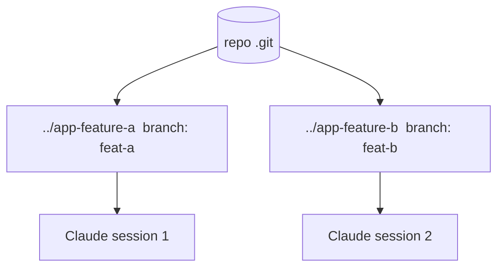

<LevelBadge level="advanced" />

<Callout type="objectives" items={["Ce qu'est un worktree git — un dépôt, plusieurs répertoires de travail, chacun sur sa propre branche","Le problème exact qu'il résout : empêcher les sessions Claude parallèles d'entrer en collision sur les mêmes fichiers","Les quatre commandes pour ajouter, lister et supprimer des worktrees","Quand la technique porte ses fruits — et les trois pièges qui mordent au moment de la fusion","Comment les worktrees se combinent avec les sous-agents : parallélisme entre sessions vs au sein d'une seule"]} />

Un **worktree git** permet à un seul dépôt d'avoir **plusieurs répertoires de travail**, chacun pointant sur une branche différente. Associez cela à Claude Code et vous pouvez exécuter **plusieurs sessions en parallèle** sur le même projet — chacune modifiant ses propres fichiers, sans collisions.

## Le problème qu'il résout

Si deux sessions Claude modifient le même répertoire de travail en même temps, elles se marchent dessus. Les worktrees donnent à chaque session son **propre répertoire et sa propre branche**, de sorte que le travail parallèle reste isolé jusqu'à la fusion.

## Les bases

Quatre commandes portent tout le flux de travail : ajouter un worktree (nouveau répertoire + nouvelle branche), lister ce qui existe, et en supprimer un quand vous avez terminé.

<Steps items={[{title: "Ajoutez un worktree pour une fonctionnalité", body: "Depuis votre dépôt, git worktree add ../app-feature-a -b feat-a crée un nouveau répertoire ET une nouvelle branche d'un seul coup."},{title: "Ajoutez-en un autre pour un correctif", body: "git worktree add ../app-fix-123 -b fix-123 — un deuxième répertoire/branche isolé, côte à côte avec le premier."},{title: "Voyez ce que vous avez", body: "git worktree list affiche chaque répertoire de travail et la branche sur laquelle il se trouve."},{title: "Faites le ménage une fois terminé", body: "git worktree remove ../app-feature-a démonte un worktree pour que les répertoires obsolètes ne s'accumulent pas."}]} />

<PromptCard title="Le flux de travail en quatre commandes">{`# from your repo
git worktree add ../app-feature-a -b feat-a   # new dir + new branch
git worktree add ../app-fix-123 -b fix-123
git worktree list
# when done with one:
git worktree remove ../app-feature-a`}</PromptCard>

Ouvrez une session Claude Code dans chaque répertoire de worktree et laissez-les travailler indépendamment.

## Quand ça en vaut la peine

- **Fonctionnalités/correctifs parallèles** que vous voulez faire avancer en même temps.
- **Une tâche longue en cours** dans un worktree pendant que vous continuez à travailler dans un autre.
- **Expériences risquées** isolées de votre checkout principal.

## Pièges

<Callout type="warning" items={["Attention à la fusion de retour : les branches finiront par fusionner — les conflits surgissent à ce moment-là, pas pendant. Gardez les worktrees ciblés et de courte durée.","N'exécutez pas de ressources partagées à état (une seule base de dev, un seul port) depuis deux worktrees sans les séparer.","Nettoyez avec git worktree remove pour que les répertoires obsolètes ne s'accumulent pas."]} />

## Worktrees vs sous-agents

Deux axes de parallélisme différents — ils ne s'opposent pas, ils s'empilent.

| | Ce qu'il parallélise | Isolation |
| --- | --- | --- |
| **[Sous-agents](/docs/claude-code/subagents)** | Le travail *au sein* d'une session (délégation) | Contexte isolé |
| **Worktrees** | Le travail *entre* sessions sur le disque | Branches/fichiers isolés |

Ils se combinent bien : une session dans un worktree peut elle-même engendrer des sous-agents.

<Callout type="tip" items={["Utilisez un worktree quand vous avez besoin de deux sessions Claude touchant le même dépôt en même temps ; utilisez un sous-agent quand une session doit décharger une portion de travail dans un contexte isolé."]} />

<Quiz title="Vérifiez vos connaissances" questions={[{q: "Que vous apporte un worktree git ?", options: ["Plusieurs branches dans un seul répertoire de travail", "Plusieurs répertoires de travail pour un dépôt, chacun sur sa propre branche", "Une copie de sauvegarde de votre dossier .git"], answer: 1, explain: "Un worktree git permet à un seul dépôt d'avoir plusieurs répertoires de travail, chacun pointant sur une branche différente — de sorte que les sessions parallèles n'entrent pas en collision."}, {q: "Quelle commande crée un nouveau répertoire ET une nouvelle branche en une seule étape ?", options: ["git worktree list", "git worktree add ../app-feature-a -b feat-a", "git worktree remove ../app-feature-a"], answer: 1, explain: "git worktree add ../app-feature-a -b feat-a crée le nouveau répertoire et la nouvelle branche ensemble. list affiche les worktrees existants ; remove en démonte un."}, {q: "Quand les conflits de fusion issus de worktrees parallèles surgissent-ils réellement ?", options: ["En continu pendant que les deux sessions modifient", "Au moment de la fusion de retour, pas pendant", "Jamais, car les branches sont isolées"], answer: 1, explain: "Les branches restent isolées pendant que vous travaillez, donc les conflits n'apparaissent pas pendant — ils surgissent à la fusion de retour. Gardez les worktrees ciblés et de courte durée pour les limiter."}, {q: "Comment les worktrees et les sous-agents se rapportent-ils ?", options: ["Ce sont la même fonctionnalité sous deux noms", "Les worktrees parallélisent entre sessions sur le disque ; les sous-agents parallélisent au sein d'une session — et ils se combinent", "Vous devez en choisir un ; utiliser les deux casse l'isolation"], answer: 1, explain: "Les sous-agents, c'est du parallélisme au sein d'une session (contexte isolé) ; les worktrees, c'est du parallélisme entre sessions sur le disque (branches/fichiers isolés). Une session dans un worktree peut elle-même engendrer des sous-agents."}]} />

<Callout type="takeaways" items={["Un worktree git = un dépôt, plusieurs répertoires de travail, chacun sur sa propre branche — la base de sessions Claude parallèles sans collision.","Deux sessions sur un même répertoire de travail se marchent dessus ; un worktree par session garde fichiers et branches isolés jusqu'à la fusion.","git worktree add ../dir -b branch crée dir + branche ; list les affiche ; remove fait le ménage.","Ça en vaut la peine pour les fonctionnalités/correctifs parallèles, les tâches longues menées en parallèle d'un autre travail, et les expériences risquées isolées.","Méfiez-vous de la fusion de retour, ne partagez pas de ressources à état (base, port) entre worktrees, et faites toujours le ménage — et rappelez-vous que les worktrees se combinent avec les sous-agents."]} />

## Et après

- [Sous-agents & agents parallèles](/docs/claude-code/subagents)
- [Mode headless & l'Agent SDK](/docs/claude-code/headless-and-agent-sdk)
- [Gestion du contexte](/docs/claude-code/context-management)
