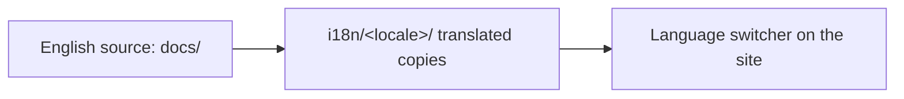

<LevelBadge level="intermediate" />

AILmanac est conçu d'abord en anglais mais **fait pour être traduit** — c'est ainsi qu'il atteint « tout le monde sur la planète ». Si vous souhaitez l'amener dans votre langue, voici la marche à suivre.

## Comment fonctionne l'i18n ici

Le site utilise l'internationalisation intégrée de Docusaurus. **L'anglais est la source canonique.** Une langue est un ensemble parallèle de fichiers traduits ; Docusaurus propose un sélecteur de langue dès qu'une langue est activée.

## La règle d'or : prenez-la en charge avant qu'on la publie

:::warning Pas de traductions partielles en production
Une langue n'est **activée en production qu'une fois que quelqu'un s'engage à la maintenir.** Une langue traduite à 30 %, périmée depuis des mois, nuit davantage à la crédibilité qu'une absence de traduction. Mieux vaut bien traduire une *section complète* que de disperser des pages partielles.
:::

## Comment contribuer une traduction

1. **Ouvrez une issue** (utilisez le modèle *translation*) en indiquant quelle langue et quelle section vous prenez en charge.
2. **Traduisez d'abord un bloc cohérent** — par exemple tout *Start Here* — et non des pages au hasard.
3. **Laissez le code, les commandes et les sources de `VerifyNote` inchangés** ; traduisez la prose, les titres et le texte des admonitions.
4. **Ne traduisez pas les IDs de modèles ni les liens** ; gardez les chemins `/docs/...` tels quels.
5. **Ouvrez une PR.** Un mainteneur la relit et, une fois qu'une langue a un responsable + une première section complète, nous l'activons.

## Conseils

- **Utilisez Claude pour rédiger un premier jet**, puis faites relire par un humain qui maîtrise la langue — la traduction par IA est un excellent premier passage, pas une autorité finale (les [hallucinations](/docs/foundations/hallucinations) s'appliquent aussi à la traduction).
- **Adaptez le niveau/le ton** de la page anglaise.
- **Signalez les termes intraduisibles** (gardez « prompt », « token », etc. là où c'est la norme dans la communauté tech de votre langue).

## Suite

- [Contribuer en 10 minutes](/docs/contribute/contribute-in-10-minutes)
- [Guide de style du contenu](/docs/contribute/style-guide)
- [Code de conduite et gouvernance](/docs/contribute/governance)
