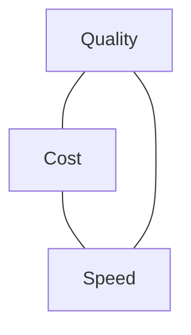

<LevelBadge level="intermediate" />

Qualité, coût et vitesse tirent à hue et à dia. Vous ne pouvez pas maximiser les trois à la fois — mais vous *pouvez* dépenser chacun là où cela compte et économiser partout ailleurs.

## Le triangle

Un modèle plus gros est plus intelligent mais plus lent et plus cher ; un plus petit est rapide et bon marché mais moins capable. La bonne ingénierie consiste à **diriger chaque tâche vers le bon point** de ce triangle.

## Les plus grands leviers (à peu près dans l'ordre)

1. **Dimensionnez le modèle au plus juste.** Ne faites pas tourner Opus pour de la classification. Commencez avec Sonnet, descendez à Haiku pour les étapes simples/à fort volume, réservez Opus aux parties difficiles — [Choisir un modèle](/docs/api/choosing-a-model).
2. **Paliers de modèles / cascades.** Utilisez d'abord un modèle bon marché ; escaladez vers un plus puissant seulement quand c'est nécessaire (par exemple pour les cas à faible confiance).
3. **[Mise en cache des prompts](/docs/api/prompt-caching).** Réutilisez un préfixe de prompt stable d'un appel à l'autre — de grosses économies pour les prompts système répétés, le contexte RAG ou les catalogues d'outils d'agents.
4. **Réduisez les jetons d'entrée.** N'envoyez que l'essentiel ; le [RAG](/docs/foundations/rag) vaut mieux que d'entasser toute la base de connaissances. Des entrées plus courtes = moins cher *et* souvent meilleur.
5. **Plafonnez la sortie** avec un `max_tokens` raisonnable et des instructions de format strictes.
6. **Traitez par lots** le travail hors ligne lorsque la latence n'a pas d'importance.

## Gains spécifiques à la latence

- **Diffusez en continu** les réponses pour que les utilisateurs voient la sortie immédiatement — énorme pour la vitesse *perçue*, même si le temps total est inchangé ([Streaming](/docs/api/streaming)).
- **Parallélisez** les sous-appels indépendants.
- **Mettez en cache** le travail répété ; précalculez quand vous le pouvez.
- Choisissez un **modèle plus petit** pour le chemin interactif ; faites le gros du travail de façon asynchrone.

## N'optimisez pas à l'aveugle

Mesurez d'abord : où partent réellement les jetons et les secondes ? Optimisez ensuite le poste le plus important. Et revérifiez la qualité avec des [évaluations](/docs/foundations/evals) après chaque réduction de coût — une configuration moins chère qui se trompe n'est pas moins chère.

## Pour aller plus loin

- [Choisir un modèle Claude](/docs/api/choosing-a-model)
- [Mise en cache des prompts et optimisation des coûts](/docs/api/prompt-caching)
- [Jetons, contexte et tarification](/docs/api/tokens-and-pricing)
