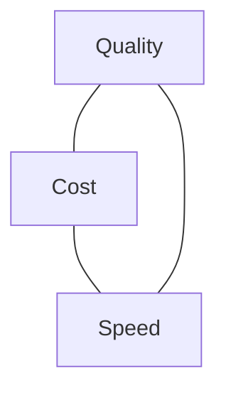
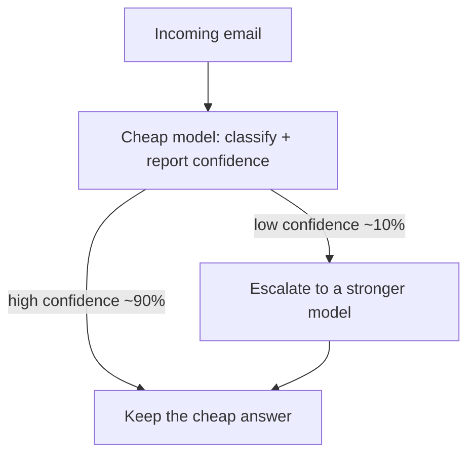

<LevelBadge level="intermediate" />

<Callout type="objectives" items={["Le triangle coût/qualité/vitesse — pourquoi vous ne pouvez jamais maximiser les trois à la fois","Les six plus grands leviers pour dépenser là où ça compte et économiser partout ailleurs","Comment une cascade « le moins cher d'abord » achemine 90 % du volume vers un petit modèle et coupe le coût d'environ 70 % sans faire chuter la qualité sur les cas difficiles","Les gains spécifiques à la latence (streaming, parallélisme, cache, async) qui redéfinissent la vitesse perçue","Pourquoi « optimiser à l'aveugle » brûle la qualité — mesurer d'abord, se protéger avec des évals ensuite"]} />

Qualité, coût et vitesse tirent à hue et à dia. Vous ne pouvez pas maximiser les trois à la fois — mais vous *pouvez* dépenser chacun là où cela compte et économiser partout ailleurs.

## Le triangle

```mermaid
flowchart TD
  Q[Quality] --- C[Cost]
  C --- S[Speed]
  S --- Q
```

Un modèle plus gros est plus intelligent mais plus lent et plus cher ; un plus petit est rapide et bon marché mais moins capable. La bonne ingénierie consiste à **diriger chaque tâche vers le bon point** de ce triangle.

## Les plus grands leviers (à peu près dans l'ordre)

<Steps items={[{title: "Dimensionner correctement le modèle", body: "Ne faites pas tourner Opus pour de la classification. Commencez avec Sonnet, descendez à Haiku pour les étapes simples/à fort volume, réservez Opus pour les parties difficiles. Le levier unique le plus important — voir /docs/api/choosing-a-model."}, {title: "Paliers / cascades de modèles", body: "Utilisez d'abord un modèle bon marché ; escaladez vers un plus fort seulement si nécessaire (par ex. cas à faible confiance). Voir l'exemple travaillé ci-dessous."}, {title: "Mise en cache des prompts", body: "Réutilisez un préfixe de prompt stable à travers les appels — grosses économies pour les prompts système répétés, contexte RAG, ou catalogues d'outils d'agent. Voir /docs/api/prompt-caching."}, {title: "Réduire les tokens d'entrée", body: "N'envoyez que ce qui compte. Le RAG bat le fait de bourrer toute la base de connaissances. Entrées plus courtes = moins cher ET souvent meilleure sortie."}, {title: "Plafonner les tokens de sortie", body: "Définissez un max_tokens raisonnable et des instructions de format serrées. Les tokens de sortie sont facturés au taux le plus élevé — les plafonner coupe la queue."}, {title: "Traiter le travail hors ligne par lots", body: "Pour tout ce qui n'a pas besoin d'être interactif, utilisez l'API Message Batches. Échange de la latence contre une grosse remise par token."}]} />

## Exemple travaillé : une cascade « le moins cher d'abord »

La cascade est le levier que les gens sautent parce qu'il paraît vague. Rendons-le concret. Disons que vous devez trier 100 000 e-mails de support. L'approche naïve fait passer chaque e-mail par votre modèle le plus fort. Une cascade achemine la plupart du volume vers un modèle bon marché et n'escalade que les cas difficiles :

```mermaid
flowchart TD
  In[Incoming email] --> Cheap[Cheap model: classify + report confidence]
  Cheap -->|high confidence ~90%| Done[Keep the cheap answer]
  Cheap -->|low confidence ~10%| Strong[Escalate to a stronger model]
  Strong --> Done
```

Supposons que le modèle bon marché résout 90 % des cas seul et qu'un modèle plus fort coûte environ 5× plus par token. En comptant en *unités de coût* relatives (1 = un passage bon marché sur un e-mail) :

- **Tout-fort :** `100k × 5 = 500k` unités de coût.
- **Cascade :** `100k × 1` (chaque e-mail reçoit le passage bon marché) `+ 10k × 5` (les 10 % qui escaladent) `= 150k` unités de coût.

Cela fait environ **70 % d'économie**, et les cas véritablement difficiles reçoivent quand même votre meilleur modèle. Les multiplicateurs et la répartition sont illustratifs — mettez vos propres [décomptes de tokens et tarifs](/docs/api/tokens-and-pricing) et mesurez le taux *réel* d'escalade avec les [évals](/docs/foundations/evals). La leçon tient quoi qu'il en soit : les économies viennent de la rareté avec laquelle vous payez le tarif cher, pas du tarif lui-même.

## Gains spécifiques à la latence

<Callout type="tip" items={["Streamez les réponses — les utilisateurs voient les premiers tokens instantanément, donc la vitesse perçue bondit même quand le temps total est inchangé (/docs/api/streaming).","Parallélisez les sous-appels indépendants — une requête qui se déploie vers trois outils finit en max(latence), pas somme(latence).","Mettez en cache le travail répété et pré-calculez quand vous le pouvez — les tokens les plus rapides sont ceux que vous n'avez pas à générer.","Choisissez un modèle plus petit pour le chemin interactif ; déplacez le gros travail en async pour que l'utilisateur n'attende pas dessus.","Réduisez les tokens de sortie max pour les endpoints interactifs — les générations longues sont la source dominante de latence de queue."]} />

## Ne pas optimiser à l'aveugle

Mesurez d'abord : où passent réellement les tokens et les secondes ? Puis optimisez la plus grosse ligne. Et revérifiez la qualité avec des [évals](/docs/foundations/evals) après toute réduction de coût — une configuration moins chère qui se trompe n'est pas moins chère.

<Quiz title="Vérifiez-vous" questions={[{q: "Quel est GÉNÉRALEMENT le plus grand levier de coût unique ?", options: ["Activer la mise en cache des prompts", "Bien dimensionner le modèle par rapport à la tâche (ne pas faire tourner le flagship pour des jobs qu'un petit modèle gère bien)", "Définir un max_tokens plus petit", "Utiliser le mode batch"], answer: 1, explain: "Le choix du modèle est de loin le plus grand multiplicateur — souvent 5–10× entre paliers. Le cache, le plafonnement et le batch sont significatifs, mais aucun ne bat « arrêter de payer les tarifs flagship pour un job qu'un modèle de classe Haiku termine correctement »."}, {q: "Dans une cascade « le moins cher d'abord », d'où viennent réellement les économies ?", options: ["Du fait que le modèle bon marché est intrinsèquement moins cher par token", "De la RARETÉ avec laquelle vous finissez par payer le tarif cher — la plupart des cas se résolvent au palier bon marché", "De la mise en cache des prompts cachée derrière la cascade", "Du streaming des réponses"], answer: 1, explain: "Les maths (100k × 1 + 10k × 5 vs 100k × 5) montrent que les économies sont dominées par le taux d'escalade. Si vous acheminez 90 % vers le bon marché et 10 % vers le fort, vous payez le tarif cher sur un dixième du volume."}, {q: "Vous voulez que l'utilisateur ait l'impression qu'une réponse est plus rapide. Quel levier aide LE PLUS sans changer le choix du modèle ?", options: ["Mettre max_tokens à 5 pour que la réponse soit courte", "Streamer les tokens au fur et à mesure qu'ils sont générés pour que le temps jusqu'au premier token chute fortement", "Réessayer la requête deux fois en parallèle et garder la plus rapide", "Ajouter un spinner de chargement"], answer: 1, explain: "Le streaming refaçonne la latence PERÇUE sans changer le temps total de génération — les utilisateurs voient la sortie au fur et à mesure, donc une réponse de 4 secondes semble instantanée. Tronquer avec un tout petit max_tokens nuit à la qualité ; les tentatives parallèles brûlent du coût."}, {q: "Vous avez coupé les coûts en passant de Sonnet à Haiku sur un workflow. Quelle est l'étape suivante requise ?", options: ["Livrer — le coût a baissé, c'est toute la victoire", "Relancer les évals pour confirmer que la qualité ne s'est pas effondrée — une configuration moins chère qui se trompe n'est pas moins chère", "Mettre le prompt en cache pour que ça coûte encore moins", "Ajouter un fallback vers Opus pour chaque requête"], answer: 1, explain: "Chaque réduction de coût doit être gardée par des évals. Une mauvaise réponse bon marché coûte généralement plus cher qu'une bonne réponse chère — via des retries, des escalades ou du nettoyage aval. Mesurez la qualité après tout changement."}]} />

<Callout type="takeaways" items={["Le triangle est réel : qualité, coût et vitesse tirent à hue et à dia — l'ingénierie signifie diriger chaque tâche vers le bon point, pas maxer les trois.","Bien dimensionner le modèle est le plus grand levier unique ; les cascades le multiplient en ne payant les tarifs flagship que sur la minorité difficile.","La mise en cache des prompts, un max_tokens serré, et la réduction des entrées via RAG se composent avec le choix du modèle.","La perception de latence est un axe distinct — le streaming, les sous-appels parallèles, et le gros travail asynchrone refaçonnent l'UX sans changer le coût brut.","Chaque réduction de coût doit être gardée par des évals — une configuration moins chère qui se trompe n'est pas moins chère."]} />

## Suite

- [Choisir un modèle Claude](/docs/api/choosing-a-model)
- [Mise en cache des prompts et optimisation des coûts](/docs/api/prompt-caching)
- [Tokens, contexte et tarification](/docs/api/tokens-and-pricing)
