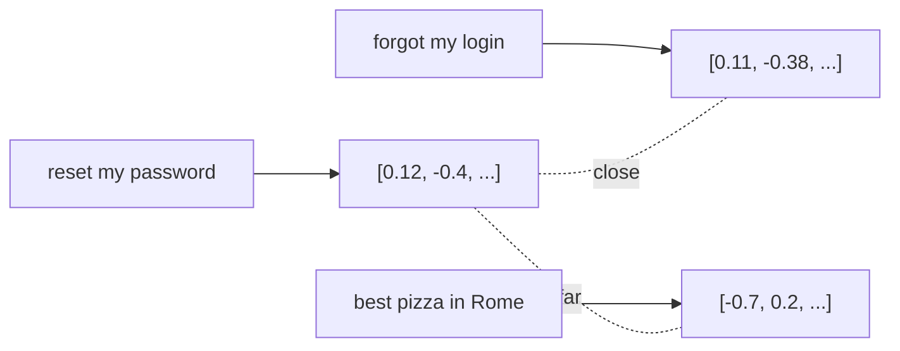

<LevelBadge level="intermediate" />

Un **embedding** transforme un morceau de texte en une liste de nombres (un **vecteur**) qui capture son *sens*. Les textes au sens proche obtiennent des vecteurs proches les uns des autres — même s'ils ne partagent aucun mot. C'est l'astuce derrière la **recherche sémantique** et le [RAG](/docs/foundations/rag).

## L'intuition

Imaginez chaque phrase placée comme un point dans un immense espace multidimensionnel, agencé de sorte que **les sens proches se trouvent près les uns des autres**. « Comment réinitialiser mon mot de passe ? » atterrit près de « J'ai oublié mes identifiants », loin de « la meilleure pizza de Rome ».

## Recherche sémantique vs recherche par mots-clés

- **La recherche par mots-clés** fait correspondre les mots littéraux (« mot de passe » trouve « mot de passe »).
- **La recherche sémantique** fait correspondre le *sens* — « je n'arrive pas à me connecter » trouve la doc de réinitialisation du mot de passe même sans le mot « mot de passe ».

Les meilleurs résultats **combinent** souvent les deux (recherche hybride).

## Comment fonctionne une recherche vectorielle

1. **Encodez** (embed) vos documents (généralement découpés en **fragments**) et stockez les vecteurs dans une **base de données vectorielle**.
2. Au moment de la requête, **encodez la requête**.
3. Trouvez les vecteurs les **plus proches** (par similarité cosinus / distance).
4. Renvoyez ces fragments — généralement pour les fournir au [RAG](/docs/foundations/rag).

## Notes pratiques

- **Le découpage compte.** Trop gros = correspondances bruitées ; trop petit = contexte perdu. Réglez-le.
- **Utilisez un seul modèle d'embedding de façon cohérente** — les vecteurs issus de modèles différents ne sont pas comparables.
- **Métadonnées + filtres** (date, source, type) rendent la récupération bien plus précise.
- Une base vectorielle n'est pas toujours nécessaire — pour de petits corpus, une simple recherche en mémoire suffit.

## Pour aller plus loin

- [Génération augmentée par la récupération (RAG)](/docs/foundations/rag)
- [Fine-tuning vs prompting vs RAG](/docs/foundations/finetune-vs-prompt-vs-rag)
- [Les hallucinations et comment les réduire](/docs/foundations/hallucinations)
