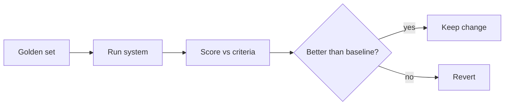

<LevelBadge level="advanced" />

Si vous mettez en production quoi que ce soit reposant sur l'IA, les **évaluations** sont ce qui vous permet de savoir que cela fonctionne — et de savoir qu'un changement l'a amélioré, et non dégradé. Sans elles, vous volez à l'aveugle : un ajustement de prompt qui aide un cas peut silencieusement en casser dix autres.

## L'évaluation minimale viable

Vous n'avez pas besoin d'un framework pour démarrer :

1. **Constituez un jeu de référence.** 20 à 100 entrées réelles avec les sorties *correctes* ou *acceptables* (ou des critères clairs). Couvrez les cas faciles, les cas délicats et les cas limites qui vous ont déjà mordu.
2. **Définissez ce que « bon » signifie** par tâche — correspondance exacte, contient les faits clés, schéma JSON valide, aucun chiffre halluciné, ton, etc.
3. **Exécutez et notez** votre configuration actuelle face au jeu.
4. **Changez une seule chose** (prompt, modèle, récupération), réexécutez, **comparez**. Ne conservez le changement que si le score s'améliore.

## Choisir les métriques

- **Contrôles déterministes** lorsque c'est possible : le schéma est-il valide ? contient-il la bonne valeur ? le code passe-t-il les tests ? Ils sont peu coûteux et dignes de confiance.
- **LLM comme juge** pour la qualité floue (utilité, ton) : faites noter les sorties par un modèle selon une grille. Utile mais **calibrez-le** — les juges ont des biais (longueur, position). Validez le juge face à des notes humaines sur un échantillon.
- **Relecture humaine** pour la tranche aux plus forts enjeux.

## Quand les exécuter

- **Avant/après tout changement de prompt ou de modèle.**
- **Lors d'une migration de modèle** — un nouveau modèle peut modifier le comportement ([Erreurs et migration](/docs/api/errors-and-rate-limits)).
- **En CI** pour les systèmes en production, comme garde-fou.

:::tip Séparez les étapes
Pour le [RAG](/docs/foundations/rag) et les [agents](/docs/api/building-agents), évaluez chaque étape (la récupération a-t-elle trouvé le bon document ? l'outil a-t-il été appelé correctement ?) — pas seulement la réponse finale. Cela localise les défaillances.
:::

## Pour aller plus loin

- [Les hallucinations et comment les réduire](/docs/foundations/hallucinations)
- [Construire des agents sur l'API](/docs/api/building-agents)
- [Choisir un modèle et un fournisseur](/docs/foundations/choosing-a-model-provider)
