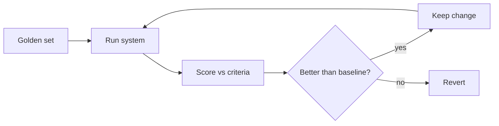

<LevelBadge level="advanced" />

<Callout type="objectives" items={[
  "Construire l'eval minimale utile — un golden set de 20 à 100 entrées réelles avec des critères de réussite clairs",
  "Choisir la bonne métrique par tâche : vérifications déterministes, LLM-as-judge ou revue humaine",
  "Exécuter les evals comme un garde-fou — avant/après chaque changement de prompt, chaque swap de modèle, et en CI",
  "Noter chaque étape (retrieval, appel d'outil, réponse finale), pas seulement la dernière, pour localiser les régressions"
]} />

Si vous livrez quoi que ce soit construit sur de l'IA, les **evals** sont la façon dont vous savez que ça marche — et la façon dont vous savez qu'un changement l'a amélioré, pas empiré. Sans elles, vous naviguez à vue : un ajustement de prompt qui aide un cas peut silencieusement en casser dix autres. Les evals transforment l'itération « au feeling » en une boucle mesurable.

## L'eval minimale viable

Vous n'avez pas besoin d'un framework pour commencer. Toute la boucle tient en quatre étapes :

<Steps items={[
  {title: "Collecter un golden set", body: "20 à 100 entrées réelles avec les sorties correctes ou acceptables (ou des critères clairs de ce qui compte comme une réussite). Couvrez les cas faciles, les cas délicats et les cas limites qui vous ont déjà mordu en production."},
  {title: "Définir ce que 'bon' veut dire par tâche", body: "Correspondance exacte ? Contient un fait clé spécifique ? JSON valide qui respecte votre schéma ? Aucun chiffre halluciné ? Ton conforme à la marque ? Écrivez les critères — une ligne par cas suffit."},
  {title: "Exécuter et noter votre baseline", body: "Faites tourner votre setup actuel contre le set et notez le score. C'est désormais le chiffre à battre. Sauvegardez-le — le futur vous en aura besoin."},
  {title: "Changer une seule chose, relancer, comparer", body: "Ajustement de prompt, swap de modèle, changement de retrieval — une variable à la fois. Si le score monte et rien ne régresse, gardez le changement. Sinon, revenez en arrière. C'est toute la boucle."}
]} />

```mermaid
flowchart LR
  G[Golden set] --> R[Run system]
  R --> S[Score vs criteria]
  S --> C{Better than baseline?}
  C -->|yes| K[Keep change]
  C -->|no| X[Revert]
  K --> R
```

## Choisir les métriques

Toutes les questions ne méritent pas le même test. Faites correspondre la métrique à la tâche :

| Type de tâche | Métrique | Coût | Fiabilité |
|---|---|---|---|
| Sortie structurée (JSON, SQL) | Validation de schéma, correspondance exacte | Gratuit | Élevée |
| Génération de code | Faire tourner les tests qu'il a écrits | Faible | Élevée |
| Extraction (dates, entités) | String contains / regex | Gratuit | Élevée |
| Classification | Accuracy, precision, recall | Gratuit | Élevée |
| Résumés, brouillons, ton | LLM-as-judge avec une rubrique | Modéré | Moyenne — doit être calibré |
| Écriture à fort enjeu, sécurité | Revue humaine sur un échantillon | Cher | Maximale |

Trois règles de pouce :

- **Vérifications déterministes quand c'est possible.** Si la réponse est « JSON valide qui respecte ce schéma » ou « le code passe ces tests », ne demandez pas à un LLM — vérifiez-le.
- **LLM-as-judge pour la qualité floue.** Utilité, ton, factualité-vs-source. Rapide et bon marché, mais a des *biais* (longueur, position, auto-préférence). Validez le juge contre des notes humaines sur un échantillon avant de faire confiance à ses chiffres.
- **Humains sur la tranche à plus fort enjeu.** Même 10 cas notés par un humain par release valent mieux que 0.

<PromptCard title="Rubrique de départ pour LLM-as-judge">{`You are grading assistant responses against a source document.

For each response, output a JSON object with these fields:
- grounded: true if every factual claim is supported by the source, else false
- complete: true if the response answers all parts of the question, else false
- concise: true if the response contains no filler or repetition, else false
- overall_score: 1-5 (1 = unusable, 5 = ship it)
- reasoning: one sentence explaining the score

Do not consider length. Do not consider whether the response comes first or second.

<source>{{SOURCE}}</source>
<question>{{QUESTION}}</question>
<response>{{RESPONSE}}</response>

Return only the JSON, no preamble.`}</PromptCard>

## Quand les exécuter

- **Avant/après tout changement de prompt ou de modèle.** Sans exception. L'objectif même du golden set est d'attraper le changement que vous pensiez sûr.
- **Lors d'une migration de modèle.** Les nouveaux modèles décalent le comportement — parfois silencieusement. Faites tourner les evals avant de basculer l'ID du modèle. Voir [Erreurs & Migration](/docs/api/errors-and-rate-limits).
- **En CI, pour les systèmes en production.** Transformez une eval verte en un garde-fou de merge. Les régressions sont attrapées avant que les utilisateurs ne les voient.
- **Après chaque bug remonté.** Ajoutez le cas défaillant au golden set. Le set grandit avec le système.

## Notez chaque étape, pas seulement la réponse finale

Pour [RAG](/docs/foundations/rag) et les [agents](/docs/api/building-agents), un seul score de « réponse finale » cache où les choses cassent. Notez chaque étape séparément pour que les régressions atterrissent au bon endroit :

| Étape | Ce qu'il faut vérifier |
|---|---|
| Retrieval | Le top-k contenait-il le document qui contient la réponse ? |
| Sélection d'outil | L'agent a-t-il choisi le bon outil pour ce tour ? |
| Arguments d'outil | Les arguments étaient-ils bien formés et corrects ? |
| Réponse finale | Correspond-elle aux critères du golden set ? |

Quand le score de retrieval baisse mais que le score final reste stable, vous savez que c'est une régression de retrieval — pas un problème de prompt. Ce genre de localisation est ce qui rend les evals réellement utiles pour le debugging, pas juste pour la notation.

## Erreurs courantes

- **Noter avec le même modèle qui a généré la réponse.** Le biais d'auto-préférence gonfle les scores. Utilisez un autre modèle — ou mieux, une autre famille — comme juge.
- **Des prompts de juge qui divulguent la « bonne » réponse.** Si le juge voit la réponse dorée, il trouvera des raisons de la récompenser. Notez sur des critères, pas sur la similarité.
- **Des golden sets figés au jour un.** Le set doit grandir chaque fois que la production vous surprend. Un set obsolète mesure le passé.
- **Optimiser pour l'eval plutôt que pour la tâche.** Si vous ajustez les prompts contre un petit set jusqu'à ce que tous les cas passent, vous avez peut-être overfit. Mettez de côté ~20 % des cas comme un slice de validation que vous ne regardez jamais pendant l'itération.

<Quiz title="Vérifiez-vous" questions={[
  {q: "Qu'est-ce que l'eval minimale viable ?", options: ["Un modèle fine-tuné sur vos données", "Un golden set de 20 à 100 entrées réelles avec des critères de réussite mesurables", "Un dashboard qui suit la latence et le coût"], answer: 1, explain: "20 à 100 entrées réelles avec une définition claire de 'bon' suffisent pour commencer. Vous n'avez pas besoin d'un framework — vous avez besoin de quelque chose que vous pouvez noter."},
  {q: "Quand préférer une vérification déterministe à LLM-as-judge ?", options: ["Jamais — les juges LLM sont plus nuancés", "Quand le critère de réussite est objectif (schéma valide, correspondance exacte, tests qui passent)", "Seulement quand vous ne pouvez pas vous permettre un juge LLM"], answer: 1, explain: "Si vous pouvez décider pass/fail par code, faites-le — les vérifications déterministes sont gratuites, rapides et sans biais. Réservez LLM-as-judge pour les dimensions de qualité vraiment floues."},
  {q: "Pour un agent RAG, pourquoi noter chaque étape séparément ?", options: ["Pour satisfaire la conformité", "Pour qu'une régression vous dise OÙ elle a cassé (retrieval, outil ou réponse finale)", "Pour rendre l'eval plus lente et plus complète"], answer: 1, explain: "Un score end-to-end unique cache quelle étape a régressé. Des scores par étape permettent de localiser les bugs — le retrieval a baissé mais le final tient ? C'est une régression de retrieval, pas une régression de prompt."},
  {q: "Qu'est-ce qui indique que vous avez overfit sur votre eval set ?", options: ["Votre golden set ne change jamais et passe à 100 %", "Vous utilisez un juge LLM", "Vous faites tourner les evals en CI"], answer: 0, explain: "Un golden set figé à 100 % de réussite signifie généralement que vous l'avez mémorisé. Gardez un slice de validation que vous ne regardez jamais pendant l'itération, et faites grandir le set à partir des vraies défaillances en production."}
]} />

<Callout type="takeaways" items={[
  "20 à 100 entrées réelles + critères de réussite + une variable à la fois = une boucle d'eval fonctionnelle.",
  "Déterministe > LLM-judge > humain — prenez la métrique la moins chère que la tâche permet.",
  "Notez chaque étape d'un pipeline, pas seulement la réponse finale.",
  "Le golden set grandit avec chaque bug remonté. Un set obsolète mesure le passé."
]} />

## Suite

- [Évaluer votre agent IA](/docs/playbooks/evaluating-agents) — le playbook plus profond : scoring de trajectoire, calibration du juge LLM, garde-fou de CI
- [Hallucinations et comment les réduire](/docs/foundations/hallucinations)
- [Construire des agents sur l'API](/docs/api/building-agents)
- [Choisir un modèle et un fournisseur](/docs/foundations/choosing-a-model-provider)
