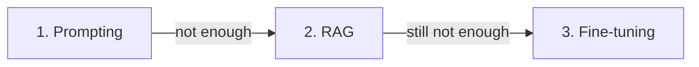

<LevelBadge level="intermediate" />

Quand le modèle ne fait pas ce que vous voulez, il existe trois leviers — et les gens saisissent d'abord le plus coûteux. Voici l'ordre qui fonctionne réellement.

## Essayez dans cet ordre

### 1. Le prompting — commencez ici, toujours
Des instructions plus claires, des exemples, un rôle, des contraintes de sortie ([Les bases du prompting](/docs/prompting/basics)). Cela règle la **majorité** des problèmes, ne coûte rien de plus et s'itère instantanément. La plupart des « le modèle est mauvais sur X » se révèlent être des « le prompt était vague ».

### 2. Le RAG — quand il a besoin de *votre* savoir
Si l'écart vient d'une **information manquante ou récente** (vos documents, vos données, des faits actuels), ajoutez du [RAG](/docs/foundations/rag). Cela garde le savoir actualisable et citable sans toucher au modèle.

### 3. Le fine-tuning — dernier recours, pour le *comportement/format* à grande échelle
Le fine-tuning poursuit l'entraînement d'un modèle sur vos exemples. N'y recourez que lorsque le prompting + RAG ne parviennent pas à obtenir un **style, un format ou un comportement de tâche** cohérent, que vous disposez de **nombreux exemples de haute qualité** et d'un volume qui le justifie.

## La table de décision

| Votre problème | Recourez à |
|---|---|
| Sorties vagues/erronées, mauvais format | **Le prompting** |
| Ne connaît pas vos données / a besoin d'infos actuelles | **Le RAG** |
| A besoin d'un style/comportement très spécifique, de façon cohérente, à grande échelle | **Le fine-tuning** |
| A besoin d'effectuer des actions | (Pas ceux-ci — c'est l'[utilisation d'outils/les agents](/docs/api/tool-use)) |

## Pourquoi les gens se trompent

Le fine-tuning *ressemble* à « apprendre au modèle », ce qui donne l'impression d'être le vrai remède. Mais c'est l'option la plus lente, la plus coûteuse, la moins flexible, elle **n'ajoute pas bien de savoir récent** (le RAG le fait), et elle est facile à mal faire. Épuisez d'abord le prompting et le RAG — vous n'aurez généralement pas besoin de l'étape 3.

:::tip Ils se combinent
Un système solide est souvent un bon **prompt** + du **RAG** pour le savoir, le fine-tuning étant réservé à un besoin comportemental restreint. Ils ne s'excluent pas mutuellement.
:::

## Pour aller plus loin

- [Génération augmentée par la récupération (RAG)](/docs/foundations/rag)
- [Les bases du prompting](/docs/prompting/basics)
- [Évaluer la qualité de l'IA (évaluations)](/docs/foundations/evals)
