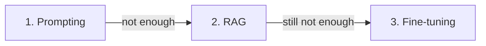

<LevelBadge level="intermediate" />

<Callout type="objectives" items={["Les trois leviers dont vous disposez quand le modèle ne fait pas ce que vous voulez","L'ordre qui marche vraiment — et pourquoi le fine-tuning n'est presque jamais l'étape 1","Quand le RAG est le bon correctif et quand c'est de la surdose","À quoi le fine-tuning est vraiment bon (et à quoi il ne l'est pas)","Comment les trois se combinent dans un vrai système en production"]} />

Quand le modèle ne fait pas ce que vous voulez, il y a trois leviers — et les gens attrapent le plus cher en premier. Voici l'ordre qui marche vraiment.

## Essayez dans cet ordre

```mermaid
flowchart LR
  A[1. Prompting] -->|not enough| B[2. RAG]
  B -->|still not enough| C[3. Fine-tuning]
```

<Steps items={[{title: "1. Prompting — commencez ici, toujours", body: "Instructions plus claires, exemples, un rôle, des contraintes de sortie (voir /docs/prompting/basics). Corrige la majorité des problèmes, ne coûte rien de plus, et est instantané à itérer. La plupart des « le modèle est mauvais à X » se révèlent être « le prompt était vague »."}, {title: "2. RAG — quand il a besoin de VOS connaissances", body: "Si l'écart est une information manquante ou récente (vos docs, vos données, faits actuels), ajoutez le RAG (/docs/foundations/rag). Garde la connaissance actualisable et citable sans toucher au modèle — échangez un document et la prochaine réponse le reflète."}, {title: "3. Fine-tuning — dernier recours, pour le comportement/format à l'échelle", body: "Le fine-tuning entraîne davantage un modèle sur vos exemples. Ne le touchez que quand prompting + RAG ne peuvent pas obtenir un style, format ou comportement de tâche cohérents ET vous avez beaucoup d'exemples de haute qualité ET le volume pour le justifier."}]} />

## Le tableau de décision

| Votre problème | Attrapez |
|---|---|
| Sorties vagues/fausses, mauvais format | **Prompting** |
| Ne connaît pas vos données / a besoin d'infos actuelles | **RAG** |
| A besoin d'un style/comportement très spécifique, cohérent, à l'échelle | **Fine-tuning** |
| A besoin de prendre des actions | (Pas ceux-ci — c'est [utilisation d'outils/agents](/docs/api/tool-use)) |

<Flashcards title="Quel levier résout quel problème" cards={[{front: "Symptôme : la sortie est vague, dans le mauvais format, ou passe à côté du but de la tâche.", back: "Corrigez avec le PROMPTING. Ajoutez rôle, contraintes, exemples et un format cible. Le moins cher et le plus rapide — neuf fois sur dix c'est toute la réponse."}, {front: "Symptôme : le modèle ne connaît pas les docs de votre entreprise, la grille tarifaire actuelle, ou les nouvelles de la semaine dernière.", back: "Corrigez avec le RAG. Récupérez les chunks pertinents au moment de la requête et injectez-les comme contexte. La connaissance reste actualisable et citable — pas besoin de réentraînement."}, {front: "Symptôme : vous avez besoin d'un style maison très cohérent, d'un schéma JSON, ou d'un comportement de classification étroit sur des milliers d'appels, et le prompting continue de dériver.", back: "Envisagez le FINE-TUNING. Seulement après que prompting + RAG aient échoué, et seulement avec des centaines à des milliers d'exemples de haute qualité plus le volume d'appels pour amortir le coût d'entraînement."}, {front: "Symptôme : le modèle a besoin de prendre des actions (envoyer un e-mail, exécuter une requête, appeler une API).", back: "Aucun des trois — c'est l'UTILISATION D'OUTILS / AGENTS. Voir /docs/api/tool-use."}]} />

## Pourquoi les gens se trompent

Le fine-tuning *sonne* comme « enseigner au modèle », donc ça ressemble au vrai correctif. Mais c'est l'option la plus lente, la plus coûteuse, la moins flexible, elle **n'ajoute pas bien de connaissance fraîche** (le RAG fait ça), et c'est facile de le rater. Épuisez d'abord prompting et RAG — vous n'aurez généralement pas besoin de l'étape 3.

<Callout type="warning" items={["Fine-tuner un modèle frontière sur vos données n'ajoute PAS de manière fiable de nouveaux faits — ça décale le style et le comportement. Les faits continuent d'halluciner.","Un modèle fine-tuné est épinglé à cette version de base. Quand le fournisseur sort une meilleure base, vous réentraînez ou vous êtes coincé.","De mauvaises données d'entraînement amplifient de mauvais comportements — un jeu de données médiocre rend le modèle pire, pas meilleur.","La plupart des demandes « on a besoin de fine-tuning » sont vraiment « notre prompt fait 40 lignes de règles ad hoc » — refactorez d'abord le prompt."]} />

:::tip Ils se combinent
Un système fort est souvent un bon **prompt** + **RAG** pour la connaissance, avec le fine-tuning réservé à un besoin comportemental étroit. Ils ne sont pas mutuellement exclusifs.
:::

<PromptCard title="Un exemple concret : « le modèle ne peut pas répondre aux questions sur notre produit »">{`# Wrong first move: fine-tune on the product manual.
# Right first move: retrieve the relevant chapter and inject it.

# 1. PROMPTING (baseline)
System: "You are a support agent for Acme Widgets. Be concise, cite doc sections."
User:   "Does the Widget Pro support Bluetooth 5.3?"
# Fails — model has no idea what a Widget Pro is.

# 2. + RAG (usually enough)
System: "You are a support agent for Acme Widgets. Be concise, cite doc sections."
Context: [top-3 chunks from product manual retrieved by embedding search]
User:    "Does the Widget Pro support Bluetooth 5.3?"
# Works — model reads the retrieved specs and answers with a citation.

# 3. + Fine-tuning (only if house voice / format is still drifting after 1+2)
# Train on 500-2000 (prompt, ideal answer) pairs to lock in the style — NOT to teach facts.`}</PromptCard>

<Quiz title="Vérifiez-vous" questions={[{q: "Le modèle donne des réponses vagues, hors format à votre tâche. Que tentez-vous d'abord ?", options: ["Fine-tuner sur un lot de sorties idéales", "Ajouter du RAG pour qu'il puisse récupérer un meilleur contexte", "Resserrer le prompt — rôle, contraintes, exemples, format cible", "Passer à un modèle plus gros"], answer: 2, explain: "Le prompting est l'étape 1, toujours. La plupart des « le modèle est mauvais à X » se révèlent être « le prompt était vague ». C'est gratuit, instantané à itérer, et corrige la majorité des problèmes."}, {q: "Votre modèle ne connaît pas votre wiki interne. Quel levier ?", options: ["Prompting — écrire un prompt système plus long décrivant le wiki", "RAG — récupérer la page wiki pertinente au moment de la requête et l'injecter", "Fine-tuning — entraîner sur le corpus wiki pour que le modèle le « connaisse »", "Aucun — juste changer de modèle"], answer: 1, explain: "L'information manquante OU fraîche est exactement ce que le RAG résout. Le fine-tuning n'est pas fiable pour ajouter des faits et est épinglé à un modèle de base. Le RAG garde la connaissance actualisable et citable — échangez la page wiki et la prochaine réponse le reflète."}, {q: "À quoi le fine-tuning est-il RÉELLEMENT bon ?", options: ["Ajouter une nouvelle connaissance factuelle au modèle", "Verrouiller un style, un format ou un comportement de tâche étroit cohérents à l'échelle, quand prompting + RAG ne peuvent pas y arriver", "Rendre le modèle plus rapide", "Supprimer le besoin d'un prompt système"], answer: 1, explain: "Le fine-tuning décale le style et le comportement, pas les faits. C'est le bon outil de dernier recours pour un besoin comportemental étroit à fort volume (ex. produire un schéma JSON strict dans un ton spécifique sur des millions d'appels). Les faits appartiennent au RAG."}, {q: "Quelle combinaison est la forme d'un système de production mature ?", options: ["Fine-tuner tout et sauter le prompting", "Prompt fort + RAG pour la connaissance, avec le fine-tuning réservé à un besoin comportemental étroit — ils ne sont pas mutuellement exclusifs", "Seulement un des trois — les mélanger cause des conflits", "Prompt + fine-tune, jamais de RAG"], answer: 1, explain: "Les trois leviers se composent. Un bon prompt pose le cadre, le RAG fournit la connaissance fraîche, et le fine-tuning (s'il est utilisé) verrouille un comportement spécifique à l'échelle."}]} />

<Callout type="takeaways" items={["Trois leviers quand le modèle ne fait pas ce que vous voulez : prompting, RAG, fine-tuning — dans cet ordre.","Le prompting corrige ~9 plaintes sur 10 du type « le modèle est mauvais à X » pour zéro coût et itération instantanée.","Le RAG est le bon correctif quand l'écart est une connaissance manquante ou fraîche — le fine-tuning n'est PAS fiable pour ajouter des faits.","Le fine-tuning est un dernier recours pour un style/format/comportement cohérents à l'échelle, et a besoin de centaines à des milliers d'exemples de haute qualité plus le volume d'appels pour le justifier.","Dans un vrai système en production les trois se composent : prompt fort + RAG + fine-tune étroit."]} />

## Suite

- [Génération augmentée par récupération (RAG)](/docs/foundations/rag)
- [Bases du prompting](/docs/prompting/basics)
- [Évaluer la qualité IA (Évals)](/docs/foundations/evals)
