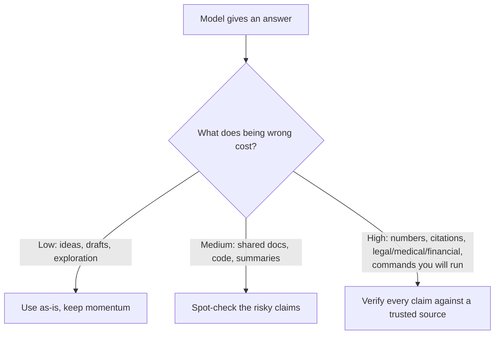

<LevelBadge level="intermediate" />

<Callout type="objectives" items={["Comprendre POURQUOI les modèles fabriquent des réponses assurées et bien formées", "Reconnaître les 5 zones à haut risque où il faut être le plus sceptique", "Appliquer une boîte à outils en 6 parties pour réduire drastiquement les hallucinations", "Utiliser un prompt anti-hallucination à copier-coller qui ancre, donne une porte de sortie et force les citations", "Adopter l'état d'esprit qui ajuste l'effort de vérification au coût d'une erreur"]} />

Une **hallucination** se produit lorsqu'un modèle affirme quelque chose de faux avec une assurance totale. Il ne ment pas et n'est pas défectueux — c'est le revers de la façon dont fonctionnent les LLM : ils génèrent du texte *plausible*, et plausible n'est pas toujours vrai (voir [Qu'est-ce qu'un LLM ?](/docs/foundations/what-is-an-llm)). Vous ne pouvez pas l'éliminer entièrement par un prompt, mais vous pouvez la réduire drastiquement et rattraper le reste.

## Pourquoi cela arrive

Le modèle prédit une continuation probable. Lorsqu'il ne « sait » pas quelque chose, la continuation *qui paraît la plus probable* est souvent une réponse assurée, bien formée — et fausse. Il n'existe aucun signal intégré « je ne suis pas sûr » à moins que vous ne lui laissiez de la place pour cela.

<Callout type="tip" items={["Le remède à la plupart des hallucinations est de créer délibérément de la place pour l'incertitude — donnez au modèle la permission de dire qu'il ne sait pas."]} />

## Les zones à haut risque

Soyez le plus sceptique lorsque la sortie implique :

- **Citations, propos rapportés et références** — articles inventés, fausses URL, citations mal attribuées.
- **Chiffres, dates et statistiques précis** — des données plausibles mais inventées.
- **Faits de niche ou très récents** — au-delà de ce que le modèle a réellement appris de façon fiable.
- **Détails d'API et de bibliothèques** — méthodes ou paramètres qui n'existent pas.
- **Personnes et précisions juridiques/médicales** — enjeux élevés, faciles à se tromper subtilement.

## La boîte à outils de réduction

Empilez-les — chacune apporte sa pierre :

<Steps items={[
  {title: "Ancrez-la dans des sources", body: "Collez le texte source et dites « réponds uniquement à partir du texte ci-dessus ; si l'information n'y figure pas, dis-le. » C'est l'idée centrale derrière le RAG (/docs/foundations/rag)."},
  {title: "Donnez-lui une porte de sortie", body: "Autorisez explicitement « Si tu n'es pas sûr, dis 'je ne sais pas' » — cela réduit considérablement les suppositions assurées."},
  {title: "Demandez le raisonnement et les citations", body: "« Cite la phrase exacte qui appuie chaque affirmation. » Les affirmations non étayées deviennent évidentes."},
  {title: "Baissez la créativité", body: "Pour les tâches factuelles où le modèle expose un contrôle de température, baissez-la (voir Contrôles d'échantillonnage sur /docs/foundations/sampling-controls)."},
  {title: "Utilisez des outils", body: "Pour les mathématiques, les données actuelles ou les recherches, donnez au modèle une calculatrice/un moteur de recherche/un outil (/docs/api/tool-use) plutôt que de vous fier à sa mémoire."},
  {title: "Recoupez", body: "Posez la même question de deux manières, ou faites critiquer la première réponse par un second passage."}
]} />

## Un prompt anti-hallucination à copier-coller

L'essentiel de la boîte à outils ci-dessus se condense en un seul gabarit réutilisable. Collez votre source à l'endroit indiqué et posez votre question — il ancre la réponse, donne une porte de sortie au modèle et force les citations en un seul coup :

<PromptCard title="Enveloppe anti-hallucination">{`You answer ONLY from the SOURCE below.
Rules:
- If the answer is not in the SOURCE, reply exactly: "Not stated in the source."
- After every claim, quote the exact sentence from the SOURCE that supports it.
- Do not add outside knowledge, estimates, or assumptions.

SOURCE:
"""
[paste the document, transcript, or data here]
"""

QUESTION: [your question]`}</PromptCard>

Pourquoi ça marche : l'échappatoire « Not stated in the source » supprime la pression de deviner, et la règle de citer-la-phrase rend impossible de cacher toute affirmation non étayée. Retirez le bloc SOURCE quand vous voulez réellement les connaissances propres du modèle — mais alors la vérification vous revient à nouveau.

## L'état d'esprit qui vous protège vraiment

<Callout type="warning" items={["Aucun prompt ne rend une sortie fiable à 100 %. Pour tout ce qui a des conséquences — un chiffre dans un rapport, une citation, une commande que vous allez exécuter, un détail médical/juridique/financier — confrontez-le à une source fiable. Traitez l'IA comme un premier jet rapide, pas comme une autorité finale. C'est le cœur de l'Usage responsable (/docs/security/responsible-use)."]} />

Une règle simple : **le coût d'une erreur fixe le niveau de vérification.** Du brainstorming ? Faites confiance librement. Publier une statistique ? Vérifiez à chaque fois.

<Callout type="takeaways" items={["Les hallucinations sont un sous-produit d'une génération fondée sur la plausibilité, pas un bug que vous pouvez entièrement éliminer par un prompt.", "Soyez le plus sceptique avec les citations, les chiffres/dates, les faits de niche ou récents, les détails d'API et les précisions sur les personnes/le juridique/le médical.", "Empilez la boîte à outils : ancrez dans des sources, donnez une porte de sortie, exigez des citations, baissez la température, utilisez des outils, recoupez.", "Une seule enveloppe de prompt ancre + donne une porte de sortie + force les citations d'un seul coup.", "Ajustez l'effort de vérification au coût d'une erreur — faites confiance librement quand c'est peu coûteux, vérifiez chaque affirmation quand c'est conséquent."]} />

<Quiz title="Vérifiez vos connaissances" questions={[
  {
    q: "Pourquoi les modèles hallucinent-ils ?",
    options: [
      "Ils mentent délibérément à l'utilisateur",
      "Ils prédisent la continuation qui paraît la plus plausible, laquelle n'est pas toujours vraie",
      "Ils sont défectueux et doivent être réentraînés",
      "Ils manquent toujours de mémoire en cours de réponse"
    ],
    answer: 1,
    explain: "L'hallucination est le revers de la façon dont fonctionnent les LLM : ils génèrent du texte plausible, et plausible n'est pas toujours vrai. Lorsque le modèle ne sait pas quelque chose, la continuation qui paraît la plus probable est souvent assurée, bien formée et fausse."
  },
  {
    q: "Laquelle de ces situations est une zone à haut risque où vous devriez être le plus sceptique ?",
    options: [
      "Un brainstorming ouvert pour des idées",
      "Reformuler une phrase que vous avez déjà écrite",
      "Chiffres, dates et statistiques précis",
      "Demander une définition simple que vous pouvez vérifier"
    ],
    answer: 2,
    explain: "Les chiffres, dates et statistiques précis sont une zone à haut risque — ils peuvent être plausibles mais inventés. Les autres zones à haut risque incluent les citations/propos rapportés, les faits de niche ou récents, les détails d'API et les précisions sur les personnes/le juridique/le médical."
  },
  {
    q: "Quel est l'effet le plus direct de donner au modèle une porte de sortie explicite comme « Si tu n'es pas sûr, dis 'je ne sais pas' » ?",
    options: [
      "Cela rend le modèle plus rapide",
      "Cela réduit considérablement les suppositions assurées",
      "Cela augmente automatiquement la température",
      "Cela connecte le modèle à une recherche en direct"
    ],
    answer: 1,
    explain: "Autoriser explicitement le modèle à dire qu'il ne sait pas supprime la pression de produire une supposition assurée, ce qui réduit considérablement les réponses hallucinées."
  },
  {
    q: "Quelle règle décide du niveau de vérification qu'une réponse exige ?",
    options: [
      "La longueur de la réponse",
      "Le niveau de confiance affiché par le modèle",
      "Le coût d'une erreur",
      "Le temps qu'a pris la rédaction du prompt"
    ],
    answer: 2,
    explain: "Le coût d'une erreur fixe le niveau de vérification. Du brainstorming ? Faites confiance librement. Publier une statistique ? Vérifiez à chaque fois."
  },
  {
    q: "Dans le prompt-enveloppe anti-hallucination, qu'est-ce qui rend impossible de cacher toute affirmation non étayée ?",
    options: [
      "Baisser la température à zéro",
      "La règle de citer la phrase exacte de la SOURCE qui appuie chaque affirmation",
      "Poser la question deux fois",
      "Retirer le bloc SOURCE"
    ],
    answer: 1,
    explain: "La règle de citer-la-phrase force le modèle à étayer chaque affirmation par une phrase exacte de la SOURCE, de sorte que toute affirmation réellement non étayée devient évidente. L'échappatoire « Not stated in the source » supprime la pression de deviner."
  }
]} />

## Pour aller plus loin

- [Génération augmentée par la récupération (RAG)](/docs/foundations/rag)
- [Évaluer la qualité de l'IA (évaluations)](/docs/foundations/evals)
- [Usage responsable, éthique et vérification](/docs/security/responsible-use)
