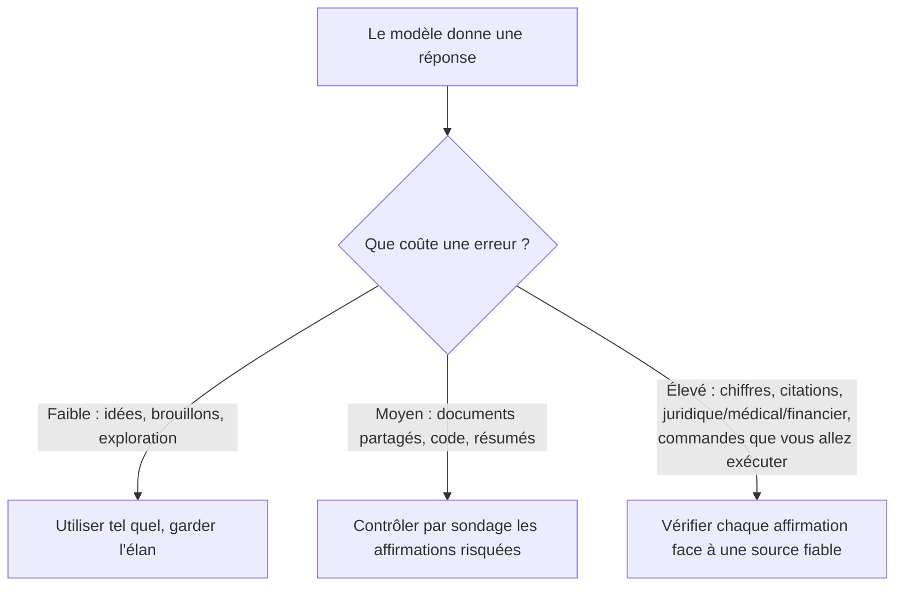

<LevelBadge level="intermediate" />

Une **hallucination** se produit lorsqu'un modèle affirme quelque chose de faux avec une assurance totale. Il ne ment pas et n'est pas défectueux — c'est le revers de la façon dont fonctionnent les LLM : ils génèrent du texte *plausible*, et plausible n'est pas toujours vrai (voir [Qu'est-ce qu'un LLM ?](/docs/foundations/what-is-an-llm)). Vous ne pouvez pas l'éliminer entièrement par un prompt, mais vous pouvez la réduire drastiquement et rattraper le reste.

## Pourquoi cela arrive

Le modèle prédit une continuation probable. Lorsqu'il ne « sait » pas quelque chose, la continuation *qui paraît la plus probable* est souvent une réponse assurée, bien formée — et fausse. Il n'existe aucun signal intégré « je ne suis pas sûr » à moins que vous ne lui laissiez de la place pour cela.

## Les zones à haut risque

Soyez le plus sceptique lorsque la sortie implique :

- **Citations, propos rapportés et références** — articles inventés, fausses URL, citations mal attribuées.
- **Chiffres, dates et statistiques précis** — des données plausibles mais inventées.
- **Faits de niche ou très récents** — au-delà de ce que le modèle a réellement appris de façon fiable.
- **Détails d'API et de bibliothèques** — méthodes ou paramètres qui n'existent pas.
- **Personnes et précisions juridiques/médicales** — enjeux élevés, faciles à se tromper subtilement.

## La boîte à outils de réduction

Empilez-les — chacune apporte sa pierre :

1. **Ancrez-la dans des sources.** Collez le texte source et dites *« réponds uniquement à partir du texte ci-dessus ; si l'information n'y figure pas, dis-le. »* C'est l'idée centrale derrière le [RAG](/docs/foundations/rag).
2. **Donnez-lui une porte de sortie.** Autorisez explicitement *« Si tu n'es pas sûr, dis "je ne sais pas" »* — cela réduit considérablement les suppositions assurées.
3. **Demandez le raisonnement et les citations.** *« Cite la phrase exacte qui appuie chaque affirmation. »* Les affirmations non étayées deviennent évidentes.
4. **Baissez la créativité** pour les tâches factuelles, lorsque le modèle expose un contrôle de température (voir [Contrôles d'échantillonnage](/docs/foundations/sampling-controls)).
5. **Utilisez des outils.** Pour les mathématiques, les données actuelles ou les recherches, donnez au modèle une calculatrice/un moteur de recherche/un [outil](/docs/api/tool-use) plutôt que de vous fier à sa mémoire.
6. **Recoupez.** Posez la même question de deux manières, ou faites critiquer la première réponse par un second passage.

## Un prompt anti-hallucination à copier-coller

L'essentiel de la boîte à outils ci-dessus se condense en un seul gabarit réutilisable. Collez votre source à l'endroit indiqué et posez votre question — il ancre la réponse, donne une porte de sortie au modèle et force les citations en un seul coup :

```text
Tu réponds UNIQUEMENT à partir de la SOURCE ci-dessous.
Règles :
- Si la réponse ne figure pas dans la SOURCE, réponds exactement : "Non précisé dans la source."
- Après chaque affirmation, cite la phrase exacte de la SOURCE qui l'appuie.
- N'ajoute aucune connaissance extérieure, estimation ni supposition.

SOURCE :
"""
[collez ici le document, la transcription ou les données]
"""

QUESTION : [votre question]
```

Pourquoi ça marche : l'échappatoire « Non précisé dans la source. » supprime la pression de deviner, et la règle de citer-la-phrase rend impossible de cacher toute affirmation non étayée. Retirez le bloc SOURCE quand vous voulez réellement les connaissances propres du modèle — mais alors la vérification vous revient à nouveau.

## L'état d'esprit qui vous protège vraiment

:::warning Vérifiez ce qui compte — toujours
Aucun prompt ne rend une sortie fiable à 100 %. Pour tout ce qui a des conséquences — un chiffre dans un rapport, une citation, une commande que vous allez exécuter, un détail médical/juridique/financier — **confrontez-le à une source fiable**. Traitez l'IA comme un premier jet rapide, pas comme une autorité finale. C'est le cœur de l'[Usage responsable](/docs/security/responsible-use).
:::

Une règle simple : **le coût d'une erreur fixe le niveau de vérification.** Du brainstorming ? Faites confiance librement. Publier une statistique ? Vérifiez à chaque fois.



## Pour aller plus loin

- [Génération augmentée par la récupération (RAG)](/docs/foundations/rag)
- [Évaluer la qualité de l'IA (évaluations)](/docs/foundations/evals)
- [Usage responsable, éthique et vérification](/docs/security/responsible-use)
