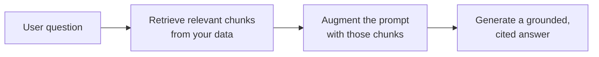

<LevelBadge level="intermediate" />

<Callout type="objectives" items={[
  "Ce qu'est le RAG et la boucle récupérer-augmenter-générer",
  "Comment indexer, récupérer, augmenter et générer avec citations",
  "Pourquoi le RAG surpasse le fine-tuning pour les besoins « répondre sur mes documents »",
  "Les cinq modes de défaillance qui tuent la qualité du RAG",
  "Un prompt d'ancrage à copier-coller qui comble les deux plus grandes lacunes"
]} />

Le **RAG** fait répondre un modèle à des questions sur **vos** données — documents, base de connaissances, base de code — sur lesquelles il n'a jamais été entraîné. L'idée est simple : **récupérer** les éléments pertinents, **augmenter** le prompt avec eux, puis **générer** une réponse ancrée dans ces éléments.

## La boucle

<Steps items={[
  {title: "Indexez vos données", body: "Découpez-les en fragments, encodez-les (voir /docs/foundations/embeddings) et stockez-les dans un index vectoriel (et/ou par mots-clés)."},
  {title: "Récupérez", body: "Tirez les meilleurs fragments les plus pertinents pour la question."},
  {title: "Augmentez", body: "Placez ces fragments dans le prompt avec une instruction du type « Réponds uniquement à partir du contexte ci-dessous ; si l'information n'y figure pas, dis-le. »"},
  {title: "Générez", body: "Produisez la réponse — et idéalement citez le fragment d'où provient chaque affirmation."}
]} />

Pour l'étape d'encodage lors de l'indexation, voir [Embeddings et recherche vectorielle](/docs/foundations/embeddings).

## Pourquoi le RAG plutôt que le fine-tuning ?

<Callout type="tip" items={[
  "Frais : mettez à jour les données, pas le modèle",
  "Vérifiable : fournit des citations",
  "Économique : bien moins cher qu'un réentraînement"
]} />

Pour la plupart des besoins du type « répondre à propos de mes documents », le RAG est le bon premier outil — voir [Fine-tuning vs prompting vs RAG](/docs/foundations/finetune-vs-prompt-vs-rag).

## Les modes de défaillance (là où la qualité du RAG meurt)

<Callout type="warning" items={[
  "Mauvaise récupération = mauvaise réponse. Si le bon fragment n'est pas récupéré, le modèle ne peut pas l'utiliser. La plupart des problèmes « le RAG se trompe » sont des problèmes de récupération.",
  "Un découpage trop grossier/trop fin ruine la pertinence (voir embeddings).",
  "Pas d'instruction d'ancrage : le modèle mélange les faits récupérés avec ses propres suppositions. Dites-lui de répondre uniquement à partir du contexte et d'admettre les lacunes.",
  "Trop en entasser : des fragments non pertinents diluent le signal et coûtent des tokens. Récupérez peu de fragments, de haute qualité.",
  "Pas de citations : vous ne pouvez pas vérifier, donc vous ne pouvez pas faire confiance."
]} />

L'échec de découpage renvoie aux [embeddings](/docs/foundations/embeddings), et le surentassement coûte des [tokens](/docs/foundations/tokens-and-context).

<Callout type="tip" items={[
  "Évaluez la récupération séparément : mesurez « avons-nous récupéré le bon fragment ? » indépendamment de « le modèle a-t-il bien répondu ? ». Cela localise le problème rapidement. Voir Évaluations (/docs/foundations/evals)."
]} />

## Copier-coller : un prompt d'ancrage

Le correctif au plus fort impact est une instruction d'ancrage. Déposez vos fragments récupérés dans un gabarit comme celui-ci — il force le modèle à répondre *uniquement* à partir du contexte, à citer chaque affirmation et à admettre les lacunes au lieu de deviner :

<PromptCard title="Prompt d'ancrage">{`You are answering strictly from the context below.

Rules:
- Use ONLY the context to answer. Do not use outside knowledge.
- Cite the source after each claim, like [chunk 2].
- If the answer is not in the context, reply exactly:
  "I don't have that in the provided sources."
- Quote numbers and names verbatim — never paraphrase a figure.

Context:
[chunk 1] ...
[chunk 2] ...
[chunk 3] ...

Question: <the user's question>`}</PromptCard>

Associez-le à *quelques* fragments de haute qualité (pas tout ce que vous avez récupéré) et vous comblez les deux plus grandes lacunes d'un coup : le mélange halluciné et les réponses invérifiables. Ensuite, [évaluez](/docs/foundations/evals) la récupération et la génération séparément pour savoir quelle moitié régler.

## Maîtrisez les termes

<Flashcards cards={[
  {front: "RAG", back: "Récupérer les éléments pertinents de vos données, augmenter le prompt avec eux, puis générer une réponse ancrée dans ces éléments."},
  {front: "Étape d'indexation", back: "Découper les données en fragments, les encoder, les stocker dans un index vectoriel et/ou par mots-clés."},
  {front: "Étape d'augmentation", back: "Placer les fragments récupérés dans le prompt avec une instruction d'ancrage : répondre uniquement à partir du contexte, admettre les lacunes."},
  {front: "Pourquoi le RAG plutôt que le fine-tuning", back: "Frais (mettre à jour les données, pas le modèle), fournit des citations, bien moins cher qu'un réentraînement."},
  {front: "Mode de défaillance n°1 du RAG", back: "Mauvaise récupération. Si le bon fragment n'est pas récupéré, le modèle ne peut pas l'utiliser — la plupart des problèmes « le RAG se trompe » sont des problèmes de récupération."},
  {front: "Instruction d'ancrage", back: "Dire au modèle de répondre UNIQUEMENT à partir du contexte, de citer chaque affirmation et de le dire quand la réponse n'y figure pas."}
]} />

<Quiz title="Vérifiez vos connaissances" questions={[
  {
    q: "Que signifient les trois lettres de RAG, dans l'ordre ?",
    options: ["Read, Analyze, Generate", "Retrieve, Augment, Generate", "Rank, Aggregate, Group", "Reduce, Append, Generate"],
    answer: 1,
    explain: "RAG = Retrieve (récupérer) les fragments pertinents, Augment (augmenter) le prompt avec eux, puis Generate (générer) une réponse ancrée."
  },
  {
    q: "Quand « le RAG se trompe », quel est le plus souvent le vrai problème ?",
    options: ["Le modèle est trop petit", "La récupération — le bon fragment n'a pas été tiré", "Trop peu de tokens dans la fenêtre de contexte", "Les embeddings sont mal fine-tunés"],
    answer: 1,
    explain: "Mauvaise récupération = mauvaise réponse. Si le bon fragment n'est pas récupéré, le modèle ne peut pas l'utiliser. La plupart des problèmes « le RAG se trompe » sont des problèmes de récupération."
  },
  {
    q: "Pourquoi le RAG est-il généralement préféré au fine-tuning pour « répondre à propos de mes documents » ?",
    options: ["Il agrandit le modèle", "Il garde le savoir frais, donne des citations et coûte moins cher qu'un réentraînement", "Il supprime le besoin de tout prompt", "Il garantit que le modèle n'hallucine jamais"],
    answer: 1,
    explain: "Le RAG garde le savoir frais (mettre à jour les données, pas le modèle), fournit des citations et coûte bien moins cher qu'un réentraînement."
  },
  {
    q: "Quel est le correctif au plus fort impact pour empêcher le modèle de mélanger les faits avec des suppositions ?",
    options: ["Récupérer tous les fragments possibles", "Une instruction d'ancrage qui force les réponses uniquement à partir du contexte", "Augmenter la température", "Sauter les citations pour économiser des tokens"],
    answer: 1,
    explain: "Une instruction d'ancrage force le modèle à répondre uniquement à partir du contexte, à citer chaque affirmation et à admettre les lacunes au lieu de deviner."
  },
  {
    q: "Pourquoi évaluer la récupération séparément de la génération ?",
    options: ["C'est exigé par le fournisseur du modèle", "Cela localise le problème rapidement — vous savez quelle moitié régler", "Cela réduit automatiquement le coût en tokens", "La génération ne peut pas être mesurée autrement"],
    answer: 1,
    explain: "Mesurer « avons-nous récupéré le bon fragment ? » indépendamment de « le modèle a-t-il bien répondu ? » localise le problème rapidement et vous dit quelle moitié régler."
  }
]} />

<Callout type="takeaways" items={[
  "RAG = récupérer les fragments pertinents, augmenter le prompt, générer une réponse ancrée et citée.",
  "Indexez (découper + encoder + stocker), récupérez les meilleurs fragments, augmentez avec une instruction d'ancrage, générez avec citations.",
  "Préférez le RAG au fine-tuning pour les Q&R sur documents : frais, cité, moins cher.",
  "La plupart des défaillances sont des défaillances de récupération — récupérez peu de fragments de haute qualité, pas tout.",
  "Ajoutez toujours une instruction d'ancrage et citez ; évaluez la récupération et la génération séparément."
]} />

## Pour aller plus loin

- [Embeddings et recherche vectorielle](/docs/foundations/embeddings)
- [Fine-tuning vs prompting vs RAG](/docs/foundations/finetune-vs-prompt-vs-rag)
- [Guide pratique de recherche et synthèse](/docs/playbooks/research)
