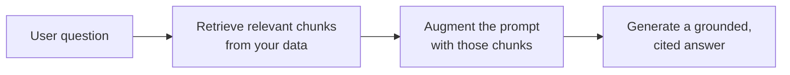

<LevelBadge level="intermediate" />

Le **RAG** fait répondre un modèle à des questions sur **vos** données — documents, base de connaissances, base de code — sur lesquelles il n'a jamais été entraîné. L'idée est simple : **récupérer** les éléments pertinents, **augmenter** le prompt avec eux, puis **générer** une réponse ancrée dans ces éléments.

## La boucle

1. **Indexez** vos données : découpez-les en fragments, [encodez-les](/docs/foundations/embeddings) (embed), stockez-les dans un index vectoriel (et/ou par mots-clés).
2. **Récupérez** les meilleurs fragments les plus pertinents pour la question.
3. **Augmentez** : placez ces fragments dans le prompt avec une instruction du type *« Réponds uniquement à partir du contexte ci-dessous ; si l'information n'y figure pas, dis-le. »*
4. **Générez** — et idéalement **citez** le fragment d'où provient chaque affirmation.

## Pourquoi le RAG plutôt que le fine-tuning ?

Le RAG garde le savoir **frais** (mettez à jour les données, pas le modèle), fournit des **citations** et coûte bien moins cher qu'un réentraînement. Pour la plupart des besoins du type « répondre à propos de mes documents », c'est le bon premier outil — voir [Fine-tuning vs prompting vs RAG](/docs/foundations/finetune-vs-prompt-vs-rag).

## Les modes de défaillance (là où la qualité du RAG meurt)

- **Mauvaise récupération = mauvaise réponse.** Si le bon fragment n'est pas récupéré, le modèle ne peut pas l'utiliser. La plupart des problèmes « le RAG se trompe » sont des problèmes de *récupération*.
- **Un découpage trop grossier/trop fin** — ruine la pertinence ([embeddings](/docs/foundations/embeddings)).
- **Pas d'instruction d'ancrage** — le modèle mélange les faits récupérés avec ses propres suppositions. Dites-lui de répondre *uniquement* à partir du contexte et d'admettre les lacunes.
- **Trop en entasser** — des fragments non pertinents diluent le signal et coûtent des [jetons](/docs/foundations/tokens-and-context). Récupérez peu de fragments, de haute qualité.
- **Pas de citations** — vous ne pouvez pas vérifier, donc vous ne pouvez pas faire confiance.

:::tip Évaluez la récupération séparément
Mesurez « avons-nous récupéré le bon fragment ? » indépendamment de « le modèle a-t-il bien répondu ? ». Cela localise le problème rapidement. Voir [Évaluations](/docs/foundations/evals).
:::

## Pour aller plus loin

- [Embeddings et recherche vectorielle](/docs/foundations/embeddings)
- [Fine-tuning vs prompting vs RAG](/docs/foundations/finetune-vs-prompt-vs-rag)
- [Guide pratique de recherche et synthèse](/docs/playbooks/research)
