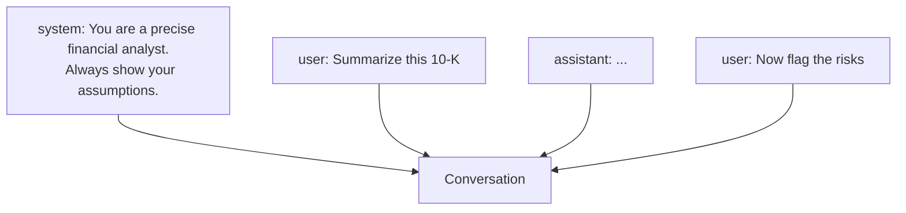

<LevelBadge level="beginner" />

Toute conversation avec une IA est construite à partir de **messages**, et chaque message possède un **rôle**. Comprendre les trois rôles explique comment orienter le modèle — et pourquoi certaines instructions tiennent quand d'autres non.

## Les trois rôles

- **Système** — la configuration de haut niveau pour toute la conversation : qui le modèle doit être, les règles, le format. Défini une seule fois, il s'applique de bout en bout.
- **Utilisateur** — c'est vous : vos questions et vos entrées, tour après tour.
- **Assistant** — les réponses du modèle. (Vous pouvez aussi *mettre des mots dans la bouche de l'assistant* en guise d'exemples — voir le [few-shot](/docs/prompting/few-shot).)

## Pourquoi le prompt système est votre levier le plus puissant

Le message système cadre **tout ce qui suit**. C'est là que vous définissez le rôle du modèle, ses standards, son ton et ses règles strictes — et le modèle lui accorde un poids élevé. Si vous voulez un comportement cohérent sur toute une conversation (ou une application), placez-le ici, et non enfoui dans un tour utilisateur.

En pratique :
- **Applications de chat :** les [instructions personnalisées](/docs/claude-app/custom-instructions) de votre compte font office de prompt système personnel.
- **Claude Code :** [CLAUDE.md](/docs/claude-code/claude-md) joue ce rôle pour votre projet.
- **L'API :** le [paramètre `system`](/docs/api/first-call).

Même idée, trois surfaces.

## Conseils pratiques

- **Soyez précis dans le prompt système** quant au rôle, aux règles et au format de sortie — c'est l'endroit qui offre le plus de levier pour le faire.
- **Gardez les tours utilisateur centrés** sur la tâche réelle ; ne recollez pas les règles à chaque tour.
- **Des instructions contradictoires ?** Une instruction utilisateur ultérieure et explicite peut l'emporter sur une instruction système vague — restez cohérent pour éviter les surprises ([Dépannage](/docs/contribute/troubleshooting)).

## Pour aller plus loin

- [Les bases du prompting](/docs/prompting/basics)
- [Instructions personnalisées et styles](/docs/claude-app/custom-instructions)
- [Jetons, contexte et mémoire](/docs/foundations/tokens-and-context)
